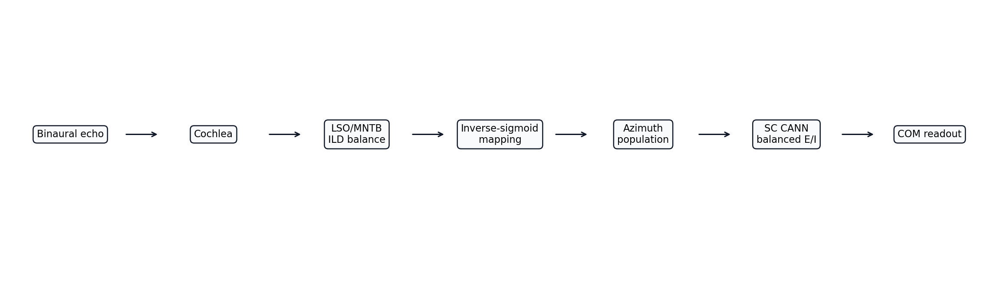
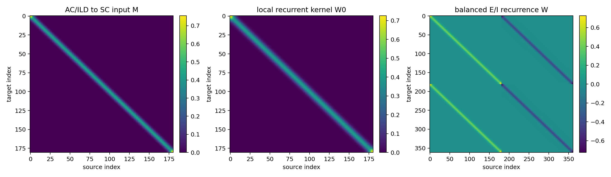
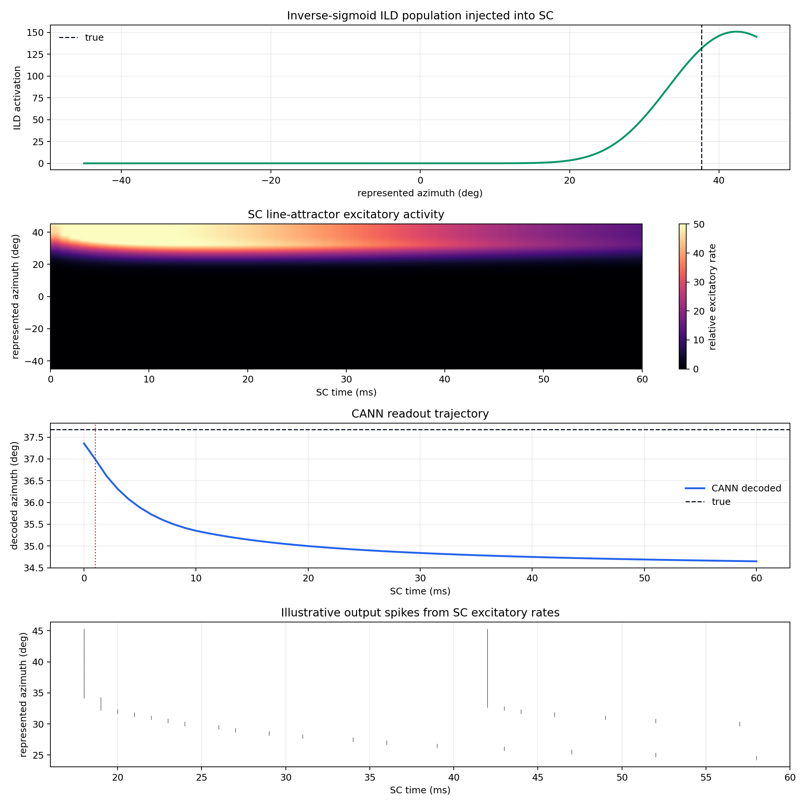
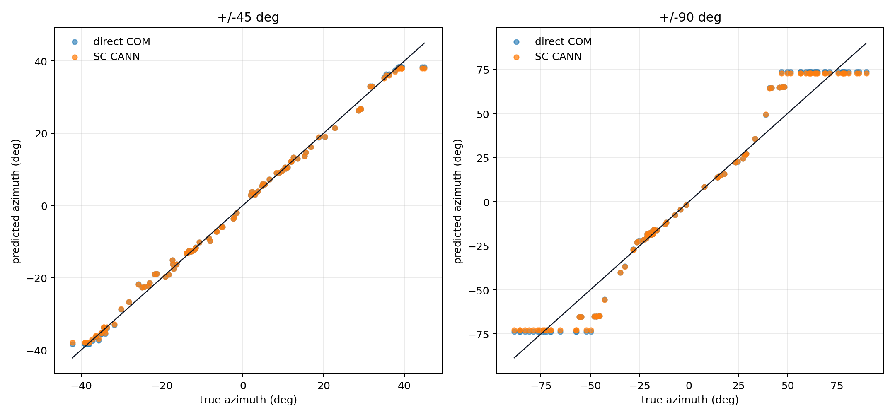
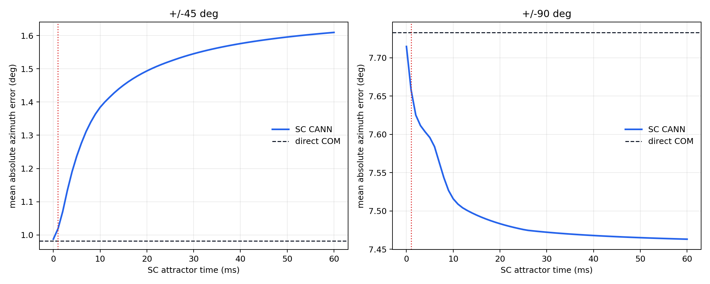
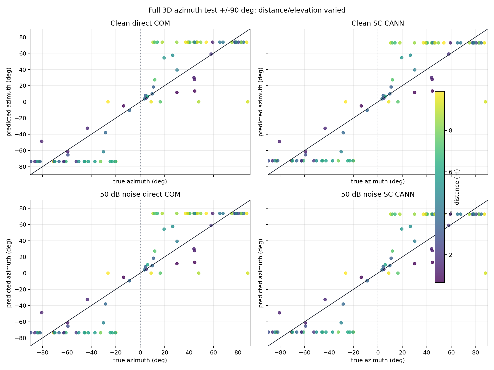

# Azimuth ILD Pathway With SC Line Attractor

This report adds the same optimised SC line-attractor readout used in the distance pathway to the calibrated azimuth ILD population. The lower azimuth pathway is unchanged: binaural cochlea, multi-threshold ILD coding, MNTB/LSO opponent comparison, then inverse-sigmoid synaptic mapping.

## Model

The no-attractor baseline decodes the inverse-sigmoid ILD population directly by centre of mass:

$$
\hat\theta_{COM}=\frac{\sum_k A_{ILD}^{inv}(\theta_k)\theta_k}{\sum_k A_{ILD}^{inv}(\theta_k)}.
$$

The CANN version injects that same population into the FI reflected Gaussian two-block balanced E/I line attractor:

$$
x(0)=s\begin{bmatrix}M \\ -\beta M\end{bmatrix}A_{ILD}^{inv},
$$

$$
\tau\dot{x}=-x+Wx,
\qquad
W=\begin{bmatrix}W_0&-W_0\\W_0&-W_0\end{bmatrix}.
$$

The final readout is centre of mass over the rectified excitatory half of the SC state at the selected readout time.

## Parameters

| Parameter | Value |
|---|---:|
| sample rate | `64000 Hz` |
| cochlea channels | `48` |
| inverse-sigmoid gain `k` | `3.750` |
| inverse-sigmoid sigma | `0.120` |
| SC attractor variant | `FI reflected Gaussian 2-block` |
| input width | `3` bins |
| recurrent width | `4` bins |
| beta | `0.897` |
| alpha prime | `4.0` |
| tau | `20.0 ms` |
| readout time | `1.0 ms` |

## Example Dynamics

The example below shows the inverse-sigmoid ILD population being injected into the SC attractor, followed by the excitatory rate dynamics, decoded trajectory, and illustrative output spikes.

## Accuracy

| Readout | MAE | RMSE | Max error | Bias |
|---|---:|---:|---:|---:|
| +/-45 direct inverse-sigmoid ILD | `0.982 deg` | `1.480 deg` | `6.577 deg` | `-0.039 deg` |
| +/-45 SC CANN | `1.019 deg` | `1.535 deg` | `6.981 deg` | `-0.038 deg` |
| +/-90 direct inverse-sigmoid ILD | `7.733 deg` | `10.699 deg` | `26.658 deg` | `1.110 deg` |
| +/-90 SC CANN | `7.658 deg` | `10.547 deg` | `25.789 deg` | `1.037 deg` |
| Full 3D +/-45 clean direct COM | `9.757 deg` | `13.622 deg` | `42.980 deg` | `0.102 deg` |
| Full 3D +/-45 clean SC CANN | `9.729 deg` | `13.567 deg` | `42.980 deg` | `0.152 deg` |
| Full 3D +/-45 50 dB noise direct COM | `9.658 deg` | `13.645 deg` | `42.980 deg` | `-0.031 deg` |
| Full 3D +/-45 50 dB noise SC CANN | `9.627 deg` | `13.583 deg` | `42.980 deg` | `0.023 deg` |
| Full 3D +/-90 clean direct COM | `21.061 deg` | `27.965 deg` | `88.042 deg` | `0.293 deg` |
| Full 3D +/-90 clean SC CANN | `20.845 deg` | `27.606 deg` | `88.042 deg` | `0.254 deg` |
| Full 3D +/-90 50 dB noise direct COM | `21.101 deg` | `27.966 deg` | `88.042 deg` | `0.340 deg` |
| Full 3D +/-90 50 dB noise SC CANN | `20.885 deg` | `27.607 deg` | `88.042 deg` | `0.301 deg` |

## Full 3D And Noise Tests

The full test samples `80` targets per azimuth support. Both tests vary distance `0.25 -> 10.00 m` and elevation `-45 -> 45 deg`. Two azimuth ranges are tested: `+/-45 deg`, matching the current inverse-sigmoid calibration support, and `+/-90 deg`, the wide-field stress case. The acoustic simulator includes binaural head shadow, path-length ITD, and elevation spectral filtering. Only azimuth error is measured.

The noisy condition uses a fixed receiver noise floor of `50 dB`, corresponding to `noise_std = 0.0316228` under the project convention where amplitude `1.0` is `80 dB` and the `1000x` call is `140 dB`. This noise is not re-normalised per target, so farther echoes have lower effective SNR.

The full-3D error is much larger than the controlled fixed-distance result. The most likely reason is that the inverse-sigmoid mapping was calibrated at one distance and zero elevation, so it assumes one stable relationship between LSO balance and azimuth. In the full scene, distance changes the echo level, elevation filtering changes spectral energy across channels, and the current ILD code collapses the LSO output into one global balance. Those extra variables can shift the balance even when azimuth is unchanged, so the calibrated map no longer represents azimuth alone.

The 50 dB noise floor barely changes the result, which supports this interpretation: the dominant failure is not random receiver noise, but systematic cue confounding from range/elevation and spectral filtering. A stronger next ILD model should either normalise level/spectrum before the balance calculation, use frequency-dependent LSO populations instead of one global balance, or learn/tune a multidimensional mapping conditioned on distance/elevation-sensitive context.

## Interpretation

The attractor is tested as a reversible SC readout module: it receives exactly the same inverse-sigmoid ILD population as the direct COM baseline. If the CANN improves accuracy, it is sharpening or stabilising the population readout. If it does not, then the calibrated ILD population is already close to the useful decoded statistic and recurrence mainly adds smoothing/bias.

This distinction matters biologically: the CANN is not a replacement for the LSO/MNTB cue computation. It is a candidate superior-colliculus style population stabiliser placed after the cue has already been mapped into azimuth space.

## Runtime

| Quantity | Value |
|---|---:|
| full experiment runtime | `38.72 s` |
| CANN seconds per sample, +/-45 | `0.001238` |
| CANN seconds per sample, +/-90 | `0.002097` |
| full 3D +/-45 clean seconds per sample | `0.047664` |
| full 3D +/-45 noisy seconds per sample | `0.083248` |
| full 3D +/-90 clean seconds per sample | `0.048074` |
| full 3D +/-90 noisy seconds per sample | `0.079567` |

## Generated Files

- `pipeline_diagram`: `azimuth_pathway/outputs/ild_line_attractor/figures/pipeline_diagram.png`
- `attractor_matrices`: `azimuth_pathway/outputs/ild_line_attractor/figures/attractor_matrices.png`
- `prediction_scatter`: `azimuth_pathway/outputs/ild_line_attractor/figures/prediction_scatter.png`
- `error_over_time`: `azimuth_pathway/outputs/ild_line_attractor/figures/error_over_time.png`
- `example_dynamics`: `azimuth_pathway/outputs/ild_line_attractor/figures/example_dynamics.png`
- `full_3d_results_pm45`: `azimuth_pathway/outputs/ild_line_attractor/figures/full_3d_results_pm45.png`
- `full_3d_results_pm90`: `azimuth_pathway/outputs/ild_line_attractor/figures/full_3d_results_pm90.png`
- `results`: `azimuth_pathway/outputs/ild_line_attractor/results.json`
