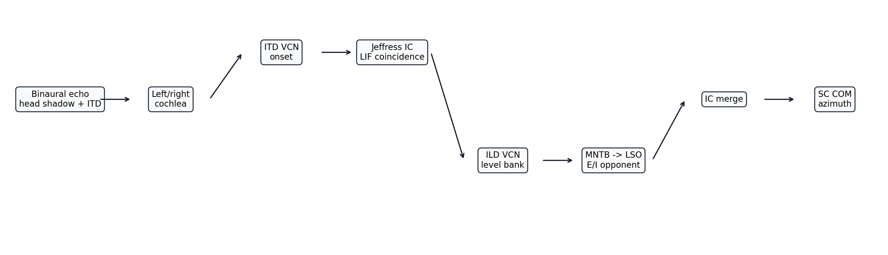
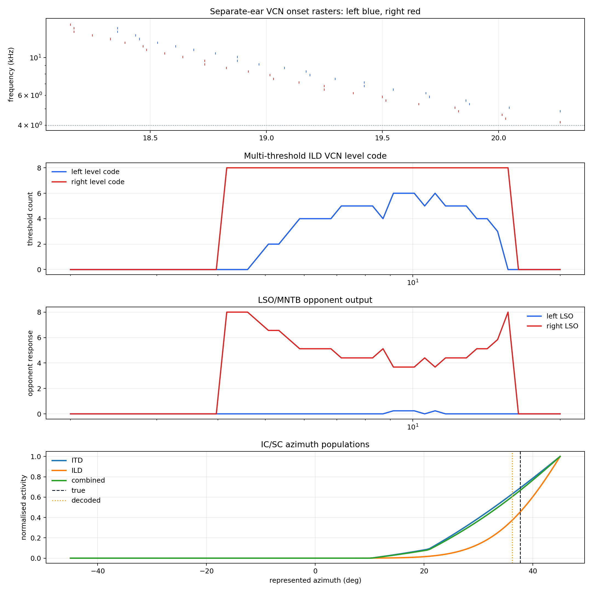
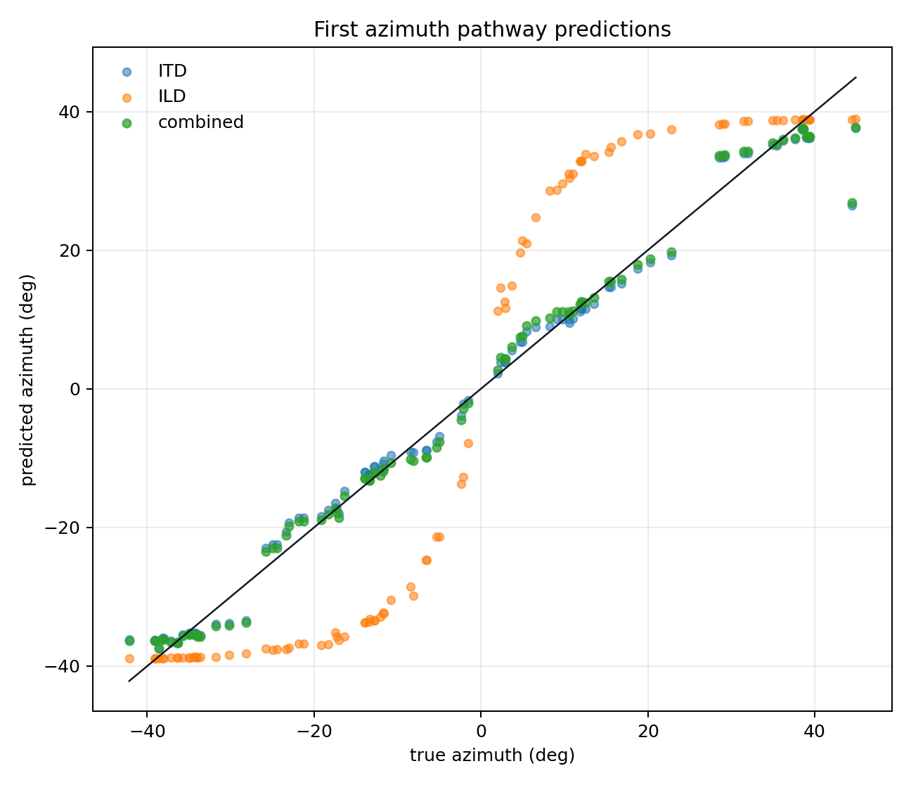
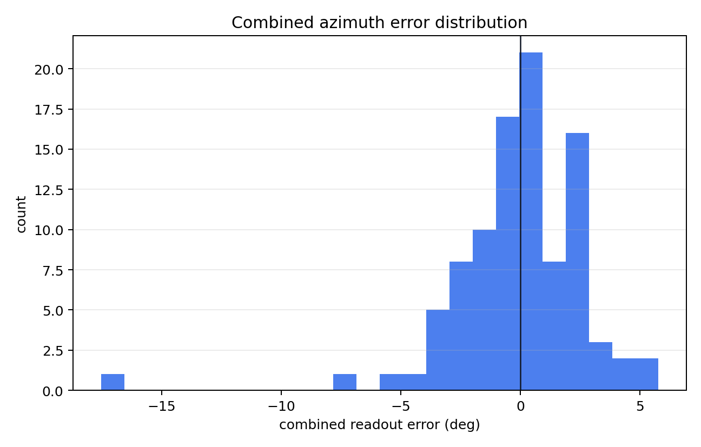

# Azimuth Pathway First Attempt

This report starts a new standalone azimuth pathway. It does not modify the old trained model. The aim is to build an interpretable feed-forward azimuth system using the same final cochlea used in the distance pathway.

## Acoustic Setup

| Parameter | Value |
|---|---:|
| sample rate | `64000 Hz` |
| chirp | `18000 -> 2000 Hz` |
| chirp duration | `3.0 ms` |
| target distance | `3.00 m` |
| primary azimuth range | `+/-45 deg` |
| stress azimuth range | `+/-90 deg` |
| ear spacing | `0.030 m` |
| head shadow strength | `0.320` |
| cochlea channels | `48` |

The old head-shadow model is retained. For azimuth $\theta$, the simulator applies a multiplicative gain to each ear:

$$
g_{ear}=\exp(s_h\sin\theta\,[-1,+1]),
$$

where $s_h$ is the head-shadow strength. Binaural geometry also changes the path length to each ear, creating an ITD.

## ITD Branch

The ITD branch uses separate-ear VCN onset rasters. For candidate azimuth $\theta_k$, the expected right-minus-left ITD is approximated by:

$$
\Delta t_k = -\frac{d_{ear}\sin\theta_k}{c}.
$$

For each frequency channel, a Jeffress-style LIF coincidence detector receives a left onset and a structurally delayed right onset. In the two-spike approximation:

$$
m_{c,k}=1+\beta_{ITD}^{|\Delta n_c-\Delta n_k|},
\qquad
a_{c,k}=\max(0,m_{c,k}-\vartheta_{ITD}).
$$

The ITD azimuth population is the sum of $a_{c,k}$ over channels.

## ILD Branch

The ILD branch uses a multi-threshold level code. For each ear and frequency channel, a bank of threshold neurons converts spike count into a level count. Louder ears cross more thresholds.

The MNTB/LSO opponent stage is:

$$
LSO_L=\max(0,L-g_I R),
\qquad
LSO_R=\max(0,R-g_I L).
$$

The global opponent balance is:

$$
b=\frac{\sum_c LSO_R(c)-\sum_c LSO_L(c)}{\sum_c LSO_R(c)+\sum_c LSO_L(c)}.
$$

Candidate azimuths are scored by matching $b$ to $\sin\theta_k$ with a Gaussian tuning curve.

## IC And SC Readout

The IC combines the normalised ITD and ILD azimuth populations. In this first prototype the ITD branch is deliberately weighted more heavily because the raw ITD detector is already sharp, while the first ILD branch is included as a weaker biological diagnostic cue:

$$
A_{IC}(\theta_k)=w_{ITD}\hat A_{ITD}(\theta_k)+w_{ILD}\hat A_{ILD}(\theta_k).
$$

The first SC readout is a centre of mass:

$$
\hat\theta=\frac{\sum_k A_{IC}(\theta_k)\theta_k}{\sum_k A_{IC}(\theta_k)}.
$$

## Example Processing Stages

The example target has azimuth `37.67 deg`.

## Accuracy

The primary test uses the same azimuth support as the old Round 3/4 training setup, `-45 deg` to `+45 deg`, at fixed range. The stress test expands to `-90 deg` to `+90 deg`.

| Readout | MAE | RMSE | Max error | Bias |
|---|---:|---:|---:|---:|
| ITD only | `1.891 deg` | `2.841 deg` | `18.012 deg` | `-0.018 deg` |
| ILD only | `11.799 deg` | `13.976 deg` | `21.756 deg` | `-1.315 deg` |
| Combined | `1.860 deg` | `2.848 deg` | `17.537 deg` | `-0.054 deg` |
| Combined stress +/-90 deg | `17.749 deg` | `20.211 deg` | `37.004 deg` | `-2.030 deg` |

## Old Model Comparison

These values are copied from the old reports and are not rerun here.

| Model | Azimuth MAE | Notes |
|---|---:|---|
| Round 3 2B + 3 | `2.860 deg` | old trained full model |
| Round 4 combined | `2.832 deg` | old trained full model |
| Round 4 LSO/MNTB ILD experiment | `3.121 deg` | old trained full model |

This first standalone pathway is not yet a full replacement for the old trained azimuth branch. It is useful because the cue split is explicit: ITD, ILD, and combined populations can be inspected separately before adding an azimuth SC attractor or robustness tests.

## Generated Files

- `pipeline_diagram`: `azimuth_pathway/outputs/first_attempt/figures/pipeline_diagram.png`
- `example_stages`: `azimuth_pathway/outputs/first_attempt/figures/example_stages.png`
- `prediction_scatter`: `azimuth_pathway/outputs/first_attempt/figures/prediction_scatter.png`
- `error_histogram`: `azimuth_pathway/outputs/first_attempt/figures/error_histogram.png`
- `results`: `azimuth_pathway/outputs/first_attempt/results.json`

Runtime: `5.92 s`.
