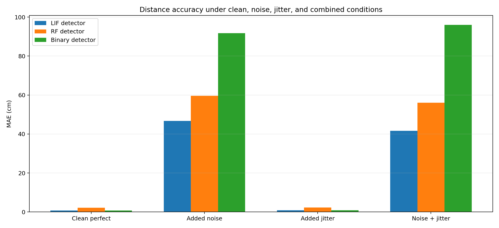
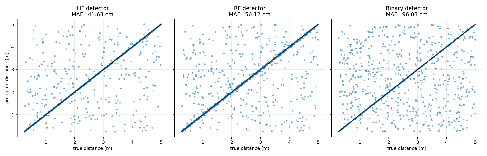
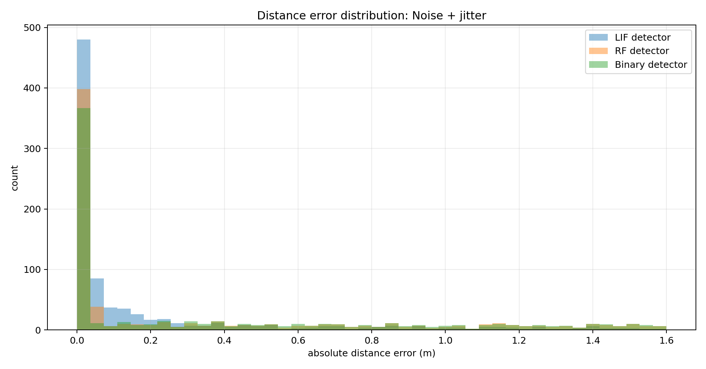
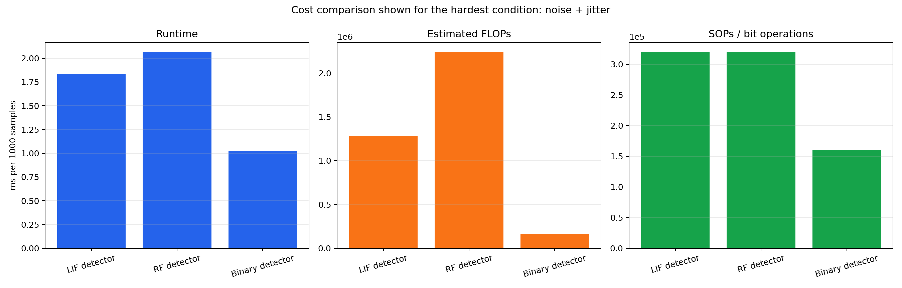
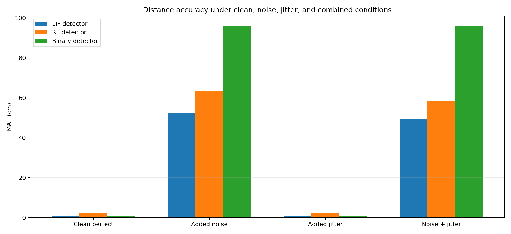
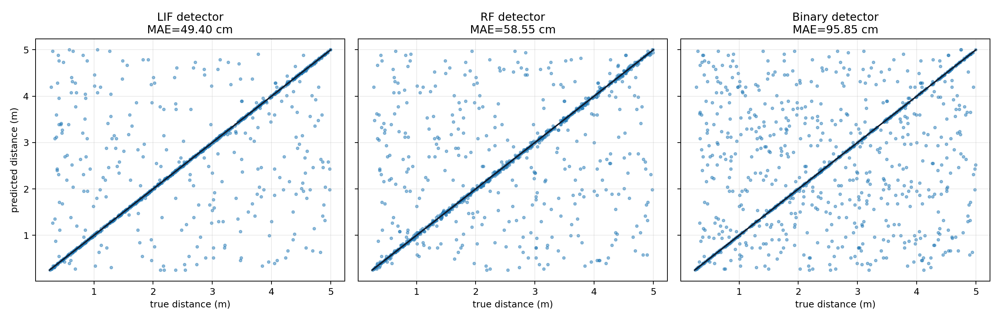
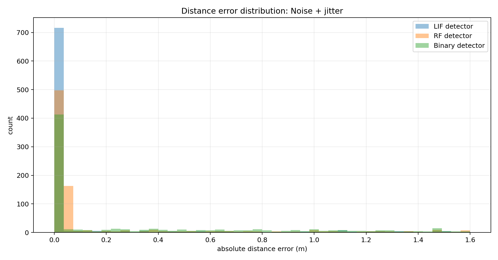
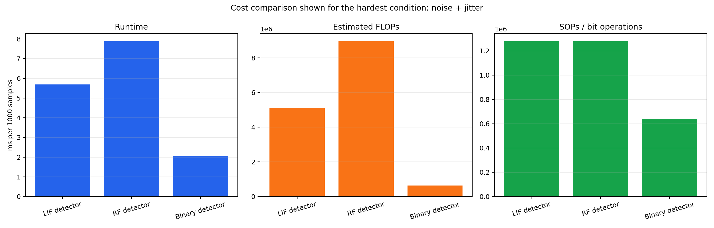

# Distance Pathway 2: Accuracy And Optimisation Testing

This report compares LIF, RF, and binary delay-line coincidence detectors under four conditions: clean, added noise, added jitter, and noise plus jitter.

There are now two input cases:

- **Waveform input:** each delay line samples a synthetic echo waveform, with optional additive white noise.
- **Spiking input:** the upstream system has already extracted onset spikes, with optional false spikes.

# Part A: Waveform Input

## Signal Conditions

| Condition | True echo jitter | Additive white noise |
|---|---:|---:|
| Clean perfect | `False` | `False` |
| Added noise | `False` | `True` |
| Added jitter | `True` | `False` |
| Noise + jitter | `True` | `True` |

Noise here means additive Gaussian white noise on the synthetic echo waveform, with an approximate SNR of `10.0 dB` relative to the unit echo pulse. The echo itself is a narrow Gaussian pulse with sigma `2.0` samples, so nearby delay lines still see a graded amplitude. Jitter means Gaussian timing jitter on the true echo pulse.

## Detector Equations

For all detectors, the candidate delay lines sample the echo waveform at their expected echo-arrival time:

```text
a_k = max(0, waveform[call_time + delay_candidate[k]])
delta_k = abs(delay_echo - delay_candidate[k])
```

The LIF and RF detectors use the sampled amplitude as their input drive. The binary detector checks whether the candidate sample crosses a fixed amplitude threshold and is close enough in time.

```text
LIF:    score_k = a_k * w * (1 + beta^delta_k)
RF:     score_k = a_k * w * (1 + exp(-delta_k/tau_rf) * cos(omega_rf * delta_k))
Binary: match_k = 1 if waveform[call_time + delay_candidate[k]] >= threshold and delta_k <= tolerance
```

## Benchmark Setup

| Parameter | Value |
|---|---:|
| sample rate | `64000 Hz` |
| speed of sound | `343.0 m/s` |
| distance range | `0.25 -> 5.0 m` |
| test samples per condition | `1000` |
| delay lines | `160` |
| jitter std | `35.0 us` |
| white noise SNR | `10.0 dB` |
| echo pulse sigma | `2.0 samples` |

## Accuracy Across Conditions



The detailed numeric results are:

| Condition | Detector | MAE (cm) | RMSE (cm) | p95 abs error (cm) | max abs error (cm) | runtime (ms) | FLOPs | SOPs / bit ops |
|---|---|---:|---:|---:|---:|---:|---:|---:|
| Clean perfect | LIF detector | 0.77 | 0.89 | 1.44 | 1.60 | 1.943 | 1,280,000 | 320,000 |
| Clean perfect | RF detector | 0.77 | 0.89 | 1.44 | 1.60 | 2.134 | 2,240,000 | 320,000 |
| Clean perfect | Binary detector | 0.77 | 0.89 | 1.44 | 1.60 | 1.028 | 160,000 | 160,000 |
| Added noise | LIF detector | 50.35 | 103.55 | 267.11 | 450.41 | 1.916 | 1,280,000 | 320,000 |
| Added noise | RF detector | 96.90 | 149.54 | 330.10 | 450.41 | 2.080 | 2,240,000 | 320,000 |
| Added noise | Binary detector | 103.44 | 155.65 | 339.15 | 464.02 | 1.076 | 160,000 | 160,000 |
| Added jitter | LIF detector | 0.88 | 1.06 | 1.93 | 3.10 | 1.867 | 1,280,000 | 320,000 |
| Added jitter | RF detector | 0.88 | 1.06 | 1.93 | 3.10 | 2.132 | 2,240,000 | 320,000 |
| Added jitter | Binary detector | 0.88 | 1.06 | 1.93 | 3.10 | 0.996 | 160,000 | 160,000 |
| Noise + jitter | LIF detector | 50.98 | 105.39 | 276.16 | 459.65 | 1.834 | 1,280,000 | 320,000 |
| Noise + jitter | RF detector | 91.64 | 145.93 | 327.44 | 459.65 | 2.065 | 2,240,000 | 320,000 |
| Noise + jitter | Binary detector | 100.78 | 153.51 | 336.27 | 459.65 | 1.022 | 160,000 | 160,000 |

## Hardest-Condition Plots

The scatter, histogram, and cost plots below use the hardest condition, `Noise + jitter`.







## Waveform-Input Interpretation

- Clean perfect signals are essentially a delay quantisation problem, so LIF and binary should be close.
- Jitter tests timing tolerance. LIF remains a useful soft detector because the membrane trace decays smoothly with timing mismatch.
- Noise tests robustness to additive waveform fluctuations. In this simplified setup, delay lines sample the noisy waveform at candidate arrival times.
- RF remains biologically interesting, but its oscillatory side lobes are a weakness for this specific pure-delay task.

# Part B: Spiking Input

The second benchmark assumes an earlier front end has already converted the echo into onset spikes. This is closer to the simplified pulse model used before, but it is now explicitly separated from the waveform-input case.

## Spiking Signal Conditions

| Condition | True echo jitter | False spikes |
|---|---:|---:|
| Clean perfect | `False` | `False` |
| Added noise | `False` | `True` |
| Added jitter | `True` | `False` |
| Noise + jitter | `True` | `True` |

Spiking noise means `3` extra false onset spikes per sample, with amplitudes sampled from `0.25` to `1.1`. This tests false-onset robustness after spike extraction.

## Spiking Detector Equations

For observed spike `p` and candidate delay `k`:

```text
delta_p,k = abs(delay_spike[p] - delay_candidate[k])
```

The detector equations are:

```text
LIF:    score_k = max_p amplitude_p * w * (1 + beta^delta_p,k)
RF:     score_k = max_p amplitude_p * w * (1 + exp(-delta_p,k/tau_rf) * cos(omega_rf * delta_p,k))
Binary: score_k = max_p amplitude_p if delta_p,k <= tolerance else no match
```

## Spiking Accuracy Across Conditions



| Condition | Detector | MAE (cm) | RMSE (cm) | p95 abs error (cm) | max abs error (cm) | runtime (ms) | FLOPs | SOPs / bit ops |
|---|---|---:|---:|---:|---:|---:|---:|---:|
| Clean perfect | LIF detector | 0.77 | 0.89 | 1.44 | 1.60 | 1.087 | 1,280,000 | 320,000 |
| Clean perfect | RF detector | 2.20 | 3.06 | 4.98 | 5.13 | 1.309 | 2,240,000 | 320,000 |
| Clean perfect | Binary detector | 0.77 | 0.89 | 1.44 | 1.60 | 0.632 | 160,000 | 160,000 |
| Added noise | LIF detector | 52.47 | 111.88 | 285.50 | 468.05 | 5.760 | 5,120,000 | 1,280,000 |
| Added noise | RF detector | 63.55 | 122.73 | 303.56 | 468.05 | 8.246 | 8,960,000 | 1,280,000 |
| Added noise | Binary detector | 96.22 | 149.95 | 335.88 | 452.10 | 2.336 | 640,000 | 640,000 |
| Added jitter | LIF detector | 0.91 | 1.10 | 2.00 | 3.06 | 1.168 | 1,280,000 | 320,000 |
| Added jitter | RF detector | 2.23 | 3.03 | 5.43 | 6.60 | 1.339 | 2,240,000 | 320,000 |
| Added jitter | Binary detector | 0.91 | 1.10 | 2.00 | 3.06 | 0.577 | 160,000 | 160,000 |
| Noise + jitter | LIF detector | 49.40 | 110.15 | 294.76 | 466.56 | 5.697 | 5,120,000 | 1,280,000 |
| Noise + jitter | RF detector | 58.55 | 117.80 | 299.79 | 448.22 | 7.888 | 8,960,000 | 1,280,000 |
| Noise + jitter | Binary detector | 95.85 | 152.11 | 346.22 | 466.56 | 2.075 | 640,000 | 640,000 |

## Spiking Hardest-Condition Plots

The scatter, histogram, and cost plots below use the spiking `Noise + jitter` condition.







## Overall Interpretation

- Waveform-input noise tests amplitude corruption before onset extraction.
- Spiking-input noise tests false onset events after onset extraction.
- Clean and jitter-only spiking inputs are mostly nearest-delay matching, so LIF and binary can be identical.
- False spikes are where LIF can outperform binary because amplitude-weighted soft coincidence can partially reduce the effect of isolated false events.
- The next realistic test should connect the final cochlea front end to this spiking-input pathway, so the spike statistics come from the actual cochlea rather than being synthetic.

## Generated Files

- `condition_mae`: `distance_pathway/outputs/accuracy_optimisation/figures/condition_mae.png`
- `accuracy_scatter_noise_jitter`: `distance_pathway/outputs/accuracy_optimisation/figures/accuracy_scatter_noise_jitter.png`
- `error_histogram_noise_jitter`: `distance_pathway/outputs/accuracy_optimisation/figures/error_histogram_noise_jitter.png`
- `cost_comparison`: `distance_pathway/outputs/accuracy_optimisation/figures/cost_comparison.png`
- `spiking_condition_mae`: `distance_pathway/outputs/accuracy_optimisation/figures/spiking_condition_mae.png`
- `spiking_accuracy_scatter_noise_jitter`: `distance_pathway/outputs/accuracy_optimisation/figures/spiking_accuracy_scatter_noise_jitter.png`
- `spiking_error_histogram_noise_jitter`: `distance_pathway/outputs/accuracy_optimisation/figures/spiking_error_histogram_noise_jitter.png`
- `spiking_cost_comparison`: `distance_pathway/outputs/accuracy_optimisation/figures/spiking_cost_comparison.png`
- `results`: `distance_pathway/outputs/distance_pathway_results.json`

Runtime: `6.56 s`.
