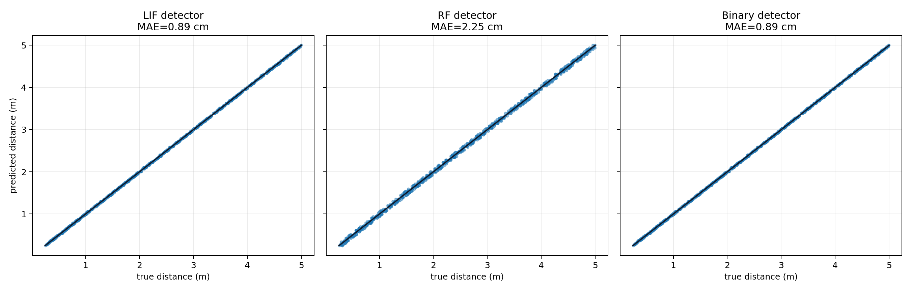
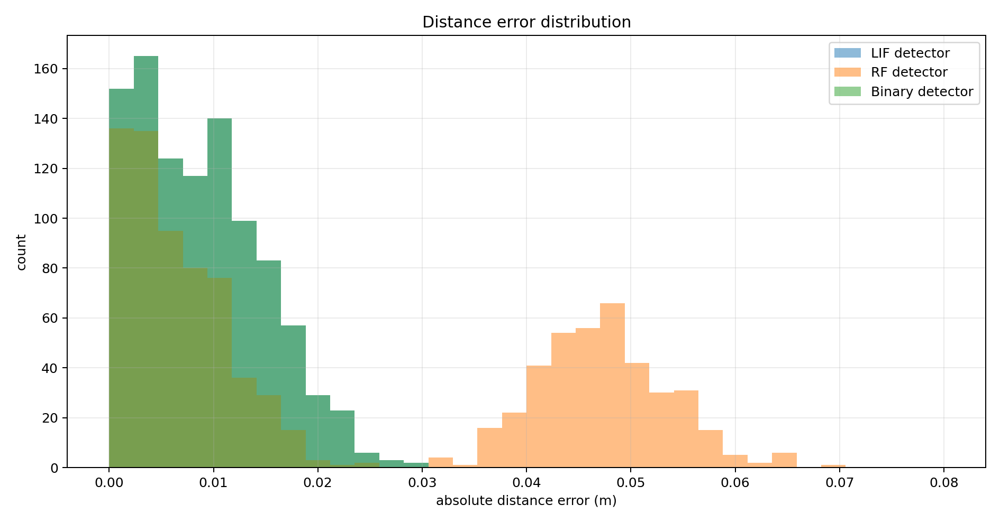

# Distance Pathway 2: Accuracy And Optimisation Testing

This report compares three ways of implementing the simple delay-line distance pathway on ideal pulse timing: LIF, RF, and binary coincidence detection.

## Detector Equations

For all detectors, the mismatch between the observed echo delay and candidate delay is:

```text
delta_k = abs(delay_echo - delay_candidate[k])
```

### LIF Detector

```text
score_k = w * (1 + beta^delta_k)
```

The LIF version is a soft coincidence detector. It is tolerant to small timing offsets because residual membrane voltage decays gradually.

### RF Detector

```text
score_k = w * (1 + exp(-delta_k/tau_rf) * cos(omega_rf * delta_k))
```

The RF version is also soft, but its oscillatory afterpotential can create side lobes. That may be useful for periodicity tasks, but it is not obviously better for pure echo-delay matching.

### Binary Detector

```text
match_k = 1 if delta_k <= tolerance else 0
```

The binary version is the cheapest form. It assumes the upstream system has already produced reliable onset events.

## Benchmark Setup

| Parameter | Value |
|---|---:|
| sample rate | `64000 Hz` |
| speed of sound | `343.0 m/s` |
| distance range | `0.25 -> 5.0 m` |
| test samples | `1000` |
| delay lines | `160` |
| jitter std | `35.0 us` |

The jitter prevents the task from being a perfectly quantized lookup problem.

## Results






| Detector | MAE (cm) | RMSE (cm) | p95 abs error (cm) | max abs error (cm) | runtime (ms) | FLOPs | SOPs / bit ops |
|---|---:|---:|---:|---:|---:|---:|---:|
| LIF detector | 0.89 | 1.07 | 1.95 | 2.91 | 0.916 | 1,280,000 | 320,000 |
| RF detector | 2.25 | 3.05 | 5.50 | 6.85 | 1.219 | 2,240,000 | 320,000 |
| Binary detector | 0.89 | 1.07 | 1.95 | 2.91 | 0.412 | 160,000 | 160,000 |

## Interpretation

- LIF is the clearest biological soft-coincidence baseline.
- RF is biologically interesting, but for pure delay matching it adds oscillatory side lobes and higher estimated FLOP cost.
- Binary coincidence is the most optimized form for ideal onset events and is the natural candidate for later bit-packing/event-based acceleration.
- The binary result should not be over-interpreted yet, because real cochlear spike rasters will have noise, missed spikes, extra spikes, and frequency-channel structure.

## Generated Files

- `accuracy_scatter`: `distance_pathway/outputs/accuracy_optimisation/figures/accuracy_scatter.png`
- `error_histogram`: `distance_pathway/outputs/accuracy_optimisation/figures/error_histogram.png`
- `cost_comparison`: `distance_pathway/outputs/accuracy_optimisation/figures/cost_comparison.png`
- `results`: `distance_pathway/outputs/distance_pathway_results.json`

Runtime: `4.87 s`.
