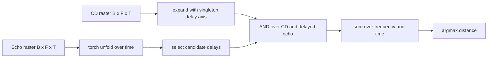

# Binary Clean Pathway Optimisation

This report isolates the clean FM-sweep binary distance path and compares an iterative delay-line implementation with an optimized `torch.unfold` implementation.

## Aim

The optimisation idea is to stop simulating the distance pathway one time step at a time. Instead, construct binary tensors for the corollary discharge and echo, unfold the echo over the delay dimension, and perform the coincidence test as one large boolean operation.



## Important Assumption

This is a clean, grid-aligned benchmark. Target distances are sampled from the delay-line grid, so exact binary coincidence is valid without dilation. This isolates the compute strategy. In a continuous-distance or noisy setting, the binary path would need either a tolerance window, denser delay lines, or surrounding robustness from the sweep/population code.

## Input Rasters

The benchmark uses a simple FM-sweep spike raster: one corollary-discharge spike per frequency channel, and one echo spike per frequency channel shifted by the target delay.


## Methods

### Original LIF Score

```text
score_k = mean_f(beta ^ abs(delay_true - delay_candidate[k]))
```

This is a floating-point soft coincidence baseline.

### Original Binary Loop

```text
for delay in candidate_delays:
    score[delay] = sum(CD[:, :, t] AND echo[:, :, t + delay])
```

This is binary, but still iterates over delay lines.

### Optimised Binary Unfold

```text
echo_windows = echo.unfold(time, max_delay + 1, step=1)
selected = echo_windows[..., candidate_delays]
coincidence = CD[..., valid_time, None] AND selected
score = sum(coincidence over frequency and time)
```

This creates a time-delay view of the echo and evaluates all candidate delays together for each chunk of samples.

## Benchmark Setup

| Parameter | Value |
|---|---:|
| samples | `256` |
| frequency channels | `32` |
| delay lines | `160` |
| sample rate | `64000 Hz` |
| sweep duration | `3.0 ms` |
| max delay | `1866` samples |
| valid unfolded time steps | `352` |
| chunk size | `16` samples |

## Results


| Method | MAE (cm) | Exact accuracy (%) | Runtime (ms) | FLOPs | Binary ops / SOPs |
|---|---:|---:|---:|---:|---:|
| LIF score | 0.0000 | 100.00 | 0.227 | 10,485,760 | 2,621,440 |
| Binary loop | 0.0000 | 100.00 | 1083.050 | 0 | 461,373,440 |
| Binary unfold | 0.0000 | 100.00 | 1369.472 | 0 | 461,373,440 |

## Interpretation

- The unfold method implements the proposed layer-style binary operation: construct a delay dimension, then apply one boolean coincidence operation per chunk.
- Exact binary coincidence works here without dilation because the benchmark is grid-aligned.
- The operation count is similar to the looped binary method, but the simulation structure changes from explicit delay iteration to tensorized delay evaluation.
- On CPU, tensorization is not guaranteed to be faster because the unfolded delay view can create substantial memory traffic. This is still the right structure for later GPU/MPS or bit-packed experiments.
- The next optimisation would be packed-bit `AND`/popcount, which should reduce the memory and operation cost substantially.

## Generated Files

- `clean_sweep_rasters`: `distance_pathway/outputs/binary_clean_optimisation/figures/clean_sweep_rasters.png`
- `accuracy_scatter`: `distance_pathway/outputs/binary_clean_optimisation/figures/accuracy_scatter.png`
- `runtime_cost`: `distance_pathway/outputs/binary_clean_optimisation/figures/runtime_cost.png`
- `results`: `distance_pathway/outputs/binary_clean_optimisation/results.json`

Runtime: `12.92 s`.
