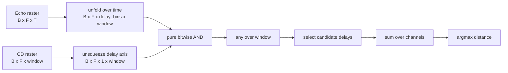

# Binary Clean Pathway Optimisation

This report now compares the optimised binary implementation against the same clean FM-sweep LIF and binary scoring setups used in the distance accuracy tests.

## Aim

The optimisation idea is to stop evaluating only pre-selected delay candidates inside the main coincidence operation. Instead, the echo raster is unfolded across the full delay space, the bitwise coincidence map is computed, time is collapsed, and candidate delays are selected only at the end.



## Important Correction

The previous unfold version selected candidate delays before the bitwise `AND`. That used advanced indexing on the large unfolded tensor and destroyed much of the point of using `unfold`. The corrected ordering is:

```python
echo_windows = echo.unfold(dimension=-1, size=window_length, step=1)
cd_template = swept_cd.unsqueeze(2)
coincidence = echo_windows & cd_template
raw_scores = coincidence.any(dim=-1)
final_scores = raw_scores[..., candidate_delays].sum(dim=1)
```

The only candidate-delay selection now happens after time has been collapsed.

## Input Rasters

The benchmark uses a clean FM-sweep spike raster: one corollary-discharge spike per frequency channel, and one echo spike per frequency channel shifted by the target delay.


## Methods

### Original LIF Score

```text
score_k = mean_f(A * (1 + beta ^ abs(delay_true - delay_candidate[k])))
```

This is the soft timing score used in the clean sweep accuracy test.

### Original Binary Score

```text
score_k = 1 if abs(delay_true - delay_candidate[k]) <= half_bin_tolerance else 0
```

This is the binary clean-sweep score from the accuracy test. The tolerance is half the median delay-line spacing.

### Optimised Binary Unfold

```text
echo_windows = unfold(echo, window_length)
coincidence = echo_windows AND dilated_cd_template
raw_scores = any(coincidence over time)
final_scores = raw_scores at candidate delays, summed over channels
```

The CD template is dilated by the same half-bin tolerance as the original binary score. This makes the optimised method comparable to the accuracy-test binary path while preserving the corrected operation ordering.

## Benchmark Setup

| Parameter | Value |
|---|---:|
| samples | `32` |
| frequency channels | `32` |
| delay lines | `160` |
| sample rate | `64000 Hz` |
| sweep duration | `3.0 ms` |
| max delay | `1866` samples |
| full delay bins tested by unfold | `1867` |
| unfolded window length | `352` samples |
| binary tolerance | `6` samples |

The sample count is intentionally modest because the pure full-delay unfold materialises a large boolean coincidence tensor on CPU. This benchmark tests implementation structure; larger sample counts should use batching, packing, or hardware acceleration.

## Results


| Method | MAE (cm) | Nearest-bin accuracy (%) | Runtime (ms) | FLOPs | Binary ops / SOPs |
|---|---:|---:|---:|---:|---:|
| Original LIF score | 0.6685 | 96.88 | 0.034 | 1,310,720 | 327,680 |
| Original binary score | 0.6950 | 93.75 | 0.008 | 0 | 163,840 |
| Optimised binary unfold | 0.6950 | 93.75 | 77.321 | 0 | 673,120,256 |

## Interpretation

- The original LIF score and original binary score are now the same scoring families as the previous clean sweep accuracy tests.
- The optimised binary implementation now follows the intended pure bitwise logic: no candidate advanced indexing occurs before the `AND`.
- The optimised unfold version performs many more raw binary comparisons because it evaluates every integer delay bin, not only the 160 candidate bins. This is structurally cleaner, but not automatically faster on CPU.
- The result is the right stepping stone for bit-packing: once the boolean tensors are packed into machine words, the same full-delay logic can become `AND` plus popcount rather than dense boolean tensor traffic.

## Generated Files

- `clean_sweep_rasters`: `distance_pathway/outputs/binary_clean_optimisation/figures/clean_sweep_rasters.png`
- `accuracy_scatter`: `distance_pathway/outputs/binary_clean_optimisation/figures/accuracy_scatter.png`
- `runtime_cost`: `distance_pathway/outputs/binary_clean_optimisation/figures/runtime_cost.png`
- `results`: `distance_pathway/outputs/binary_clean_optimisation/results.json`

Runtime: `1.02 s`.
