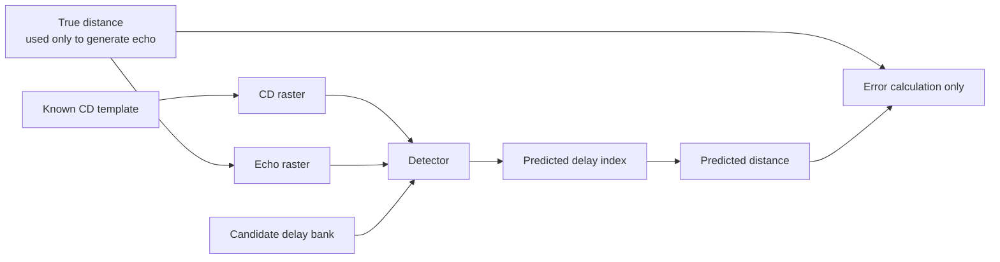
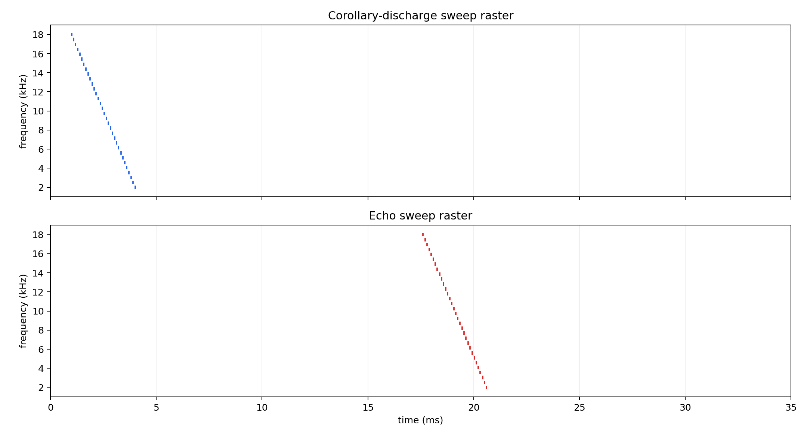
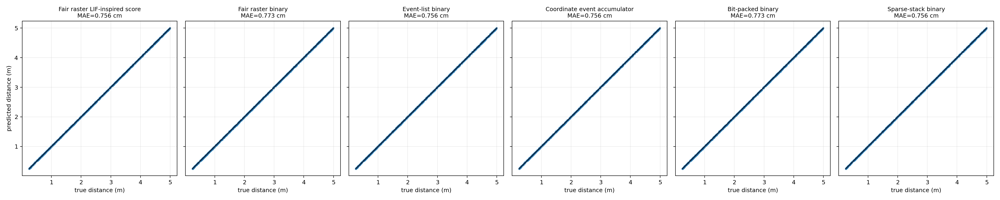
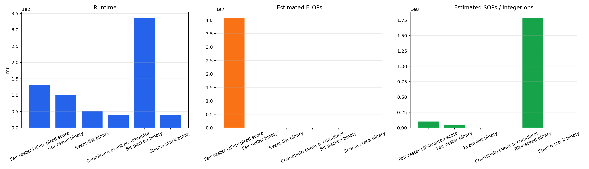

# Binary Clean Pathway Optimisation

This report replaces the earlier unfair analytic delay comparison with a fair detector benchmark. Every method receives only the corollary-discharge raster, the echo raster, and the candidate delay bank. The true distance/delay is used only after prediction to calculate the error.

## Experiment Design

The input is a clean synthetic FM-sweep spike raster. Each frequency channel has one corollary-discharge spike and one echo spike. The echo spike is shifted by the round-trip delay implied by the target distance, but the predictors are not given this delay directly.



This is fair because the detector must infer delay from spike timing in the input rasters. It cannot read `true_delay_samples`, `true_distance_m`, or any precomputed label during prediction.

## Inputs

| Input | Shape / meaning | Used by predictors? |
|---|---|---:|
| CD raster | `1000 x 32 x 2218` Boolean spikes | yes |
| Echo raster | `1000 x 32 x 2218` Boolean spikes | yes |
| Candidate delay bank | `160` candidate delays from `0.25` to `5.0` m | yes |
| True distance | continuous target distance | error calculation only |
| True delay | generated echo shift | generation/error only, not prediction |

For this clean sweep benchmark there is exactly one CD spike per sample/channel and one echo spike per sample/channel. That lets the coordinate methods pair events by `(sample, channel)` without an ambiguity-resolution rule.



## Metrics

- `MAE`: mean absolute distance error in centimetres.
- `RMSE`: root-mean-square distance error in centimetres.
- `Nearest-bin accuracy`: whether the predicted delay line is the candidate delay line closest to the true continuous distance.
- `Runtime`: median wall-clock time over repeated predictor calls on CPU.
- `FLOPs`: rough floating-point operations estimate.
- `SOPs / integer ops`: rough spike/integer operation estimate. These are estimates, not hardware counters.

## Methods

### Fair Raster LIF-Inspired Soft Score

Extracts the first CD spike and first echo spike from each channel, computes the observed delay, then uses a soft LIF-like timing score:

```text
observed_delay_c = echo_time_c - cd_time_c
score_k = mean_c(beta ^ abs(observed_delay_c - candidate_delay_k))
```

This is an important simplification. It is not a full LIF neuron simulation with membrane threshold, reset, refractory period, and emitted output spikes. It is a scoring surrogate: the exponential decay mimics how a leaky membrane would give high coincidence score to near-simultaneous inputs and lower score to separated inputs. The model detects distance by choosing the delay line with the largest score, not by counting threshold-crossing LIF output spikes.

### Fair Raster Binary

Uses the same observed delays, but each delay line is either matched or not matched:

```text
score_k = mean_c(abs(observed_delay_c - candidate_delay_k) <= tolerance)
```

### Event-List Binary

Converts the rasters into a list of events, computes echo-minus-CD delays, and votes directly for the nearest candidate delay. This removes the dense time axis from the computation.

```text
events = nonzero(spike_raster)
delay_events = echo_events.time - cd_events.time
score[nearest_candidate(delay_event)] += 1
```

### Coordinate Event Accumulator

This combines the event-list and sparse-stack ideas. The raster is converted into a compact coordinate matrix:

```text
CD coordinates   = [[batch, channel, time], ...]
Echo coordinates = [[batch, channel, time], ...]
```

Since the CD has one spike per channel, CD and echo events can be sorted by `(batch, channel)` and paired directly. The detector then performs vector subtraction and candidate lookup:

```text
delay_i = echo_time_i - cd_time_i
candidate_i = nearest_candidate_lookup[delay_i]
score[batch_i, candidate_i] += 1
prediction = argmax_candidate(score)
```

The accumulator uses `np.bincount` over flattened `(batch, candidate)` vote IDs rather than building a dense raster or a PyTorch sparse tensor. This is the current recommended implementation direction for sparse clean spikes.

| Parameter | Value / behaviour |
|---|---|
| CD spikes | `32000` total, exactly one per sample/channel |
| Echo spikes | `32000` total, exactly one per sample/channel |
| Coordinate columns | `batch index`, `channel index`, `timestamp` |
| Pairing key | sorted `(batch, channel)` |
| Delay calculation | vectorised `echo_time - cd_time` |
| Candidate quantisation | nearest-candidate lookup table |
| Vote accumulation | vectorised `np.bincount` over flattened `(batch, candidate)` IDs |

### Bit-Packed Binary

Packs every time trace into a Python integer bitset. Candidate delays are tested by shifting the echo bitset and applying a bitwise `AND` with the CD bitset:

```text
match_k,c = ((echo_bits_c >> candidate_delay_k) AND cd_bits_c) != 0
score_k = sum_c(match_k,c)
```

The current trace length is `2218` samples, so each trace corresponds to about `35` 64-bit words conceptually. Python integers are used here for clarity, not maximum speed.

### Sparse-Stack Binary

Builds a sparse `(sample, candidate_delay)` score stack from event delays. Multiple channels voting for the same candidate coalesce into a larger score.

```text
candidate = delay_to_candidate_lookup[observed_delay]
sparse_score[sample, candidate] += 1
prediction = argmax_candidate(sparse_score)
```

## Benchmark Setup

| Parameter | Value |
|---|---:|
| samples | `1000` |
| frequency channels | `32` |
| delay lines | `160` |
| sample rate | `64000 Hz` |
| sweep duration | `3.0 ms` |
| max delay | `1866` samples |
| binary tolerance | `6` samples |
| time samples per trace | `2218` |

## Results





| Method | MAE (cm) | RMSE (cm) | Nearest-bin accuracy (%) | Runtime (ms) | FLOPs | SOPs / integer ops |
|---|---:|---:|---:|---:|---:|---:|
| Fair raster LIF-inspired score | 0.7562 | 0.8708 | 97.50 | 130.016 | 40,960,000 | 10,240,000 |
| Fair raster binary | 0.7732 | 0.8995 | 92.90 | 100.040 | 0 | 5,120,000 |
| Event-list binary | 0.7562 | 0.8708 | 97.50 | 51.331 | 0 | 256,000 |
| Coordinate event accumulator | 0.7562 | 0.8708 | 97.50 | 39.672 | 0 | 32,000 |
| Bit-packed binary | 0.7732 | 0.8995 | 92.90 | 337.205 | 0 | 179,200,000 |
| Sparse-stack binary | 0.7562 | 0.8708 | 97.50 | 38.297 | 0 | 32,000 |

## Interpretation

- The fair raster LIF-inspired score and fair raster binary methods now consume only input rasters, so they are valid detector baselines.
- The coordinate event accumulator is the most direct combination of the event-list and sparse-stack ideas: represent spikes as coordinates, compute delays by vector subtraction, then accumulate candidate votes.
- The event-list and sparse-stack methods are kept as comparison points because they show the two halves of the combined coordinate accumulator.
- The bit-packed method is closer to a real binary hardware implementation, but this Python-int prototype is mainly a correctness and scaling demonstration.
- Dense `unfold` is no longer treated as the main optimised method because it turns sparse spikes into a large dense memory-traffic problem.

## Generated Files

- `clean_sweep_rasters`: `distance_pathway/outputs/binary_clean_optimisation/figures/clean_sweep_rasters.png`
- `accuracy_scatter`: `distance_pathway/outputs/binary_clean_optimisation/figures/accuracy_scatter.png`
- `runtime_cost`: `distance_pathway/outputs/binary_clean_optimisation/figures/runtime_cost.png`
- `results`: `distance_pathway/outputs/binary_clean_optimisation/results.json`

Runtime: `5.69 s`.
