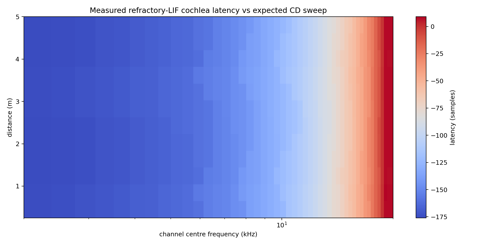
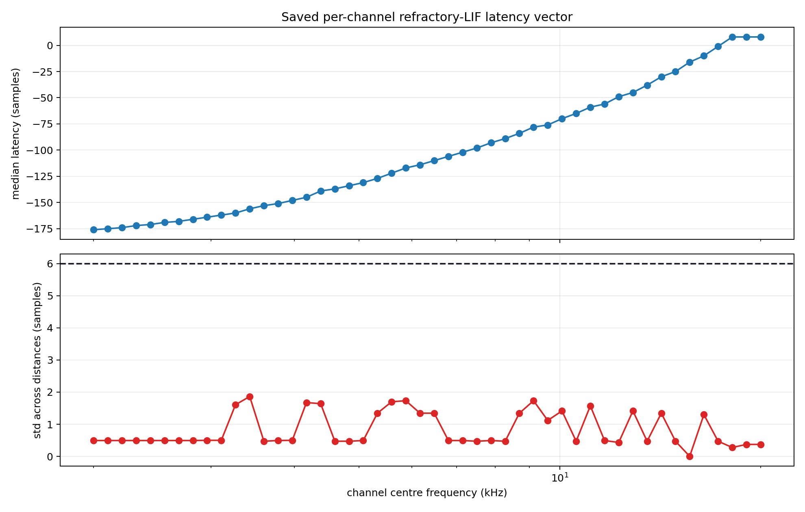
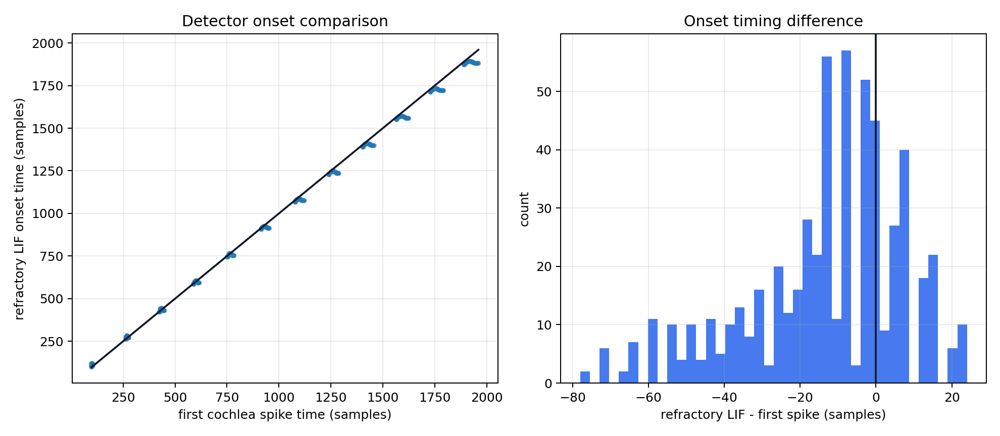

# Cochlea Latency Experiment

This experiment measures the per-channel latency introduced by the final cochlea front end plus a low-threshold refractory-LIF onset detector. It tests whether that latency is stable enough to use as a correction vector in the full distance pathway.

## Method

For each test distance:

1. Simulate a clean binaural echo.
2. Run the final cochlea model: IIR resonator bank, rectification, TorchScript LIF spikes.
3. Combine left/right cochleagram activity with a max operation.
4. Apply a low-threshold refractory-LIF onset detector to get one causal onset per channel.
5. Compare that onset time with the expected ideal corollary-discharge sweep time plus the acoustic round-trip delay.

```text
latency_c,d = refractory_LIF_onset_c,d - (CD_time_c + round_trip_delay_d)
latency_vector_c = median_d(latency_c,d)
```

The saved vector is intended to be applied to the corollary-discharge template in the full pathway, rather than subtracting latency from echo spikes.

## Refractory LIF Onset Detector

The refractory-LIF detector is used because the raw first cochlea spike is distance/amplitude dependent. The detector uses an adaptive per-channel threshold and a long refractory period so it produces one onset event per sweep:

```text
v_c[t] = beta*v_c[t-1] + cochleagram_c[t]
onset_c = first t where v_c[t] >= threshold_c
threshold_c = fraction * max_t(cochleagram_c[t])
```

The refractory period was `10.0 ms`, threshold fraction `0.03`, and beta `0.92`.

## Parameters

| Parameter | Value |
|---|---:|
| sample rate | `64000 Hz` |
| channels | `48` |
| distances tested | `0.25 -> 5.00 m` |
| number of distances | `12` |
| consistency threshold | `6.0` samples max std |

## Results







| Metric | Value |
|---|---:|
| mean channel latency std | `0.825` samples |
| max channel latency std | `1.863` samples |
| mean simple first-spike latency std | `14.776` samples |
| max simple first-spike latency std | `25.692` samples |
| missing first-spike fraction | `0.0000` |
| missing refractory-LIF fraction | `0.0000` |
| median refractory-LIF minus first-spike time | `-9.000` samples |
| p95 abs refractory-LIF difference | `54.250` samples |
| simple first-spike swap safe | `False` |
| latency vector accepted | `True` |

## Interpretation

- The latency vector is accepted if refractory-LIF latency is stable across distance, because it can then be treated as a fixed cochlea/front-end delay per channel.
- The simple first-spike method is only safe to use if its onset timing closely matches the refractory-LIF detector.
- The latency correction should be applied to the corollary-discharge expectation or IC comparison, not by moving echo spikes earlier in time.

## Saved Files

- `latency_vector`: `distance_pathway/outputs/cochlea_latency/cochlea_latency_samples.npy`
- `results`: `distance_pathway/outputs/cochlea_latency/results.json`
- `latency_heatmap`: `distance_pathway/outputs/cochlea_latency/figures/latency_heatmap.png`
- `latency_vector`: `distance_pathway/outputs/cochlea_latency/figures/latency_vector.png`
- `detector_comparison`: `distance_pathway/outputs/cochlea_latency/figures/detector_comparison.png`

Runtime: `0.70 s`.