# Distance Noise Diagnostics

This report diagnoses why the full distance pathway fails under the harsh noise condition used in the signal-analysis mini model.

Two variants are compared on the same noisy echo:

- Cochleagram VCN: the VCN onset LIF reads the rectified cochleagram.
- Spike-raster VCN: the VCN onset LIF reads the cochlear spike raster.

## Noise Condition

- Distance: `3.00 m`
- Additive white receiver noise: `10.0 dB` SNR over the active echo window
- Propagation jitter: `jitter_std = 0.00025 s`
- Realised `noise_std`: `2.96442`

The goal is not to prove final robustness. The goal is to see where the failure enters the pathway.

## Shared Noisy Cochlea Output

Both VCN variants receive the same noisy simulated echo and the same cochlea front end.

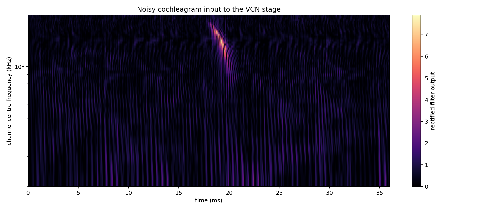

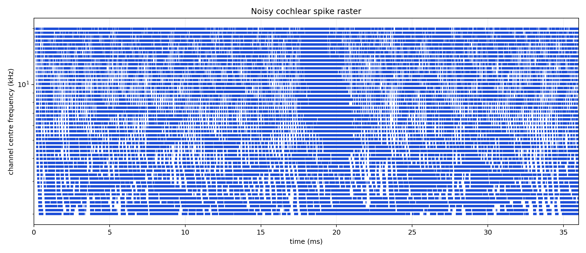

## VCN Outputs

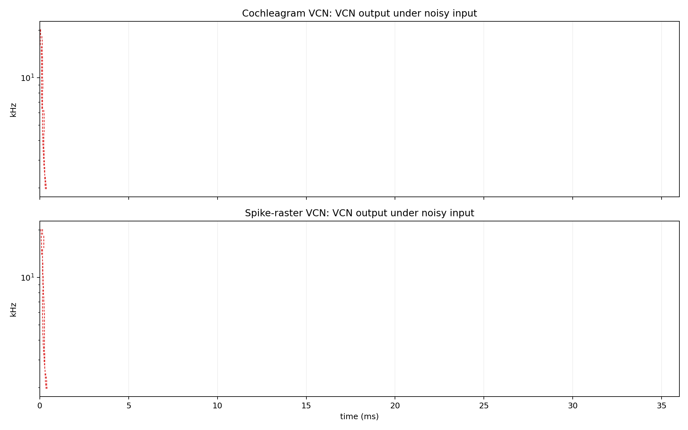

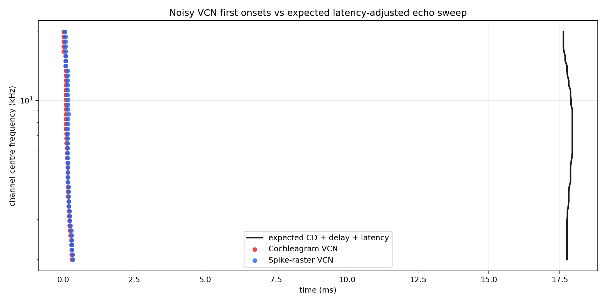

## Timing Summary

| Model | VCN input | Active channels | First global onset | Mean abs timing error | Median timing error | Error range |
|---|---|---:|---:|---:|---:|---:|
| Cochleagram VCN | `cochleagram` | `48` | `0.016 ms` | `1131.0` samples | `-1130.5` samples | `-1142 -> -1116` samples |
| Spike-raster VCN | `spikes` | `48` | `0.062 ms` | `1128.4` samples | `-1128.5` samples | `-1138 -> -1114` samples |

## Cochlear Threshold Sweep

The first attempted fix is to raise the cochlear spike threshold while keeping the same noisy waveform. This tests whether the noisy cochlear spike raster can be cleaned before changing the downstream VCN logic.

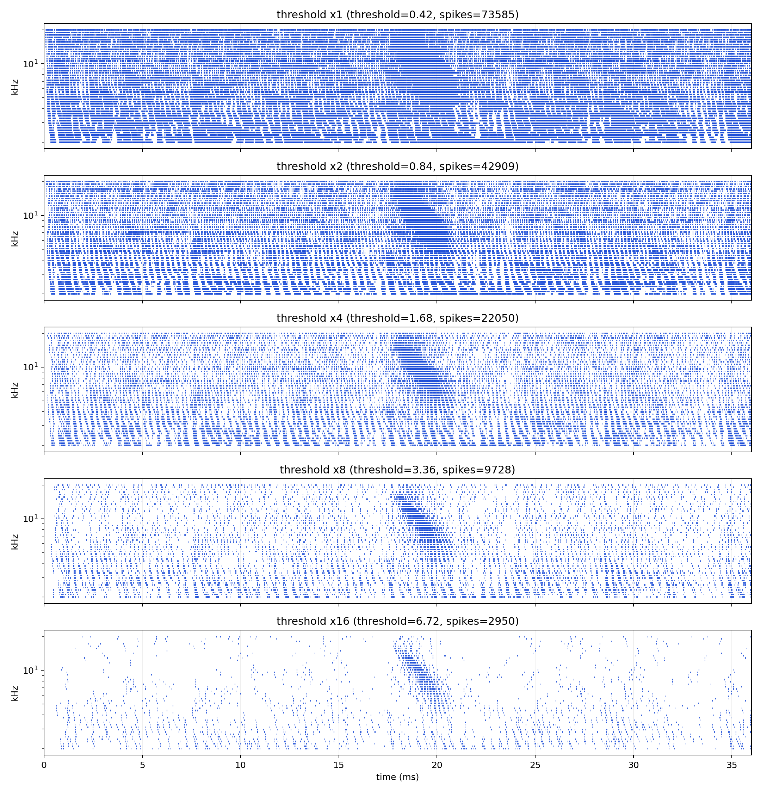

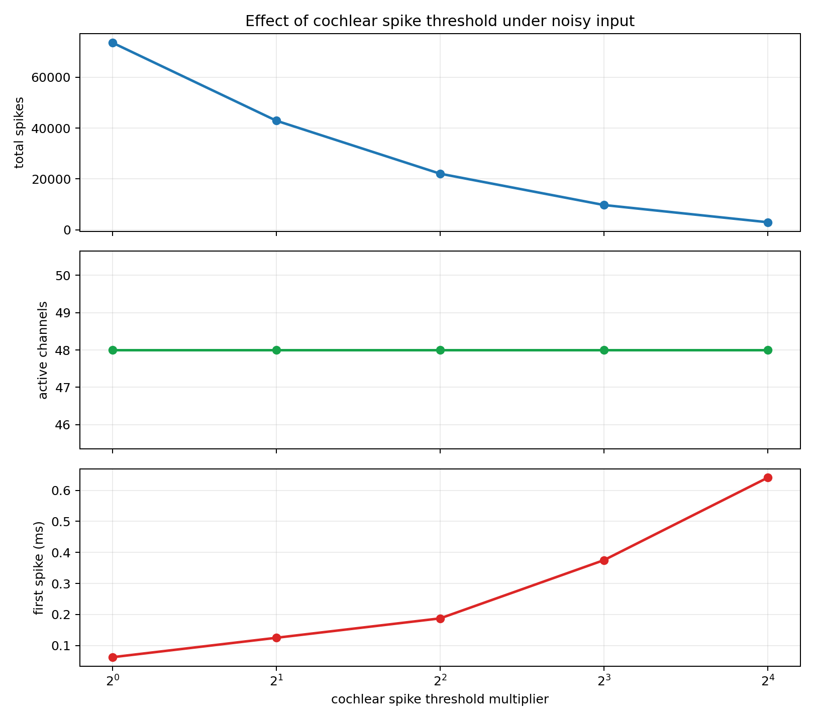

| Threshold multiplier | Spike threshold | Total cochlear spikes | Active channels | First global spike |
|---:|---:|---:|---:|---:|
| `x1` | `0.42` | `73585` | `48` | `0.062 ms` |
| `x2` | `0.84` | `42909` | `48` | `0.125 ms` |
| `x4` | `1.68` | `22050` | `48` | `0.188 ms` |
| `x8` | `3.36` | `9728` | `48` | `0.375 ms` |
| `x16` | `6.72` | `2950` | `48` | `0.641 ms` |

## Cochlear Decay Sweep At 16x Threshold

Using the `16x` cochlear spike threshold as the best cleanup attempt so far, this sweep varies the cochlear LIF decay/beta. Lower beta leaks faster and should reduce accumulation from isolated noise; higher beta integrates longer and may increase sensitivity.

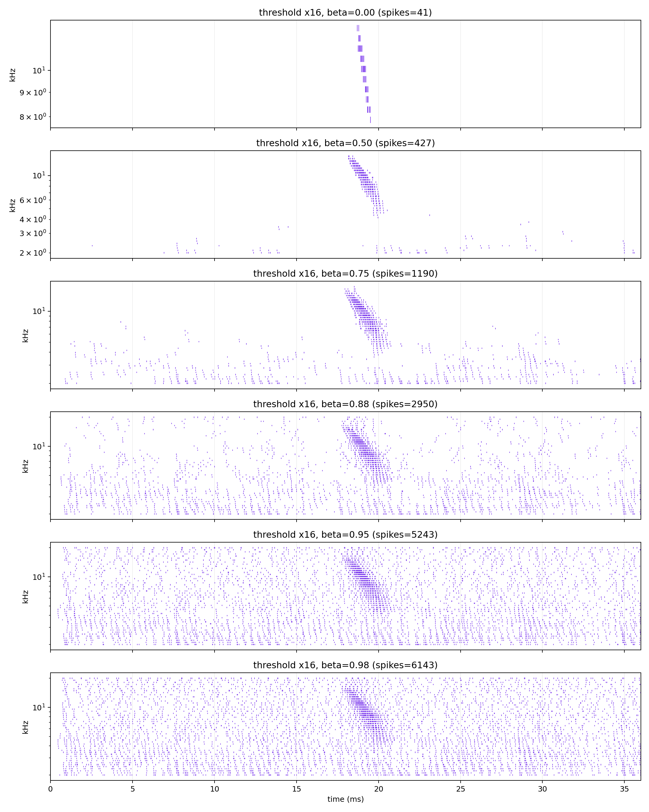

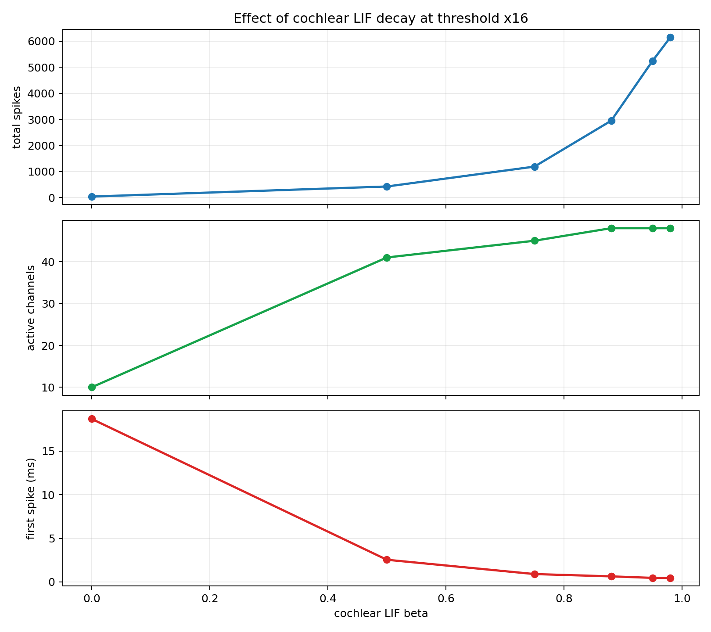

| Cochlear beta | Spike threshold | Total cochlear spikes | Active channels | First global spike |
|---:|---:|---:|---:|---:|
| `0.00` | `6.72` | `41` | `10` | `18.703 ms` |
| `0.50` | `6.72` | `427` | `41` | `2.547 ms` |
| `0.75` | `6.72` | `1190` | `45` | `0.906 ms` |
| `0.88` | `6.72` | `2950` | `48` | `0.641 ms` |
| `0.95` | `6.72` | `5243` | `48` | `0.469 ms` |
| `0.98` | `6.72` | `6143` | `48` | `0.453 ms` |

## Dynamic Threshold And Beta

The next test addresses the distance-dependent volume problem. Near echoes are loud and arrive early; far echoes are weak and arrive late. A fixed threshold/beta therefore either over-fires on early noise or misses far echoes.

The tested dynamic LIF uses:

```text
threshold(t) = threshold_base * (floor + (start - floor)*exp(-t/tau_threshold))
beta(t) = beta_start + (beta_end - beta_start)*(1 - exp(-t/tau_beta))
v_c[t] = beta(t)*v_c[t-1] + cochleagram_c[t]
spike_c[t] = 1 if v_c[t] >= threshold(t)
```

This is a heuristic rather than an analytic optimum. Analytically deriving the optimum would require a calibrated model of echo amplitude, target reflectivity, channel noise variance, filter group delay, and acceptable false-alarm probability. Here, a small parameter sweep is used as a practical first step.

Spike-count SNR is measured as the ratio of spike rate in the expected echo window to spike rate in an equal-length pre-echo noise window:

```text
SNR_spike = 10 log10((echo_rate + 1) / (noise_rate + 1))
```

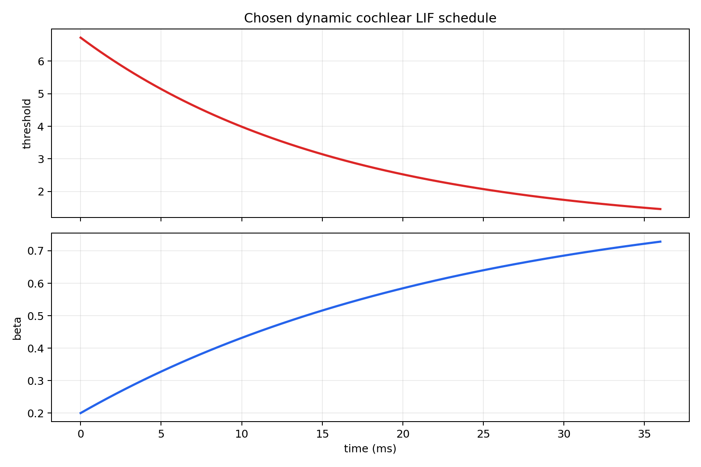

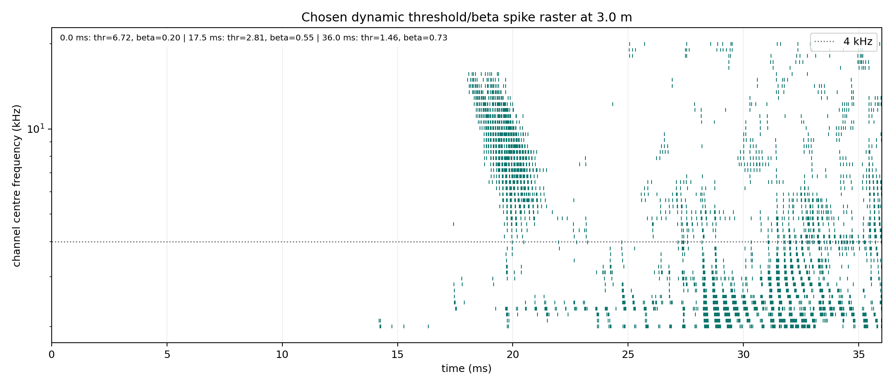

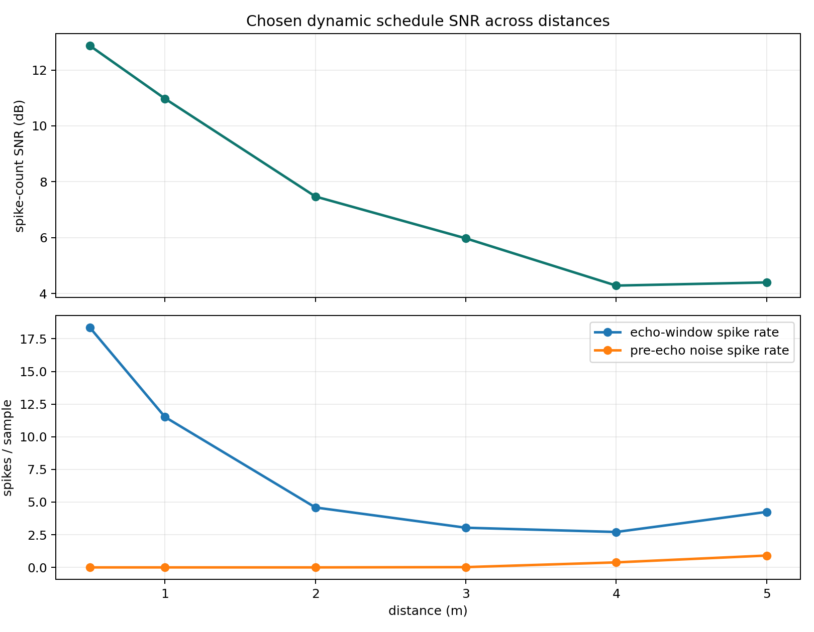

| Schedule | Start threshold | Floor threshold | Threshold tau | Beta start | Beta end | Beta tau | Mean SNR | SNR std | Min SNR | Score |
|---|---:|---:|---:|---:|---:|---:|---:|---:|---:|---:|
| `dyn_A_x32_to_x8_beta0_to_0p75` | `x32` | `x8` | `10.0 ms` | `0.00` | `0.75` | `18.0 ms` | `5.03 dB` | `3.91 dB` | `0.93 dB` | `1.58` |
| `dyn_B_x32_to_x4_beta0_to_0p75` | `x32` | `x4` | `12.0 ms` | `0.00` | `0.75` | `18.0 ms` | `5.78 dB` | `3.32 dB` | `2.49 dB` | `3.71` |
| `dyn_C_x24_to_x6_beta0_to_0p8` | `x24` | `x6` | `14.0 ms` | `0.00` | `0.80` | `22.0 ms` | `5.38 dB` | `3.93 dB` | `1.37 dB` | `2.13` |
| `dyn_D_x16_to_x4_beta0p2_to_0p8` | `x16` | `x4` | `10.0 ms` | `0.20` | `0.80` | `18.0 ms` | `7.65 dB` | `3.60 dB` | `3.41 dB` | `5.75` |
| `dyn_E_x16_to_x2_beta0p2_to_0p88` | `x16` | `x2` | `16.0 ms` | `0.20` | `0.88` | `24.0 ms` | `7.66 dB` | `3.24 dB` | `4.28 dB` | `6.56` |

Chosen schedule: `dyn_E_x16_to_x2_beta0p2_to_0p88` with threshold `x16 -> x2` and beta `0.20 -> 0.88`.

| Distance | Echo spikes | Noise spikes | Spike SNR |
|---:|---:|---:|---:|
| `0.50 m` | `6465` | `0` | `12.87 dB` |
| `1.00 m` | `4052` | `0` | `10.97 dB` |
| `2.00 m` | `1615` | `0` | `7.47 dB` |
| `3.00 m` | `1069` | `7` | `5.97 dB` |
| `4.00 m` | `954` | `135` | `4.28 dB` |
| `5.00 m` | `1495` | `319` | `4.40 dB` |

## Per-Distance Call Comparisons

The following plots compare the same noisy call/echo condition at `1, 2, 3, 4, 5 m`. Each figure shows the noisy binaural waveform, the fixed robust cochlea raster (`threshold x16`, `beta=0.5`), and the chosen dynamic threshold/beta raster.

### 1 m

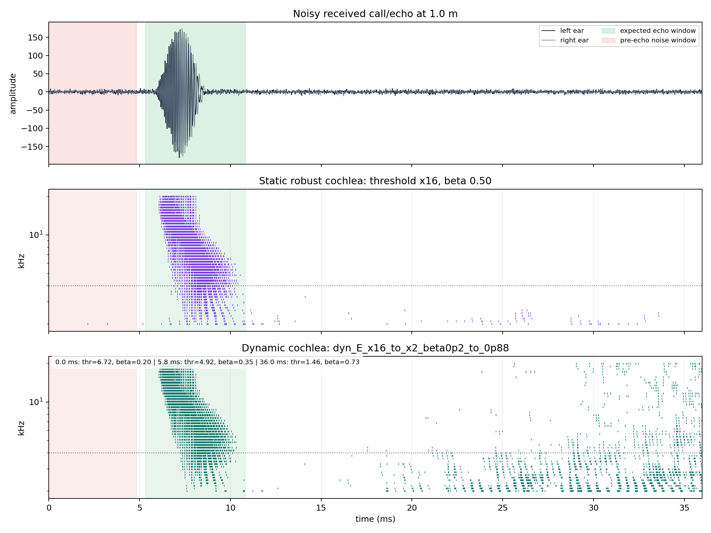

### 2 m

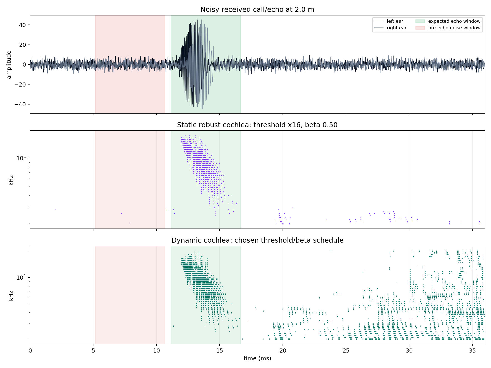

### 3 m

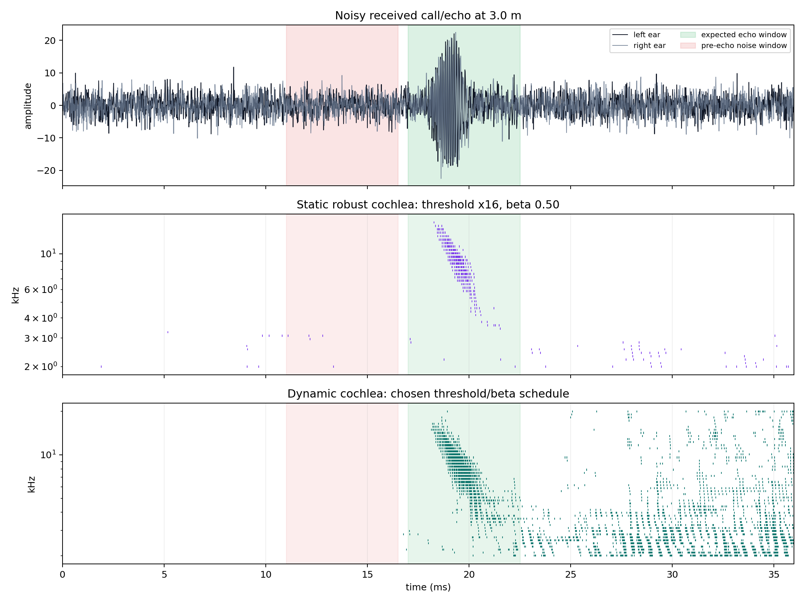

### 4 m

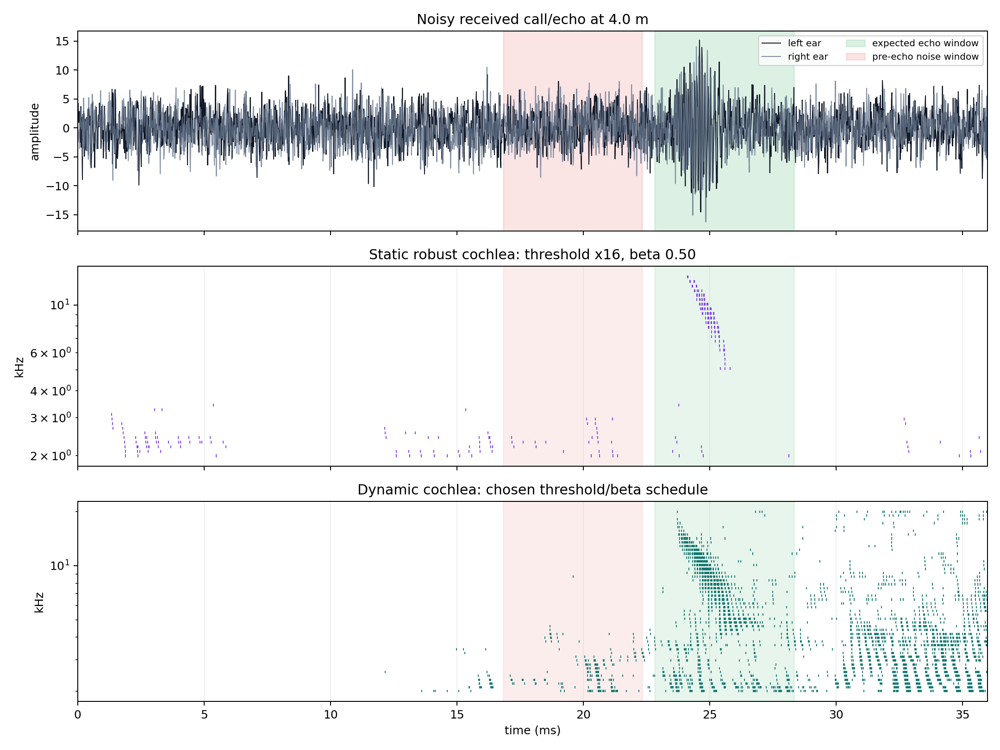

### 5 m

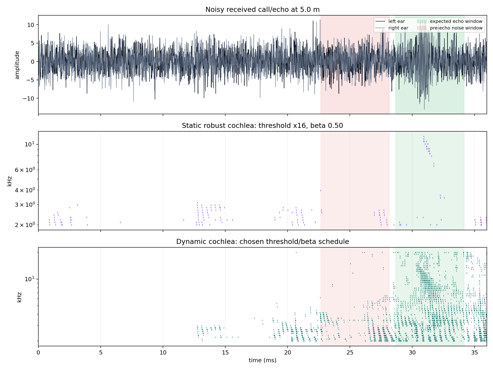


## Interpretation

- The cochleagram-driven VCN is very sensitive because it uses a low adaptive threshold on continuous cochleagram activity.
- Under strong white noise, early noise energy can cross that low threshold before the real echo onset.
- The spike-raster VCN is slightly more conservative because it waits for the cochlear spike encoder, but it still fails when noise creates false or shifted cochlear spikes.
- The clean 0.32 cm result is therefore a clean-timing result, not yet a robust-noise result.
- Raising the cochlear spike threshold can reduce spike density, but the important question is whether it removes the early false events without deleting the real echo.
- Reducing cochlear beta tests whether faster leak can stop isolated noisy samples from accumulating into false early spikes.
- Dynamic thresholding/beta is a better match to distance-dependent volume: it suppresses early noise strongly, then gradually becomes more sensitive to later weak echoes.
- The next fix should be a more robust VCN onset rule, such as multi-channel agreement, matched sweep gating, higher/refractory adaptive thresholds, or a pre-onset denoising/gain-control stage.

## Noise Definition Details

The noise in this diagnostic is a fixed additive receiver noise floor, but that fixed value is calibrated from a reference condition.

Reference condition used to set the noise floor:

- Distance: `3.00 m`
- Azimuth: `0 deg`
- Elevation: `0 deg`
- Clean binaural echo, no elevation cue
- Active echo window: samples where the clean left-ear received waveform exceeds `2%` of its own maximum absolute amplitude
- Target reference SNR: `10.0 dB`

The noise standard deviation is calculated as:

```text
signal_rms = RMS(clean_reference_echo over active echo window)
noise_std = signal_rms / 10^(target_snr_db / 20)
```

For these diagnostics this gives `noise_std = 2.96442`.

That same `noise_std` is then reused for all tested distances:

```text
receive_noisy[d] = receive_clean[d] + Normal(0, noise_std)
```

Therefore the actual received SNR is not fixed across distance. It is highest for near/loud echoes and lower for far/weak echoes. So this should be described as a fixed receiver noise floor calibrated to 10 dB SNR at the reference condition, not as 10 dB SNR at every distance and not as 10 dB SNR at call emission.

## Generated Files

- `noisy_cochleagram`: `distance_pathway/outputs/distance_noise_diagnostics/figures/noisy_cochleagram.png`
- `noisy_spike_raster`: `distance_pathway/outputs/distance_noise_diagnostics/figures/noisy_spike_raster.png`
- `noisy_vcn_outputs`: `distance_pathway/outputs/distance_noise_diagnostics/figures/noisy_vcn_outputs.png`
- `expected_vs_vcn`: `distance_pathway/outputs/distance_noise_diagnostics/figures/expected_vs_vcn.png`
- `threshold_spike_rasters`: `distance_pathway/outputs/distance_noise_diagnostics/figures/threshold_spike_rasters.png`
- `threshold_summary`: `distance_pathway/outputs/distance_noise_diagnostics/figures/threshold_summary.png`
- `beta_spike_rasters`: `distance_pathway/outputs/distance_noise_diagnostics/figures/beta_spike_rasters.png`
- `beta_summary`: `distance_pathway/outputs/distance_noise_diagnostics/figures/beta_summary.png`
- `dynamic_chosen_raster`: `distance_pathway/outputs/distance_noise_diagnostics/figures/dynamic_chosen_raster.png`
- `dynamic_snr_across_distance`: `distance_pathway/outputs/distance_noise_diagnostics/figures/dynamic_snr_across_distance.png`
- `dynamic_schedule`: `distance_pathway/outputs/distance_noise_diagnostics/figures/dynamic_schedule.png`
- `distance_comparison_1m`: `distance_pathway/outputs/distance_noise_diagnostics/figures/distance_comparison_1m.png`
- `distance_comparison_2m`: `distance_pathway/outputs/distance_noise_diagnostics/figures/distance_comparison_2m.png`
- `distance_comparison_3m`: `distance_pathway/outputs/distance_noise_diagnostics/figures/distance_comparison_3m.png`
- `distance_comparison_4m`: `distance_pathway/outputs/distance_noise_diagnostics/figures/distance_comparison_4m.png`
- `distance_comparison_5m`: `distance_pathway/outputs/distance_noise_diagnostics/figures/distance_comparison_5m.png`
- `results`: `distance_pathway/outputs/distance_noise_diagnostics/results.json`

Runtime: `10.78 s`.