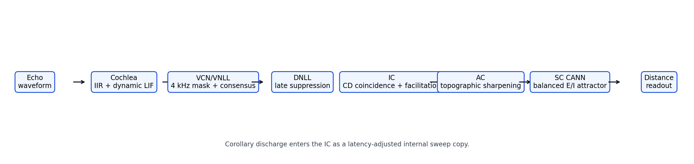
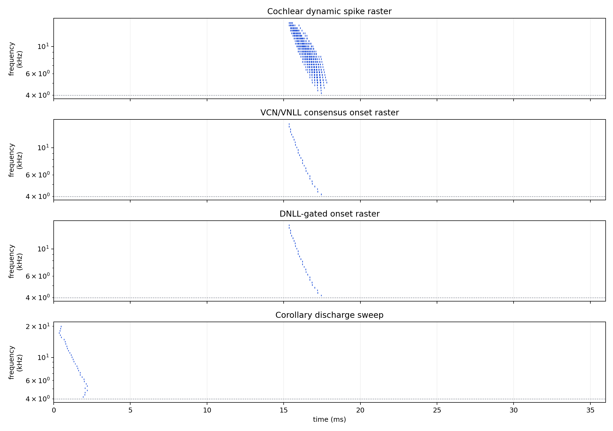
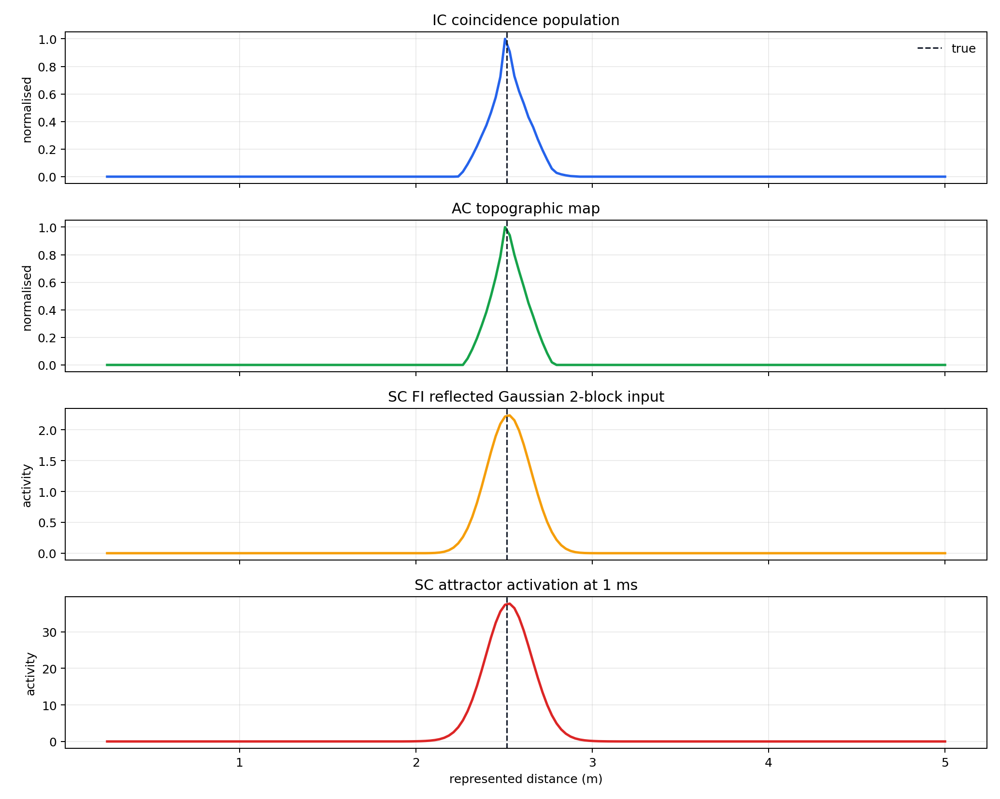
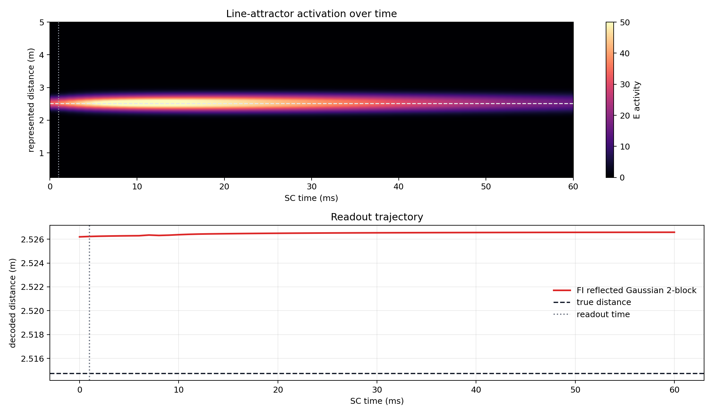
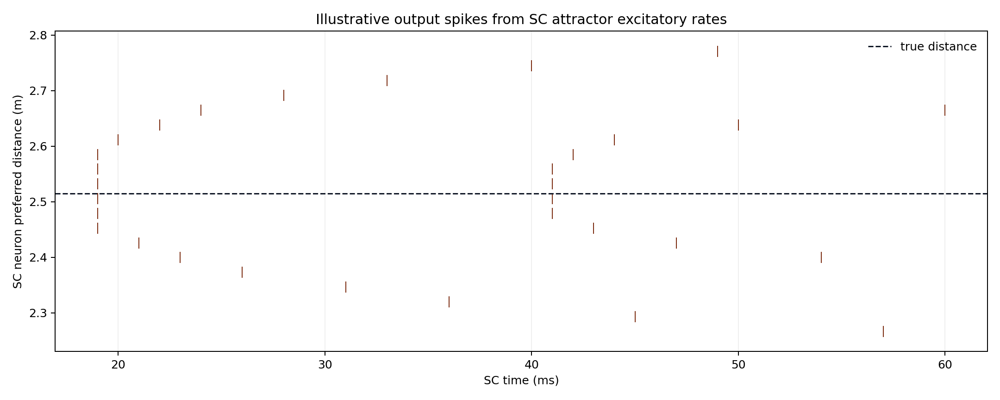
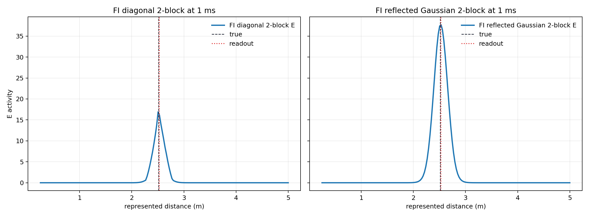
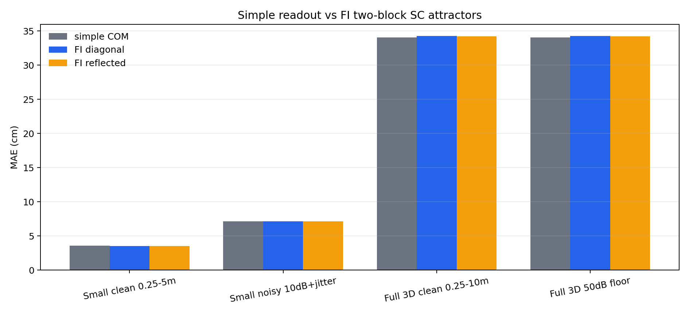
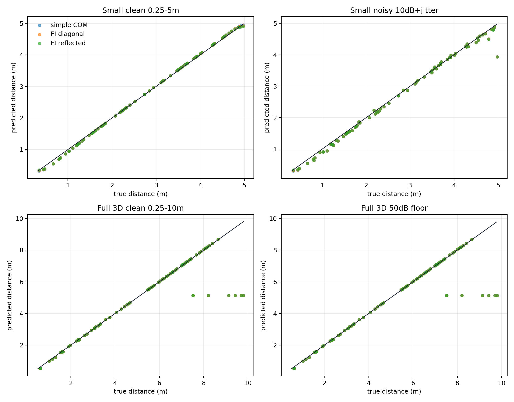
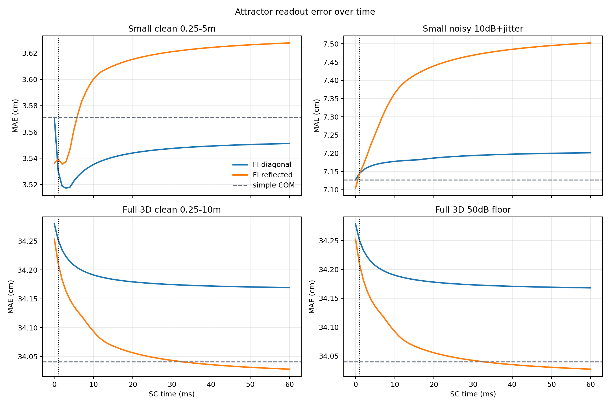

# Final Distance Pipeline With SC Line Attractor

This report is the final distance-pipeline summary before separate failure-case analysis. It keeps the current primary distance pathway unchanged through the AC distance map, then compares three SC readouts:

- `simple COM`: the existing centre-of-mass readout directly from the AC map.
- `FI diagonal 2-block SC line attractor`: identity AC-to-SC input with analytic opponent beta.
- `FI reflected Gaussian 2-block SC line attractor`: reflected Gaussian AC-to-SC input with analytic opponent beta.

The comparison is controlled because all three readouts receive the same AC activity. Any difference is caused by the final SC readout only.



## Acoustic And Pathway Setup

| Parameter | Value |
|---|---:|
| small-space distance range | `0.25 -> 5.00 m` |
| full-space distance range | `0.25 -> 10.00 m` |
| full-space azimuth range | `±90 deg` |
| full-space elevation range | `±45 deg` |
| sample rate | `64000 Hz` |
| call sweep | `18000 -> 2000 Hz` |
| call duration | `3.0 ms` |
| small-space signal duration | `36.0 ms` |
| full-space signal duration | `70.0 ms` |
| cochlea channels | `48` |
| distance bins | `180` |
| primary variant | `Primary: dynamic spike VCN + consensus + IC facilitation` |

## Full Pipeline

### 1. Echo Waveform

The simulator generates a received binaural echo from the emitted FM call. In the full-space tests, azimuth changes the binaural timing/level cues and elevation applies spectral filtering before cochlear processing.

### 2. Cochlea

The cochlea is the optimised IIR front end from the cochlea mini-model work. It filters the waveform into frequency channels and converts activity to spikes. The current distance model uses the dynamic spike schedule:

```text
threshold(t): 16x -> 2.5x baseline threshold
beta(t):      0.20 -> 0.60
```

This makes early high-amplitude noise less likely to spike while still allowing weaker later echoes to pass.

### 3. VCN/VNLL

The VCN/VNLL stage is simplified as a causal onset detector. It ignores channels below `4 kHz`, then requires local frequency-time consensus before emitting a first onset spike for each channel:

```text
count[c,t] = sum spikes in local channel-time window
VCN[c,t] = first spike where count[c,t] >= 3
```

This replaces the much harder biological VCN/VNLL constant-latency mechanism with a robust engineering approximation.

### 4. DNLL

DNLL is modelled as delayed inhibition. It suppresses later onsets after the first echo sweep window, helping the pathway focus on the primary echo:

```text
suppress_after = first_onset + chirp_duration + padding
```

### 5. Corollary Discharge

The corollary discharge is an internal sweep-shaped copy of the expected call response. Per-channel cochlea/VCN latency is added to the CD timing rather than subtracting latency from echo spikes, keeping the whole pathway causal.

### 6. IC

The IC compares the VCN/DNLL echo onset against delayed corollary-discharge spikes for every distance bin. For a two-spike LIF coincidence detector:

```text
delta[c,k] = abs(t_echo[c] - (t_CD[c] + delay[k]))
m[c,k] = 1 + beta_IC^delta[c,k]
score[c,k] = relu(m[c,k] - threshold_IC)
```

Neighbouring frequency channels add a soft facilitation term when they support the same candidate delay. This helps a sweep-consistent echo dominate isolated noisy events without hard-gating the system.

### 7. AC

The AC stage organises the IC coincidence scores into a sharper topographic distance map with a Mexican-hat interaction:

```text
AC = relu(IC + IC * K_mexican_hat)
K = Gaussian(sigma_exc) - g_inh Gaussian(sigma_inh)
```

### 8. SC Readouts

The baseline SC readout is the original centre of mass:

```text
d_hat_COM = sum_k AC[k] d[k] / sum_k AC[k]
```

The main upgraded SC readout is the finite-line balanced E/I attractor:

```text
r = [r_E, r_I]
B = [M; -beta M] / sqrt(1 + beta^2)
W = [[W0, -W0], [W0, -W0]]
tau dr/dt = -r + W r
```

The final decoded distance is centre of mass over the rectified excitatory population at `1 ms`. The full trajectory is retained so the report can show error as a function of SC readout time.

## Selected SC Attractor Parameters

These parameters come from the finite-line input theory work. Both attractor variants use the same balanced two-block E/I recurrence. They differ only in the AC-to-SC input matrix and the corresponding analytic opponent beta.

| SC attractor parameter | Value |
|---|---:|
| diagonal input | `identity`, beta `0.886` |
| reflected input | `reflected Gaussian`, width `3` bins, beta `0.897` |
| recurrent width | `4` bins |
| alpha prime | `4.0` |
| recurrent local max eigenvalue | `4.000` |
| tau | `20.0 ms` |
| simulation step | `1.0 ms` |
| readout time | `1.0 ms` |
| rate cap | `55.0 Hz` |

## Example Spike Processing Path

The example below uses a target at `2.51 m`. Frequency is shown on a log axis; the dotted horizontal line marks the `4 kHz` VCN cut-off.



The next figure shows the conversion from IC coincidence scores to AC topographic activity, then into the selected reflected SC attractor activity over represented distance.



The attractor dynamics are shown with SC time on the x-axis and represented distance on the y-axis. This is the key visualisation of the line attractor: the activity bump evolves over time but remains organised along the distance line.



The line attractor itself is simulated as a rate model. The spike raster below is an illustrative deterministic spike conversion from the excitatory rate state, included so the final SC output can be visualised as spikes.



The figure below compares the diagonal and reflected FI two-block excitatory profiles at the selected readout time.



## Readout Comparison

The simple readout and attractor readout are compared on the same AC activations.





The plot below shows how attractor error changes as the SC dynamics evolve. The dotted vertical line marks the selected `1 ms` readout time, and the dashed horizontal line is the no-attractor simple COM error.



| Condition | Subset | N | Simple MAE | Diagonal MAE | Reflected MAE | Simple RMSE | Diagonal RMSE | Reflected RMSE | Simple max error | Diagonal max error | Reflected max error | Diagonal runtime/sample | Reflected runtime/sample |
|---|---|---:|---:|---:|---:|---:|---:|---:|---:|---:|---:|---:|---:|
| Small clean 0.25-5m | all | `80` | `3.571 cm` | `3.530 cm` | `3.539 cm` | `4.364 cm` | `4.325 cm` | `4.307 cm` | `11.710 cm` | `11.643 cm` | `11.591 cm` | `1.282 ms` | `1.748 ms` |
| Small noisy 10dB+jitter | all | `80` | `7.127 cm` | `7.144 cm` | `7.144 cm` | `13.797 cm` | `13.815 cm` | `13.827 cm` | `104.423 cm` | `104.425 cm` | `104.426 cm` | `1.249 ms` | `1.786 ms` |
| Full 3D clean 0.25-10m | <=5 m | `33` | `2.831 cm` | `2.761 cm` | `2.662 cm` | `4.167 cm` | `4.007 cm` | `3.761 cm` | `11.500 cm` | `10.755 cm` | `9.527 cm` | `2.489 ms` | `0.877 ms` |
| Full 3D clean 0.25-10m | <=10 m | `80` | `34.041 cm` | `34.251 cm` | `34.210 cm` | `110.014 cm` | `110.792 cm` | `110.788 cm` | `464.131 cm` | `466.854 cm` | `466.854 cm` | `2.489 ms` | `0.877 ms` |
| Full 3D 50dB floor | <=5 m | `33` | `2.826 cm` | `2.756 cm` | `2.657 cm` | `4.164 cm` | `4.003 cm` | `3.757 cm` | `11.500 cm` | `10.755 cm` | `9.527 cm` | `2.246 ms` | `1.160 ms` |
| Full 3D 50dB floor | <=10 m | `80` | `34.040 cm` | `34.250 cm` | `34.210 cm` | `110.014 cm` | `110.792 cm` | `110.788 cm` | `464.131 cm` | `466.854 cm` | `466.854 cm` | `2.246 ms` | `1.160 ms` |

## Interpretation

- The final SC line attractor is now attached as a reversible readout module after AC.
- The comparison is controlled: cochlea, VCN/VNLL, DNLL, IC, and AC are identical for all readouts.
- The line attractors give biologically motivated recurrent readouts and clear population-bump visualisations.
- The diagonal and reflected variants test whether the applied pathway agrees with the finite-line FI theory or with the transient rough-input diagnostic.
- If the attractor does not improve a condition, that means the AC map already contains the relevant bias or ambiguity; the SC cannot recover information that was lost upstream.
- Failure-case analysis is intentionally deferred to the next report.

## Generated Files

- `pipeline_diagram`: `distance_pathway/outputs/final_distance_pipeline_with_attractor/figures/pipeline_diagram.png`
- `frequency_time_rasters`: `distance_pathway/outputs/final_distance_pipeline_with_attractor/figures/frequency_time_rasters.png`
- `distance_population_stages`: `distance_pathway/outputs/final_distance_pipeline_with_attractor/figures/distance_population_stages.png`
- `line_attractor_dynamics`: `distance_pathway/outputs/final_distance_pipeline_with_attractor/figures/line_attractor_dynamics.png`
- `line_attractor_output_spikes`: `distance_pathway/outputs/final_distance_pipeline_with_attractor/figures/line_attractor_output_spikes.png`
- `sc_excitatory_rate_comparison`: `distance_pathway/outputs/final_distance_pipeline_with_attractor/figures/sc_excitatory_rate_comparison.png`
- `readout_mae_comparison`: `distance_pathway/outputs/final_distance_pipeline_with_attractor/figures/readout_mae_comparison.png`
- `readout_scatter`: `distance_pathway/outputs/final_distance_pipeline_with_attractor/figures/readout_scatter.png`
- `error_over_time`: `distance_pathway/outputs/final_distance_pipeline_with_attractor/figures/error_over_time.png`
- `results`: `distance_pathway/outputs/final_distance_pipeline_with_attractor/results.json`

Runtime: `18.31 s`.
