# Finite-Line Input Theory For The SC Line Attractor

This report is a standalone analytical study. It does not use the current distance pathway outputs and does not plug a new SC back into the model. The aim is to transfer the original ring-model input theory to a finite line in a controlled way.

## Problem

The ring model used circulant matrices. A circulant matrix is natural on a ring because every neuron has the same neighbourhood, only shifted. A distance line has boundaries, so a direct finite-line replacement must decide what happens near `0 m` and `L`.

The finite-line state is either one population:

$$
\tau \dot r = -r + W r, \qquad y = C r
$$

or a balanced E/I two-block state:

$$
r = \begin{bmatrix} r_E \\ r_I \end{bmatrix}, \qquad
W_{EI} = \begin{bmatrix} K & -K \\ K & -K \end{bmatrix}, \qquad
y = \begin{bmatrix} I & 0 \end{bmatrix} r.
$$

The sensory input is a synthetic reflected Gaussian population code $h(d)$, not the real AC map:

$$
h_i(d) = \exp\left[-\frac{(x_i-d)^2}{2\sigma_h^2}\right]
+ \exp\left[-\frac{(x_i+d)^2}{2\sigma_h^2}\right]
+ \exp\left[-\frac{(x_i-(2L-d))^2}{2\sigma_h^2}\right].
$$

## Fisher Information Theory

Fisher information measures local discriminability. If a small distance change produces a large reliable change in neural activity, distance can be estimated accurately. For independent Gaussian readout noise with variance $\sigma_n^2$:

$$
J(d,t) = \frac{1}{\sigma_n^2}\left\|\frac{\partial y(d,t)}{\partial d}\right\|_2^2.
$$

For linear dynamics with an impulse input:

$$
y(d,t) = C e^{At} B h(d), \qquad A = \frac{-I+W}{\tau}.
$$

Therefore:

$$
\frac{\partial y(d,t)}{\partial d} = C e^{At} B h'(d),
$$

and:

$$
J(d,t) = \frac{1}{\sigma_n^2}\left\|C e^{At} B h'(d)\right\|_2^2.
$$

The Cramer-Rao bound gives the local lower bound:

$$
\operatorname{Var}(\hat d) \geq \frac{1}{J(d,t)}.
$$

The ranking metric used here is the mean Cramer-Rao RMSE across the line at the final readout time:

$$
\operatorname{CRB}_{\rm RMSE} = \sqrt{\frac{1}{N}\sum_d \frac{1}{J(d,T)}}.
$$

This is not a fitted label error. It is an analytical sensitivity measure through the chosen input matrix, recurrent dynamics, and readout.

## Finite-Line Input Matrices

The tested finite-line analogues of the ring circulant input matrix are:

- `identity`: direct topographic input.
- `toeplitz_raw`: a banded symmetric Toeplitz Gaussian matrix, with no edge correction.
- `toeplitz_amplitude`: the same matrix with column amplitude compensation so edge columns do not lose total drive.
- `reflected`: a reflected-boundary Gaussian matrix, equivalent to no-flux boundary correction.

All input matrices are normalised to the same Frobenius norm as the identity input, so differences are structural rather than caused by injecting more total power.

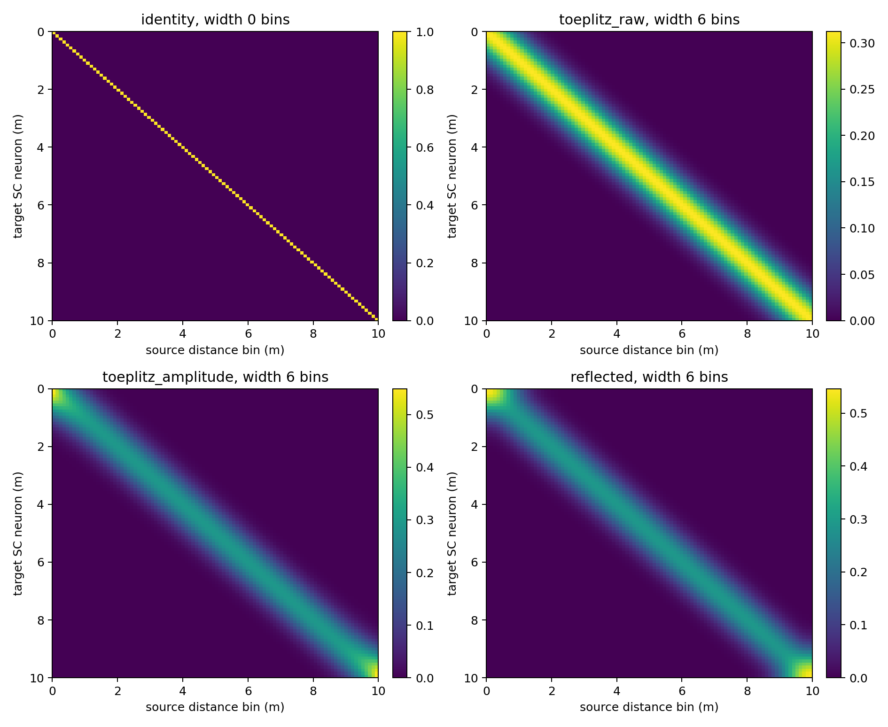

## One-Block Versus Two-Block Input

The original ring notebook did not only use $B=[I;0]$. For the balanced model, it used a two-block input matrix:

$$
B = \begin{bmatrix} B_E \\ B_I \end{bmatrix}.
$$

This report compares:

$$
B_{1pop}=M, \qquad B_{E-only}=\begin{bmatrix}M\\0\end{bmatrix}, \qquad
B_{opp}=\frac{1}{\sqrt{1+\beta^2}}\begin{bmatrix}M\\-\beta M\end{bmatrix}.
$$

The opponent input is a signed current formulation. It is the direct finite-line analogue of the ring-model E/I input trick, not a literal claim that inhibitory firing rates are negative.

For the balanced matrix, $W_{EI}^2=0$, so:

$$
e^{(-I+W_{EI})t/\tau}=e^{-t/\tau}\left(I+\frac{t}{\tau}W_{EI}\right).
$$

Let $A_d=Mh'(d)$ and $G_d=K M h'(d)$. For $B_{opp}$:

$$
\frac{\partial y}{\partial d}
=\frac{e^{-t/\tau}}{\sqrt{1+\beta^2}}\left[A_d + \frac{t}{\tau}(1+\beta)G_d\right].
$$

The FI numerator is therefore a quadratic ratio:

$$
F(\beta)=\frac{U+2\beta V+\beta^2 Z}{1+\beta^2}.
$$

The stationary condition is:

$$
V\beta^2 + (U-Z)\beta - V = 0.
$$

This gives an analytic opponent gain for a fixed matrix family and objective, so no label fitting is used.

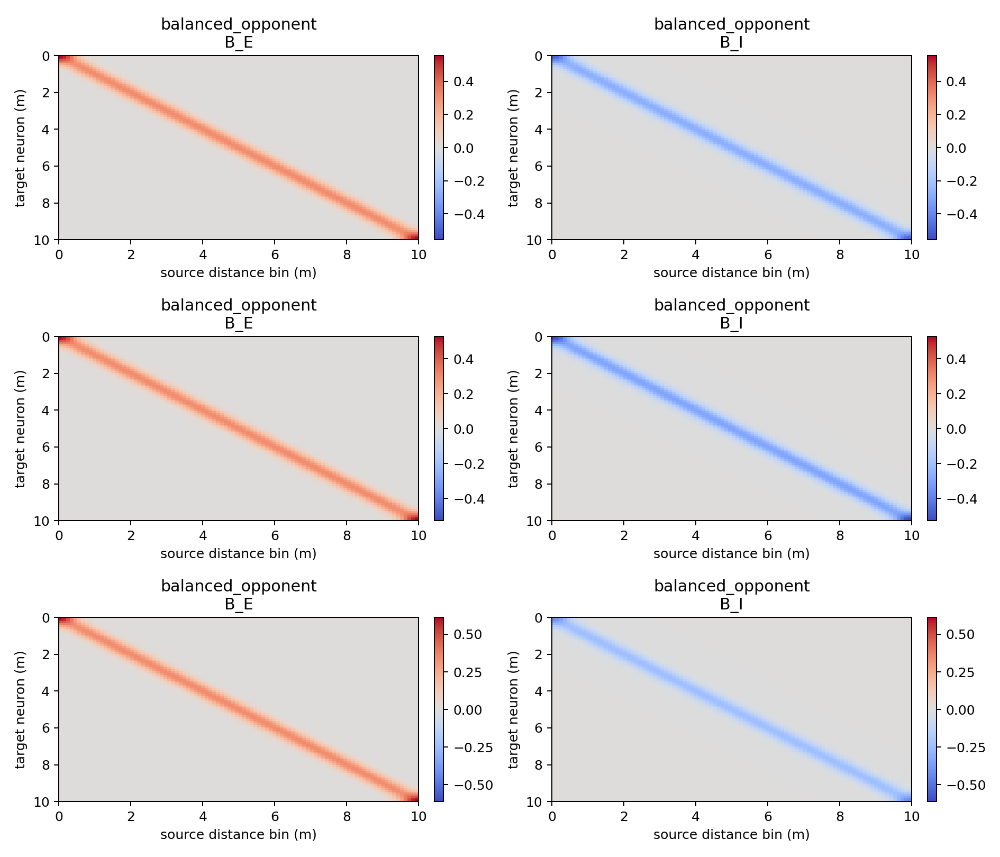

## Chosen Matrix Diagnostics

The selected candidate uses a reflected finite-line input matrix and a balanced two-block recurrent matrix. The heatmap below shows the chosen input matrix $M$, the two input blocks $B_E$ and $B_I$, and the full recurrent matrix $W$.

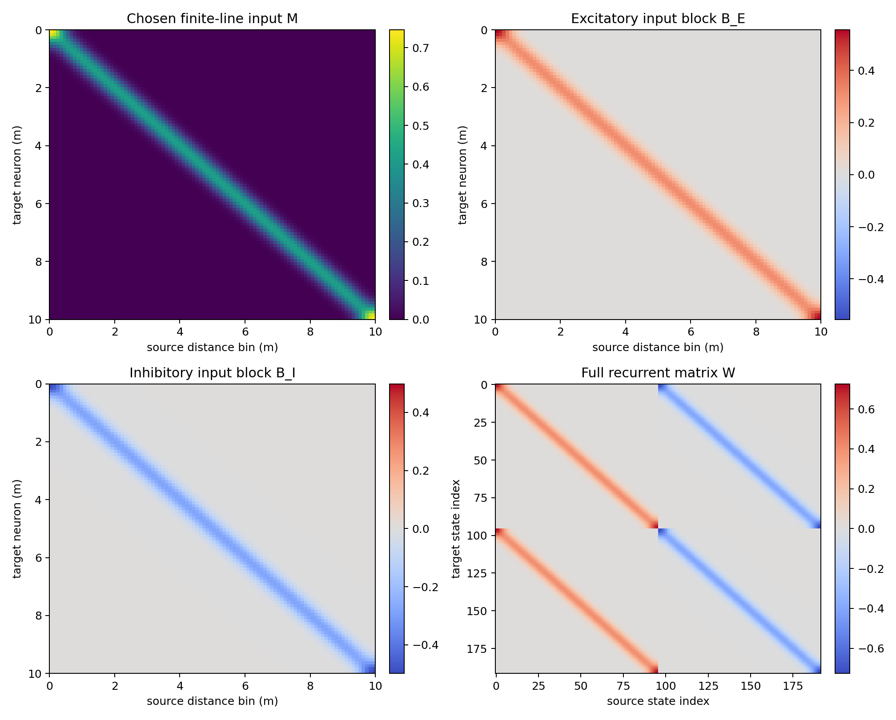

The input matrix can also be analysed as a finite-line spatial filter. Because a line is not periodic, the appropriate clean basis is a cosine basis rather than the ring Fourier basis. The gain curve below shows $\|M q_k\|/\|q_k\|$ for cosine spatial mode $q_k$.

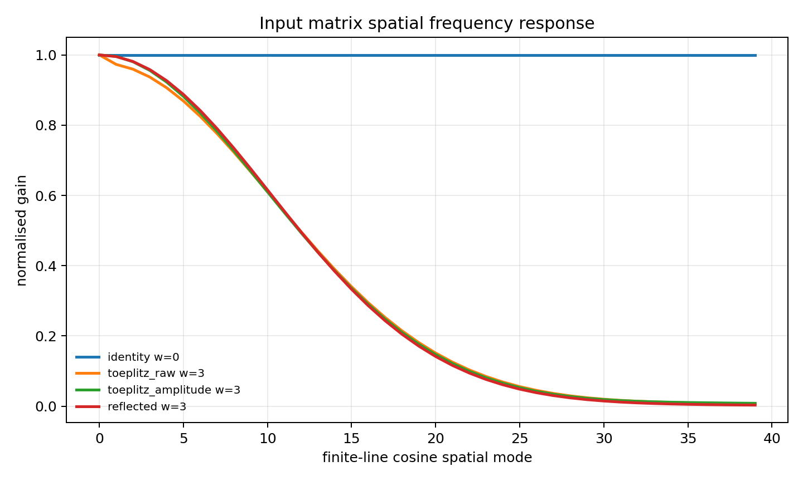

## Recurrent Spectrum And Pseudospectrum

The balanced E/I recurrence is asymptotically stable in continuous time because the system matrix is:

$$
A = \frac{-I+W}{\tau}.
$$

For the ideal balanced block, eigenvalues alone can look deceptively simple because the block is highly non-normal. Therefore, the report shows both eigenvalue spectra and a pseudospectrum proxy.

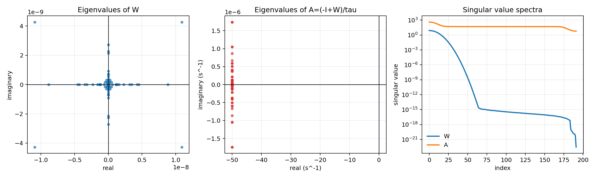

The pseudospectrum plot shows $\log_{10}\sigma_{\min}(zI-A)$. Regions with small $\sigma_{\min}$ indicate where small perturbations could strongly change the apparent spectrum. This is useful for balanced E/I systems because transient amplification can occur even when all eigenvalues are stable.

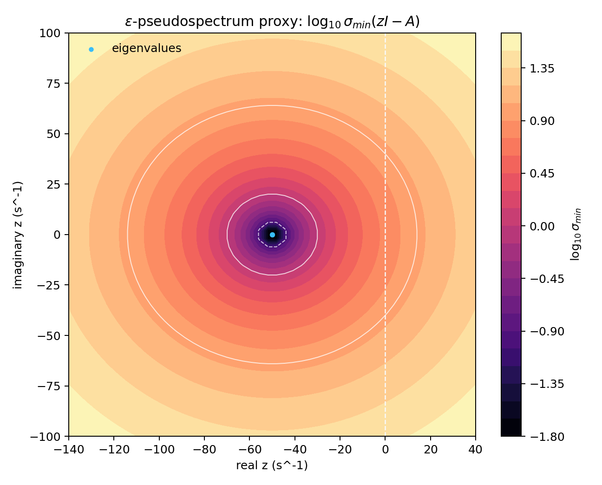

## Candidate Comparison

Parameters: `N=96`, `L=10 m`, `sigma_h=0.42 m`, `tau=20 ms`, final readout `T=60 ms`.

| Block | Input family | Input width | Recurrent width | beta | Final CRB RMSE | 5ms CRB RMSE | FI uniformity | Mean COM bias | Edge COM bias |
|---|---|---:|---:|---:|---:|---:|---:|---:|---:|
| balanced_opponent | reflected | `3` | `4` | `0.897` | `0.851 cm` | `0.393 cm` | `0.101` | `3.363 cm` | `16.074 cm` |
| balanced_opponent | reflected | `3` | `4` | `1.000` | `0.853 cm` | `0.402 cm` | `0.101` | `3.367 cm` | `16.089 cm` |
| balanced_opponent | reflected | `3` | `4` | `0.697` | `0.858 cm` | `0.379 cm` | `0.102` | `3.356 cm` | `16.038 cm` |
| balanced_opponent | toeplitz_amplitude | `3` | `4` | `0.897` | `0.858 cm` | `0.397 cm` | `0.097` | `3.632 cm` | `17.293 cm` |
| balanced_opponent | toeplitz_amplitude | `3` | `4` | `1.000` | `0.859 cm` | `0.405 cm` | `0.097` | `3.635 cm` | `17.307 cm` |
| balanced_opponent | toeplitz_amplitude | `3` | `4` | `0.697` | `0.864 cm` | `0.383 cm` | `0.097` | `3.625 cm` | `17.262 cm` |
| balanced_opponent | toeplitz_amplitude | `6` | `4` | `0.909` | `0.936 cm` | `0.461 cm` | `0.082` | `7.323 cm` | `31.960 cm` |
| balanced_opponent | toeplitz_amplitude | `6` | `4` | `1.000` | `0.938 cm` | `0.469 cm` | `0.082` | `7.325 cm` | `31.970 cm` |
| balanced_opponent | toeplitz_amplitude | `6` | `4` | `0.732` | `0.942 cm` | `0.448 cm` | `0.082` | `7.317 cm` | `31.938 cm` |
| balanced_opponent | reflected | `6` | `4` | `0.909` | `0.946 cm` | `0.465 cm` | `0.073` | `5.948 cm` | `27.192 cm` |
| balanced_opponent | reflected | `6` | `4` | `1.000` | `0.947 cm` | `0.473 cm` | `0.073` | `5.951 cm` | `27.204 cm` |
| balanced_opponent | reflected | `6` | `4` | `0.733` | `0.951 cm` | `0.452 cm` | `0.073` | `5.941 cm` | `27.165 cm` |
| balanced_opponent | toeplitz_raw | `3` | `4` | `0.896` | `0.952 cm` | `0.431 cm` | `0.050` | `4.159 cm` | `19.674 cm` |
| balanced_opponent | toeplitz_raw | `3` | `4` | `1.000` | `0.954 cm` | `0.440 cm` | `0.050` | `4.162 cm` | `19.686 cm` |

## Fisher And Width Sensitivity

The best candidates have much flatter final-time Fisher information than uncorrected finite-line inputs. Amplitude compensation and reflection both reduce boundary loss, but reflection is the cleaner finite-line analogue of the ring because it preserves no-flux boundary structure.

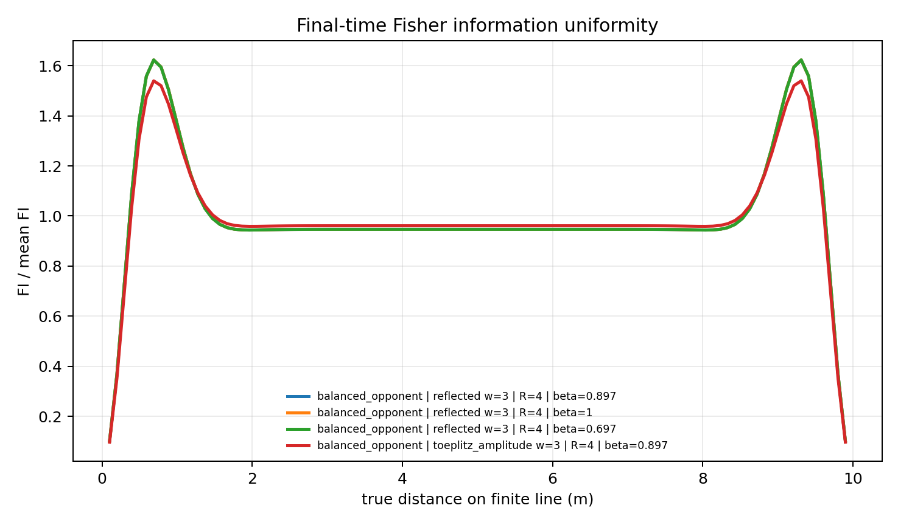

The width sweep below compares the best two-block opponent candidate within each input family. Narrow reflected input generally preserves more position sensitivity; wider input becomes smoother but less discriminating.

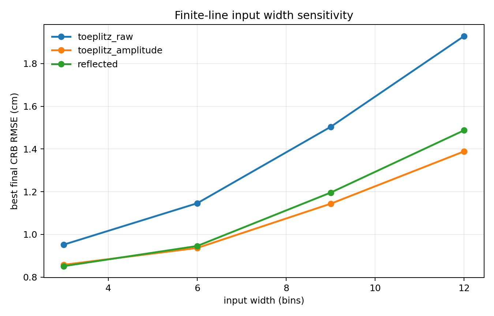

The beta scan uses the reflected input with width `6` and recurrent width `8`. It shows why the two-block input matters: opponent E/I input can increase FI through the balanced transient, but too much opponent drive can increase bias or over-amplify the recurrent term.

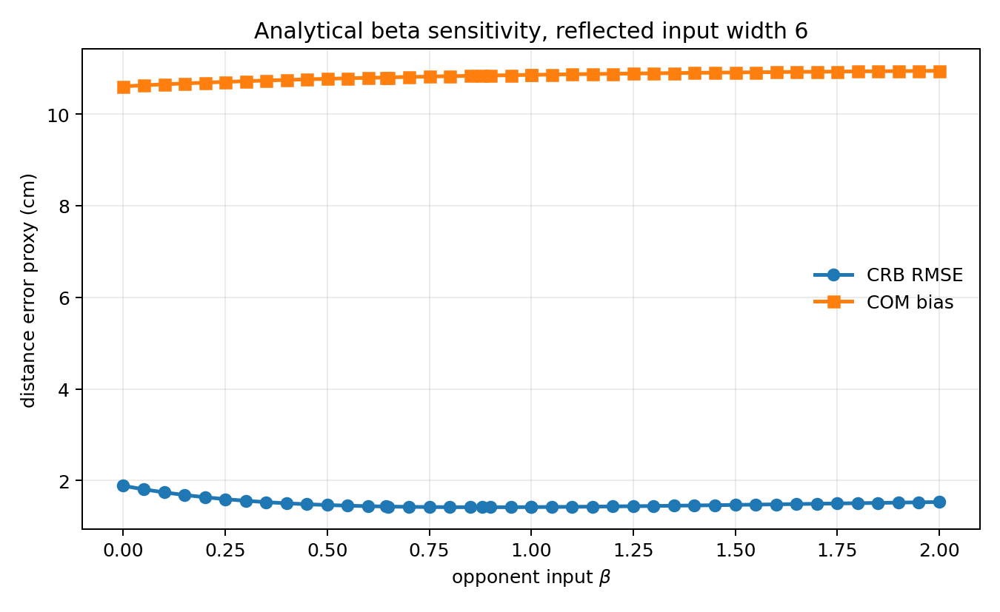

## Alpha Sweep

The selected reflected/opponent family was re-tested across balanced $\alpha'$. For each $\alpha'$, the opponent $\beta$ was recomputed analytically from the final-time Fisher objective. This is still an analytical sweep, not a label fit.

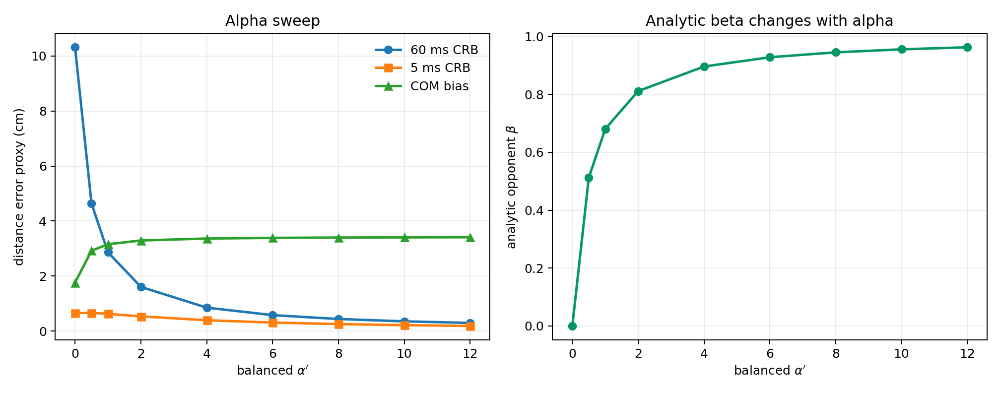

| alpha prime | analytic beta | Final CRB RMSE | 5ms CRB RMSE | Mean COM bias | Edge COM bias | FI uniformity |
|---:|---:|---:|---:|---:|---:|---:|
| `0.0` | `0.000` | `10.316 cm` | `0.659 cm` | `1.761 cm` | `8.869 cm` | `0.137` |
| `0.5` | `0.513` | `4.637 cm` | `0.660 cm` | `2.921 cm` | `14.096 cm` | `0.111` |
| `1.0` | `0.681` | `2.863 cm` | `0.627 cm` | `3.156 cm` | `15.149 cm` | `0.106` |
| `2.0` | `0.812` | `1.606 cm` | `0.533 cm` | `3.293 cm` | `15.758 cm` | `0.103` |
| `4.0` | `0.897` | `0.851 cm` | `0.393 cm` | `3.363 cm` | `16.074 cm` | `0.101` |
| `6.0` | `0.929` | `0.579 cm` | `0.308 cm` | `3.387 cm` | `16.179 cm` | `0.101` |
| `8.0` | `0.946` | `0.438 cm` | `0.253 cm` | `3.399 cm` | `16.232 cm` | `0.101` |
| `10.0` | `0.956` | `0.353 cm` | `0.214 cm` | `3.406 cm` | `16.263 cm` | `0.100` |
| `12.0` | `0.963` | `0.295 cm` | `0.186 cm` | `3.411 cm` | `16.284 cm` | `0.100` |

The best alpha in this sweep by final CRB RMSE was `12.0`, with analytic beta `0.963` and final CRB RMSE `0.295 cm`.

## Biological Limits On Alpha

The uncapped alpha sweep should not be interpreted as permission to increase gain indefinitely. This is the same limitation seen in the original ring notebook: increasing $\alpha'$ improves the idealised accuracy metric, but it also increases neural activity and therefore metabolic cost. Real neurons have maximum firing rates, refractory periods, synaptic limits, and finite energy budgets.

To illustrate this, the selected reflected/opponent family was re-simulated with a simple firing-rate cap inside the dynamics. The state is interpreted as relative rate around a `5 Hz` baseline, with `20 Hz` per activity unit used for this diagnostic scaling. The caps are applied as:

$$
r(t) \leftarrow \operatorname{clip}\left(r(t), -r_0, r_{\max}-r_0\right),
$$

where $r_0=5\,\mathrm{Hz}$ and $r_{\max}$ is either `55 Hz` or `100 Hz`. Because clipping makes the system nonlinear, the capped FI curves are estimated with finite differences rather than the analytic linear formula.

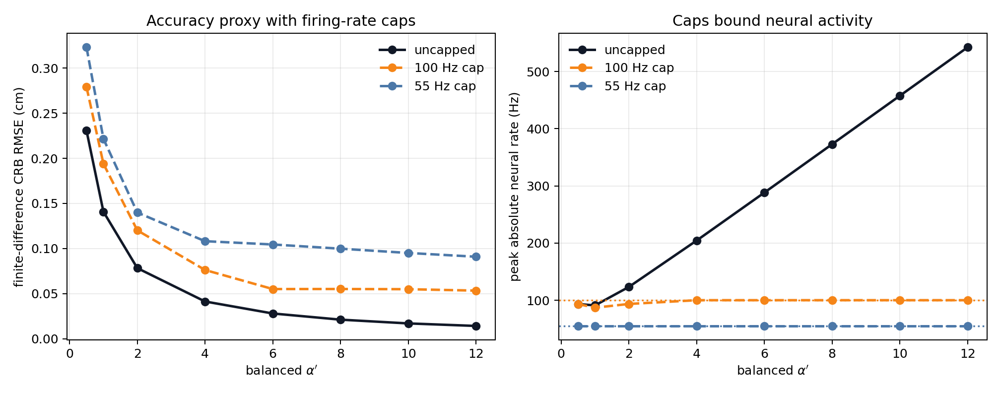

| alpha prime | cap | analytic beta | Capped finite-difference CRB RMSE | Mean COM bias | Peak rate |
|---:|---|---:|---:|---:|---:|
| `4.0` | uncapped | `0.897` | `0.041 cm` | `3.021 cm` | `204.4 Hz` |
| `4.0` | 100 Hz cap | `0.897` | `0.076 cm` | `4.001 cm` | `100.0 Hz` |
| `4.0` | 55 Hz cap | `0.897` | `0.108 cm` | `5.784 cm` | `55.0 Hz` |
| `8.0` | uncapped | `0.946` | `0.021 cm` | `3.053 cm` | `372.8 Hz` |
| `8.0` | 100 Hz cap | `0.946` | `0.055 cm` | `6.096 cm` | `100.0 Hz` |
| `8.0` | 55 Hz cap | `0.946` | `0.100 cm` | `8.853 cm` | `55.0 Hz` |
| `12.0` | uncapped | `0.963` | `0.014 cm` | `3.064 cm` | `542.3 Hz` |
| `12.0` | 100 Hz cap | `0.963` | `0.053 cm` | `8.299 cm` | `100.0 Hz` |
| `12.0` | 55 Hz cap | `0.963` | `0.091 cm` | `11.490 cm` | `55.0 Hz` |

The rate trace below shows the same issue dynamically. Without a cap, high $\alpha'$ produces increasingly large transient activity. With caps, the activity saturates, so extra gain no longer has the same linear Fisher-information benefit.

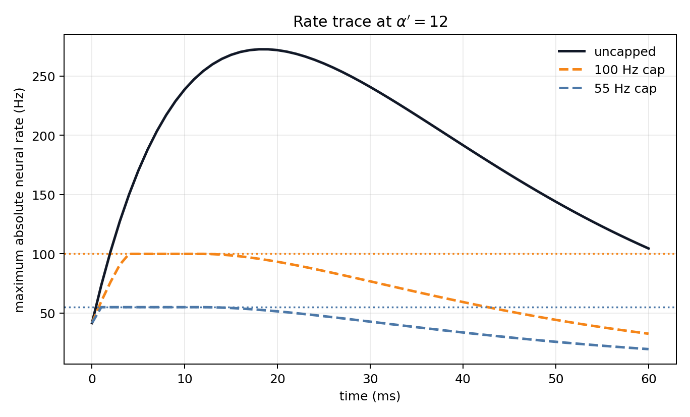

## Fixed-Setup Alpha Sweep

The previous alpha sweep recomputed the analytic opponent $\beta$ for every $\alpha'$. That is useful for asking what the best analytical gain should be at each recurrence strength, but it mixes two effects: stronger recurrence and retuned input balance.

The diagnostic below keeps the selected setup fixed and changes only $\alpha'$:

- input family: `reflected`;
- input width: `3` bins;
- recurrent width: `4` bins;
- fixed opponent beta: `0.897`.

This isolates whether the balanced recurrence gain itself improves the line-attractor sensitivity, and how firing-rate caps change that conclusion.

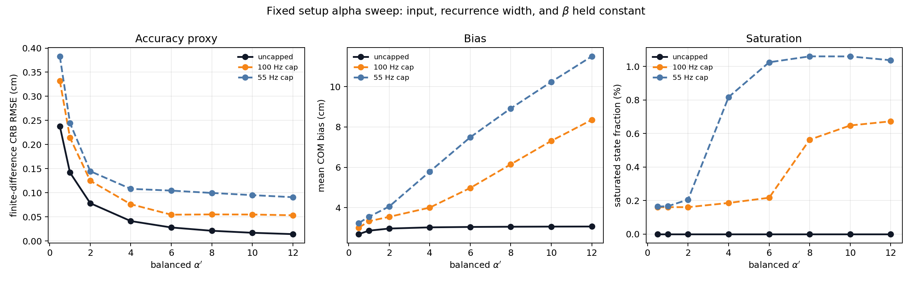

| alpha prime | cap | fixed beta | Finite-difference CRB RMSE | Mean COM bias | Peak rate | Saturated state fraction |
|---:|---|---:|---:|---:|---:|---:|
| `4.0` | uncapped | `0.897` | `0.041 cm` | `3.021 cm` | `204.4 Hz` | `0.0%` |
| `4.0` | 100 Hz cap | `0.897` | `0.076 cm` | `4.001 cm` | `100.0 Hz` | `0.2%` |
| `4.0` | 55 Hz cap | `0.897` | `0.108 cm` | `5.784 cm` | `55.0 Hz` | `0.8%` |
| `8.0` | uncapped | `0.897` | `0.021 cm` | `3.052 cm` | `373.2 Hz` | `0.0%` |
| `8.0` | 100 Hz cap | `0.897` | `0.055 cm` | `6.148 cm` | `100.0 Hz` | `0.6%` |
| `8.0` | 55 Hz cap | `0.897` | `0.100 cm` | `8.922 cm` | `55.0 Hz` | `1.1%` |
| `12.0` | uncapped | `0.897` | `0.014 cm` | `3.063 cm` | `542.6 Hz` | `0.0%` |
| `12.0` | 100 Hz cap | `0.897` | `0.053 cm` | `8.357 cm` | `100.0 Hz` | `0.7%` |
| `12.0` | 55 Hz cap | `0.897` | `0.091 cm` | `11.506 cm` | `55.0 Hz` | `1.0%` |

With this fixed setup, the best uncapped tested value was $\alpha'=12.0$, giving finite-difference CRB RMSE `0.014 cm`. If this curve improves with $\alpha'$ even when $\beta$ is fixed, the gain is coming from balanced recurrent amplification rather than from repeatedly retuning the input matrix.

## Notebook-Style 60 ms Error Sweep

The final alpha diagnostic follows the original notebook style more closely: it plots actual mean decoding error at `60 ms` against $\alpha'$. Unlike the CRB plots, this is not a Fisher-information lower bound. It adds independent Gaussian readout noise with the same `fisher_noise_sigma` used above, decodes by centre of mass, and averages absolute distance error over the finite line.

The selected setup is still held fixed, so the only parameter changing is $\alpha'$.

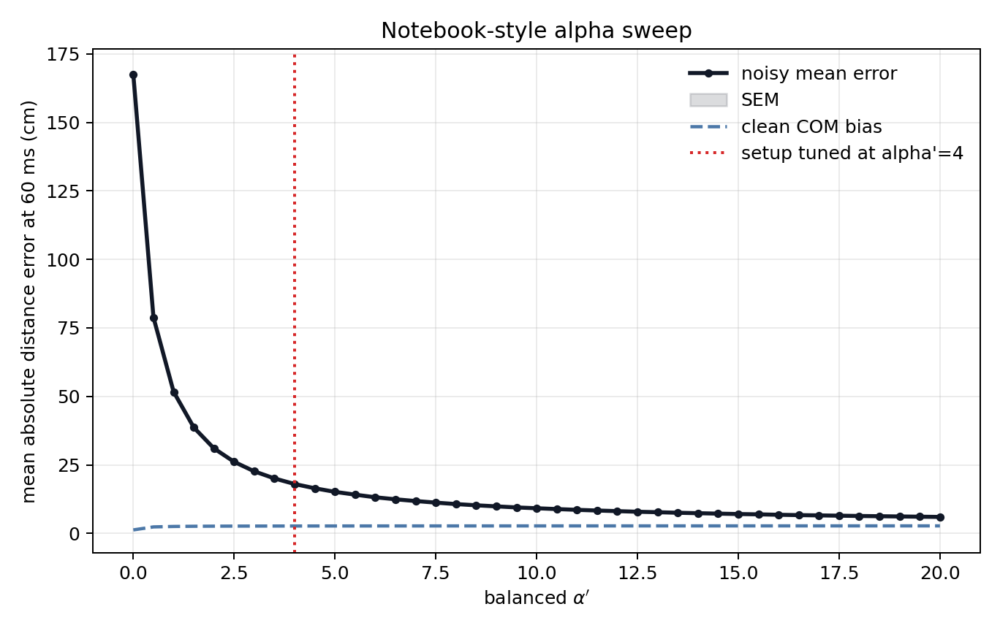

| alpha prime | Noisy mean absolute error | SEM | Clean COM bias |
|---:|---:|---:|---:|
| `0.0` | `167.561 cm` | `0.858 cm` | `1.260 cm` |
| `4.0` | `18.012 cm` | `0.117 cm` | `2.686 cm` |
| `8.0` | `10.698 cm` | `0.086 cm` | `2.716 cm` |
| `12.0` | `8.119 cm` | `0.076 cm` | `2.727 cm` |
| `16.0` | `6.786 cm` | `0.071 cm` | `2.732 cm` |
| `20.0` | `5.999 cm` | `0.068 cm` | `2.736 cm` |

The lowest noisy mean error in this diagnostic occurred at $\alpha'=20.0$ with mean absolute error `5.999 cm`. The dashed clean-bias curve is included because alpha can improve noise sensitivity without necessarily moving the deterministic centre-of-mass bias.

## Capped 60 ms Decoding Error

The plot below is the finite-line version of the biophysical cap diagnostic from the original notebook. It keeps the selected setup fixed and compares uncapped dynamics with `55 Hz` and `100 Hz` firing-rate caps. The left panel shows noisy centre-of-mass decoding error at `60 ms`; the right panel shows the peak neural rate demanded by the same dynamics.

This is the main motivation for not simply choosing the largest possible $\alpha'$. In the uncapped mathematical model, increasing $\alpha'$ keeps improving the noisy decoding error by increasing gain. With caps, high $\alpha'$ asks for rates that the neurons cannot realise, causing clipping, distortion, and a worse biological tradeoff.

For this diagnostic, Gaussian readout noise has standard deviation `5.0 Hz`.

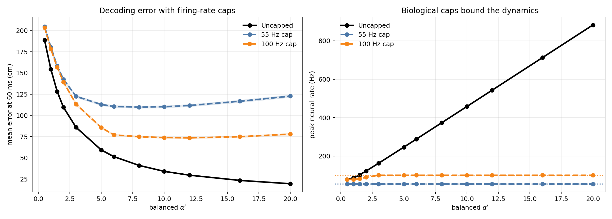

| alpha prime | cap | Noisy mean absolute error | SEM | Clean COM bias | Peak rate | Saturated state fraction |
|---:|---|---:|---:|---:|---:|---:|
| `2.0` | Uncapped | `109.546 cm` | `0.975 cm` | `2.962 cm` | `122.0 Hz` | `0.0%` |
| `2.0` | 55 Hz cap | `142.535 cm` | `1.313 cm` | `4.054 cm` | `55.0 Hz` | `0.2%` |
| `2.0` | 100 Hz cap | `139.349 cm` | `1.252 cm` | `3.543 cm` | `89.9 Hz` | `0.2%` |
| `5.0` | Uncapped | `59.291 cm` | `0.556 cm` | `3.033 cm` | `246.4 Hz` | `0.0%` |
| `5.0` | 55 Hz cap | `112.882 cm` | `1.166 cm` | `6.673 cm` | `55.0 Hz` | `0.9%` |
| `5.0` | 100 Hz cap | `85.616 cm` | `0.862 cm` | `4.382 cm` | `100.0 Hz` | `0.2%` |
| `8.0` | Uncapped | `41.075 cm` | `0.397 cm` | `3.052 cm` | `373.2 Hz` | `0.0%` |
| `8.0` | 55 Hz cap | `109.800 cm` | `1.171 cm` | `8.922 cm` | `55.0 Hz` | `1.1%` |
| `8.0` | 100 Hz cap | `74.933 cm` | `0.839 cm` | `6.148 cm` | `100.0 Hz` | `0.6%` |
| `12.0` | Uncapped | `29.582 cm` | `0.302 cm` | `3.063 cm` | `542.6 Hz` | `0.0%` |
| `12.0` | 55 Hz cap | `111.697 cm` | `1.225 cm` | `11.506 cm` | `55.0 Hz` | `1.0%` |
| `12.0` | 100 Hz cap | `73.581 cm` | `0.878 cm` | `8.357 cm` | `100.0 Hz` | `0.7%` |
| `20.0` | Uncapped | `19.497 cm` | `0.220 cm` | `3.071 cm` | `882.3 Hz` | `0.0%` |
| `20.0` | 55 Hz cap | `122.668 cm` | `1.397 cm` | `17.522 cm` | `55.0 Hz` | `1.0%` |
| `20.0` | 100 Hz cap | `77.979 cm` | `1.000 cm` | `12.732 cm` | `100.0 Hz` | `0.8%` |

Best uncapped tested error: `19.497 cm` at $\alpha'=20.0$, but this requires a peak rate of `882.3 Hz`. With a `55 Hz` cap, the best tested error is `109.800 cm` at $\alpha'=8.0$. With a `100 Hz` cap, the best tested error is `73.581 cm` at $\alpha'=12.0$.

## Input Spread Dynamics

This diagnostic compares a direct diagonal input matrix against the selected reflected Gaussian spread input. Everything else is fixed: balanced opponent block, recurrent width `4` bins, fixed beta from the selected setup, and $\alpha'=8$. A roughened synthetic input population is used to expose whether the input matrix passes high-frequency discontinuity/noise into the attractor.

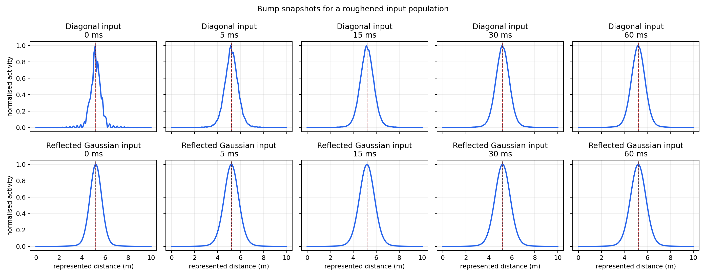

The diagonal input preserves the rougher sample-to-sample shape more directly. The reflected Gaussian input smooths the injected population before the recurrence acts, so the initial bump is less jagged and the attractor has a cleaner state to stabilise.

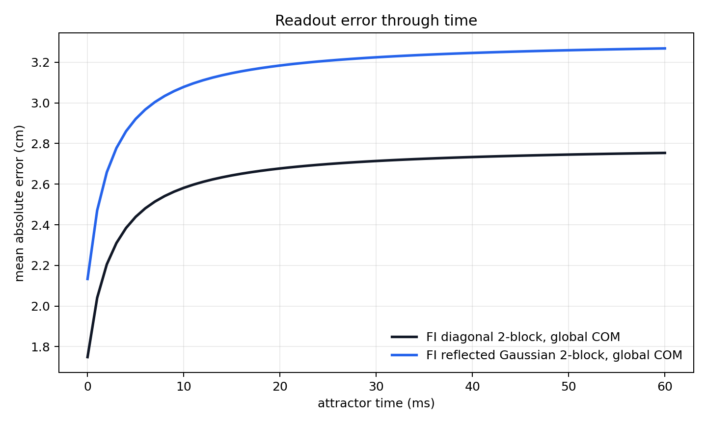

| Input | Readout | Best time | Best MAE | MAE at 5 ms | MAE at 60 ms |
|---|---|---:|---:|---:|---:|
| diagonal | global COM | `0.0 ms` | `1.748 cm` | `2.583 cm` | `2.775 cm` |
| reflected | global COM | `0.0 ms` | `2.133 cm` | `3.079 cm` | `3.292 cm` |
| reflected | local population vector | `0.0 ms` | `3.997 cm` | `4.736 cm` | `5.199 cm` |

These curves are not a replacement for the Fisher analysis. They answer a different practical question: when the incoming population is imperfect, does the input spread make the transient bump easier to read out, and is there a useful readout time before the final state?

## Local Population-Vector Readout

The local population-vector test is performed on the reflected Gaussian attractor output. It does **not** feed a different input into the attractor. Instead, the same attractor activity is decoded in two ways:

- global centre of mass over the whole excitatory population;
- local centre of mass over a `±5` bin neighbourhood around the activity peak.

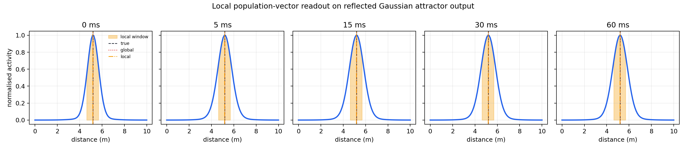

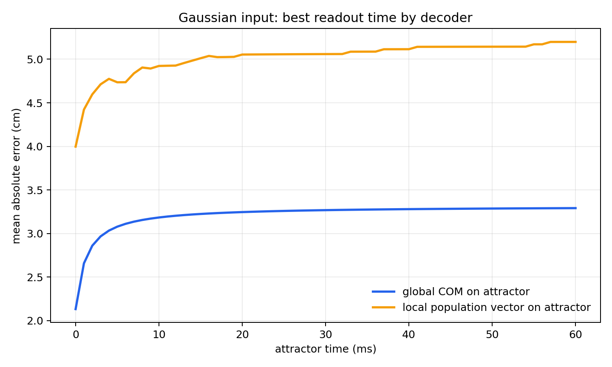

This test shows whether the best readout should use the full attractor population or only the local peak neighbourhood. A local vector can reduce bias from distant low-amplitude tails, but it is brittle if the peak itself is wrong.

## Bump Dynamics

The snapshot plot shows the synthetic readout bump for selected one-population, E-only, and opponent candidates. This is still synthetic theory, not the real AC map.

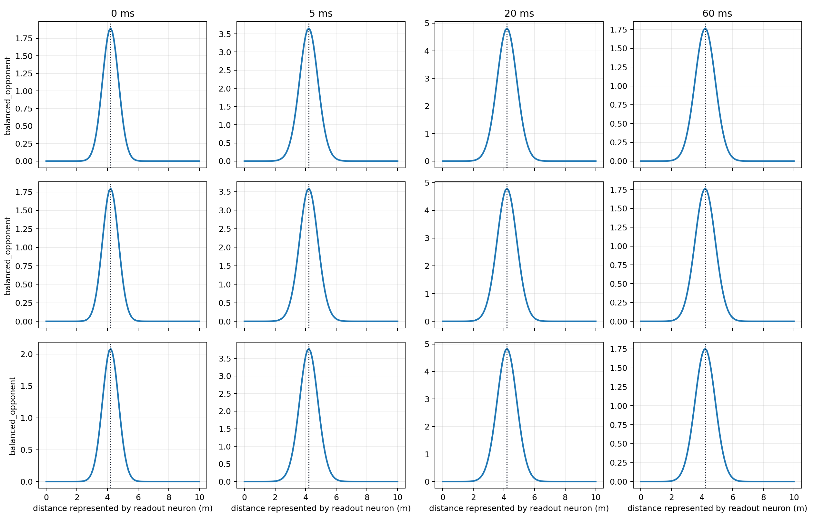

## Interpretation

Best analytical candidate in the default-alpha grid by final Cramer-Rao RMSE: `balanced_opponent` with `reflected` input, input width `3`, recurrent width `4`, beta `0.897`.

- The two-block opponent input is the closest finite-line transfer of the original ring-model FI theory.
- The one-block and E-only versions are useful controls, but they do not exploit the balanced E/I transient as directly.
- Edge correction matters. Raw Toeplitz input loses structure near the boundaries; reflected or amplitude-compensated input is more appropriate.
- This report still does not prove the setup will improve the real distance pathway. It only identifies principled finite-line candidates to consider before integration.
- The alpha sweep now behaves more like the original ring theory: stronger balanced recurrence improves the analytical FI metric over this tested range, although this should be capped by biological rate/stability constraints before integration.
- Once firing-rate caps are included, high alpha becomes a tradeoff rather than a free improvement: the idealised FI metric improves, but activity saturates and power/firing-rate demands become unrealistic.
- The next step, if accepted, is to port the best reflected/opponent family into `sc_line_attractor_integration.py` and compare it against the current simple COM readout.

## Generated Files

- `input_matrix_families`: `distance_pathway/outputs/finite_line_input_theory/figures/input_matrix_families.png`
- `chosen_matrices`: `distance_pathway/outputs/finite_line_input_theory/figures/chosen_matrices.png`
- `spatial_frequency_response`: `distance_pathway/outputs/finite_line_input_theory/figures/spatial_frequency_response.png`
- `recurrent_spectrum`: `distance_pathway/outputs/finite_line_input_theory/figures/recurrent_spectrum.png`
- `pseudospectrum`: `distance_pathway/outputs/finite_line_input_theory/figures/pseudospectrum.png`
- `fisher_curves`: `distance_pathway/outputs/finite_line_input_theory/figures/fisher_curves.png`
- `beta_scan`: `distance_pathway/outputs/finite_line_input_theory/figures/beta_scan.png`
- `width_sensitivity`: `distance_pathway/outputs/finite_line_input_theory/figures/width_sensitivity.png`
- `alpha_sweep`: `distance_pathway/outputs/finite_line_input_theory/figures/alpha_sweep.png`
- `capped_alpha_sweep`: `distance_pathway/outputs/finite_line_input_theory/figures/capped_alpha_sweep.png`
- `fixed_setup_alpha_sweep`: `distance_pathway/outputs/finite_line_input_theory/figures/fixed_setup_alpha_sweep.png`
- `notebook_style_alpha_error`: `distance_pathway/outputs/finite_line_input_theory/figures/notebook_style_alpha_error.png`
- `capped_decoding_error`: `distance_pathway/outputs/finite_line_input_theory/figures/capped_decoding_error.png`
- `input_spread_snapshots`: `distance_pathway/outputs/finite_line_input_theory/figures/input_spread_snapshots.png`
- `input_spread_error_time`: `distance_pathway/outputs/finite_line_input_theory/figures/input_spread_error_time.png`
- `local_vector_snapshots`: `distance_pathway/outputs/finite_line_input_theory/figures/local_vector_snapshots.png`
- `local_vector_error_time`: `distance_pathway/outputs/finite_line_input_theory/figures/local_vector_error_time.png`
- `capped_rate_traces`: `distance_pathway/outputs/finite_line_input_theory/figures/capped_rate_traces.png`
- `block_input_matrices`: `distance_pathway/outputs/finite_line_input_theory/figures/block_input_matrices.png`
- `response_snapshots`: `distance_pathway/outputs/finite_line_input_theory/figures/response_snapshots.png`
- `results`: `distance_pathway/outputs/finite_line_input_theory/results.json`

Runtime: `95.90 s`.
