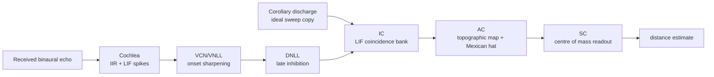
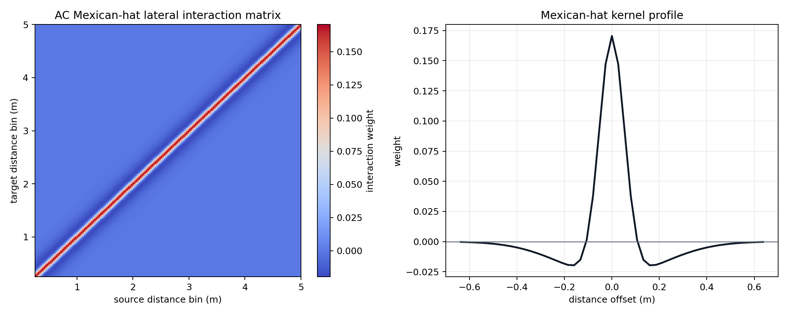
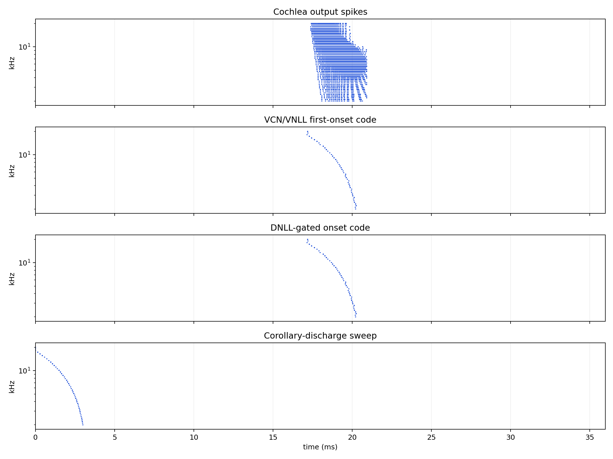
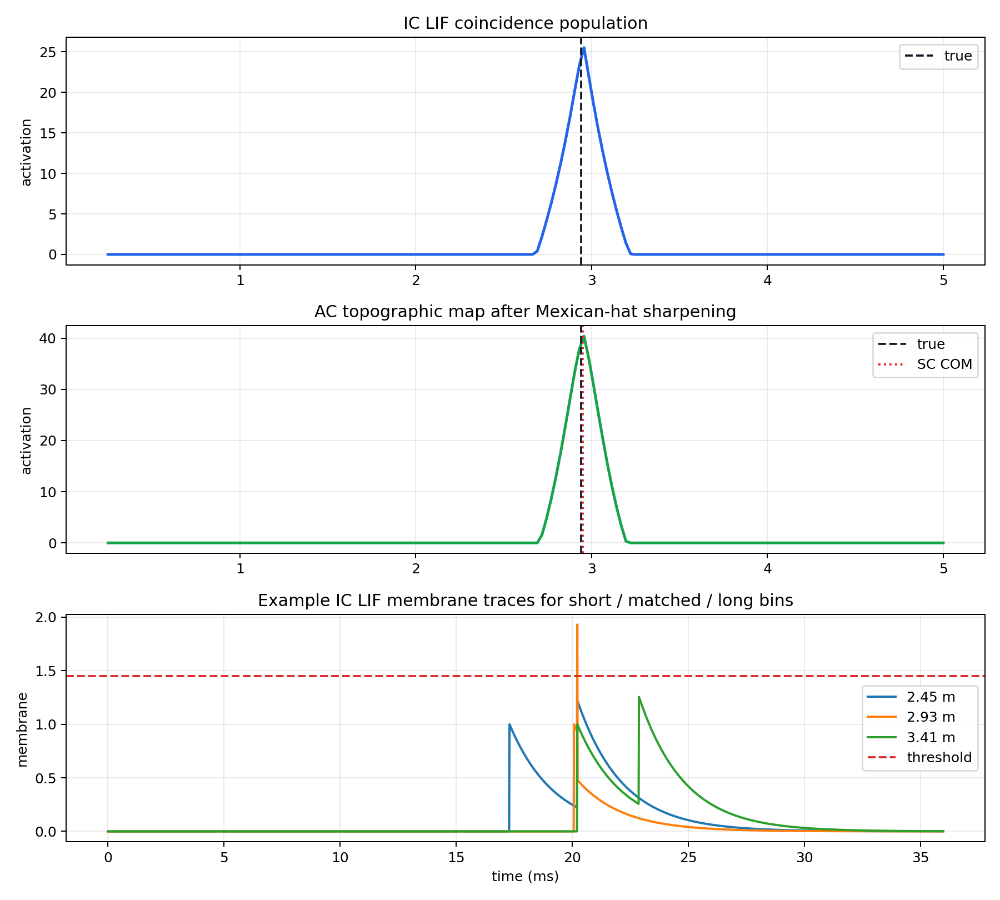
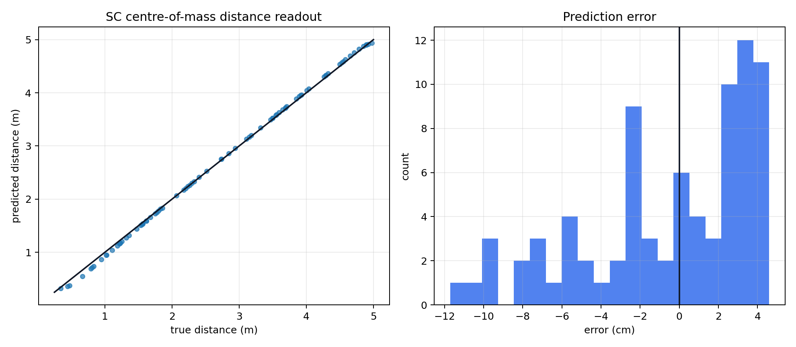

# Full Distance Pathway Model

This report introduces the first full distance-pathway prototype. It starts with the final cochlea front end and builds a biologically structured distance pathway around it: cochlea, VCN/VNLL, DNLL, corollary discharge, IC, AC, and SC.

## High-Level Pipeline



The lower cochlear and onset stages are explicitly bilateral. The IC/AC/SC map is simplified into a single combined distance map covering the whole tested distance range.

## Parameters

| Parameter | Value |
|---|---:|
| sample rate | `64000 Hz` |
| chirp | `18000 -> 2000 Hz` |
| chirp duration | `3.0 ms` |
| signal duration | `36.0 ms` |
| cochlea channels | `48` |
| cochlea Q factor | `12.0` |
| distance range | `0.25 -> 5.0 m` |
| distance bins | `180` |
| candidate delay range | `93 -> 1866 samples` |
| IC LIF beta | `0.992` |
| IC LIF threshold | `1.45` |
| VCN LIF beta | `0.92` |
| VCN threshold fraction | `0.03` |
| AC Mexican-hat inhibit gain | `0.58` |

## Stage Details

### 1. Cochlea

The cochlea is the final model developed in the cochlea mini-model work: active-window detection, IIR resonator filterbank, half-wave rectification, and TorchScript LIF spike encoding. In this distance-pathway prototype, the VCN/VNLL onset detector reads the rectified cochleagram activity, because the latency experiment showed this gives a more stable onset than the later cochlear spike raster.

```text
y_c[n] = b0_c*x[n] + 2*r_c*cos(theta_c)*y_c[n-1] - r_c^2*y_c[n-2]
v_c[n] = beta*v_c[n-1] + relu(y_c[n])
spike_c[n] = 1 if v_c[n] >= threshold
```

### 2. VCN/VNLL

The VCN/VNLL stage is simplified to a low-threshold LIF onset detector with a long refractory period. This keeps the model causal: the VCN/VNLL onset is emitted at the observed cochleagram onset, not moved earlier in time.

```text
v_c[t] = beta*v_c[t-1] + cochleagram_c[t]
threshold_c = threshold_fraction*max_t(cochleagram_c[t])
t_vcn,c = first t where v_c[t] >= threshold_c
```

The saved cochlea-latency vector is not subtracted from the VCN spikes. It is applied to the corollary-discharge expectation instead. The latency vector ranges from `-176` to `8` samples.

### 3. DNLL

The DNLL is simplified as delayed inhibition. After the first echo sweep begins, events after the primary sweep window are suppressed:

```text
suppress_after = first_onset + chirp_duration + padding
```

This blocks late secondary echoes in the simplest case. It would need to be relaxed or made object-aware for multi-object tracking.

### 4. Corollary Discharge

The corollary discharge is an internal ideal sweep. Each channel receives one spike at the expected time that the emitted chirp crosses that channel frequency, then the saved cochlea/onset latency vector is added to align the CD expectation with causal VCN/VNLL echo onsets.

```text
f(t) = f_start + (f_end - f_start)*t/T
t_cd,c = T * (f_c - f_start)/(f_end - f_start) + latency_c
```

### 5. IC LIF Coincidence Bank

The IC compares the VCN/VNLL echo onset against delayed corollary-discharge spikes for every candidate distance. For clean two-spike coincidence, the LIF membrane peak can be calculated directly:

```text
delta_c,k = abs(t_echo,c - (t_cd,c + delay_k))
m_c,k = 1 + beta^delta_c,k
IC_k = sum_c relu(m_c,k - threshold)
```

This is equivalent to a thresholded LIF coincidence detector for two unit input spikes, but evaluated in closed form for speed.

### 6. AC Topographic Map

The AC organises the IC population into a sharper distance map using a static Mexican-hat lateral interaction:

```text
K = Gaussian(sigma_exc) - g_inh*Gaussian(sigma_inh)
AC = relu(IC + conv(IC, K))
```



### 7. SC Readout

The SC readout uses centre of mass over the AC population:

```text
d_hat = sum_k AC_k*d_k / sum_k AC_k
```

This uses the whole population, gives sub-bin distance estimates, and resembles reading the mean of a posterior-like activity distribution.

## Example Stage Progression





## Accuracy Test

The first test uses `80` clean distances sampled uniformly from `0.25` to `5.0 m`.



| Metric | Value |
|---|---:|
| MAE | `0.317 cm` |
| RMSE | `0.934 cm` |
| max abs error | `6.119 cm` |
| bias | `-0.133 cm` |

## Noise Robustness Test

This test uses the noisy diagnostic condition from the signal-analysis mini model: additive white receiver noise at `10.0 dB` SNR over the active echo window, plus propagation-delay jitter with `jitter_std = 0.00025 s`. For this distance-pathway setup that gives `noise_std = 2.96442`.

The same stochastic noise and jitter sequence is used for both VCN variants, so the comparison isolates the VCN input representation.

| Variant | VCN input | Noise condition | MAE | RMSE | Max abs error | Bias |
|---|---|---|---:|---:|---:|---:|
| Current: cochleagram LIF + latency-adjusted CD | `cochleagram` | `10.0 dB SNR + jitter` | `138.617 cm` | `177.373 cm` | `471.981 cm` | `-107.721 cm` |
| Ablation: spike-raster LIF + matched latency-adjusted CD | `spikes` | `10.0 dB SNR + jitter` | `117.863 cm` | `138.242 cm` | `463.321 cm` | `-19.090 cm` |

These noisy results should be interpreted as a stress test, not as the final operating condition. The clean pathway is strongly timing-driven, so noise that creates early threshold crossings can be damaging unless the VCN onset detector includes stronger robustness logic.

## Ablation Comparison

The following variants were run on the same clean `80`-distance test set. The goal is to separate the benefit of the latency-adjusted CD/IC comparison from the benefit of reading the cochleagram rather than the later cochlear spike raster.

| Variant | VCN input | CD latency vector | MAE | RMSE | Max abs error | Bias | Interpretation |
|---|---|---|---:|---:|---:|---:|---|
| Current: cochleagram LIF + latency-adjusted CD | `cochleagram` | matched | `0.317 cm` | `0.934 cm` | `6.119 cm` | `-0.133 cm` | Current causal prototype; VCN reads cochleagram and CD expectation is latency-adjusted. |
| Ablation: cochleagram LIF, no latency vector | `cochleagram` | none | `26.918 cm` | `27.264 cm` | `29.422 cm` | `-26.918 cm` | Tests whether the CD/IC latency vector is responsible for the timing accuracy. |
| Ablation: spike-raster LIF + matched latency-adjusted CD | `spikes` | matched | `2.774 cm` | `3.145 cm` | `5.678 cm` | `-0.200 cm` | Tests whether the VCN can read the cochlear spike raster instead of the cochleagram. |

The no-latency ablation isolates the importance of the per-channel timing correction. The spike-raster ablation tests whether the VCN/VNLL onset stage can be driven by the already-spiking cochlea output rather than by the rectified cochleagram activity.

## Comparison To Previous Full Models

The table below compares the distance error here against the old trained multi-output models. This is useful context, but it is not a perfectly fair benchmark: the old models estimated distance, azimuth, and elevation together, while this new prototype is a clean distance-only pathway with no angle variation or noise.

| Model / result | Task | Distance MAE |
|---|---|---:|
| Round 4 combined model | full distance + azimuth + elevation | `7.86 cm` |
| Round 3 `2B + 3` | full distance + azimuth + elevation | `6.46 cm` |
| Round 5 trained-once fixed ridge decoder | full distance + azimuth + elevation with fixed tuned decoder | `4.38 cm` |
| Full distance pathway prototype | clean distance-only pathway, `0.25 -> 5.0 m` | `0.32 cm` |

On nominal distance MAE, this new distance-only pathway is better than the previous full models. The correct interpretation is not that the whole new model is already better overall, because it does not yet solve azimuth/elevation and is tested under cleaner conditions. The useful conclusion is narrower: the new structured distance pathway works as a distance estimator and is competitive enough to justify developing it further.

## Causality Update

The previous prototype subtracted the latency vector from echo onsets, which could make VCN/VNLL and DNLL spikes appear before the cochlea output. This version fixes that: VCN/VNLL and DNLL stay causal, and the latency vector is added to the corollary-discharge expectation inside the CD/IC comparison.

## Interpretation

- The model now has the intended high-level biological pathway structure rather than just a standalone coincidence detector.
- The VCN/VNLL stage is deliberately simplified; robust biological onset coding is difficult to tune, and here it is represented by a causal low-threshold refractory-LIF onset detector.
- The IC stage is still a simplified LIF coincidence model. It uses the closed-form two-spike LIF peak rather than time-stepping every IC neuron for every sample.
- The AC and SC stages give a smooth population readout, which is useful for sub-bin distance estimates.
- The next optimisation step is to replace dense cochlear rasters with coordinate events so the chosen coordinate accumulator can be used downstream.
- This should be counted as a successful first full-distance-pathway prototype: the full chain from cochlea to SC readout produces a structured distance population and low clean distance error while preserving causal onset timing.

## Generated Files

- `stage_rasters`: `distance_pathway/outputs/full_distance_pathway/figures/stage_rasters.png`
- `population_progression`: `distance_pathway/outputs/full_distance_pathway/figures/population_progression.png`
- `mexican_hat_matrix`: `distance_pathway/outputs/full_distance_pathway/figures/mexican_hat_matrix.png`
- `accuracy`: `distance_pathway/outputs/full_distance_pathway/figures/accuracy.png`
- `results`: `distance_pathway/outputs/full_distance_pathway/results.json`

Runtime: `22.69 s`.
