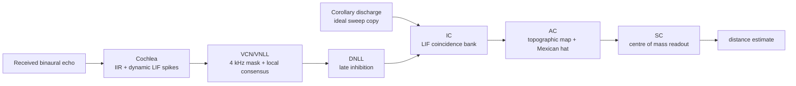

# Full Distance Pathway Model

This report describes the current full distance-pathway prototype using the updated primary model: dynamic cochlear spike encoding, VCN consensus, DNLL suppression, IC coincidence with soft sweep facilitation, AC topographic sharpening, and SC centre-of-mass readout.

## High-Level Pipeline



The lower cochlear and onset stages are explicitly bilateral. The IC/AC/SC map is simplified into a single combined distance map covering the whole tested distance range.

## Parameters

| Parameter | Value |
|---|---:|
| sample rate | `64000 Hz` |
| chirp | `18000 -> 2000 Hz` |
| chirp duration | `3.0 ms` |
| signal duration | `36.0 ms` |
| cochlea channels | `48` |
| cochlea Q factor | `12.0` |
| distance range | `0.25 -> 5.0 m` |
| distance bins | `180` |
| candidate delay range | `93 -> 1866 samples` |
| IC LIF beta | `0.992` |
| IC LIF threshold | `1.45` |
| VCN LIF beta | `0.92` |
| VCN threshold fraction | `0.03` |
| VCN minimum responsive frequency | `4.0 kHz` |
| VCN consensus window | `±2` channels, `±8` samples |
| VCN consensus minimum count | `3` |
| IC facilitation gain | `0.45` |
| IC facilitation tau | `8.0` samples |
| AC Mexican-hat inhibit gain | `0.58` |

## Stage Details

### 1. Cochlea

The cochlea starts with the final model developed in the cochlea mini-model work: active-window detection, IIR resonator filterbank, half-wave rectification, and LIF spike encoding. The current primary model then replaces the fixed cochlear spike raster with a dynamic LIF spike raster before the VCN.

```text
y_c[n] = b0_c*x[n] + 2*r_c*cos(theta_c)*y_c[n-1] - r_c^2*y_c[n-2]
v_c[n] = beta*v_c[n-1] + relu(y_c[n])
spike_c[n] = 1 if v_c[n] >= threshold
```

For the primary dynamic cochlear spike raster:

```text
threshold(t): x16 -> x2.5
beta(t):      0.20 -> 0.60
```

### 2. VCN/VNLL

The primary VCN/VNLL stage uses the dynamic cochlear spike raster. Channels below `4 kHz` are silenced before VCN detection. The VCN then uses local multi-channel consensus, requiring activity within a small frequency-time neighbourhood before emitting the first onset for a channel.

```text
raw_c,t = dynamic_spike_c,t and f_c >= 4 kHz
count_c,t = sum raw over local frequency-time window
t_vcn,c = first t where raw_c,t = 1 and count_c,t >= consensus_min
```

The saved cochlea-latency vector is not subtracted from the VCN spikes. It is applied to the corollary-discharge expectation instead. The latency vector ranges from `-43` to `31` samples.

### 3. DNLL

The DNLL is simplified as delayed inhibition. After the first echo sweep begins, events after the primary sweep window are suppressed:

```text
suppress_after = first_onset + chirp_duration + padding
```

This blocks late secondary echoes in the simplest case. It would need to be relaxed or made object-aware for multi-object tracking.

### 4. Corollary Discharge

The corollary discharge is an internal ideal sweep. Each channel receives one spike at the expected time that the emitted chirp crosses that channel frequency, then the saved cochlea/onset latency vector is added to align the CD expectation with causal VCN/VNLL echo onsets.

```text
f(t) = f_start + (f_end - f_start)*t/T
t_cd,c = T * (f_c - f_start)/(f_end - f_start) + latency_c
```

### 5. IC LIF Coincidence Bank

The IC compares the VCN/VNLL echo onset against delayed corollary-discharge spikes for every candidate distance. For clean two-spike coincidence, the LIF membrane peak can be calculated directly. The primary model also applies soft local sweep facilitation: neighbouring channels with consistent delays boost a candidate distance without hard-gating it.

```text
delta_c,k = abs(t_echo,c - (t_cd,c + delay_k))
m_c,k = 1 + beta^delta_c,k
IC_k = sum_c relu(m_c,k - threshold)
IC_k = sum_c score_c,k * (1 + facil_gain*facil_c,k)
```

This is equivalent to a thresholded LIF coincidence detector for two unit input spikes, but evaluated in closed form for speed.

### 6. AC Topographic Map

The AC organises the IC population into a sharper distance map using a static Mexican-hat lateral interaction:

```text
K = Gaussian(sigma_exc) - g_inh*Gaussian(sigma_inh)
AC = relu(IC + conv(IC, K))
```


### 7. SC Readout

The SC readout uses centre of mass over the AC population:

```text
d_hat = sum_k AC_k*d_k / sum_k AC_k
```

This uses the whole population, gives sub-bin distance estimates, and resembles reading the mean of a posterior-like activity distribution.

## Example Stage Progression


## Accuracy Test

The first test uses `80` clean distances sampled uniformly from `0.25` to `5.0 m` with primary model `Primary: dynamic spike VCN + consensus + IC facilitation`.


| Metric | Value |
|---|---:|
| MAE | `3.571 cm` |
| RMSE | `4.364 cm` |
| max abs error | `11.710 cm` |
| bias | `-0.556 cm` |

## Noise Robustness Test

This test uses the noisy diagnostic condition from the signal-analysis mini model: additive white receiver noise at `10.0 dB` SNR over the active echo window, plus propagation-delay jitter with `jitter_std = 0.00025 s`. For this distance-pathway setup that gives `noise_std = 2.96442`.

The same stochastic noise and jitter sequence is used for each variant, so the comparison isolates the pathway representation and detector changes.

| Variant | VCN input | Detector | IC mode | Noise condition | MAE | RMSE | Max abs error | Bias |
|---|---|---|---|---|---:|---:|---:|---:|
| Primary: dynamic spike VCN + consensus + IC facilitation | `spikes` | `consensus` | `facilitated` | `10.0 dB SNR + jitter` | `7.127 cm` | `13.797 cm` | `104.423 cm` | `-5.768 cm` |
| Previous: cochleagram LIF + latency-adjusted CD | `cochleagram` | `lif_first` | `plain` | `10.0 dB SNR + jitter` | `118.744 cm` | `143.518 cm` | `445.503 cm` | `-86.842 cm` |
| Ablation: spike-raster LIF + matched latency-adjusted CD | `spikes` | `lif_first` | `plain` | `10.0 dB SNR + jitter` | `117.853 cm` | `138.241 cm` | `463.321 cm` | `-19.080 cm` |

These noisy results should be interpreted as a stress test, not as the final operating condition. The clean pathway is strongly timing-driven, so noise that creates early threshold crossings can be damaging unless the VCN onset detector includes stronger robustness logic.

## Ablation Comparison

The following variants were run on the same clean `80`-distance test set. The goal is to compare the updated primary dynamic pathway against the earlier cochleagram-LIF pathway and simpler ablations.

| Variant | VCN input | Detector | IC mode | CD latency vector | MAE | RMSE | Max abs error | Bias | Interpretation |
|---|---|---|---|---|---:|---:|---:|---:|---|
| Primary: dynamic spike VCN + consensus + IC facilitation | `spikes` | `consensus` | `facilitated` | matched | `3.571 cm` | `4.364 cm` | `11.710 cm` | `-0.556 cm` | Updated primary model: dynamic cochlear spikes, sub-4 kHz VCN silence, local VCN consensus, and soft IC sweep facilitation. |
| Previous: cochleagram LIF + latency-adjusted CD | `cochleagram` | `lif_first` | `plain` | matched | `0.342 cm` | `0.939 cm` | `6.101 cm` | `-0.161 cm` | Current causal prototype; VCN reads cochleagram and CD expectation is latency-adjusted. |
| Ablation: cochleagram LIF, no latency vector | `cochleagram` | `lif_first` | `plain` | none | `19.548 cm` | `19.759 cm` | `22.015 cm` | `-19.548 cm` | Tests whether the CD/IC latency vector is responsible for the timing accuracy. |
| Ablation: spike-raster LIF + matched latency-adjusted CD | `spikes` | `lif_first` | `plain` | matched | `2.154 cm` | `2.471 cm` | `4.824 cm` | `-0.172 cm` | Tests whether the VCN can read the cochlear spike raster instead of the cochleagram. |

The no-latency ablation isolates the importance of the per-channel timing correction. The dynamic primary model tests whether a stricter spike-raster pathway can retain useful distance timing while improving noise robustness.

## Comparison To Previous Full Models

The table below compares the distance error here against the old trained multi-output models. This is useful context, but it is not a perfectly fair benchmark: the old models estimated distance, azimuth, and elevation together, while this new prototype is a clean distance-only pathway with no angle variation or noise.

| Model / result | Task | Distance MAE |
|---|---|---:|
| Round 4 combined model | full distance + azimuth + elevation | `7.86 cm` |
| Round 3 `2B + 3` | full distance + azimuth + elevation | `6.46 cm` |
| Round 5 trained-once fixed ridge decoder | full distance + azimuth + elevation with fixed tuned decoder | `4.38 cm` |
| Full distance pathway prototype, updated primary dynamic model | clean distance-only pathway, `0.25 -> 5.0 m` | `3.57 cm` |

On nominal distance MAE, this updated distance-only pathway is competitive with the previous full models. The correct interpretation is not that the whole new model is already better overall, because it does not yet solve azimuth/elevation. The useful conclusion is narrower: the structured distance pathway works as a distance estimator and can be made substantially more noise robust than the original cochleagram-driven path.

## Causality Update

The previous prototype subtracted the latency vector from echo onsets, which could make VCN/VNLL and DNLL spikes appear before the cochlea output. This version fixes that: VCN/VNLL and DNLL stay causal, and the latency vector is added to the corollary-discharge expectation inside the CD/IC comparison.

## Interpretation

- The model now has the intended high-level biological pathway structure rather than just a standalone coincidence detector.
- The primary model now uses a spike-raster VCN input with dynamic cochlear threshold/beta, a 4 kHz frequency mask, and local consensus.
- The IC stage is still a simplified LIF coincidence model. It uses the closed-form two-spike LIF peak rather than time-stepping every IC neuron for every sample.
- The AC and SC stages give a smooth population readout, which is useful for sub-bin distance estimates.
- The next optimisation step is to replace dense cochlear rasters with coordinate events so the chosen coordinate accumulator can be used downstream.
- This should be counted as a successful first full-distance-pathway prototype: the full chain from cochlea to SC readout produces a structured distance population and low clean distance error while preserving causal onset timing.

## Updated model:

Updated the full distance pathway so the primary model is now:

`dynamic cochlea x16 -> x2.5, beta 0.20 -> 0.60` + `4 kHz VCN mask` + `VCN consensus` + `IC facilitation`.
Key results:

| Model | Clean MAE | Noisy MAE |
|---|---:|---:|
| Updated dynamic primary | `3.571 cm` | `7.127 cm` |
| Previous cochleagram path | `0.342 cm` | `118.744 cm` |
| Basic spike-raster path | `2.154 cm` | `117.853 cm` |


The dynamic primary is less accurate clean than the old cochleagram path, but dramatically more robust under the 10 dB noise + jitter test.

## Generated Files

- `stage_rasters`: `distance_pathway/outputs/full_distance_pathway/figures/stage_rasters.png`
- `population_progression`: `distance_pathway/outputs/full_distance_pathway/figures/population_progression.png`
- `mexican_hat_matrix`: `distance_pathway/outputs/full_distance_pathway/figures/mexican_hat_matrix.png`
- `accuracy`: `distance_pathway/outputs/full_distance_pathway/figures/accuracy.png`
- `results`: `distance_pathway/outputs/full_distance_pathway/results.json`

Runtime: `21.01 s`.

