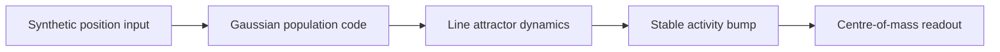
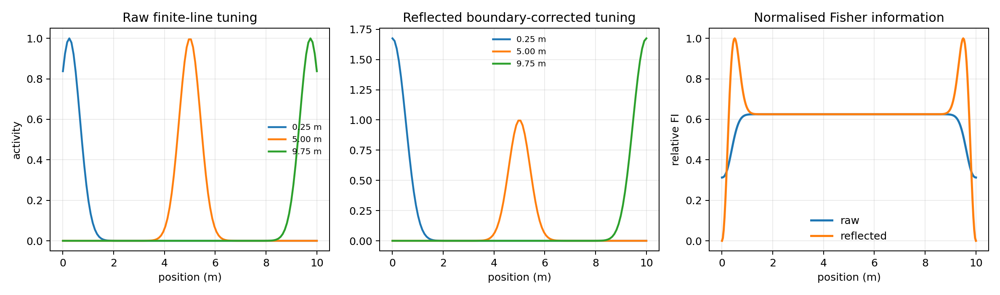
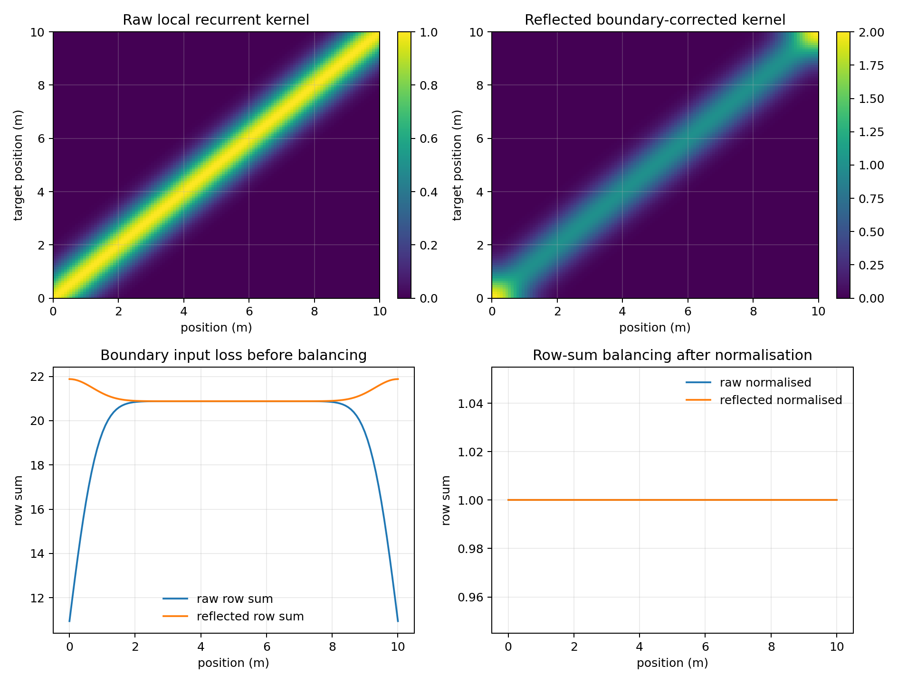
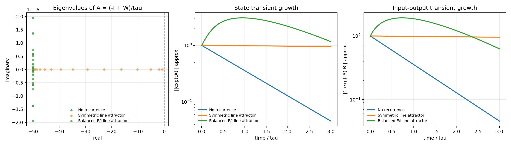
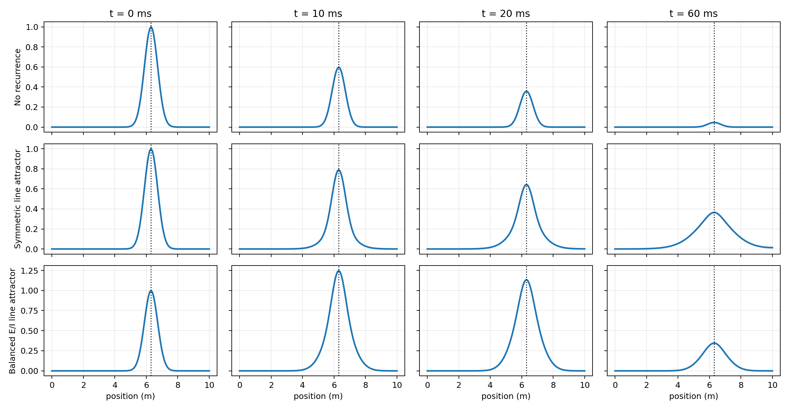
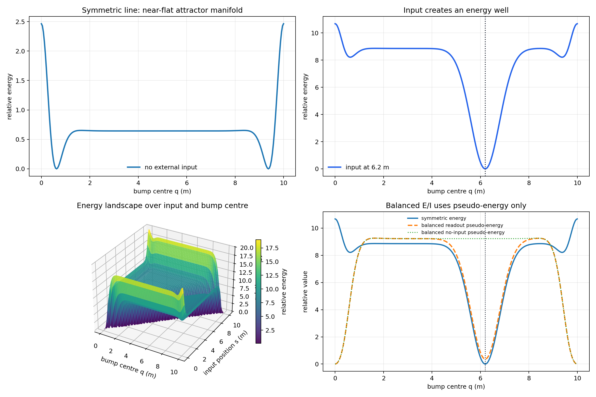
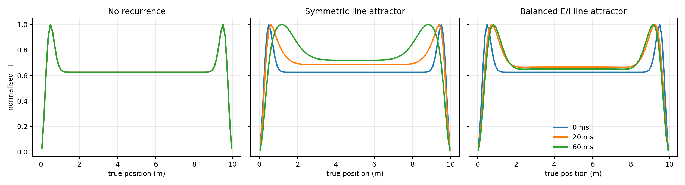
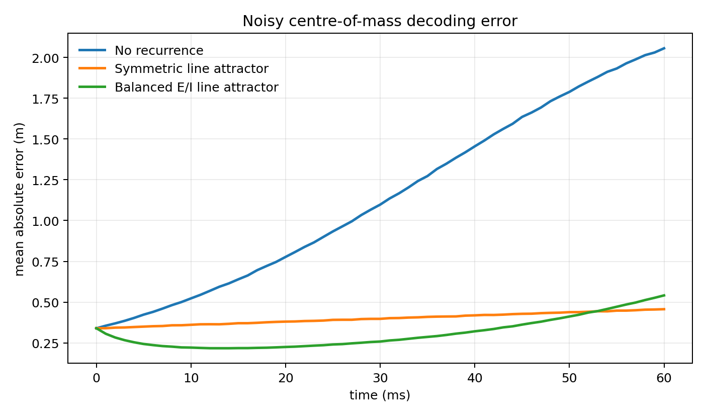

# Line Attractor Model Analysis

This report analyses a standalone line-attractor model for a future superior-colliculus-style distance readout. It does not use the current distance pathway outputs. The input is a synthetic one-dimensional population code over position.

## Aim

The current SC readout in the full distance pathway uses a direct centre of mass over an AC distance map. A continuous attractor neural network is a more neuromorphic alternative: the input briefly creates a bump of activity, recurrent structure maintains and sharpens the bump, and the final distance is decoded from the population.



## From Ring To Line

The previous ring model represented a circular variable, so the distance between neurons wrapped around:

```text
d_ring(phi_i, phi_j) = angle_wrap(phi_i - phi_j)
W_ij = K(d_ring(phi_i, phi_j))
```

Distance is not circular. A target at `10 m` is not close to a target at `0 m`, so the ring is opened into a finite line:

```text
x_i in [0, L]
d_line(i, j) = x_i - x_j
W_ij = K(x_i - x_j)
```

The main complication is the boundary. A neuron near `0 m` or `L` has fewer neighbours on one side, so an uncorrected line has weaker recurrent input and weaker Fisher information at the edges. This is the finite-line equivalent of losing half of the kernel.

## Population Code And Fisher Information

A position `x` is encoded as a Gaussian population bump:

```text
h_i(x) = exp(-(x_i - x)^2 / (2 sigma_h^2))
```

For independent Gaussian readout noise with variance `sigma_n^2`, Fisher information is:

```text
J(x) = (dh/dx)^T Sigma^-1 (dh/dx)
J(x) = (1 / sigma_n^2) * sum_i (dh_i/dx)^2
```

Fisher information is useful because it measures local discriminability: high `J(x)` means a small change in distance causes a large, noise-robust change in the population pattern. Through the Cramer-Rao bound, any unbiased estimator has variance at least `1 / J(x)`. Therefore, a good readout representation should have high and reasonably flat Fisher information across the whole represented interval.

## Boundary Correction

The boundary-corrected line uses reflected image terms:

```text
h_i_ref(x) = G(x_i - x) + G(x_i + x) + G(x_i - (2L - x))
```

This is equivalent to reflecting the tuning curve outside the interval. It prevents edge neurons from losing half their input and makes the representation closer to a finite line with no-flux boundaries.



The same correction is applied to recurrent kernels. After that, row-sum balancing ensures every neuron receives comparable total recurrent drive:

```text
K_ij_ref = G(x_i - x_j) + G(x_i + x_j) + G(x_i - (2L - x_j))
W_ij = alpha * K_ij_ref / sum_j K_ij_ref
```



## Dynamics

The analysed rate model is:

```text
tau dr/dt = -r + W r + B u(t)
```

For this analysis the input is a brief impulse, so after `t=0` the autonomous dynamics are:

```text
tau dr/dt = -r + W r
A = (-I + W) / tau
r(t) = exp(tA) r(0)
```

Three models are compared:

| Model | Meaning |
|---|---|
| No recurrence | The bump simply decays. This is the non-attractor baseline. |
| Symmetric line attractor | Local reflected excitation with largest recurrent eigenvalue just below one. This gives a slow, stable bump. |
| Balanced E/I line attractor | A high-gain E/I block with matched excitation and inhibition. This is asymptotically stable but can show transient amplification. |

## Balancing

Balancing happens in two senses.

First, spatial balancing corrects the finite-line boundary problem by keeping row sums approximately equal across position. Without this, boundary neurons receive less recurrent drive than middle neurons.

Second, E/I balancing uses opposing excitatory and inhibitory pathways:

```text
W_EI = [[ W0, -W0],
        [ W0, -W0]]
B = [I; 0]
C = [I, 0]
```

This matrix has strong internal gain but cancels asymptotically because excitation and inhibition are matched. It is non-normal: eigenvalues alone do not describe the short-term response.

## Transient Growth But Asymptotically Stable

A continuous-time linear system is asymptotically stable if all eigenvalues of `A` have negative real part. The symmetric line model is stable because the largest eigenvalue of `W` is set below one. The balanced E/I model is also stable, even with high internal gain, because its recurrent block is arranged so the long-term eigenvalues remain below the stability boundary.

Transient growth is still possible when `A` is non-normal. In that case, eigenvectors are not orthogonal, so activity can temporarily grow before eventually decaying. This is useful for a readout because it can amplify a weak distance bump without requiring unstable persistent activity.



| Model | max Re(A) | peak state gain | peak readout gain | final state gain | final readout gain |
|---|---:|---:|---:|---:|---:|
| No recurrence | `-50.000` | `1.00` | `1.00` | `0.046` | `0.046` |
| Symmetric line attractor | `-0.750` | `1.00` | `1.00` | `0.956` | `0.956` |
| Balanced E/I line attractor | `-50.000` | `3.07` | `1.93` | `1.166` | `0.628` |

## Bump Dynamics



The symmetric line attractor keeps the bump shape stable for longer than no recurrence. The balanced E/I version can transiently amplify the readout while still decaying eventually.

## Energy Landscape View

For the symmetric line model, the recurrent system can be viewed with a quadratic Lyapunov-style energy:

```text
E(r) = 0.5*r^T*(I - W)*r - h(s)^T*r
```

The first term describes the recurrent attractor landscape. The second term is the external input, which creates an energy well at the stimulus position. To visualise this in one dimension, the report evaluates the energy only along the bump manifold `r = h(q)`, where `q` is the represented bump centre:

```text
E(q | s) = 0.5*h(q)^T*(I - W)*h(q) - h(s)^T*h(q)
```

A good continuous line attractor should have an almost flat no-input landscape along `q`, so the bump can represent any distance without being pulled to a preferred point. When input arrives, the landscape should form a well around the measured position.



The balanced E/I model is non-normal, so it does not generally have a single scalar energy function that fully explains its dynamics. The plotted balanced curve is therefore a readout pseudo-energy, useful as an intuition for bump localisation, while the transient-growth and eigenvalue plots remain the correct stability analysis.

## Fisher Information Through Time



The useful target is not simply high Fisher information at one point. For a distance map, the more important property is high and flat Fisher information across the full line, including near the boundaries. This is why boundary correction is central to converting the ring model into a line model.

## Noisy Decoding Test

A simple centre-of-mass decoder was applied to noisy readout activity. This is not yet coupled to the distance pathway; it only tests whether the attractor dynamics preserve a decodable line-position bump.



| Model | Mean absolute error at 60 ms |
|---|---:|
| No recurrence | `2.0555 m` |
| Symmetric line attractor | `0.4570 m` |
| Balanced E/I line attractor | `0.5415 m` |

## Interpretation

- A ring attractor becomes a line attractor by replacing circular distance with finite-line distance.
- The line requires explicit boundary correction; otherwise the endpoints have weaker recurrent input and lower Fisher information.
- Fisher information is the correct analysis tool because it measures how well nearby distances can be distinguished under noise.
- The safest SC readout candidate is an asymptotically stable line attractor, not a perfectly neutral one, because stability prevents runaway drift.
- Balanced E/I circuitry can provide transient gain while remaining stable, which is attractive for a neuromorphic readout receiving brief IC/AC input.
- This report analyses the readout model only. Integration with the distance pathway should come later by feeding the AC population into the line-attractor input `u(t)`.

## Parameters

| Parameter | Value |
|---|---:|
| represented length | `10.0 m` |
| neurons per population | `120` |
| tau | `20.0 ms` |
| dt | `1.0 ms` |
| simulation time | `60.0 ms` |
| tuning sigma | `0.420 m` |
| recurrent sigma | `0.700 m` |
| symmetric alpha | `0.985` |
| balanced alpha prime | `4.000` |

## Generated Files

- `tuning_and_fisher`: `distance_pathway/outputs/line_attractor_analysis/figures/tuning_and_fisher.png`
- `boundary_weights`: `distance_pathway/outputs/line_attractor_analysis/figures/boundary_weights.png`
- `readout_snapshots`: `distance_pathway/outputs/line_attractor_analysis/figures/readout_snapshots.png`
- `energy_landscape`: `distance_pathway/outputs/line_attractor_analysis/figures/energy_landscape.png`
- `stability_transients`: `distance_pathway/outputs/line_attractor_analysis/figures/stability_transients.png`
- `fisher_through_time`: `distance_pathway/outputs/line_attractor_analysis/figures/fisher_through_time.png`
- `decoding_error`: `distance_pathway/outputs/line_attractor_analysis/figures/decoding_error.png`
- `results`: `distance_pathway/outputs/line_attractor_analysis/results.json`

Runtime: `12.47 s`.
