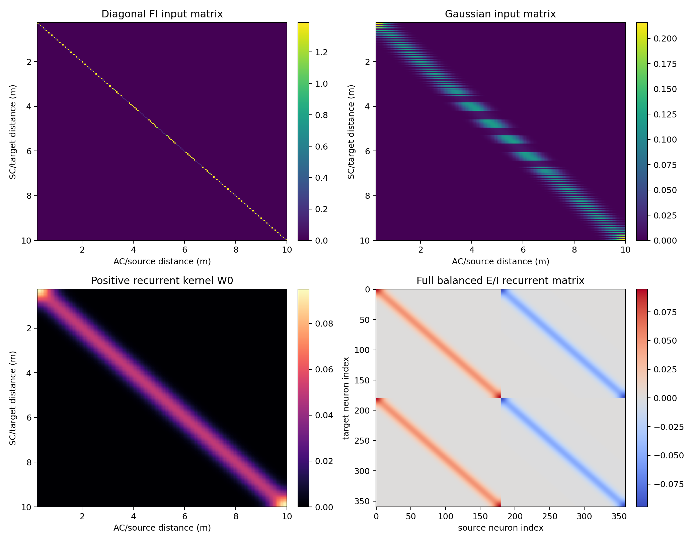
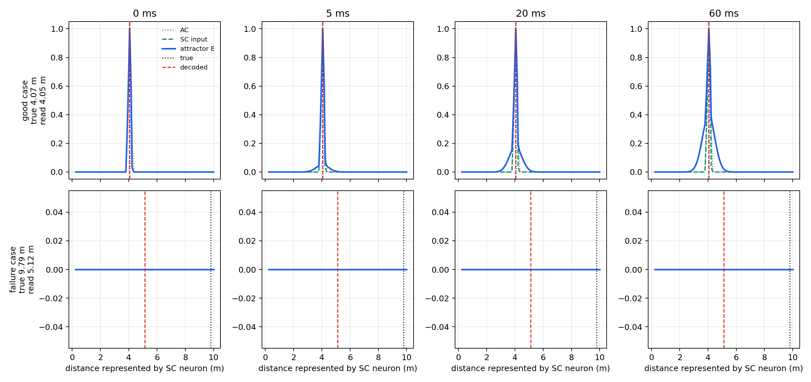
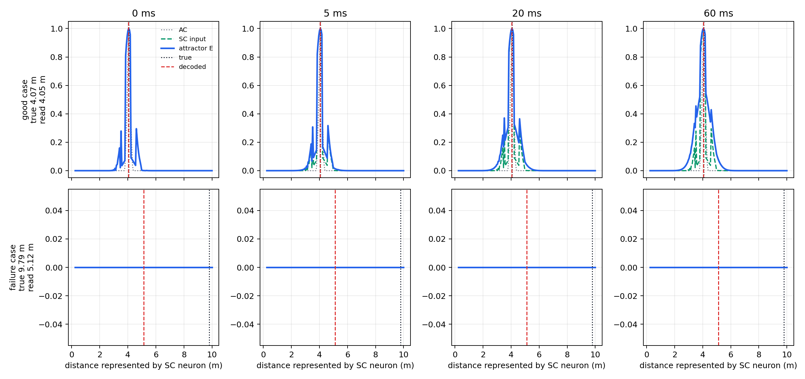
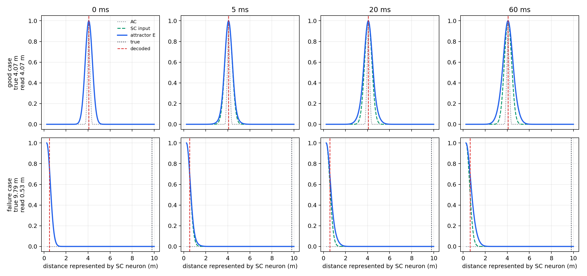
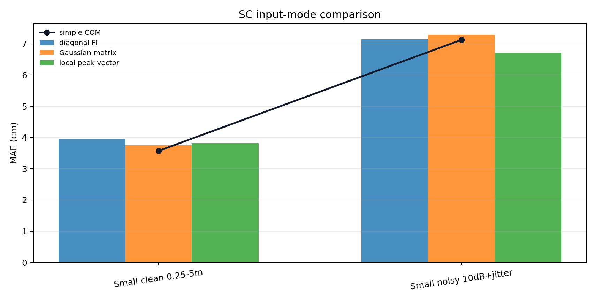

# SC Line Attractor Integration

This report tests a balanced E/I line-attractor readout as an upgraded SC stage. The current full distance pathway is left unchanged up to the AC distance population. The only change is the final readout.

## Experiment Design

The baseline is the existing simple SC centre-of-mass readout:

```text
d_hat = sum_k AC_k d_k / sum_k AC_k
```

The upgraded readout uses a balanced E/I line attractor with the same distance grid as the AC. Therefore, no spatial resampling is needed:

```text
N_SC = N_AC
x_SC,k = d_AC,k
```

The balanced E/I state is:

```text
r = [r_E, r_I]
W_EI = [[ W0, -W0],
        [ W0, -W0]]
tau dr/dt = -r + W_EI r
```

The AC population is injected as a brief impulse into the excitatory population only:

```text
r_E(0) = G_FI * normalise(AC)
r_I(0) = 0
```

The distance is decoded by centre of mass from the excitatory readout. The requested first readout time is `5 ms`, but the timing plot shows how the decoded distance changes over the full `60 ms` simulation.

This version compares three AC-to-SC input transforms:

- `diagonal FI`: the original topographic diagonal Fisher-balanced gain matrix.
- `Gaussian matrix`: a fixed off-diagonal Gaussian input matrix that spreads each AC bin into neighbouring SC bins before recurrence.
- `local peak vector`: a nonlinear local population vector centred on the AC peak neighbourhood; this is not a fixed matrix, because it first estimates the peak location for each sample.

## Fisher-Balanced Input Weights

The recurrent weights are kept as the reflected line-attractor structure. Input weights are diagonal gains chosen to flatten Fisher information over the distance grid rather than learned from labels.

For reflected tuning curves `h_i(x)`, independent Gaussian noise gives:

```text
J(x) = sum_i (g_i dh_i/dx)^2 / sigma_n^2
```

The gain values are found by solving a constrained least-squares approximation:

```text
D^2 u ~= constant
u_i = g_i^2
mean(u) = 1
```

This keeps the input topographic while reducing boundary-related Fisher information dips.


## Input And Recurrent Matrices

The heatmaps below show the fixed input matrices and recurrent matrices. The diagonal FI matrix is the original input. The Gaussian matrix is the widened input tested here. The local peak-vector input is not shown as a fixed matrix because it is computed separately for each sample.



## Alpha Sweep

The original ring-model notebook showed that increasing recurrent gain can improve readout accuracy. Here the same idea is tested by sweeping the balanced E/I `alpha_prime` parameter while keeping the recurrent structure fixed.


| alpha prime | Clean MAE | Noisy MAE | Selection score | Runtime/sample |
|---:|---:|---:|---:|---:|
| `0.00` | `4.057 cm` | `7.145 cm` | `5.601 cm` | `0.53 ms` |
| `0.50` | `3.984 cm` | `7.141 cm` | `5.562 cm` | `0.93 ms` |
| `1.00` | `3.957 cm` | `7.138 cm` | `5.547 cm` | `0.93 ms` |
| `2.00` | `3.967 cm` | `7.134 cm` | `5.550 cm` | `1.34 ms` |
| `4.00` | `4.022 cm` | `7.176 cm` | `5.599 cm` | `1.79 ms` |
| `6.00` | `4.054 cm` | `7.204 cm` | `5.629 cm` | `1.07 ms` |
| `8.00` | `4.075 cm` | `7.222 cm` | `5.649 cm` | `2.47 ms` |

The selected alpha for the controlled comparisons is `1.00`, chosen by the mean of clean and noisy small-space MAE.

## Input Timing Experiment

The integration uses the readout at `5 ms`. The plot below checks whether that is reasonable by showing representative decoded distances over time and the mean absolute error over time.


## Bump Dynamics

The plots below show the upstream AC population, transformed SC input, and attractor excitatory population at several times. They include one good full-3D clean case and one failure case. The grey dotted curve is the original AC map, the green dashed curve is the SC input after the selected input transform, the blue curve is the attractor excitatory bump, the black dotted line is the true distance, and the red dashed line is the decoded distance at that time.







## Controlled Comparisons

The comparison uses the same upstream AC activations for both readouts, so any difference is caused by the SC readout only.




| Condition | SC input | Subset | N | Baseline MAE | Attractor MAE | Baseline RMSE | Attractor RMSE | Baseline max error | Attractor max error | Attractor runtime/sample |
|---|---|---|---:|---:|---:|---:|---:|---:|---:|---:|
| Small clean 0.25-5m | diagonal FI | all | `80` | `3.571 cm` | `3.957 cm` | `4.364 cm` | `4.664 cm` | `11.710 cm` | `11.350 cm` | `0.99 ms` |
| Small noisy 10dB+jitter | diagonal FI | all | `80` | `7.127 cm` | `7.138 cm` | `13.797 cm` | `13.997 cm` | `104.423 cm` | `104.854 cm` | `1.05 ms` |
| Full 3D clean 0.25-10m | diagonal FI | <=5m | `33` | `2.831 cm` | `3.706 cm` | `4.167 cm` | `4.780 cm` | `11.500 cm` | `9.780 cm` | `0.93 ms` |
| Full 3D clean 0.25-10m | diagonal FI | <=10m | `80` | `34.041 cm` | `35.099 cm` | `110.014 cm` | `110.833 cm` | `464.131 cm` | `466.854 cm` | `0.93 ms` |
| Full 3D 50dB floor | diagonal FI | <=5m | `33` | `2.826 cm` | `3.694 cm` | `4.164 cm` | `4.760 cm` | `11.500 cm` | `9.788 cm` | `1.40 ms` |
| Full 3D 50dB floor | diagonal FI | <=10m | `80` | `34.040 cm` | `35.099 cm` | `110.014 cm` | `110.833 cm` | `464.131 cm` | `466.854 cm` | `1.40 ms` |
| Small clean 0.25-5m | Gaussian matrix | all | `80` | `3.571 cm` | `3.753 cm` | `4.364 cm` | `4.531 cm` | `11.710 cm` | `12.535 cm` | `2.88 ms` |
| Small noisy 10dB+jitter | Gaussian matrix | all | `80` | `7.127 cm` | `7.289 cm` | `13.797 cm` | `13.815 cm` | `104.423 cm` | `103.344 cm` | `1.87 ms` |
| Full 3D clean 0.25-10m | Gaussian matrix | <=5m | `33` | `2.831 cm` | `2.290 cm` | `4.167 cm` | `2.831 cm` | `11.500 cm` | `7.223 cm` | `1.29 ms` |
| Full 3D clean 0.25-10m | Gaussian matrix | <=10m | `80` | `34.041 cm` | `33.960 cm` | `110.014 cm` | `110.778 cm` | `464.131 cm` | `466.854 cm` | `1.29 ms` |
| Full 3D 50dB floor | Gaussian matrix | <=5m | `33` | `2.826 cm` | `2.288 cm` | `4.164 cm` | `2.829 cm` | `11.500 cm` | `7.223 cm` | `0.97 ms` |
| Full 3D 50dB floor | Gaussian matrix | <=10m | `80` | `34.040 cm` | `33.961 cm` | `110.014 cm` | `110.778 cm` | `464.131 cm` | `466.854 cm` | `0.97 ms` |
| Small clean 0.25-5m | local peak vector | all | `80` | `3.571 cm` | `3.814 cm` | `4.364 cm` | `4.667 cm` | `11.710 cm` | `13.483 cm` | `1.31 ms` |
| Small noisy 10dB+jitter | local peak vector | all | `80` | `7.127 cm` | `6.717 cm` | `13.797 cm` | `13.378 cm` | `104.423 cm` | `104.197 cm` | `1.43 ms` |
| Full 3D clean 0.25-10m | local peak vector | <=5m | `33` | `2.831 cm` | `2.034 cm` | `4.167 cm` | `2.686 cm` | `11.500 cm` | `7.057 cm` | `1.30 ms` |
| Full 3D clean 0.25-10m | local peak vector | <=10m | `80` | `34.041 cm` | `74.152 cm` | `110.014 cm` | `244.800 cm` | `464.131 cm` | `926.329 cm` | `1.30 ms` |
| Full 3D 50dB floor | local peak vector | <=5m | `33` | `2.826 cm` | `2.030 cm` | `4.164 cm` | `2.681 cm` | `11.500 cm` | `7.057 cm` | `1.27 ms` |
| Full 3D 50dB floor | local peak vector | <=10m | `80` | `34.040 cm` | `74.151 cm` | `110.014 cm` | `244.800 cm` | `464.131 cm` | `926.329 cm` | `1.27 ms` |

## Full-3D Failure Cases

The table below lists the worst clean full-3D cases by the original simple-readout absolute distance error. The target coordinate is shown as `(distance, azimuth, elevation)`, while the readouts are one-dimensional distance estimates. The estimated reason is a heuristic diagnostic, not a proven causal attribution.

| Rank | True coordinate | Simple readout | Attractor readout | Simple error | Attractor error | Estimated reason |
|---:|---|---:|---:|---:|---:|---|
| 1 | `(9.79 m, 38.4 deg, -28.3 deg)` | `5.15 m` | `5.12 m` | `-4.64 m` | `-4.67 m` | true range is outside the 5 m range where the pathway is strongest; readout is biased short, suggesting the AC peak is already pulled to an earlier delay |
| 2 | `(9.69 m, 37.7 deg, -23.2 deg)` | `5.15 m` | `5.12 m` | `-4.54 m` | `-4.57 m` | true range is outside the 5 m range where the pathway is strongest; readout is biased short, suggesting the AC peak is already pulled to an earlier delay |
| 3 | `(9.42 m, 6.2 deg, -5.3 deg)` | `5.15 m` | `5.12 m` | `-4.27 m` | `-4.29 m` | true range is outside the 5 m range where the pathway is strongest; readout is biased short, suggesting the AC peak is already pulled to an earlier delay |
| 4 | `(9.13 m, -58.0 deg, -21.0 deg)` | `5.15 m` | `5.12 m` | `-3.98 m` | `-4.01 m` | true range is outside the 5 m range where the pathway is strongest; readout is biased short, suggesting the AC peak is already pulled to an earlier delay |
| 5 | `(8.21 m, 13.5 deg, -19.2 deg)` | `5.15 m` | `5.12 m` | `-3.06 m` | `-3.09 m` | true range is outside the 5 m range where the pathway is strongest; readout is biased short, suggesting the AC peak is already pulled to an earlier delay |
| 6 | `(7.52 m, 2.9 deg, -26.4 deg)` | `5.15 m` | `5.12 m` | `-2.37 m` | `-2.40 m` | true range is outside the 5 m range where the pathway is strongest; readout is biased short, suggesting the AC peak is already pulled to an earlier delay |
| 7 | `(7.51 m, 42.1 deg, -21.8 deg)` | `5.15 m` | `5.12 m` | `-2.36 m` | `-2.39 m` | true range is outside the 5 m range where the pathway is strongest; readout is biased short, suggesting the AC peak is already pulled to an earlier delay |
| 8 | `(0.63 m, -20.3 deg, 3.4 deg)` | `0.52 m` | `0.55 m` | `-0.11 m` | `-0.09 m` | likely local ambiguity or broad AC activity rather than an obvious geometric extreme |
| 9 | `(0.63 m, -57.5 deg, -18.2 deg)` | `0.52 m` | `0.55 m` | `-0.11 m` | `-0.08 m` | likely local ambiguity or broad AC activity rather than an obvious geometric extreme |
| 10 | `(0.62 m, 66.8 deg, -10.6 deg)` | `0.52 m` | `0.55 m` | `-0.09 m` | `-0.07 m` | likely local ambiguity or broad AC activity rather than an obvious geometric extreme |

## Interpretation

Result: this balanced line-attractor SC integration should still be treated as diagnostic. The Gaussian and local peak-vector inputs make the bump visibly smoother and improve the `<=5m` full-3D subset, but they do not solve the long-range upstream failure mode.

- This is an SC readout ablation only; the cochlea, VCN, DNLL, IC, and AC stages are unchanged.
- Matching the attractor neurons to the AC distance grid keeps the interface simple and reversible.
- The alpha sweep shows the best balanced gain is modest, around `alpha_prime = 1`, rather than increasing indefinitely as in the original ring notebook.
- The widened input variants reduce MAE and max-error values in the `<=5m` full-space subset.
- The `<=10m` rows show that this SC readout does not solve the upstream long-range/angle-induced failure mode; the AC population is already biased before the SC readout.
- The Gaussian input matrix widens the initial bump as intended and is the safer of the two new variants because it preserves the full AC activity profile.
- The local peak-vector transform improves the `<=5m` subset, but it discards confidence/asymmetry information from the original AC map and fails badly when the AC peak itself is wrong.
- The likely next readout experiment is not simply stronger recurrence, but a better-matched dynamic input pulse that preserves the AC confidence profile while only smoothing pathological sharp peaks.

## Generated Files

- `fisher_input_gains`: `distance_pathway/outputs/sc_line_attractor_integration/figures/fisher_input_gains.png`
- `input_recurrent_heatmaps`: `distance_pathway/outputs/sc_line_attractor_integration/figures/input_recurrent_heatmaps.png`
- `alpha_sweep`: `distance_pathway/outputs/sc_line_attractor_integration/figures/alpha_sweep.png`
- `readout_timing`: `distance_pathway/outputs/sc_line_attractor_integration/figures/readout_timing.png`
- `bump_dynamics_diagonal`: `distance_pathway/outputs/sc_line_attractor_integration/figures/bump_dynamics_diagonal.png`
- `bump_dynamics_gaussian`: `distance_pathway/outputs/sc_line_attractor_integration/figures/bump_dynamics_gaussian.png`
- `bump_dynamics_local_peak`: `distance_pathway/outputs/sc_line_attractor_integration/figures/bump_dynamics_local_peak.png`
- `input_mode_mae`: `distance_pathway/outputs/sc_line_attractor_integration/figures/input_mode_mae.png`
- `prediction_scatter`: `distance_pathway/outputs/sc_line_attractor_integration/figures/prediction_scatter.png`
- `results`: `distance_pathway/outputs/sc_line_attractor_integration/results.json`

Runtime: `21.35 s`.
