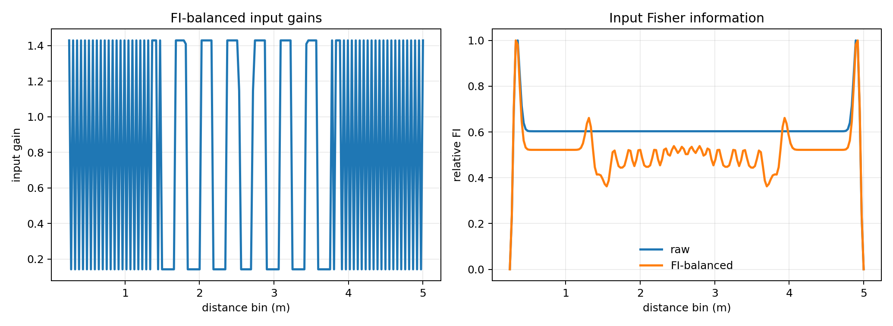
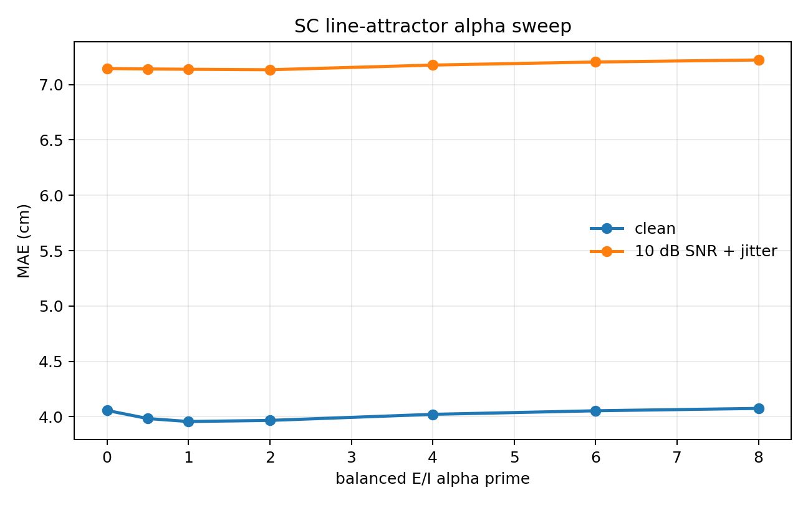
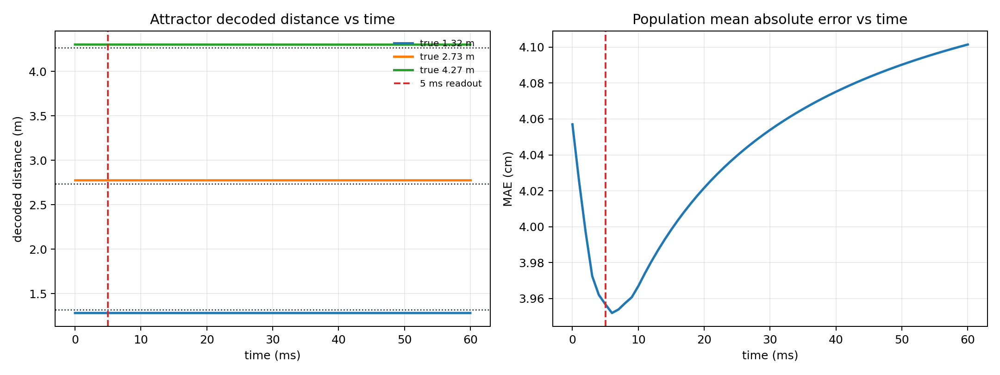
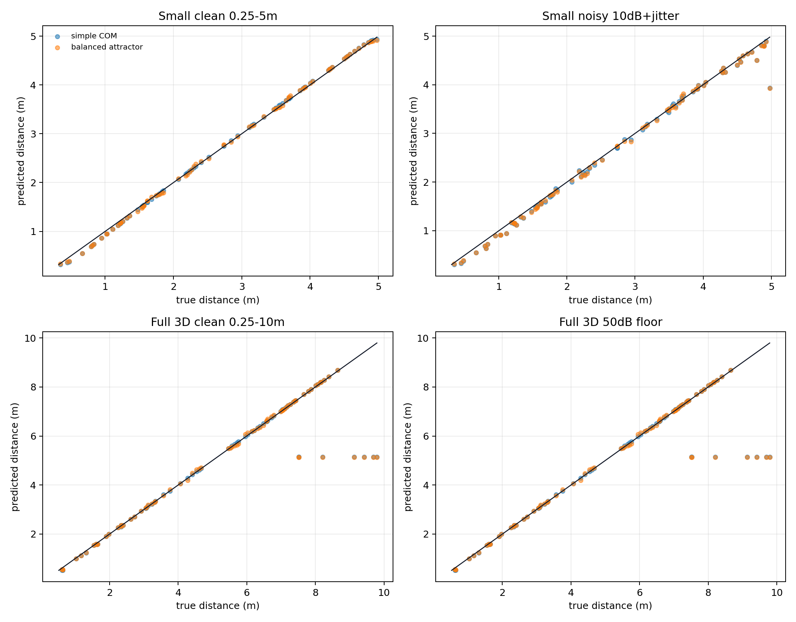

# SC Line Attractor Integration

This report tests a balanced E/I line-attractor readout as an upgraded SC stage. The current full distance pathway is left unchanged up to the AC distance population. The only change is the final readout.

## Experiment Design

The baseline is the existing simple SC centre-of-mass readout:

```text
d_hat = sum_k AC_k d_k / sum_k AC_k
```

The upgraded readout uses a balanced E/I line attractor with the same distance grid as the AC. Therefore, no spatial resampling is needed:

```text
N_SC = N_AC
x_SC,k = d_AC,k
```

The balanced E/I state is:

```text
r = [r_E, r_I]
W_EI = [[ W0, -W0],
        [ W0, -W0]]
tau dr/dt = -r + W_EI r
```

The AC population is injected as a brief impulse into the excitatory population only:

```text
r_E(0) = G_FI * normalise(AC)
r_I(0) = 0
```

The distance is decoded by centre of mass from the excitatory readout. The requested first readout time is `5 ms`, but the timing plot shows how the decoded distance changes over the full `60 ms` simulation.

## Fisher-Balanced Input Weights

The recurrent weights are kept as the reflected line-attractor structure. Input weights are diagonal gains chosen to flatten Fisher information over the distance grid rather than learned from labels.

For reflected tuning curves `h_i(x)`, independent Gaussian noise gives:

```text
J(x) = sum_i (g_i dh_i/dx)^2 / sigma_n^2
```

The gain values are found by solving a constrained least-squares approximation:

```text
D^2 u ~= constant
u_i = g_i^2
mean(u) = 1
```

This keeps the input topographic while reducing boundary-related Fisher information dips.



## Alpha Sweep

The original ring-model notebook showed that increasing recurrent gain can improve readout accuracy. Here the same idea is tested by sweeping the balanced E/I `alpha_prime` parameter while keeping the recurrent structure fixed.



| alpha prime | Clean MAE | Noisy MAE | Selection score | Runtime/sample |
|---:|---:|---:|---:|---:|
| `0.00` | `4.057 cm` | `7.145 cm` | `5.601 cm` | `0.48 ms` |
| `0.50` | `3.984 cm` | `7.141 cm` | `5.562 cm` | `1.62 ms` |
| `1.00` | `3.957 cm` | `7.138 cm` | `5.547 cm` | `1.23 ms` |
| `2.00` | `3.967 cm` | `7.134 cm` | `5.550 cm` | `1.21 ms` |
| `4.00` | `4.022 cm` | `7.176 cm` | `5.599 cm` | `1.51 ms` |
| `6.00` | `4.054 cm` | `7.204 cm` | `5.629 cm` | `0.60 ms` |
| `8.00` | `4.075 cm` | `7.222 cm` | `5.649 cm` | `1.05 ms` |

The selected alpha for the controlled comparisons is `1.00`, chosen by the mean of clean and noisy small-space MAE.

## Input Timing Experiment

The integration uses the readout at `5 ms`. The plot below checks whether that is reasonable by showing representative decoded distances over time and the mean absolute error over time.



## Controlled Comparisons

The comparison uses the same upstream AC activations for both readouts, so any difference is caused by the SC readout only.



| Condition | Subset | N | Baseline MAE | Attractor MAE | Baseline RMSE | Attractor RMSE | Baseline max error | Attractor max error | Attractor runtime/sample |
|---|---|---:|---:|---:|---:|---:|---:|---:|---:|
| Small clean 0.25-5m | all | `80` | `3.571 cm` | `3.957 cm` | `4.364 cm` | `4.664 cm` | `11.710 cm` | `11.350 cm` | `0.98 ms` |
| Small noisy 10dB+jitter | all | `80` | `7.127 cm` | `7.138 cm` | `13.797 cm` | `13.997 cm` | `104.423 cm` | `104.854 cm` | `0.92 ms` |
| Full 3D clean 0.25-10m | <=5m | `33` | `2.831 cm` | `3.706 cm` | `4.167 cm` | `4.780 cm` | `11.500 cm` | `9.780 cm` | `1.80 ms` |
| Full 3D clean 0.25-10m | <=10m | `80` | `34.041 cm` | `35.099 cm` | `110.014 cm` | `110.833 cm` | `464.131 cm` | `466.854 cm` | `1.80 ms` |
| Full 3D 50dB floor | <=5m | `33` | `2.826 cm` | `3.694 cm` | `4.164 cm` | `4.760 cm` | `11.500 cm` | `9.788 cm` | `1.31 ms` |
| Full 3D 50dB floor | <=10m | `80` | `34.040 cm` | `35.099 cm` | `110.014 cm` | `110.833 cm` | `464.131 cm` | `466.854 cm` | `1.31 ms` |

## Interpretation

Result: this first balanced line-attractor SC integration should be treated as diagnostic, not accepted as the primary readout yet. It is mechanically successful and reversible, but the simple centre-of-mass readout still has lower MAE in the main comparisons.

- This is an SC readout ablation only; the cochlea, VCN, DNLL, IC, and AC stages are unchanged.
- Matching the attractor neurons to the AC distance grid keeps the interface simple and reversible.
- The alpha sweep shows the best balanced gain is modest, around `alpha_prime = 1`, rather than increasing indefinitely as in the original ring notebook.
- The attractor slightly reduces some max-error values in the `<=5m` full-space subset, but it increases MAE and RMSE overall.
- The `<=10m` rows show that this SC readout does not solve the upstream long-range/angle-induced failure mode; the AC population is already biased before the SC readout.
- The likely next readout experiment is not simply stronger recurrence, but a better-matched input pulse or a time-varying attractor input that preserves the AC confidence profile.

## Generated Files

- `fisher_input_gains`: `distance_pathway/outputs/sc_line_attractor_integration/figures/fisher_input_gains.png`
- `alpha_sweep`: `distance_pathway/outputs/sc_line_attractor_integration/figures/alpha_sweep.png`
- `readout_timing`: `distance_pathway/outputs/sc_line_attractor_integration/figures/readout_timing.png`
- `prediction_scatter`: `distance_pathway/outputs/sc_line_attractor_integration/figures/prediction_scatter.png`
- `results`: `distance_pathway/outputs/sc_line_attractor_integration/results.json`

Runtime: `18.05 s`.
