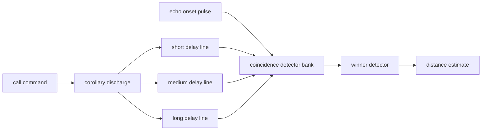
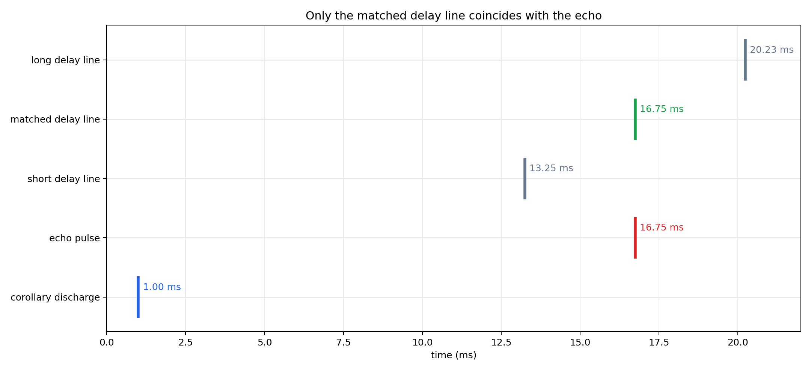
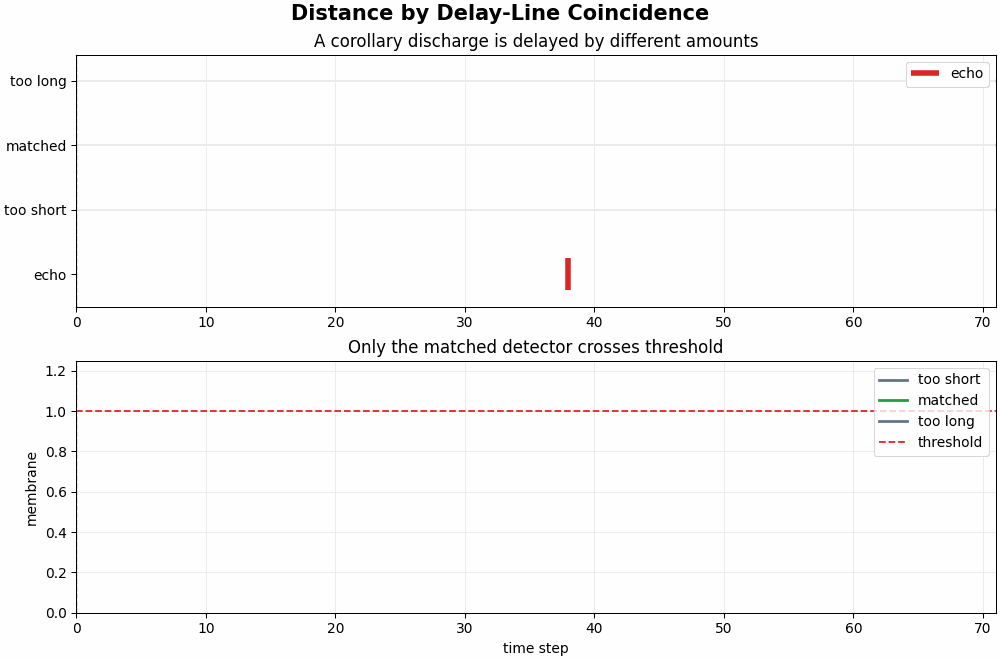
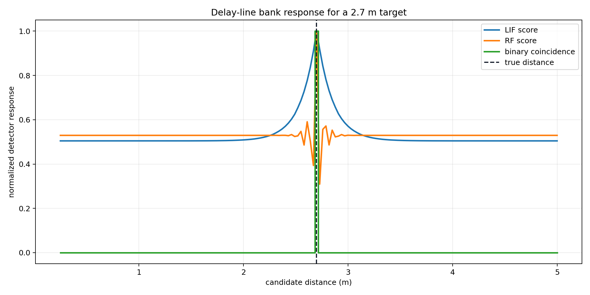

# Distance Pathway 1: Simple Coincidence Model

This report explains the simplest distance pathway possible: a corollary discharge pulse, an echo pulse, and a bank of delay-line coincidence detectors.

## Core Idea

Distance is encoded by echo latency. If a target is distance `d` away, the sound travels to the target and back, so:

```text
tau = 2*d / c
delay_samples = round(tau * f_s)
d = c*tau / 2
```

The system does not need to process the outgoing sound through the cochlea again. It can use an internal corollary discharge, or efference copy, triggered when the call is emitted.

## Architecture



A tuned detector fires when its delayed corollary pulse arrives at the same time as the echo pulse. The winning detector's delay maps directly to a distance.





## Example Detector Bank Response

The plot below shows a single target at `2.7 m`. The matched delay line peaks at the correct distance.



## Parameters Used For The Explanatory Model

| Parameter | Value |
|---|---:|
| sample rate | `64000 Hz` |
| speed of sound | `343.0 m/s` |
| distance range | `0.25 -> 5.0 m` |
| delay lines | `160` |
| time steps | `2010` |

## Biological Interpretation

This is a simplified Jeffress-style delay-line idea applied to echo delay rather than interaural delay. The corollary discharge acts like the internally generated reference for the emitted call, and the echo onset acts like the sensory return pulse.

The detector can be implemented as a LIF neuron: one input arrives from the delayed corollary discharge, one from the echo onset, and the neuron only crosses threshold when both arrive close together.

## Generated Files

- `pulse_timeline`: `distance_pathway/outputs/simple_coincidence_model/figures/pulse_timeline.png`
- `coincidence_animation`: `distance_pathway/outputs/simple_coincidence_model/figures/coincidence_detection.gif`
- `delay_bank_response`: `distance_pathway/outputs/simple_coincidence_model/figures/delay_bank_response.png`

Runtime for full script: `4.87 s`.
