# Elevation Pathway With SC Line Attractor

This report adds a reversible SC-style line-attractor readout to the current elevation pathway. The upstream pathway is unchanged: comb-filter spectral cue, final IIR cochlea, selected-ear DCN signal-weighted full-transfer population. The only tested change is the final readout.

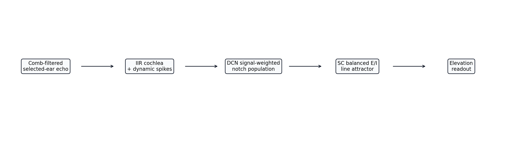

## Controlled Comparison

The comparison is controlled because every readout receives the same DCN elevation population `u`. The baseline readout is the direct centre of mass:

$$
\hat{\theta}_{COM}=\frac{\sum_i \theta_i u_i}{\sum_i u_i+\epsilon}.
$$

The attractor readout uses the same balanced two-block finite-line model developed for the distance pathway:

$$
\tau\dot{x}=-x+Wx,
$$

with initial state set by the DCN population:

$$
x(0)=s\begin{bmatrix}M u\\-\beta M u\end{bmatrix}.
$$

The decoded elevation is then centre of mass over the rectified excitatory half of the attractor at the selected readout time:

$$
\hat{\theta}_{SC}(t)=\frac{\sum_i \theta_i [x_i(t)]_+}{\sum_i [x_i(t)]_+ + \epsilon}.
$$

The selected readout time is `5.0 ms`; the full trajectory is retained to check whether this is a sensible timing choice.

Two input variants are tested:

- `FI diagonal 2-block`: direct topographic DCN-to-SC input.
- `FI reflected Gaussian 2-block`: reflected finite-line Gaussian input that compensates boundary loss.

Both use the same balanced E/I recurrent matrix and the same biophysical rate cap as the distance-pathway attractor.

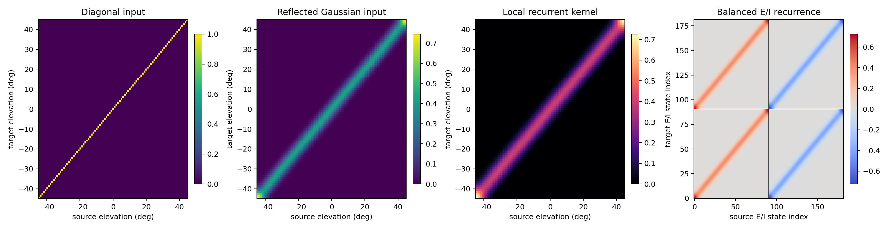

## Isolated Elevation Sweep

The isolated test uses the same monaural fixed-distance, fixed-azimuth elevation sweep as the first elevation report. It is the cleanest test of whether the attractor improves the DCN readout itself.

| Readout | MAE | RMSE | Max error | Bias | runtime/sample |
|---|---:|---:|---:|---:|---:|
| Direct DCN COM | `2.824 deg` | `3.377 deg` | `6.491 deg` | `0.814 deg` | `0.000 ms` |
| FI diagonal 2-block CANN | `2.828 deg` | `3.368 deg` | `6.504 deg` | `0.754 deg` | `0.487 ms` |
| FI reflected Gaussian 2-block CANN | `2.787 deg` | `3.316 deg` | `6.376 deg` | `0.638 deg` | `0.310 ms` |

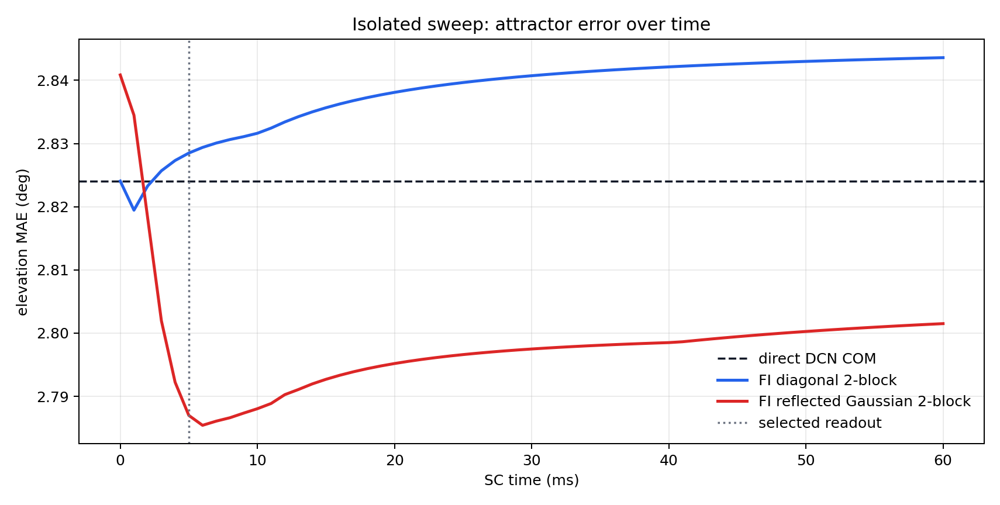

## Full 3D Elevation Test

The full-3D test reuses the clean elevation setup: distance sampled from `0.25 m` to `5.0 m`, azimuth from `-90 deg` to `+90 deg`, elevation from `-45 deg` to `+45 deg`, and the selected ear chosen by azimuth sign. Only elevation error is measured.

| Readout | MAE | RMSE | Max error | Bias | runtime/sample |
|---|---:|---:|---:|---:|---:|
| Direct DCN COM | `3.029 deg` | `3.578 deg` | `6.753 deg` | `0.777 deg` | `0.000 ms` |
| FI diagonal 2-block CANN | `3.053 deg` | `3.592 deg` | `6.736 deg` | `0.660 deg` | `0.153 ms` |
| FI reflected Gaussian 2-block CANN | `3.027 deg` | `3.551 deg` | `6.593 deg` | `0.492 deg` | `0.146 ms` |

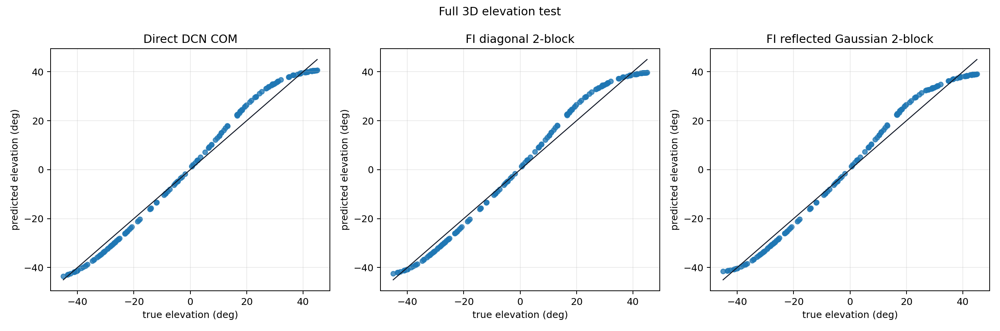

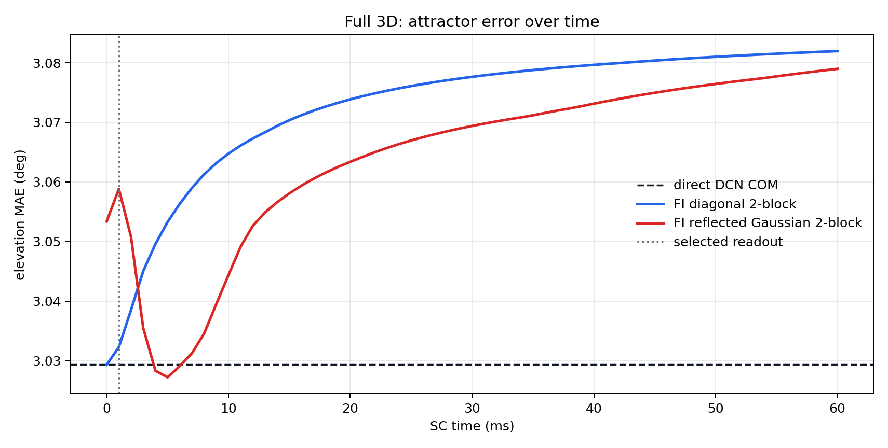

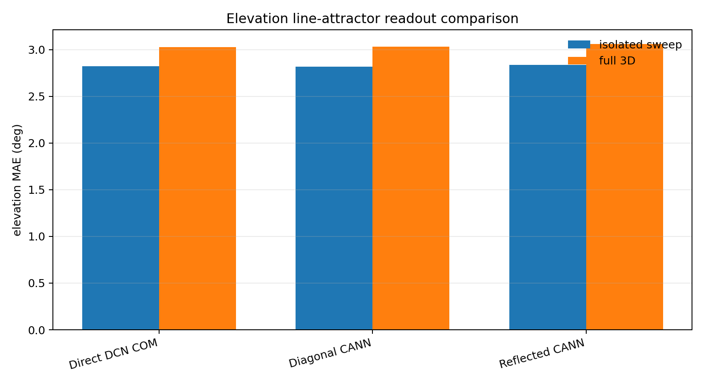

## Inverse-Sigmoid Calibration Readout

The azimuth pathway improved strongly after recognising that the raw ILD balance was a saturating monotonic coordinate. The same idea is tested here as a post-readout elevation calibration. This is not a new DCN mechanism; it is a calibrated synaptic/readout mapping applied after the direct or attractor readout.

The calibration assumes the raw elevation readout has the form:

$$
y = y_0 + L\tanh\left(k\frac{\theta-\theta_0}{L}\right),
$$

so the inverse readout is:

$$
\hat\theta = \theta_0 + \frac{L}{k}\operatorname{atanh}\left(\frac{y-y_0}{L}\right).
$$

The parameters are tuned only on the isolated elevation sweep and then applied unchanged to the full-3D test. This makes the full-3D calibrated result a useful check of whether the calibration captures a genuine readout nonlinearity or merely overfits the isolated sweep.

| Readout | gain `k` | input offset `y0` | output offset `theta0` | isolated calibrated MAE | full-3D calibrated MAE |
|---|---:|---:|---:|---:|---:|
| Direct DCN COM | `1.460` | `0.500 deg` | `-0.750 deg` | `1.382 deg` | `1.310 deg` |
| FI diagonal 2-block CANN | `1.480` | `-1.000 deg` | `-2.250 deg` | `1.244 deg` | `1.215 deg` |
| FI reflected Gaussian 2-block CANN | `1.480` | `-2.000 deg` | `-3.000 deg` | `0.972 deg` | `0.938 deg` |

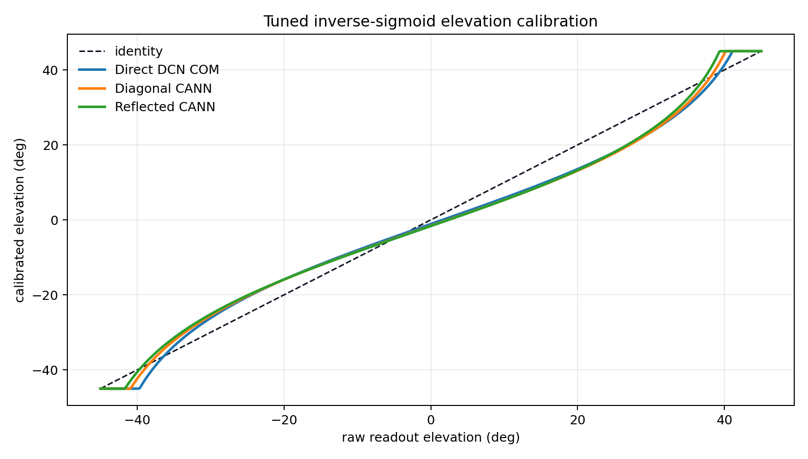

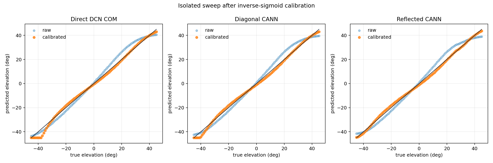

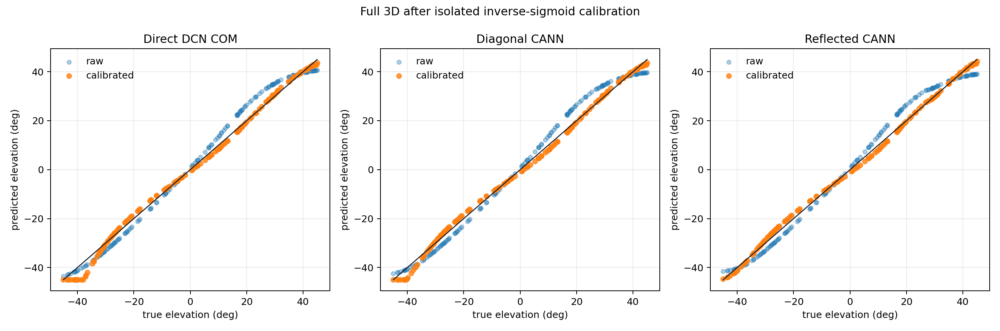

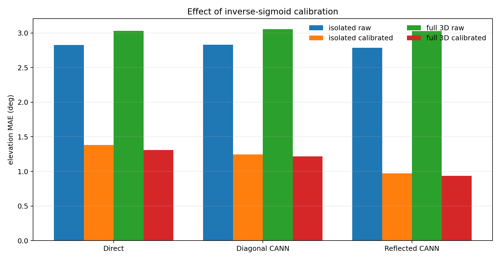

Result: the calibrated reflected-Gaussian attractor is the best tested elevation readout in this report, reducing the full-3D MAE from about `3.03 deg` to about `0.94 deg`. Because the calibration was fitted on the isolated sweep and still improved full 3D, the main remaining error appears to be a stable monotonic readout distortion rather than random scene-specific noise.

The calibrated readout should be interpreted cautiously. If it improves the isolated sweep much more than the full-3D test, then the nonlinearity is not the only source of error; range, azimuth, selected-ear effects, and residual spectral mismatch are also shifting the DCN population.

## Example Attractor Dynamics

The example below shows the unnormalised attractor activity. This is important: the changing bump level is part of the dynamics and should not be hidden by normalising each snapshot independently.

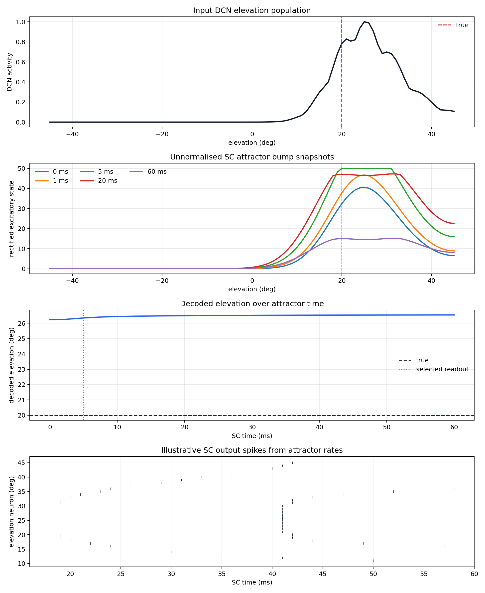

## Interpretation

The line attractor is useful if the DCN population contains a noisy but correctly centred bump. In that case, local recurrence can smooth the bump and the centre-of-mass readout can become more stable. It is less useful if the DCN population is already clean, or if the upstream DCN bump is biased. A recurrent readout cannot recover information that is missing from the input population.

This is therefore a readout ablation, not a replacement for the DCN model. If the attractor improves the result only marginally, that means the signal-weighted DCN template is already doing most of the elevation decoding. If it worsens the result, likely causes are boundary effects, excessive recurrent sharpening, or mismatch between the distance-tuned attractor parameters and the elevation population shape.

The most defensible use of this block is as an optional SC stabiliser for downstream temporal tracking, not as the primary source of elevation selectivity.

## Generated Files

- `pipeline`: `elevation_pathway/outputs/elevation_line_attractor/figures/pipeline.png`
- `attractor_matrices`: `elevation_pathway/outputs/elevation_line_attractor/figures/attractor_matrices.png`
- `isolated_prediction_scatter`: `elevation_pathway/outputs/elevation_line_attractor/figures/isolated_prediction_scatter.png`
- `isolated_error_over_time`: `elevation_pathway/outputs/elevation_line_attractor/figures/isolated_error_over_time.png`
- `full_3d_prediction_scatter`: `elevation_pathway/outputs/elevation_line_attractor/figures/full_3d_prediction_scatter.png`
- `full_3d_error_over_time`: `elevation_pathway/outputs/elevation_line_attractor/figures/full_3d_error_over_time.png`
- `mae_comparison`: `elevation_pathway/outputs/elevation_line_attractor/figures/mae_comparison.png`
- `inverse_sigmoid_mapping`: `elevation_pathway/outputs/elevation_line_attractor/figures/inverse_sigmoid_mapping.png`
- `isolated_calibrated_scatter`: `elevation_pathway/outputs/elevation_line_attractor/figures/isolated_calibrated_scatter.png`
- `full_3d_calibrated_scatter`: `elevation_pathway/outputs/elevation_line_attractor/figures/full_3d_calibrated_scatter.png`
- `calibrated_mae_comparison`: `elevation_pathway/outputs/elevation_line_attractor/figures/calibrated_mae_comparison.png`
- `example_attractor_dynamics`: `elevation_pathway/outputs/elevation_line_attractor/figures/example_attractor_dynamics.png`
- `results`: `elevation_pathway/outputs/elevation_line_attractor/results.json`
- runtime: `7.27 s`
