# Elevation Pathway First Attempt

This report starts a standalone elevation pathway. It does not modify the old trained model. The aim is to test whether a monaural DCN-style disinhibitory notch detector can decode the comb-filter elevation cue from the final cochlea.

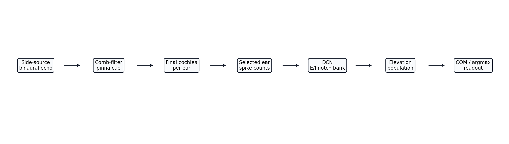

## Acoustic Setup

- Elevation range: `-45 deg` to `+45 deg`.
- Fixed distance: `3.0 m`.
- Fixed azimuth: `45.0 deg`, so the `right` ear is treated as the selected-side ear.
- Cochlea: final distance-pathway IIR cochlea with `48` channels.
- The old built-in Gaussian elevation notch is disabled; the elevation cue is applied by the comb-filter model from signal analysis.

The comb-filter cue is modelled as interference between the direct received signal and a delayed copy:

$$
y(t)=x(t)+a x(t-\tau),
$$

$$
|H(f)|=\frac{\sqrt{1+a^2+2a\cos(2\pi f\tau)}}{1+a}.
$$

The first notch is swept from `6 kHz` at `-45 deg` to `16 kHz` at `+45 deg`:

$$
f_1(\phi)=6000 + (16000-6000)\frac{1+\phi/45}{2},
\qquad
\tau(\phi)=\frac{1}{2f_1(\phi)}.
$$

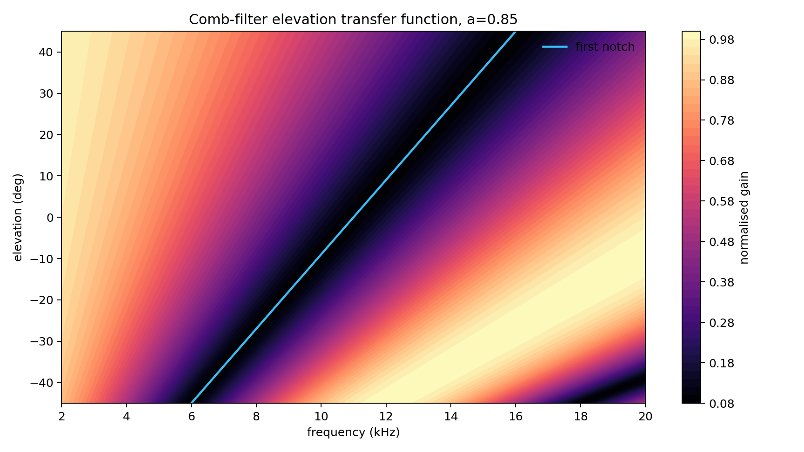

Current comb-filter gain: `a = 0.85`.

## Received Signal PSD

The plot below checks the actual selected-ear received waveform before and after the comb-filter cue is applied. The two PSDs use the same simulated echo, cropped around the active received call, so the difference comes from the spectral notch rather than a different acoustic scene.

The PSD is estimated with a Hann-windowed one-sided FFT:

$$
P(f)=\frac{|\mathcal{F}\{w(t)(x(t)-\bar{x})\}|^2}{\sum_t w(t)^2}.
$$

Both curves are normalised to the same peak power, so attenuation from the comb filter remains visible. The dashed curve is the theoretical comb-filter magnitude in dB.

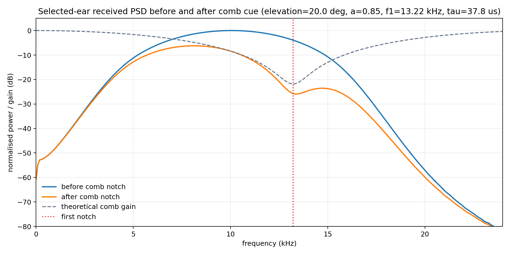

## Comb-Depth And Signal-Weighted Improvements

Two additions are tested without removing the original pathway results.

First, the delayed-copy gain is increased from `a = 0.85` to `a = 0.99`. In the ideal comb filter, the first-notch amplitude is:

$$
|H(f_1)|=\frac{|1-a|}{1+a}.
$$

This makes the spectral notch much deeper, which should make the elevation cue easier for a notch detector to identify.

Second, the matcher weights the transfer-shape error by the expected usefulness of each frequency channel. The no-notch selected-ear spectrum is treated as a baseline signal envelope `P_0(f_c)`, and each candidate elevation defines a signal-and-notch mask:

$$
m_k(f_c)=P_0(f_c)(1-H_k(f_c))^2.
$$

The signal-weighted DCN population is then:

$$
r_k=\exp\left(-\frac{\sum_c m_k(f_c)(\tilde p_c-H_k(f_c))^2}{2\sigma^2}\right).
$$

This matters because the emitted sweep and cochlear front end are not flat across frequency. A notch in a weak part of the spectrum should not contribute as much evidence as a notch inside the high-energy part of the received call.

Deep-comb gain used for the improvement plots: `a = 0.99`.

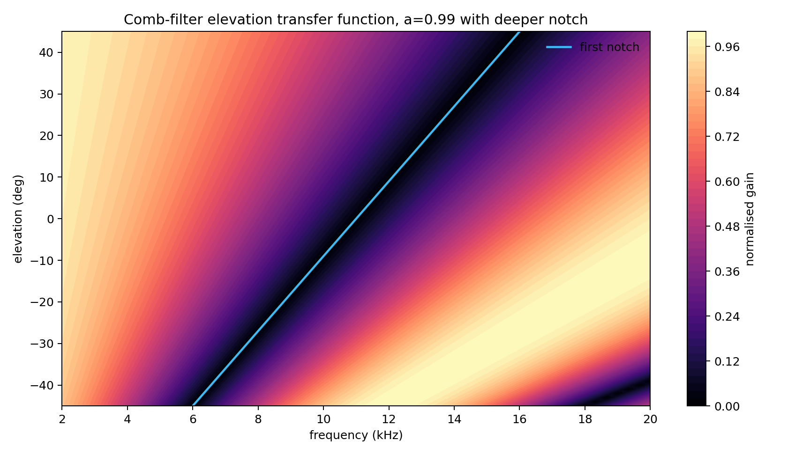

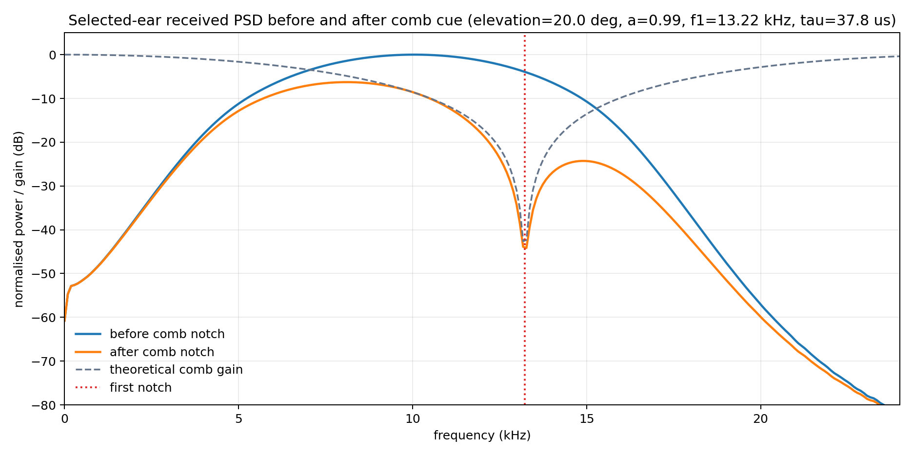

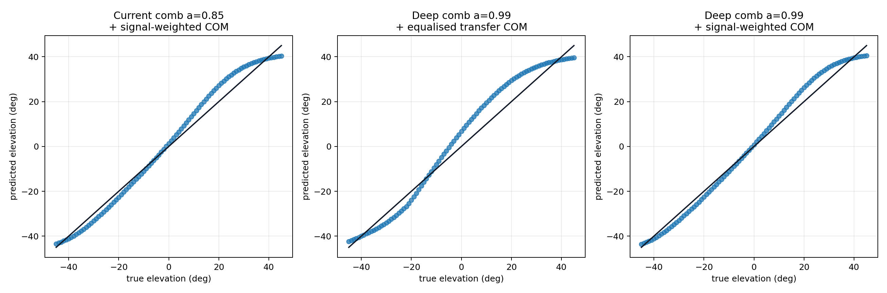

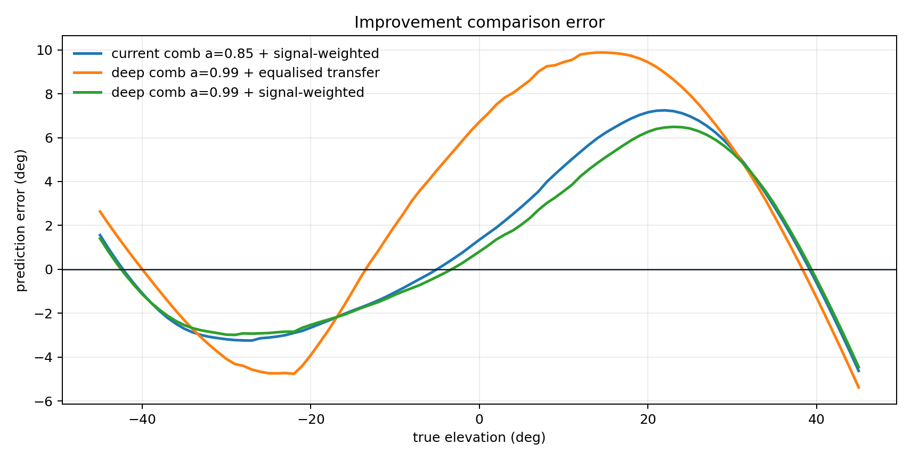

## DCN Disinhibitory Notch Detector

Each DCN output neuron corresponds to one candidate elevation. The candidate's expected comb-filter transfer function defines where inhibition should arrive from cochlear channels. If those channels are quiet because a notch is present, the candidate neuron is disinhibited.

$$
T_{k,c}=\frac{(1-G_k(f_c))^p}{\| (1-G_k)^p \|_2},
$$

$$
d_c=[\operatorname{localmean}(p)_c-p_c]_+,
$$

$$
r_k=[T_k\cdot d - 0.25 T_k\cdot p]_+.
$$

Here `p` is the normalised selected-ear spike-count spectrum, `d` is the observed local spectral dip, and `T_k` is the comb-derived inhibitory template for candidate elevation `k`.

The explicit E/I profile suggested in the design notes is also tested:

$$
w_k(f)=w_E-w_I(1-H_k(f)),
$$

$$
r_k=\left[\frac{1}{N}\sum_c \tilde p_c - \lambda \frac{\sum_c (1-H_k(f_c))\tilde p_c}{\sum_c(1-H_k(f_c))+\epsilon}\right]_+.
$$

The selected inhibition ratio from the sweep is `lambda = 1.100`.

A second DCN variant adds a learned no-comb spectral reference. This is closer to a calibrated E/I transfer-function matcher: the selected-ear cochleagram is divided by a fixed no-comb reference, then compared against the full comb gain for each candidate elevation.

$$
\tilde p_c=\frac{p^{current}_c}{p^{reference}_c},
\qquad
r_k=\exp\left(-\frac{\sum_c(\tilde p_c-G_k(f_c))^2}{2\sigma^2 N}\right).
$$

This still has an E/I interpretation: channels where the candidate transfer predicts high gain provide positive evidence, while candidate notch channels provide suppressive evidence if they remain active.

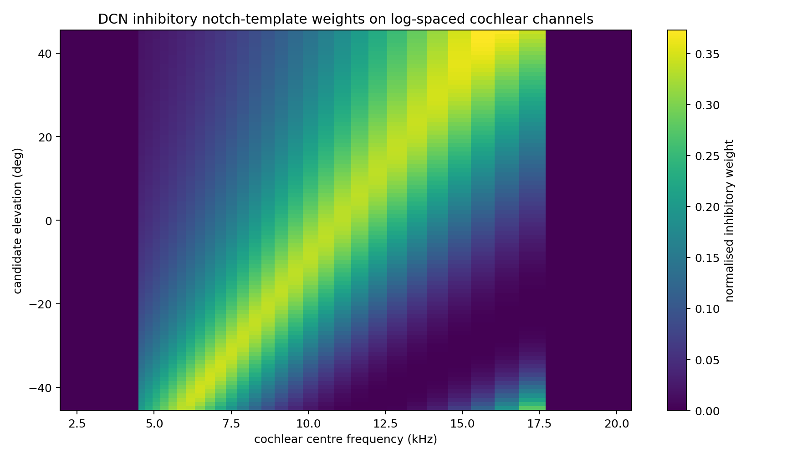

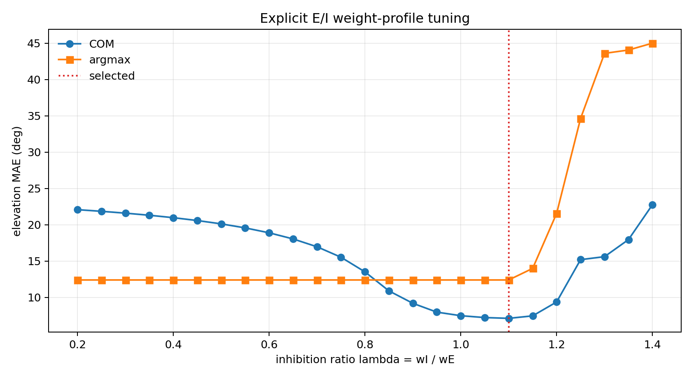

## Example Stages

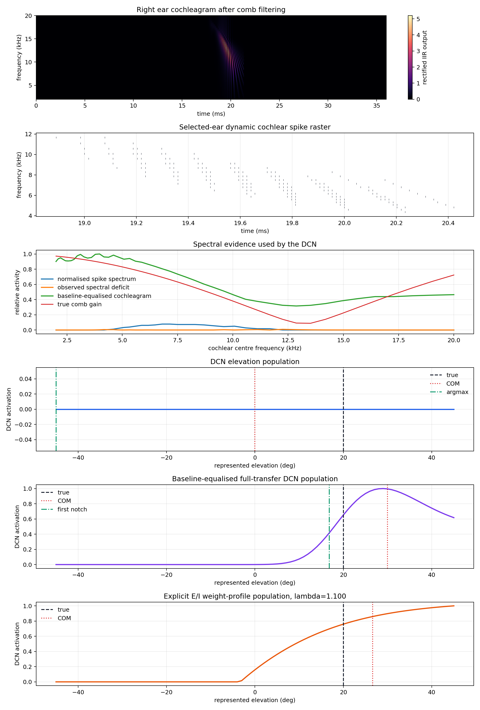

## Accuracy

| Readout | MAE | RMSE | Max error | Bias |
|---|---:|---:|---:|---:|
| Local-dip disinhibition COM | `16.907 deg` | `21.114 deg` | `52.718 deg` | `-9.858 deg` |
| Local-dip disinhibition argmax | `45.176 deg` | `52.257 deg` | `90.000 deg` | `-44.011 deg` |
| Explicit E/I weight-profile COM | `7.099 deg` | `8.828 deg` | `18.090 deg` | `2.299 deg` |
| Explicit E/I weight-profile argmax | `12.385 deg` | `16.943 deg` | `41.000 deg` | `8.780 deg` |
| Baseline-equalised full-transfer DCN COM | `5.181 deg` | `6.182 deg` | `10.830 deg` | `2.913 deg` |
| Baseline-equalised full-transfer DCN argmax | `5.934 deg` | `7.306 deg` | `19.000 deg` | `3.956 deg` |
| Signal-weighted full-transfer DCN COM | `3.137 deg` | `3.777 deg` | `7.244 deg` | `1.070 deg` |
| Signal-weighted full-transfer DCN argmax | `3.549 deg` | `4.640 deg` | `14.000 deg` | `1.747 deg` |
| Deep-comb baseline-equalised full-transfer DCN COM | `4.837 deg` | `5.724 deg` | `9.879 deg` | `2.611 deg` |
| Deep-comb baseline-equalised full-transfer DCN argmax | `5.505 deg` | `6.782 deg` | `18.000 deg` | `3.549 deg` |
| Deep-comb signal-weighted full-transfer DCN COM | `2.824 deg` | `3.377 deg` | `6.491 deg` | `0.814 deg` |
| Deep-comb signal-weighted full-transfer DCN argmax | `3.242 deg` | `4.257 deg` | `13.000 deg` | `1.484 deg` |
| First-notch diagnostic readout | `2.894 deg` | `3.981 deg` | `12.257 deg` | `-2.764 deg` |

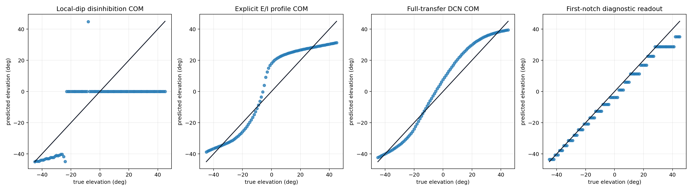

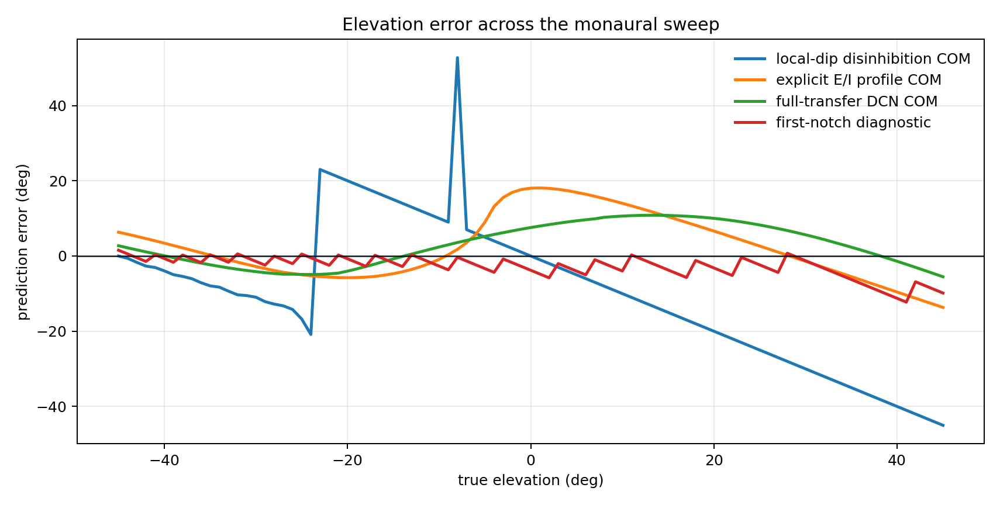

The direct first-notch readout is included as a diagnostic rather than the proposed final neural pathway. It estimates the deepest equalised notch frequency and maps it back through the known comb sweep. It shows how much elevation information is present in the cochlear spectrum before a more biological population readout is tuned.

The explicit E/I profile is the closest implementation of the proposed `excitatory - inhibitory * (1-H)` rule. In this first version it improves substantially over the naive local-dip detector, but remains weaker than the full-transfer matcher. This suggests the rule is directionally useful, but the current implementation still loses information by only penalising expected notch channels rather than also matching the full comb peak/trough shape.

## Old Model Reference

These old values are copied from previous reports and are not rerun here. They are not strict like-for-like comparisons because this report is a monaural, fixed-distance, fixed-azimuth elevation-only test, while the old models were full trained localisation systems on their original small-space setup.

| Old model | Elevation MAE | Notes |
|---|---:|---|
| Round 3 Experiment 2B moving-notch + notch detectors | `1.939 deg` | old trained/fixed-decoder reference |
| Round 3 2B + 3 | `2.526 deg` | old trained/fixed-decoder reference |
| Round 4 combined | `2.780 deg` | old trained/fixed-decoder reference |
| Round 5 trained-once fixed ridge decoder | `2.588 deg` | old trained/fixed-decoder reference |

## Interpretation

This first pathway is intentionally narrow: it tests whether the comb-filter notch position can be converted into a DCN population code before adding IC/SC integration or azimuth-gated ear selection. A good result here means the spectral cue and template wiring are usable; it does not yet prove the full elevation pathway is robust to distance, azimuth, clutter, or noise.

The local-dip disinhibition result is deliberately retained because it shows that a naive spike-count dip detector is not enough for this comb cue. The baseline-equalised transfer matcher works substantially better, which suggests that the DCN stage needs some form of spectral equalisation or learned channel-specific gain control before the E/I notch template is applied.

The biological simplification is that the selected ear is fixed. Later, the azimuth pathway should gate which monaural elevation estimate is trusted, because these pinna/DCN cues are most reliable for sounds known to originate from that side.

## Generated Files

- `pipeline_diagram`: `elevation_pathway/outputs/first_attempt/figures/pipeline_diagram.png`
- `comb_transfer`: `elevation_pathway/outputs/first_attempt/figures/comb_transfer.png`
- `received_psd`: `elevation_pathway/outputs/first_attempt/figures/received_psd_before_after_comb.png`
- `deep_comb_transfer`: `elevation_pathway/outputs/first_attempt/figures/deep_comb_transfer.png`
- `deep_received_psd`: `elevation_pathway/outputs/first_attempt/figures/deep_received_psd_before_after_comb.png`
- `dcn_templates`: `elevation_pathway/outputs/first_attempt/figures/dcn_templates.png`
- `ei_lambda_sweep`: `elevation_pathway/outputs/first_attempt/figures/ei_lambda_sweep.png`
- `example_stages`: `elevation_pathway/outputs/first_attempt/figures/example_stages.png`
- `prediction_scatter`: `elevation_pathway/outputs/first_attempt/figures/prediction_scatter.png`
- `error_curve`: `elevation_pathway/outputs/first_attempt/figures/error_curve.png`
- `improvement_prediction_scatter`: `elevation_pathway/outputs/first_attempt/figures/improvement_prediction_scatter.png`
- `improvement_error_curve`: `elevation_pathway/outputs/first_attempt/figures/improvement_error_curve.png`
- `results`: `elevation_pathway/outputs/first_attempt/results.json`
- runtime: `3.58 s`
