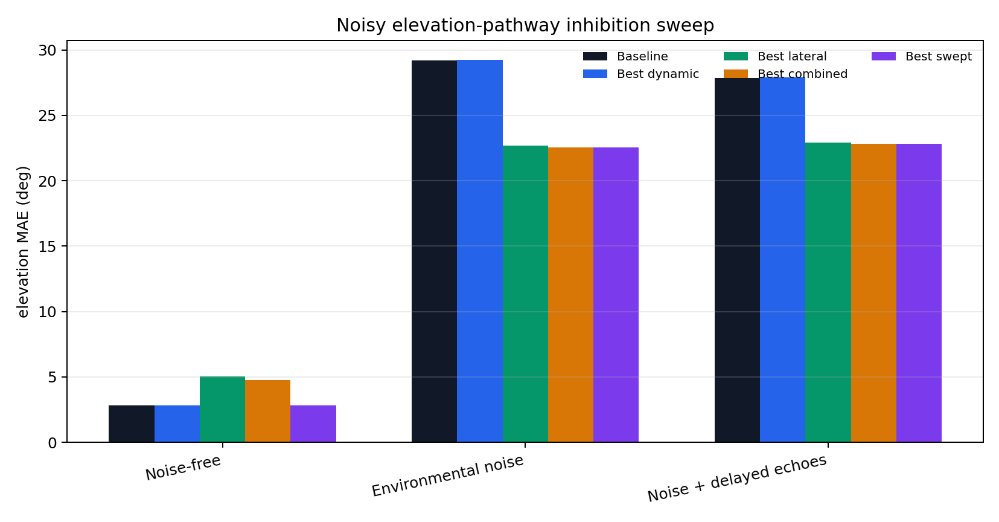
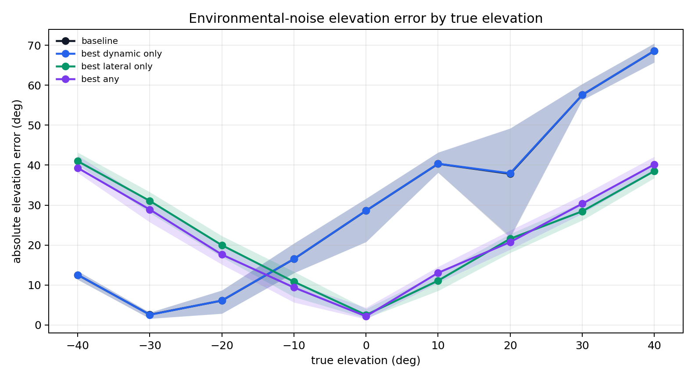
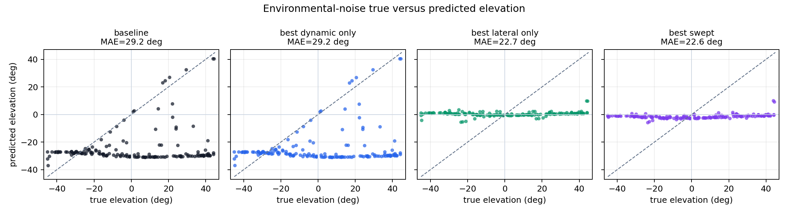

# Noisy inhibition comparison for the elevation pathway

This diagnostic retests the two extra elevation-pathway mechanisms that were not useful in the original clean sweep: global dynamic wideband inhibition before baseline equalisation, and Mexican-hat lateral inhibition over the DCN elevation population. No model is trained here.

The acoustic noise convention matches the final-model environmental-noise tests: white noise is added to the returning signal after propagation/attenuation but before head-shadow and comb-filter elevation cue application. The no-comb spectral reference remains noise-free, which is the same stable reference assumption used by the fixed elevation feature extractor.

- samples: `160` matched random targets
- target range: `0.25--5.0 m`, azimuth `+-45 deg`, elevation `+-45 deg`
- environmental SNR at call: `50.0 dB`
- noise std: `1.38309`

## Summary metrics

| condition | baseline MAE | best dynamic-only | best lateral-only | best combined | best swept |
|---|---:|---:|---:|---:|---:|
| Noise-free | 2.807 | 2.817 | 5.062 | 4.752 | 2.807 |
| Environmental noise | 29.219 | 29.249 | 22.703 | 22.554 | 22.554 |
| Noise + delayed echoes | 27.859 | 27.887 | 22.918 | 22.822 | 22.822 |

## Best parameter settings

### Noise-free
- `best_dynamic_only`: MAE `2.817 deg`, RMSE `3.413 deg`, dynamic gain `0.05`, beta `0.00`, lateral gain `0.00`.
- `best_lateral_only`: MAE `5.062 deg`, RMSE `6.491 deg`, dynamic gain `0.00`, beta `0.00`, lateral gain `0.03`.
- `best_combined`: MAE `4.752 deg`, RMSE `6.189 deg`, dynamic gain `2.00`, beta `0.00`, lateral gain `0.03`.
- `best_any`: MAE `2.807 deg`, RMSE `3.398 deg`, dynamic gain `0.00`, beta `0.00`, lateral gain `0.00`.

### Environmental noise
- `best_dynamic_only`: MAE `29.249 deg`, RMSE `37.702 deg`, dynamic gain `0.05`, beta `0.00`, lateral gain `0.00`.
- `best_lateral_only`: MAE `22.703 deg`, RMSE `26.125 deg`, dynamic gain `0.00`, beta `0.00`, lateral gain `0.10`.
- `best_combined`: MAE `22.554 deg`, RMSE `26.075 deg`, dynamic gain `2.00`, beta `0.85`, lateral gain `0.10`.
- `best_any`: MAE `22.554 deg`, RMSE `26.075 deg`, dynamic gain `2.00`, beta `0.85`, lateral gain `0.10`.

### Noise + delayed echoes
- `best_dynamic_only`: MAE `27.887 deg`, RMSE `36.748 deg`, dynamic gain `0.05`, beta `0.00`, lateral gain `0.00`.
- `best_lateral_only`: MAE `22.918 deg`, RMSE `26.286 deg`, dynamic gain `0.00`, beta `0.00`, lateral gain `0.10`.
- `best_combined`: MAE `22.822 deg`, RMSE `26.280 deg`, dynamic gain `2.00`, beta `0.85`, lateral gain `0.10`.
- `best_any`: MAE `22.822 deg`, RMSE `26.280 deg`, dynamic gain `2.00`, beta `0.85`, lateral gain `0.10`.

## Interpretation

If the best noisy setting still leaves a large MAE, then the dominant failure is not simply a lack of population sharpening. It means the spectral cue reaching the elevation template bank has already been corrupted enough that inhibition mostly sharpens or rescales the wrong evidence. In that case the residual trainable readout is justified as a correction/fusion stage rather than as a replacement for a missing hand-tuned inhibition parameter.

- results JSON: `elevation_pathway/outputs/noisy_inhibition_comparison/results.json`
