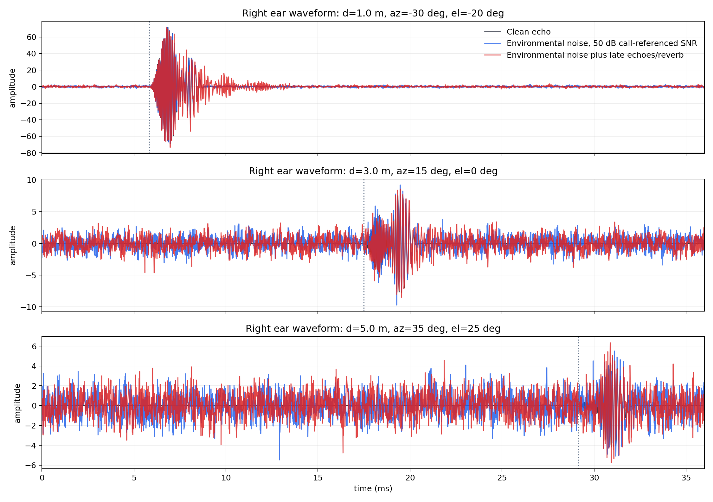

# Final Model Environmental Noise Diagnostics

This report tests a different noise convention from the previous receiver-noise runs. Here noise is inserted into the returning acoustic signal after propagation delay and inverse-square attenuation, but before the direction-dependent head-shadow and comb-filter stages.

## Acoustic Definition

The clean returned signal is first delayed and attenuated:

$$
x_{att}(t)=\frac{0.7}{L^2}x(t-L/c).
$$

Environmental noise is then added as:

$$
x_{env}(t)=x_{att}(t)+\eta(t),\quad \eta(t)\sim\mathcal{N}(0,\sigma_n^2).
$$

The noise standard deviation is call-referenced, not echo-referenced:

$$
\sigma_n=\frac{\mathrm{RMS}(x_{call})}{10^{\mathrm{SNR}_{call}/20}}.
$$

For this diagnostic, `SNR_call = 50.0 dB`, giving `noise_std = 1.38309`. This is a fixed environmental floor, so far echoes naturally have lower effective SNR than near echoes.

The reverberant condition adds delayed echo copies before the head-shadow and comb-filter stages:

$$
x_{rev}(t)=x_{att}(t)+\sum_i g_i x_{att}(t-\Delta_i).
$$

Reverb delays are `(0.85, 1.75, 3.2, 5.1)` ms with gains `(0.34, 0.22, 0.13, 0.07)`.

## Waveform Examples

## Low-Sample Fixed-Model Smoke Test

This smoke test uses `8` random targets in the constrained `0.25-5 m`, `+/-45 deg` azimuth/elevation space. It compares direct feed-forward population COM readouts against the fixed CANN readouts. No trainable SNN is used.

| Condition | Readout | Distance MAE | Azimuth MAE | Elevation MAE | Euclidean MAE | Combined error | Runtime/sample |
|---|---|---:|---:|---:|---:|---:|---:|
| Clean echo | Direct COM, no CANN | `0.0622 m` | `15.219 deg` | `2.798 deg` | `1.0755 m` | `0.1376` | `527.7 ms` |
| Clean echo | Fixed CANN | `0.0610 m` | `15.522 deg` | `1.232 deg` | `1.0420 m` | `0.1282` | `527.7 ms` |
| Environmental noise, 50 dB call-referenced SNR | Direct COM, no CANN | `0.0610 m` | `16.727 deg` | `33.750 deg` | `2.2721 m` | `0.3780` | `884.0 ms` |
| Environmental noise, 50 dB call-referenced SNR | Fixed CANN | `0.0600 m` | `17.019 deg` | `27.886 deg` | `2.0354 m` | `0.3366` | `884.0 ms` |
| Environmental noise plus late echoes/reverb | Direct COM, no CANN | `0.0635 m` | `12.468 deg` | `33.705 deg` | `2.1608 m` | `0.3463` | `719.6 ms` |
| Environmental noise plus late echoes/reverb | Fixed CANN | `0.0625 m` | `12.940 deg` | `27.842 deg` | `1.9114 m` | `0.3063` | `719.6 ms` |

## Interpretation

- This is intentionally a smoke test, not a statistically stable benchmark.
- Environmental noise is harsher than the previous low ambient receiver-noise case because its amplitude is set relative to the emitted call and then held fixed after echo attenuation.
- Reverb tests a different failure mode: later echoes can create extra onset/coincidence evidence at incorrect delays and can distort the spectral profile used by elevation.
- If the reverb condition degrades strongly, the likely next fixes are stronger DNLL-style late suppression, echo-window gating, and multi-hypothesis tracking rather than only changing the final readout.

## Generated Files

- `waveform_examples`: `final_model/outputs/environment_noise_diagnostics/figures/waveform_examples.png`
- `results`: `final_model/outputs/environment_noise_diagnostics/results.json`