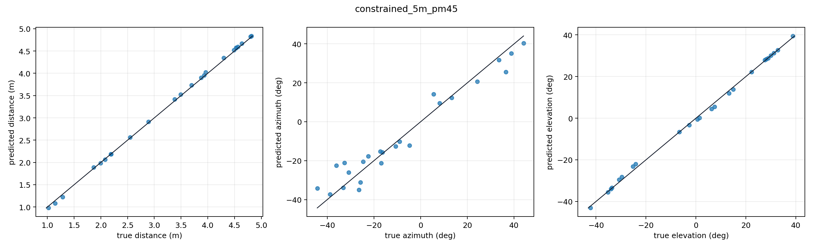
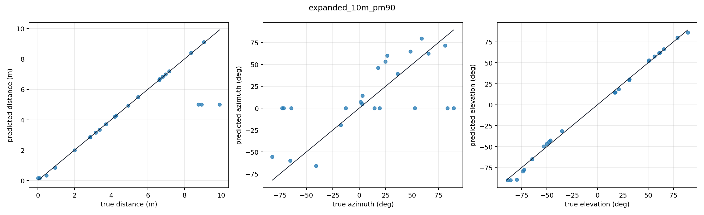
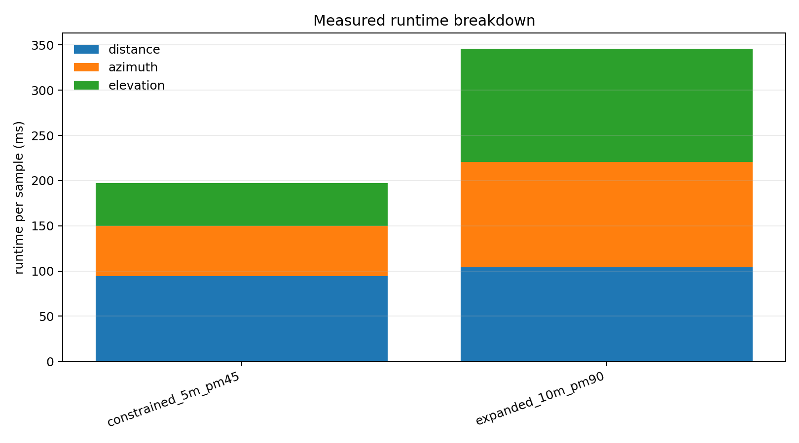
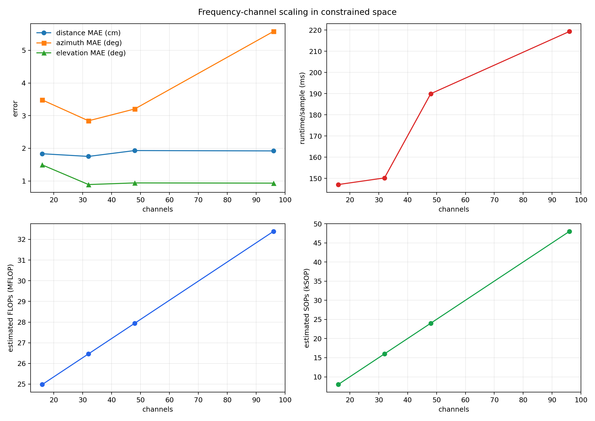
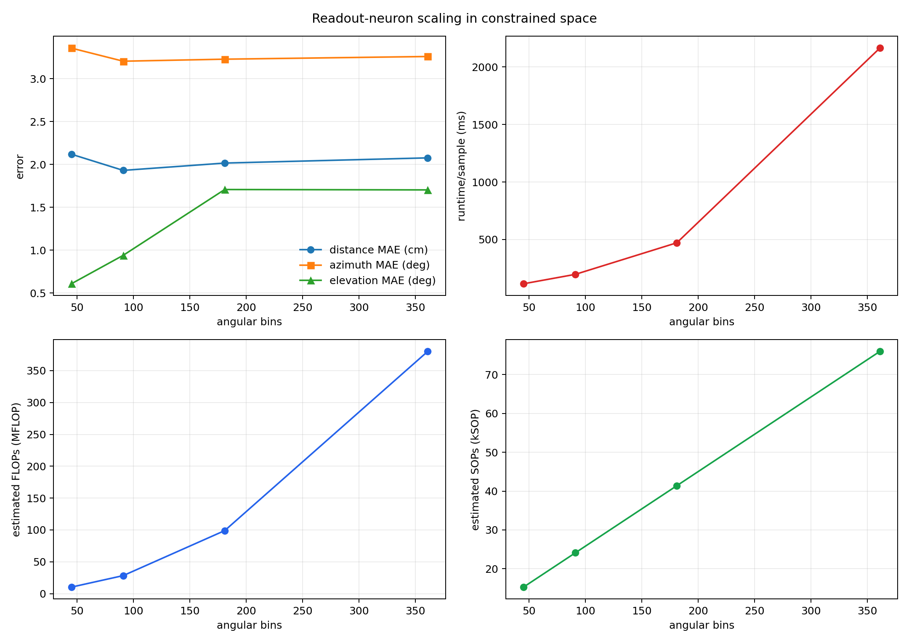

# Final Integrated Model Results

This report combines the three independently developed pathways into one final 3D localisation wrapper. Each target is passed through the distance, azimuth, and elevation pathways, and the three coordinate predictions are interpreted as a single spherical coordinate estimate.

## Final Pathway Choices

- Distance: dynamic cochlear spikes, VCN consensus, DNLL suppression, IC coincidence with facilitation, AC Mexican-hat map, reflected FI two-block SC line attractor.
- Azimuth: binaural cochlea, VCN onset detection, Jeffress-style ITD population, reflected FI two-block SC line attractor.
- Elevation: comb-filter spectral cue, selected-ear DCN signal-weighted full-transfer population, reflected FI two-block SC line attractor at 5 ms, inverse-sigmoid elevation calibration.

## Main Full 3D Tests

| Condition | Samples | Distance MAE | Azimuth MAE | Elevation MAE | Euclidean MAE | Combined norm. error | Runtime/sample |
|---|---:|---:|---:|---:|---:|---:|---:|
| Constrained: 0.25-5 m, +/-45 deg | `24` | `0.0310 m` | `4.896 deg` | `0.810 deg` | `0.2394 m` | `0.0443` | `197.14 ms` |
| Expanded: 0-10 m, +/-90 deg | `24` | `0.5556 m` | `29.240 deg` | `2.770 deg` | `1.7755 m` | `0.1371` | `345.89 ms` |

The Euclidean error is computed after converting true and predicted spherical coordinates to Cartesian coordinates:

$$
x=r\cos e\cos a,\quad y=r\cos e\sin a,\quad z=r\sin e.
$$

## Comparison With Old Models

These old values are copied from previous experiment summaries. They are not strict like-for-like comparisons because the new system is modular and separately calibrated, while the old systems used trained combined readouts on their original test setup.

| Model | Combined | Distance MAE | Azimuth MAE | Elevation MAE | Euclidean |
|---|---:|---:|---:|---:|---:|
| Round 3 2B + 3 | `0.0394` | `0.0646 m` | `2.860 deg` | `2.526 deg` | `0.2043 m` |
| Round 4 combined | `0.0435` | `0.0786 m` | `2.832 deg` | `2.780 deg` | `0.2264 m` |
| Round 5 fixed ridge | `0.0387` | `0.0438 m` | `3.108 deg` | `2.588 deg` | `0.2069 m` |
| New integrated constrained model | `0.0443` | `0.0310 m` | `4.896 deg` | `0.810 deg` | `0.2394 m` |

## Frequency-Channel Scaling

This sweep uses `8` constrained-space samples. The model is recalibrated for each channel count. Measured runtime is reported alongside analytical FLOP/SOP estimates.

| Channels | Distance MAE | Azimuth MAE | Elevation MAE | Euclidean MAE | Runtime/sample | Est. FLOPs | Est. SOPs |
|---:|---:|---:|---:|---:|---:|---:|---:|
| `16` | `0.0183 m` | `3.481 deg` | `1.491 deg` | `0.1721 m` | `147.10 ms` | `24.98 MFLOP` | `8.00 kSOP` |
| `32` | `0.0175 m` | `2.842 deg` | `0.889 deg` | `0.1204 m` | `150.23 ms` | `26.46 MFLOP` | `16.01 kSOP` |
| `48` | `0.0193 m` | `3.205 deg` | `0.939 deg` | `0.1312 m` | `189.98 ms` | `27.95 MFLOP` | `24.01 kSOP` |
| `96` | `0.0192 m` | `5.580 deg` | `0.932 deg` | `0.2456 m` | `219.38 ms` | `32.39 MFLOP` | `48.02 kSOP` |

The leading-order FLOP estimate is:

$$
F \approx 3CT(9+4) + 8CD + 6CA + 8CE + 2S[(2D)^2+(2A)^2+(2E)^2],
$$

where `C` is cochlear channels, `T` is samples, `D/A/E` are distance, azimuth, and elevation readout bins, and `S` is the number of CANN integration steps. The first term is three separate pathway cochleae, each with IIR and LIF work.

The SOP estimate is:

$$
Q \approx \rho CT + CD + CA + CE,
$$

where `rho` is an assumed cochlear spike density of `0.06`. This is an event-operation proxy rather than a hardware profiler count.

## Readout-Neuron Scaling

This sweep also uses `8` constrained-space samples. Angular readout bins are swept directly; distance bins are set to roughly twice the angular bin count because the distance pathway covers a metric line with finer useful resolution.

| Angular readout bins | Distance bins | Distance MAE | Azimuth MAE | Elevation MAE | Euclidean MAE | Runtime/sample | Est. FLOPs | Est. SOPs |
|---:|---:|---:|---:|---:|---:|---:|---:|---:|
| `45` | `90` | `0.0212 m` | `3.358 deg` | `0.607 deg` | `0.1376 m` | `115.10 ms` | `10.21 MFLOP` | `15.28 kSOP` |
| `91` | `182` | `0.0193 m` | `3.205 deg` | `0.939 deg` | `0.1312 m` | `197.13 ms` | `28.29 MFLOP` | `24.11 kSOP` |
| `181` | `362` | `0.0202 m` | `3.228 deg` | `1.707 deg` | `0.1639 m` | `471.55 ms` | `98.93 MFLOP` | `41.39 kSOP` |
| `361` | `722` | `0.0208 m` | `3.260 deg` | `1.703 deg` | `0.1657 m` | `2164.00 ms` | `380.16 MFLOP` | `75.95 kSOP` |

## Interpretation

The integrated model is a first full-system assembly. It deliberately runs the three pathways separately, so the cochlea is recomputed once per pathway. This makes the runtime conservative and keeps pathway timings easy to interpret. A production version should share the binaural cochlea output and pass common spike rasters into all pathways.

The constrained-space result is the meaningful tuned operating point. The expanded-space result is a stress test. It includes distances near zero, distances out to 10 m, and angular supports beyond the range for which the azimuth and elevation readouts were originally developed.

The expanded test is labelled `0-10 m` because it targets the zero-range edge case. In the actual simulation, exact zero is replaced by a `0.02 m` safety floor to avoid a singular acoustic path length and inverse-square attenuation term. This should be interpreted as a near-zero stress test, not a physically meaningful target at exactly the ear origin.

## Generated Files

- `constrained_predictions`: `final_model/outputs/final_model_results/figures/constrained_predictions.png`
- `expanded_predictions`: `final_model/outputs/final_model_results/figures/expanded_predictions.png`
- `runtime_breakdown`: `final_model/outputs/final_model_results/figures/runtime_breakdown.png`
- `channel_scaling`: `final_model/outputs/final_model_results/figures/channel_scaling.png`
- `readout_scaling`: `final_model/outputs/final_model_results/figures/readout_scaling.png`
- `results`: `final_model/outputs/final_model_results/results.json`