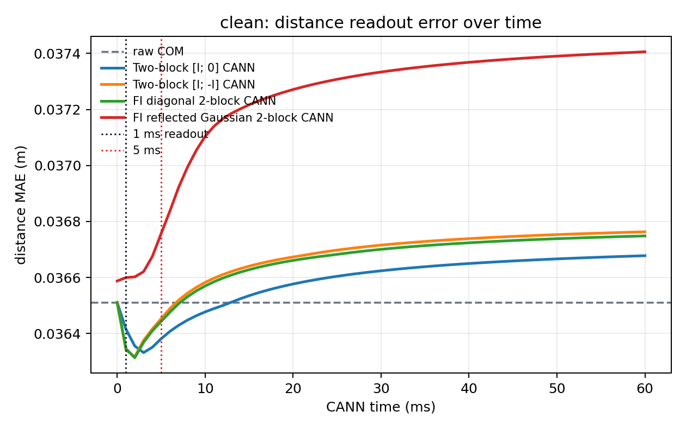
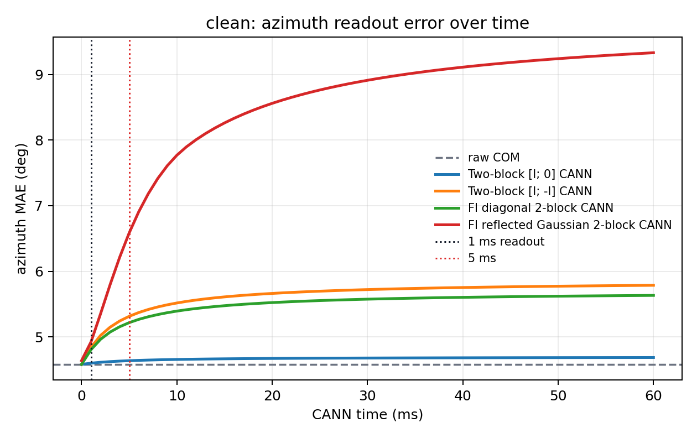
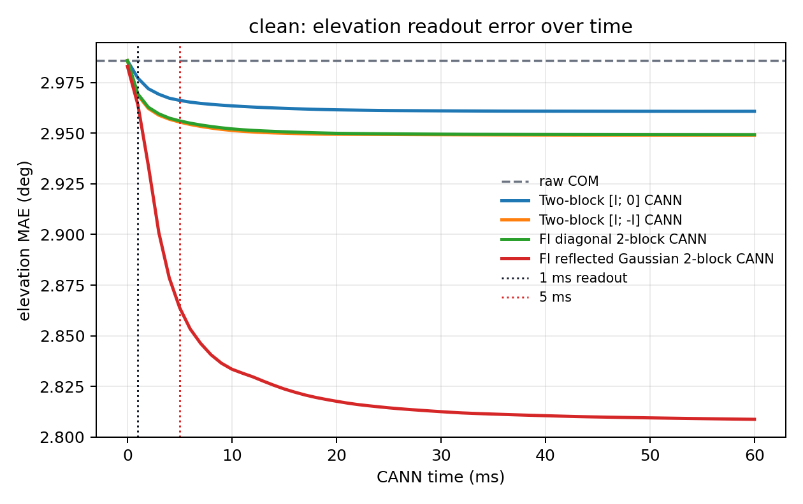
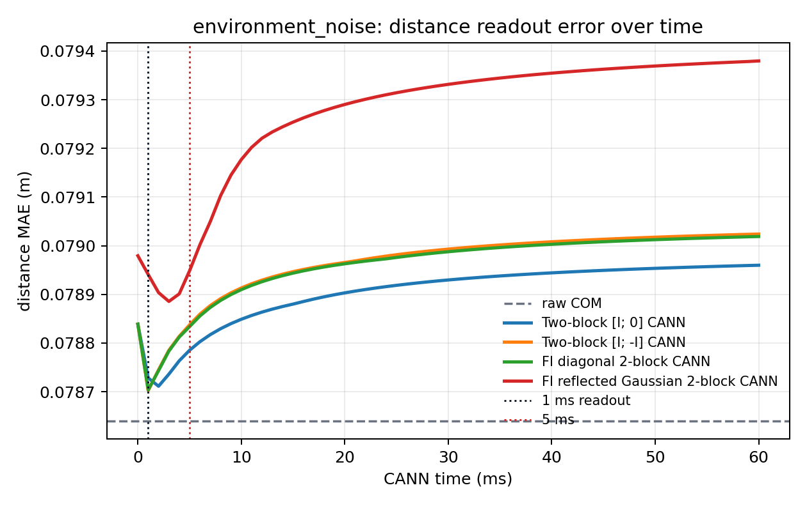
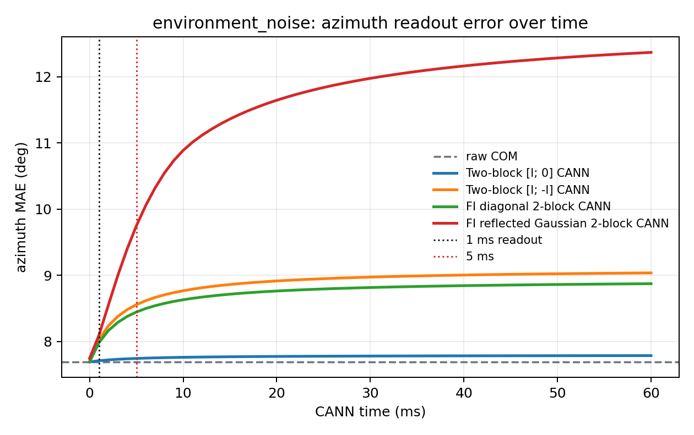
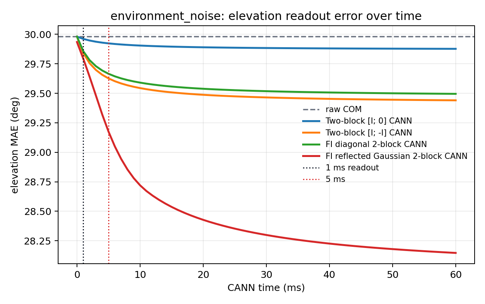
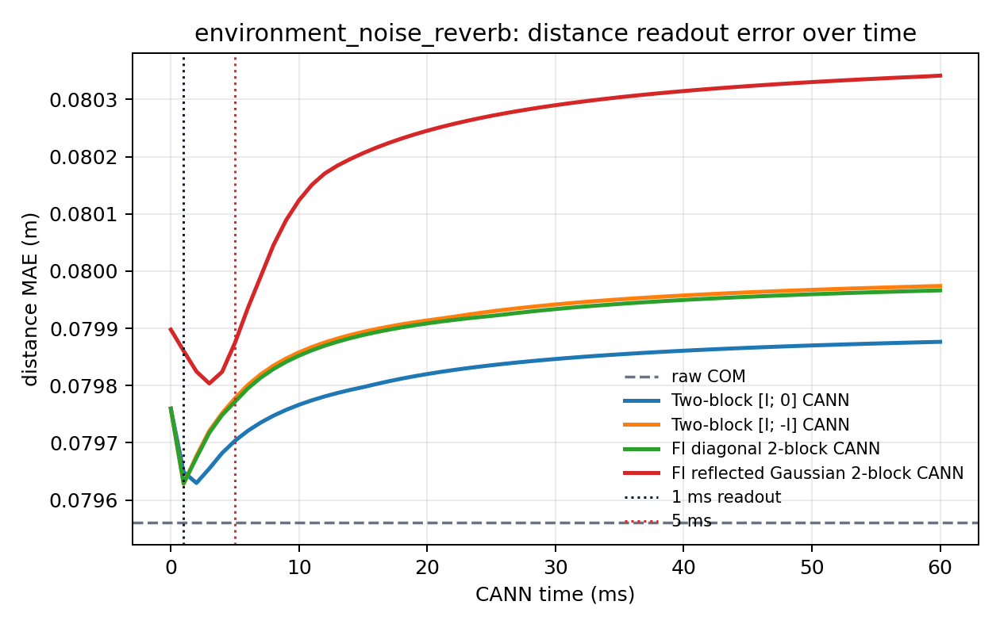
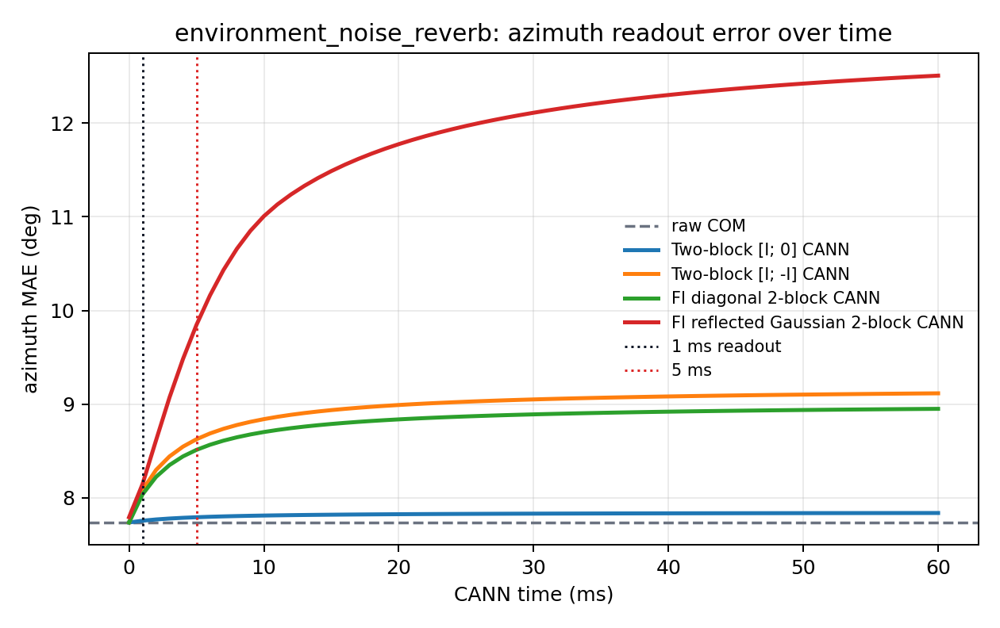
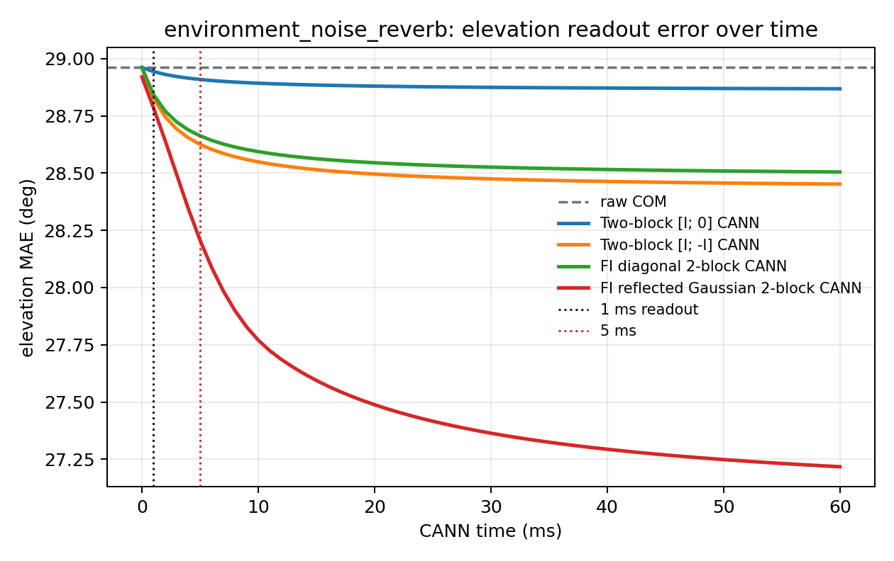

# Other CANN Tests

This report tests whether the FI reflected Gaussian CANN input is worthwhile compared with simpler diagonal CANN inputs. The expensive acoustic and pathway stages are not rerun. Instead, the test reuses cached raw pathway populations from the final trainable-readout caches and applies alternative SC/CANN readouts to the distance, azimuth ITD, and elevation populations.

## Tested Readouts

- `Raw population COM`: direct centre of mass of the cached pathway population.
- `Two-block [I; 0] CANN`: two-population line attractor with diagonal excitatory input and no explicit inhibitory input (`beta=0`).
- `Two-block [I; -I] CANN`: balanced E/I line attractor with diagonal opponent input and fixed `beta=1`.
- `FI diagonal 2-block CANN`: balanced E/I diagonal input with analytic beta `0.886`.
- `FI reflected Gaussian 2-block CANN`: implemented final CANN input with reflected Gaussian `M`, width `3` bins, and analytic beta `0.897`.

All CANN variants use the same recurrent width, gain, rate cap, simulation time, and centre-of-mass readout. The reported CANN scalar metrics use the existing `1 ms` readout time. The error-over-time figures show whether another readout time would change the conclusion.

## clean

Test samples: `400`.

### Distance

| Readout | MAE (m) | RMSE (m) | Bias (m) | Max abs error (m) | runtime/sample (ms) |
|---|---:|---:|---:|---:|---:|
| Raw population COM | `0.0365` | `0.0453` | `0.0087` | `0.1304` | `0.0000` |
| Two-block [I; 0] CANN | `0.0364` | `0.0451` | `0.0088` | `0.1290` | `8.3819` |
| Two-block [I; -I] CANN | `0.0363` | `0.0450` | `0.0090` | `0.1278` | `0.9836` |
| FI diagonal 2-block CANN | `0.0363` | `0.0450` | `0.0089` | `0.1280` | `0.9991` |
| FI reflected Gaussian 2-block CANN | `0.0366` | `0.0451` | `0.0093` | `0.1242` | `0.7289` |

### Azimuth

| Readout | MAE (deg) | RMSE (deg) | Bias (deg) | Max abs error (deg) | runtime/sample (ms) |
|---|---:|---:|---:|---:|---:|
| Raw population COM | `4.5805` | `8.1530` | `0.0088` | `44.5703` | `0.0000` |
| Two-block [I; 0] CANN | `4.5996` | `8.1678` | `0.0096` | `44.5703` | `0.2651` |
| Two-block [I; -I] CANN | `4.8418` | `8.3299` | `0.0178` | `44.5703` | `0.4719` |
| FI diagonal 2-block CANN | `4.8062` | `8.3072` | `0.0170` | `44.5703` | `0.3438` |
| FI reflected Gaussian 2-block CANN | `4.9249` | `8.4035` | `0.0155` | `44.5703` | `0.2723` |

### Elevation

| Readout | MAE (deg) | RMSE (deg) | Bias (deg) | Max abs error (deg) | runtime/sample (ms) |
|---|---:|---:|---:|---:|---:|
| Raw population COM | `2.9858` | `3.5742` | `1.0591` | `6.7427` | `0.0000` |
| Two-block [I; 0] CANN | `2.9772` | `3.5583` | `1.0462` | `6.7147` | `0.2361` |
| Two-block [I; -I] CANN | `2.9687` | `3.5473` | `1.0240` | `6.7172` | `0.3842` |
| FI diagonal 2-block CANN | `2.9694` | `3.5482` | `1.0267` | `6.7173` | `0.2262` |
| FI reflected Gaussian 2-block CANN | `2.9640` | `3.5150` | `0.9782` | `6.5829` | `0.4264` |

## environment_noise

Test samples: `400`.

### Distance

| Readout | MAE (m) | RMSE (m) | Bias (m) | Max abs error (m) | runtime/sample (ms) |
|---|---:|---:|---:|---:|---:|
| Raw population COM | `0.0786` | `0.2682` | `-0.0003` | `2.3423` | `0.0000` |
| Two-block [I; 0] CANN | `0.0787` | `0.2697` | `-0.0004` | `2.3556` | `0.9503` |
| Two-block [I; -I] CANN | `0.0787` | `0.2697` | `-0.0002` | `2.3556` | `0.8777` |
| FI diagonal 2-block CANN | `0.0787` | `0.2697` | `-0.0002` | `2.3556` | `1.2448` |
| FI reflected Gaussian 2-block CANN | `0.0789` | `0.2697` | `0.0001` | `2.3556` | `0.5276` |

### Azimuth

| Readout | MAE (deg) | RMSE (deg) | Bias (deg) | Max abs error (deg) | runtime/sample (ms) |
|---|---:|---:|---:|---:|---:|
| Raw population COM | `7.6915` | `12.1525` | `0.5540` | `44.5703` | `0.0000` |
| Two-block [I; 0] CANN | `7.7093` | `12.1629` | `0.5524` | `44.5703` | `0.2993` |
| Two-block [I; -I] CANN | `8.0261` | `12.3404` | `0.5697` | `44.5703` | `0.2767` |
| FI diagonal 2-block CANN | `7.9809` | `12.3153` | `0.5675` | `44.5703` | `0.5506` |
| FI reflected Gaussian 2-block CANN | `8.0936` | `12.3955` | `0.5648` | `44.5703` | `0.4535` |

### Elevation

| Readout | MAE (deg) | RMSE (deg) | Bias (deg) | Max abs error (deg) | runtime/sample (ms) |
|---|---:|---:|---:|---:|---:|
| Raw population COM | `29.9804` | `37.9612` | `-26.9696` | `74.8117` | `0.0000` |
| Two-block [I; 0] CANN | `29.9610` | `37.9378` | `-26.9407` | `74.7831` | `0.3823` |
| Two-block [I; -I] CANN | `29.8398` | `37.7919` | `-26.7618` | `74.6247` | `0.4579` |
| FI diagonal 2-block CANN | `29.8565` | `37.8128` | `-26.7873` | `74.6472` | `0.2507` |
| FI reflected Gaussian 2-block CANN | `29.7932` | `37.7291` | `-26.6830` | `74.5258` | `0.4227` |

## environment_noise_reverb

Test samples: `400`.

### Distance

| Readout | MAE (m) | RMSE (m) | Bias (m) | Max abs error (m) | runtime/sample (ms) |
|---|---:|---:|---:|---:|---:|
| Raw population COM | `0.0796` | `0.2684` | `0.0005` | `2.3423` | `0.0000` |
| Two-block [I; 0] CANN | `0.0796` | `0.2699` | `0.0004` | `2.3556` | `0.9924` |
| Two-block [I; -I] CANN | `0.0796` | `0.2699` | `0.0006` | `2.3556` | `0.9825` |
| FI diagonal 2-block CANN | `0.0796` | `0.2699` | `0.0006` | `2.3556` | `0.8144` |
| FI reflected Gaussian 2-block CANN | `0.0799` | `0.2699` | `0.0009` | `2.3556` | `0.9850` |

### Azimuth

| Readout | MAE (deg) | RMSE (deg) | Bias (deg) | Max abs error (deg) | runtime/sample (ms) |
|---|---:|---:|---:|---:|---:|
| Raw population COM | `7.7365` | `12.1747` | `0.5152` | `44.5703` | `0.0000` |
| Two-block [I; 0] CANN | `7.7555` | `12.1865` | `0.5132` | `44.5703` | `0.3938` |
| Two-block [I; -I] CANN | `8.0833` | `12.3708` | `0.5376` | `44.5703` | `0.3945` |
| FI diagonal 2-block CANN | `8.0367` | `12.3449` | `0.5343` | `44.5703` | `0.7453` |
| FI reflected Gaussian 2-block CANN | `8.1472` | `12.4265` | `0.5312` | `44.5703` | `0.6042` |

### Elevation

| Readout | MAE (deg) | RMSE (deg) | Bias (deg) | Max abs error (deg) | runtime/sample (ms) |
|---|---:|---:|---:|---:|---:|
| Raw population COM | `28.9615` | `37.2584` | `-26.0769` | `74.7671` | `0.0000` |
| Two-block [I; 0] CANN | `28.9439` | `37.2360` | `-26.0494` | `74.7392` | `0.2712` |
| Two-block [I; -I] CANN | `28.8272` | `37.0902` | `-25.8809` | `74.5778` | `1.0104` |
| FI diagonal 2-block CANN | `28.8435` | `37.1111` | `-25.9048` | `74.6009` | `0.3641` |
| FI reflected Gaussian 2-block CANN | `28.7853` | `37.0300` | `-25.8052` | `74.4828` | `0.4527` |

## Interpretation

This is a cached-population readout test rather than a full acoustic rerun. It directly answers whether the final CANN input transformation improves the already-computed pathway populations. If reflected Gaussian and diagonal variants are close, the main value of the FI work should be described as a principled boundary-aware readout design rather than as a large empirical accuracy gain.

Runtime: `12.51 s`.
Results JSON: `final_model/outputs/other_cann_tests/results.json`.
