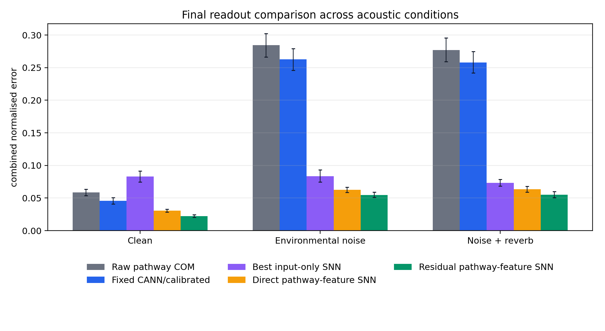
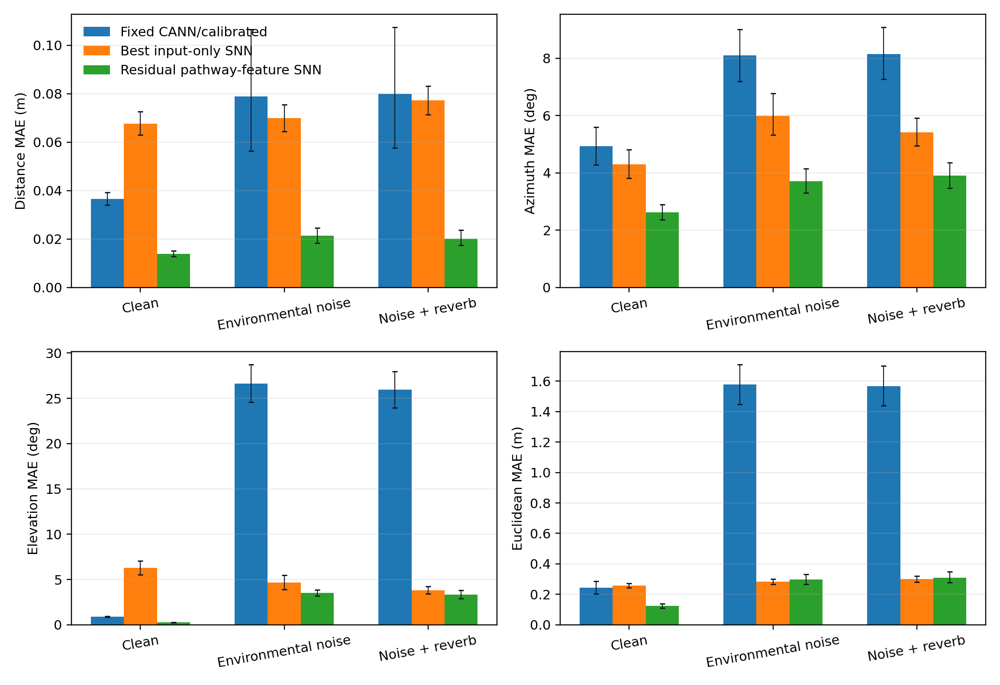
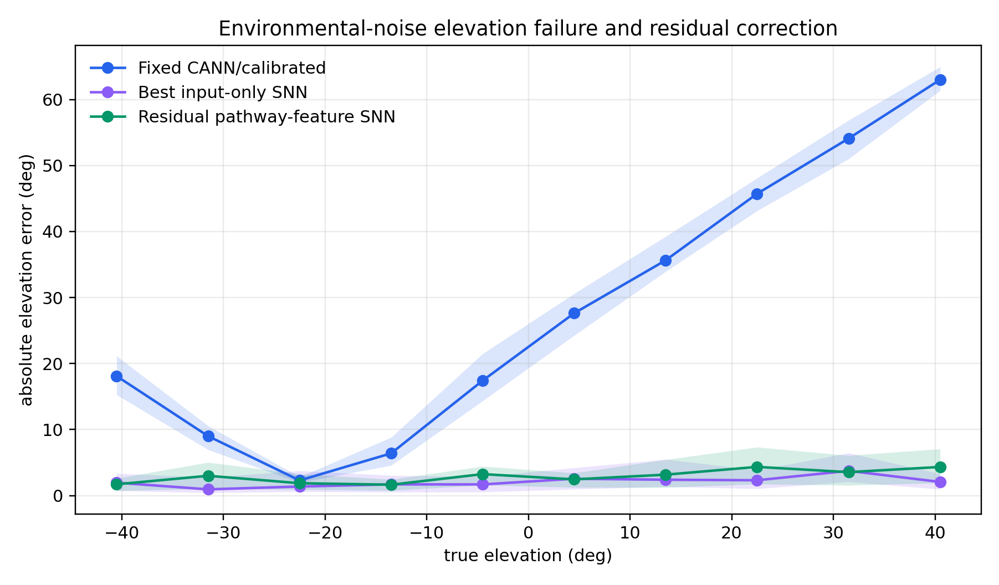
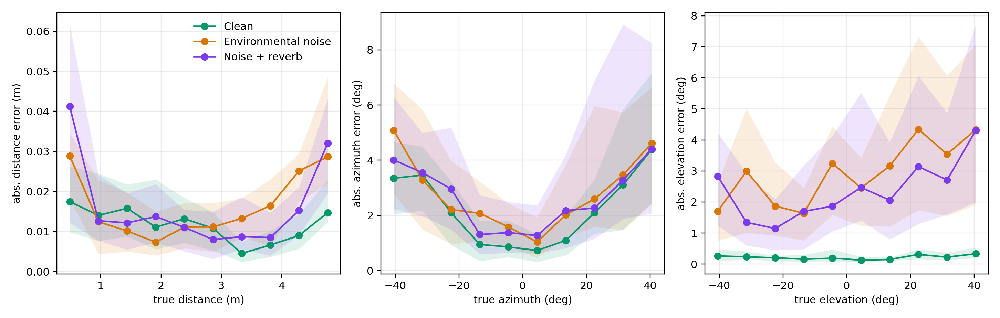
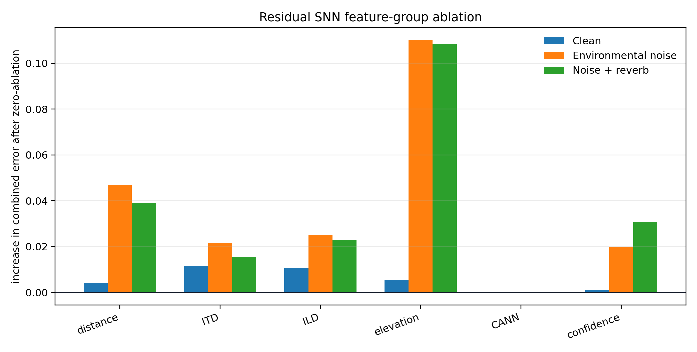
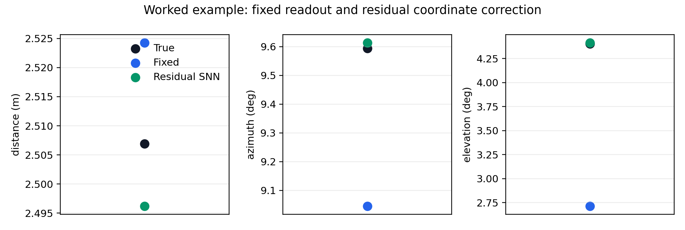

# Report Results Redraft

This report regenerates the final comparison from per-sample test predictions. All runs use the existing cached feature files and retrained the small SNN readouts with the same seeds/settings as the original reported runs. Bootstrap intervals are 95% confidence intervals over held-out test samples.

## Generated Figures

- **headline**: `final_model/outputs/report_results_redraft/figures/headline_combined_error.png`

- **coordinate_mae**: `final_model/outputs/report_results_redraft/figures/coordinate_mae_summary.png`

- **noisy_elevation**: `final_model/outputs/report_results_redraft/figures/noisy_elevation_error_by_true_elevation.png`

- **residual_binned**: `final_model/outputs/report_results_redraft/figures/residual_binned_error_curves.png`

- **feature_ablation**: `final_model/outputs/report_results_redraft/figures/residual_feature_ablation.png`

- **worked_example**: `final_model/outputs/report_results_redraft/figures/worked_example_readout_correction.png`

## Full-Model Summary

### Clean (N=400)

| Readout | Distance MAE m | Azimuth MAE deg | Elevation MAE deg | Euclidean MAE m | Combined error | Euclidean p90 m |
|---|---:|---:|---:|---:|---:|---:|
| Raw pathway COM | 0.037 [0.034, 0.039] | 4.580 [3.963, 5.275] | 2.986 [2.800, 3.175] | 0.300 [0.263, 0.343] | 0.058 [0.054, 0.064] | 0.503 |
| Fixed CANN/calibrated | 0.037 [0.034, 0.039] | 4.925 [4.288, 5.595] | 0.910 [0.846, 0.973] | 0.244 [0.204, 0.287] | 0.046 [0.041, 0.051] | 0.417 |
| Best input-only SNN | 0.068 [0.063, 0.073] | 4.292 [3.808, 4.813] | 6.282 [5.524, 7.070] | 0.258 [0.244, 0.272] | 0.083 [0.075, 0.091] | 0.450 |
| Direct pathway-feature SNN | 0.062 [0.057, 0.068] | 2.449 [2.206, 2.714] | 1.133 [1.051, 1.219] | 0.161 [0.147, 0.177] | 0.031 [0.029, 0.033] | 0.325 |
| Residual pathway-feature SNN | 0.014 [0.013, 0.015] | 2.619 [2.365, 2.890] | 0.267 [0.247, 0.288] | 0.125 [0.110, 0.140] | 0.022 [0.020, 0.024] | 0.294 |

Best input-only baseline: **Cochlear raster projected**.

### Environmental noise (N=400)

| Readout | Distance MAE m | Azimuth MAE deg | Elevation MAE deg | Euclidean MAE m | Combined error | Euclidean p90 m |
|---|---:|---:|---:|---:|---:|---:|
| Raw pathway COM | 0.079 [0.056, 0.106] | 7.691 [6.771, 8.639] | 29.980 [27.687, 32.278] | 1.705 [1.564, 1.855] | 0.284 [0.266, 0.302] | 4.018 |
| Fixed CANN/calibrated | 0.079 [0.056, 0.107] | 8.094 [7.194, 9.003] | 26.642 [24.579, 28.707] | 1.577 [1.447, 1.707] | 0.263 [0.246, 0.279] | 3.633 |
| Best input-only SNN | 0.070 [0.064, 0.075] | 5.991 [5.320, 6.774] | 4.678 [3.922, 5.481] | 0.283 [0.266, 0.301] | 0.084 [0.074, 0.093] | 0.521 |
| Direct pathway-feature SNN | 0.069 [0.063, 0.075] | 3.831 [3.418, 4.253] | 4.018 [3.677, 4.363] | 0.321 [0.291, 0.355] | 0.063 [0.059, 0.067] | 0.606 |
| Residual pathway-feature SNN | 0.021 [0.018, 0.025] | 3.705 [3.308, 4.145] | 3.505 [3.170, 3.849] | 0.297 [0.266, 0.332] | 0.055 [0.051, 0.059] | 0.655 |

Best input-only baseline: **Cochlear raster direct**.

### Noise + reverb (N=400)

| Readout | Distance MAE m | Azimuth MAE deg | Elevation MAE deg | Euclidean MAE m | Combined error | Euclidean p90 m |
|---|---:|---:|---:|---:|---:|---:|
| Raw pathway COM | 0.080 [0.057, 0.108] | 7.736 [6.818, 8.710] | 28.962 [26.705, 31.187] | 1.692 [1.545, 1.838] | 0.277 [0.259, 0.296] | 3.958 |
| Fixed CANN/calibrated | 0.080 [0.058, 0.107] | 8.147 [7.273, 9.079] | 25.975 [23.953, 27.960] | 1.567 [1.439, 1.700] | 0.258 [0.242, 0.275] | 3.612 |
| Best input-only SNN | 0.077 [0.071, 0.083] | 5.415 [4.950, 5.909] | 3.811 [3.420, 4.243] | 0.300 [0.280, 0.322] | 0.073 [0.068, 0.079] | 0.568 |
| Direct pathway-feature SNN | 0.073 [0.068, 0.079] | 3.883 [3.472, 4.338] | 4.028 [3.616, 4.497] | 0.343 [0.309, 0.380] | 0.063 [0.059, 0.068] | 0.705 |
| Residual pathway-feature SNN | 0.020 [0.017, 0.024] | 3.898 [3.460, 4.362] | 3.341 [2.916, 3.821] | 0.310 [0.277, 0.348] | 0.055 [0.050, 0.060] | 0.693 |

Best input-only baseline: **Cochlear raster projected**.

## Input-Baseline Details

| Condition | Baseline | Distance MAE m | Azimuth MAE deg | Elevation MAE deg | Euclidean MAE m | Combined error |
|---|---|---:|---:|---:|---:|---:|
| Clean | Raw waveform projected | 0.295 [0.272, 0.320] | 21.160 [19.603, 22.704] | 20.221 [18.639, 21.862] | 1.488 [1.385, 1.594] | 0.326 [0.310, 0.342] |
| Clean | Raw waveform direct | 0.805 [0.742, 0.868] | 21.580 [19.956, 23.295] | 22.855 [21.312, 24.431] | 1.859 [1.763, 1.952] | 0.383 [0.365, 0.401] |
| Clean | Cochlear raster projected | 0.068 [0.063, 0.073] | 4.292 [3.808, 4.813] | 6.282 [5.524, 7.070] | 0.258 [0.244, 0.272] | 0.083 [0.075, 0.091] |
| Clean | Cochlear raster direct | 0.065 [0.060, 0.070] | 6.033 [5.562, 6.537] | 7.178 [6.466, 7.947] | 0.387 [0.361, 0.417] | 0.102 [0.096, 0.109] |
| Environmental noise | Raw waveform projected | 0.411 [0.379, 0.447] | 23.106 [21.451, 24.778] | 22.667 [21.151, 24.132] | 1.741 [1.625, 1.860] | 0.366 [0.349, 0.384] |
| Environmental noise | Raw waveform direct | 0.979 [0.906, 1.057] | 23.847 [22.184, 25.587] | 23.836 [22.162, 25.521] | 2.006 [1.909, 2.107] | 0.418 [0.399, 0.437] |
| Environmental noise | Cochlear raster projected | 0.073 [0.067, 0.080] | 6.235 [5.595, 6.936] | 4.987 [4.252, 5.819] | 0.298 [0.279, 0.316] | 0.088 [0.079, 0.098] |
| Environmental noise | Cochlear raster direct | 0.070 [0.064, 0.075] | 5.991 [5.320, 6.774] | 4.678 [3.922, 5.481] | 0.283 [0.266, 0.301] | 0.084 [0.074, 0.093] |
| Noise + reverb | Raw waveform projected | 0.395 [0.363, 0.428] | 22.349 [20.814, 23.929] | 22.307 [20.821, 23.798] | 1.702 [1.590, 1.817] | 0.357 [0.341, 0.373] |
| Noise + reverb | Raw waveform direct | 0.941 [0.875, 1.008] | 21.990 [20.440, 23.473] | 22.471 [20.855, 24.098] | 1.903 [1.811, 2.000] | 0.392 [0.375, 0.410] |
| Noise + reverb | Cochlear raster projected | 0.077 [0.071, 0.083] | 5.415 [4.950, 5.909] | 3.811 [3.420, 4.243] | 0.300 [0.280, 0.322] | 0.073 [0.068, 0.079] |
| Noise + reverb | Cochlear raster direct | 0.063 [0.058, 0.068] | 5.900 [5.247, 6.594] | 4.704 [3.887, 5.540] | 0.268 [0.252, 0.286] | 0.083 [0.073, 0.093] |

The input-only baselines are useful controls, but they should not dominate the report. They show that a trainable SNN can exploit cochlear structure, while the pathway-feature SNN still gives the clearest evidence that the biological intermediate representations are useful.
