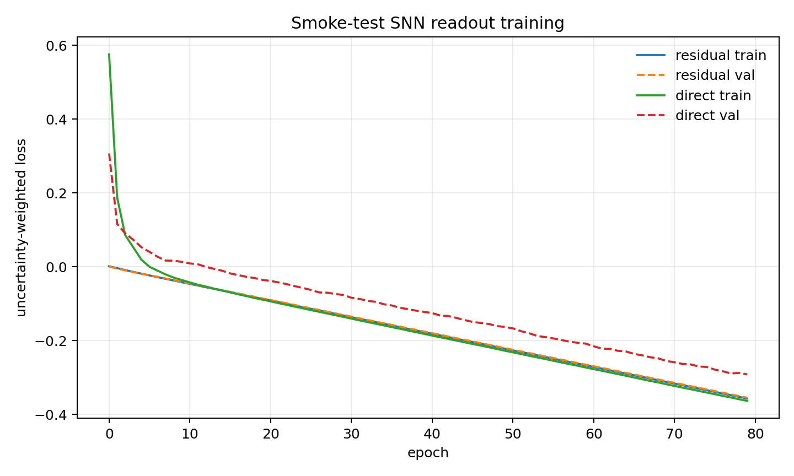
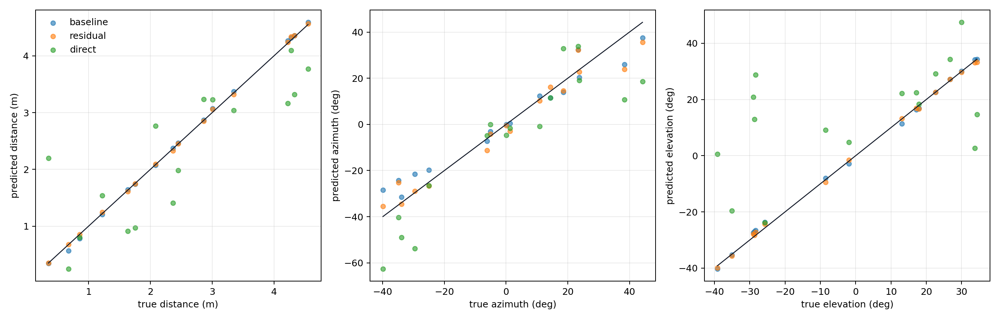
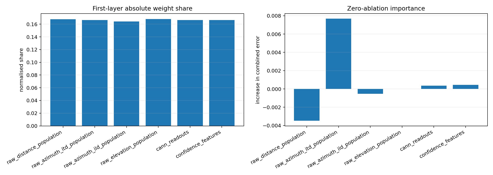

# Trainable Final SNN Readout Smoke Test

This report tests whether the fixed biologically structured pathways can be followed by a small trainable snnTorch readout. The purpose is a smoke test: validate the cache, feature layout, loss, training loop, and diagnostics before generating a larger dataset.

## Reproducible Setup

| Item | Value |
|---|---:|
| distance range | `0.25-5.0 m` |
| azimuth range | `+/-45.0 deg` |
| elevation range | `+/-45.0 deg` |
| train / val / test samples | `48 / 16 / 16` |
| dataset seed | `8101` |
| training seed | `8202` |
| cochlear channels | `48` |
| distance bins | `180` |
| angular bins | `91` |
| SNN hidden neurons | `96` |
| SNN timesteps | `12` |
| optimiser | `AdamW`, lr `0.001`, weight decay `1e-05` |
| batch size | `16` |
| epochs | `80` |
| residual scale | `0.15` |

The cached input vector is:

```text
raw distance population
raw azimuth ITD population
raw azimuth ILD population
raw elevation population
CANN distance/azimuth/elevation readouts
confidence features and spike counts
```

The target vector is:

```text
[distance_norm, az_sin, az_cos, el_sin, el_cos]
```

Distance is normalised as `(distance - 0.25) / 4.75`. Angles are trained as sine/cosine pairs to avoid discontinuities.

## Loss Function

The smoke test uses learned uncertainty weighting over three tasks:

$$
L=\frac{L_d}{2\sigma_d^2}+\log\sigma_d+\frac{L_a}{2\sigma_a^2}+\log\sigma_a+\frac{L_e}{2\sigma_e^2}+\log\sigma_e.
$$

Here `Ld` is distance MSE, `La` is azimuth sine/cosine MSE, and `Le` is elevation sine/cosine MSE.

## Smoke-Test Results

| Readout | Distance MAE | Azimuth MAE | Elevation MAE | Euclidean MAE | Combined error |
|---|---:|---:|---:|---:|---:|
| baseline | `0.0317 m` | `5.126 deg` | `0.887 deg` | `0.2018 m` | `0.0467` |
| residual | `0.0204 m` | `4.175 deg` | `0.664 deg` | `0.1813 m` | `0.0372` |
| direct | `0.6362 m` | `11.269 deg` | `20.480 deg` | `1.2599 m` | `0.2776` |

Mean feature-cache generation time was `0.584 s/sample` for this smoke test.





## Feature Importance

The first diagnostic sums the absolute first-layer weights by feature group. The second zeroes each normalised feature group on the test set and measures the increase in combined error. These are not perfect causal explanations, but they show whether the trained SNN is using the CANN readouts or mostly ignoring them.



| Feature group | First-layer share | Ablation delta |
|---|---:|---:|
| raw_distance_population | `0.1679` | `-0.0035` |
| raw_azimuth_itd_population | `0.1666` | `0.0077` |
| raw_azimuth_ild_population | `0.1642` | `-0.0005` |
| raw_elevation_population | `0.1682` | `0.0000` |
| cann_readouts | `0.1665` | `0.0004` |
| confidence_features | `0.1666` | `0.0004` |

## Biological Interpretation

This is best interpreted as a higher-level contextual integration layer. The sensory pathways still produce structured population codes. The small SNN receives raw cue populations, stabilised CANN readouts, and confidence signals, then learns how to combine them when cues are distorted by distance, azimuth, elevation, and pathway confidence.

The residual variant is especially biologically defensible because it keeps the hand-designed pathway answer as the main estimate and learns a small context-dependent correction.

## Generated Files

- `training_curves`: `final_model/outputs/trainable_readout/figures/training_curves.png`
- `test_prediction_scatter`: `final_model/outputs/trainable_readout/figures/test_prediction_scatter.png`
- `residual_feature_importance`: `final_model/outputs/trainable_readout/figures/residual_feature_importance.png`
- `cache`: `final_model/outputs/trainable_readout/smoke_cache_constrained_0p25_5m_pm45.npz`
- `results`: `final_model/outputs/trainable_readout/smoke_results.json`