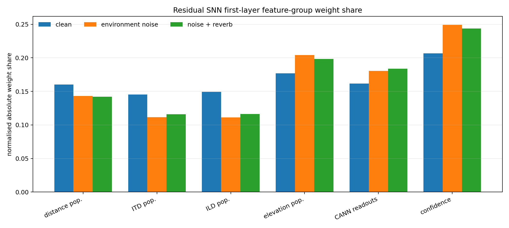
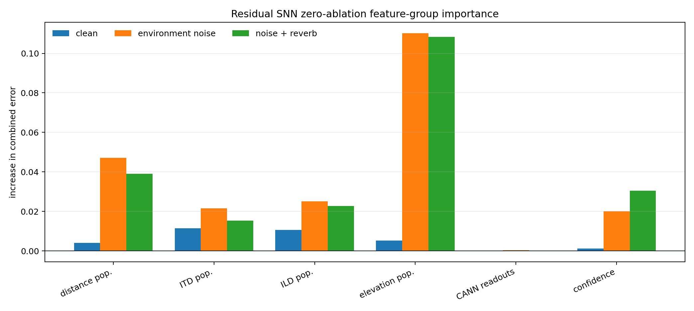
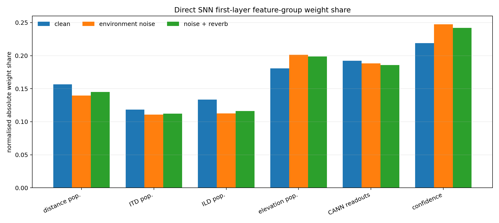
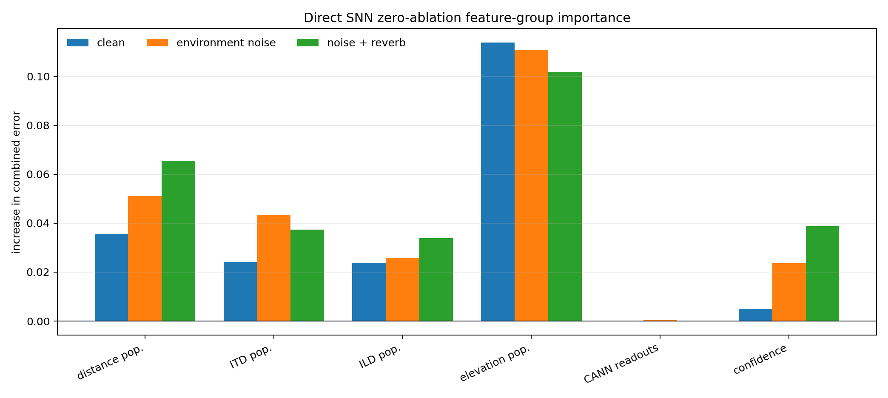
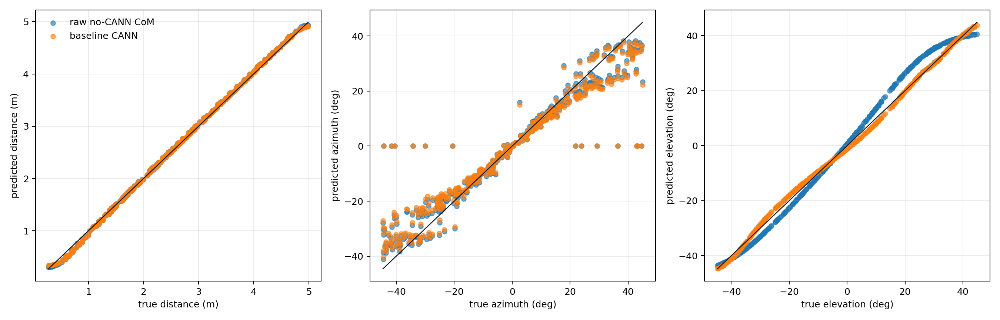
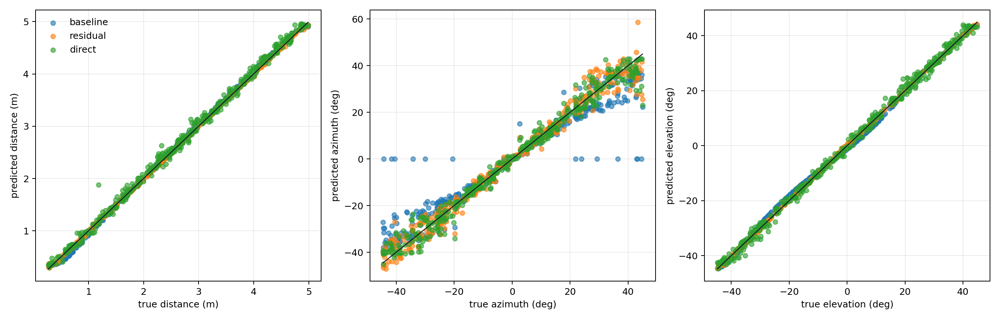
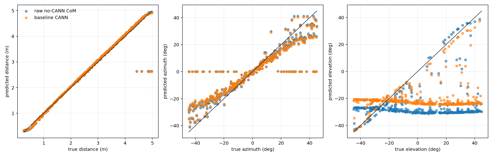
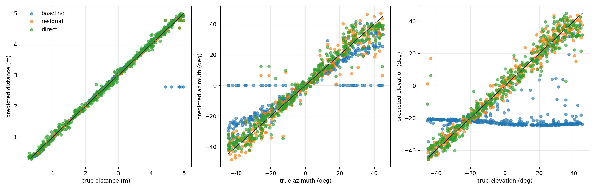

# Trainable Final SNN Readout Comparison

This report is regenerated automatically from available `results_*.json` files. It allows clean, environmental-noise, and environmental-noise-plus-reverb cached runs to coexist without overwriting each other.

Primary rows use the full cached setup (`2000/400/400` train/validation/test samples). Tiny smoke-test runs are separated because they only verify execution and should not be interpreted as accuracy results.

`raw` is the no-CANN centre-of-mass readout computed directly from the cached raw distance, ITD azimuth, and elevation populations. `baseline` is the fixed CANN readout. `residual` and `direct` are the trained SNN readouts.

## Primary Full-Run Summary

| Run | Acoustic mode | Noise | Readout | Distance MAE | Azimuth MAE | Elevation MAE | Euclidean MAE | Combined error | Results |
|---|---|---|---|---:|---:|---:|---:|---:|---|
| `train2000_val400_test400` | `clean` | `clean` | `raw` | `0.0365 m` | `4.580 deg` | `2.986 deg` | `0.2999 m` | `0.0585` | [json](../outputs/trainable_readout/results_train2000_val400_test400.json) |
| `train2000_val400_test400` | `clean` | `clean` | `baseline` | `0.0366 m` | `4.925 deg` | `0.910 deg` | `0.2435 m` | `0.0457` | [json](../outputs/trainable_readout/results_train2000_val400_test400.json) |
| `train2000_val400_test400` | `clean` | `clean` | `residual` | `0.0139 m` | `2.619 deg` | `0.267 deg` | `0.1247 m` | `0.0223` | [json](../outputs/trainable_readout/results_train2000_val400_test400.json) |
| `train2000_val400_test400` | `clean` | `clean` | `direct` | `0.0624 m` | `2.449 deg` | `1.133 deg` | `0.1612 m` | `0.0307` | [json](../outputs/trainable_readout/results_train2000_val400_test400.json) |
| `train2000_val400_test400_envnoise50dB` | `environment_noise` | `envnoise50dB` | `raw` | `0.0786 m` | `7.691 deg` | `29.980 deg` | `1.7054 m` | `0.2843` | [json](../outputs/trainable_readout/results_train2000_val400_test400_envnoise50dB.json) |
| `train2000_val400_test400_envnoise50dB` | `environment_noise` | `envnoise50dB` | `baseline` | `0.0789 m` | `8.094 deg` | `26.642 deg` | `1.5772 m` | `0.2626` | [json](../outputs/trainable_readout/results_train2000_val400_test400_envnoise50dB.json) |
| `train2000_val400_test400_envnoise50dB` | `environment_noise` | `envnoise50dB` | `residual` | `0.0213 m` | `3.705 deg` | `3.505 deg` | `0.2968 m` | `0.0548` | [json](../outputs/trainable_readout/results_train2000_val400_test400_envnoise50dB.json) |
| `train2000_val400_test400_envnoise50dB` | `environment_noise` | `envnoise50dB` | `direct` | `0.0690 m` | `3.831 deg` | `4.018 deg` | `0.3214 m` | `0.0627` | [json](../outputs/trainable_readout/results_train2000_val400_test400_envnoise50dB.json) |
| `train2000_val400_test400_envnoise50dB_reverb` | `environment_noise_reverb` | `envnoise50dB_reverb` | `raw` | `0.0796 m` | `7.736 deg` | `28.962 deg` | `1.6917 m` | `0.2771` | [json](../outputs/trainable_readout/results_train2000_val400_test400_envnoise50dB_reverb.json) |
| `train2000_val400_test400_envnoise50dB_reverb` | `environment_noise_reverb` | `envnoise50dB_reverb` | `baseline` | `0.0799 m` | `8.147 deg` | `25.975 deg` | `1.5674 m` | `0.2581` | [json](../outputs/trainable_readout/results_train2000_val400_test400_envnoise50dB_reverb.json) |
| `train2000_val400_test400_envnoise50dB_reverb` | `environment_noise_reverb` | `envnoise50dB_reverb` | `residual` | `0.0202 m` | `3.898 deg` | `3.341 deg` | `0.3103 m` | `0.0550` | [json](../outputs/trainable_readout/results_train2000_val400_test400_envnoise50dB_reverb.json) |
| `train2000_val400_test400_envnoise50dB_reverb` | `environment_noise_reverb` | `envnoise50dB_reverb` | `direct` | `0.0731 m` | `3.883 deg` | `4.028 deg` | `0.3431 m` | `0.0635` | [json](../outputs/trainable_readout/results_train2000_val400_test400_envnoise50dB_reverb.json) |

## Interpretation

- The hand-designed baseline is strongly affected by environmental noise: elevation MAE rises to `26.642 deg` because the spectral notch cue is corrupted before cochlear/DCN processing.
- The residual SNN substantially recovers the environmental-noise case, reducing combined error from `0.2626` to `0.0548`.
- Adding the simple late-echo/reverb tail does not destroy the trained residual readout in this setup: residual combined error is `0.0550`, close to the environmental-noise-only value `0.0548`.
- Clean residual performance remains best overall, with combined error `0.0223` and Euclidean MAE `0.1247 m`.

## Combined Feature Importance

These plots combine the three full `2000/400/400` runs so that feature use can be compared directly across clean, environmental-noise, and noise-plus-reverb conditions.

### Direct SNN

The first-layer plot measures parameter magnitude, while the zero-ablation plot measures the change in test combined error when a normalised feature group is set to zero. The ablation plot is therefore the more useful diagnostic for whether the trained residual SNN depends on a feature group.

## Scatter Plot Gallery

These are the per-run scatter plots collected in one place. For each condition, the first plot compares the raw no-CANN readout against the fixed CANN baseline, and the second compares the fixed baseline with the residual and direct trainable SNN readouts.

### clean

Raw no-CANN readout versus fixed CANN baseline:

Fixed baseline, residual SNN, and direct SNN:

### environment noise

Raw no-CANN readout versus fixed CANN baseline:

Fixed baseline, residual SNN, and direct SNN:

### noise + reverb

Raw no-CANN readout versus fixed CANN baseline:

Fixed baseline, residual SNN, and direct SNN:

## Per-Run Reports

- `train1_val1_test1_envnoise50dB`: [trainable_final_readout_train1_val1_test1_envnoise50dB.md](trainable_final_readout_train1_val1_test1_envnoise50dB.md)
- `train1_val1_test1_envnoise50dB_reverb`: [trainable_final_readout_train1_val1_test1_envnoise50dB_reverb.md](trainable_final_readout_train1_val1_test1_envnoise50dB_reverb.md)
- `train2000_val400_test400`: [trainable_final_readout_train2000_val400_test400.md](trainable_final_readout_train2000_val400_test400.md)
- `train2000_val400_test400_envnoise50dB`: [trainable_final_readout_train2000_val400_test400_envnoise50dB.md](trainable_final_readout_train2000_val400_test400_envnoise50dB.md)
- `train2000_val400_test400_envnoise50dB_reverb`: [trainable_final_readout_train2000_val400_test400_envnoise50dB_reverb.md](trainable_final_readout_train2000_val400_test400_envnoise50dB_reverb.md)

## Smoke-Test Runs

These rows are retained for reproducibility only. They used fewer than 100 total samples and should not be used for model comparison.

| Run | Acoustic mode | Noise | Readout | Distance MAE | Azimuth MAE | Elevation MAE | Euclidean MAE | Combined error | Results |
|---|---|---|---|---:|---:|---:|---:|---:|---|
| `train1_val1_test1_envnoise50dB` | `environment_noise` | `envnoise50dB` | `raw` | `0.0886 m` | `4.969 deg` | `23.568 deg` | `1.6827 m` | `0.2173` | [json](../outputs/trainable_readout/results_train1_val1_test1_envnoise50dB.json) |
| `train1_val1_test1_envnoise50dB` | `environment_noise` | `envnoise50dB` | `baseline` | `0.0886 m` | `4.969 deg` | `16.502 deg` | `1.2092 m` | `0.1650` | [json](../outputs/trainable_readout/results_train1_val1_test1_envnoise50dB.json) |
| `train1_val1_test1_envnoise50dB` | `environment_noise` | `envnoise50dB` | `residual` | `0.0851 m` | `4.927 deg` | `16.447 deg` | `1.2040 m` | `0.1640` | [json](../outputs/trainable_readout/results_train1_val1_test1_envnoise50dB.json) |
| `train1_val1_test1_envnoise50dB` | `environment_noise` | `envnoise50dB` | `direct` | `0.0240 m` | `149.707 deg` | `57.987 deg` | `7.1811 m` | `1.5401` | [json](../outputs/trainable_readout/results_train1_val1_test1_envnoise50dB.json) |
| `train1_val1_test1_envnoise50dB_reverb` | `environment_noise_reverb` | `envnoise50dB_reverb` | `raw` | `0.0910 m` | `4.969 deg` | `23.358 deg` | `1.6693 m` | `0.2159` | [json](../outputs/trainable_readout/results_train1_val1_test1_envnoise50dB_reverb.json) |
| `train1_val1_test1_envnoise50dB_reverb` | `environment_noise_reverb` | `envnoise50dB_reverb` | `baseline` | `0.0911 m` | `4.969 deg` | `16.230 deg` | `1.1917 m` | `0.1631` | [json](../outputs/trainable_readout/results_train1_val1_test1_envnoise50dB_reverb.json) |
| `train1_val1_test1_envnoise50dB_reverb` | `environment_noise_reverb` | `envnoise50dB_reverb` | `residual` | `0.0875 m` | `4.927 deg` | `16.208 deg` | `1.1887 m` | `0.1624` | [json](../outputs/trainable_readout/results_train1_val1_test1_envnoise50dB_reverb.json) |
| `train1_val1_test1_envnoise50dB_reverb` | `environment_noise_reverb` | `envnoise50dB_reverb` | `direct` | `0.6558 m` | `149.267 deg` | `55.258 deg` | `6.6677 m` | `1.5587` | [json](../outputs/trainable_readout/results_train1_val1_test1_envnoise50dB_reverb.json) |
| `train4_val2_test2` | `clean` | `clean` | `raw` | `0.0605 m` | `0.486 deg` | `3.687 deg` | `0.1474 m` | `0.0349` | [json](../outputs/trainable_readout/results_train4_val2_test2.json) |
| `train4_val2_test2` | `clean` | `clean` | `baseline` | `0.0605 m` | `1.170 deg` | `1.755 deg` | `0.1163 m` | `0.0257` | [json](../outputs/trainable_readout/results_train4_val2_test2.json) |
| `train4_val2_test2` | `clean` | `clean` | `residual` | `0.0590 m` | `1.223 deg` | `1.543 deg` | `0.1028 m` | `0.0244` | [json](../outputs/trainable_readout/results_train4_val2_test2.json) |
| `train4_val2_test2` | `clean` | `clean` | `direct` | `2.1532 m` | `116.815 deg` | `53.735 deg` | `2.6500 m` | `1.4069` | [json](../outputs/trainable_readout/results_train4_val2_test2.json) |
