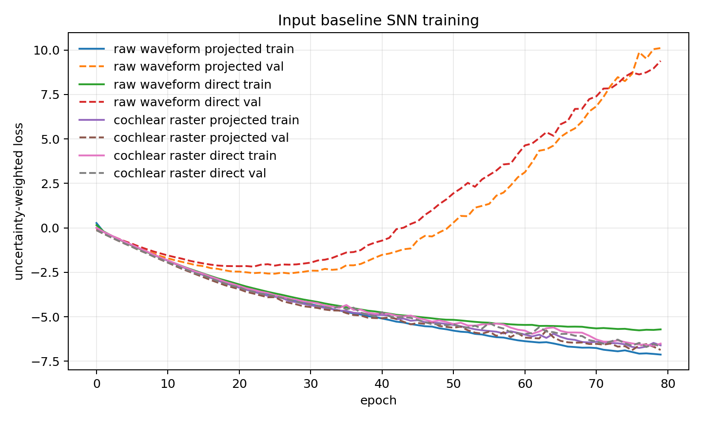
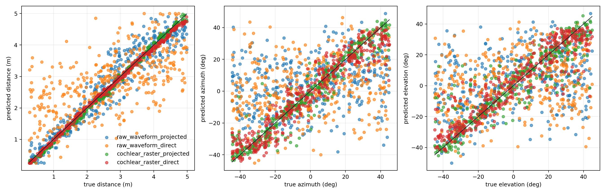

# Trainable Input Baselines

This report tests control inputs for the same small SNN readout used in the final trainable model. The goal is to check whether the crafted brain-inspired pathway features are useful, rather than simply asking whether any small SNN can learn the constrained localisation task.

## Setup

| Item | Value |
|---|---:|
| distance range | `0.25-5.0 m` |
| azimuth/elevation range | `+/-45.0 deg` |
| train / val / test samples | `2000 / 400 / 400` |
| acoustic mode | `clean` |
| noise label | `clean` |
| feature dimension after projection | `474` |
| raw waveform dimension before projection | `4608` |
| cochlear raster dimension before projection | `960` |
| cochlear temporal bins | `10` |
| projection seed | `42404` |
| hidden neurons | `96` |
| SNN timesteps | `12` |
| batch size | `16` |
| epochs | `80` |
| optimiser | `AdamW`, lr `0.001`, weight decay `1e-05` |

## Projection Method

The raw waveform baseline flattens the binaural waveform as `[left waveform, right waveform]`. The cochlear baseline first converts each binaural cochlear spike raster into channel-by-time-bin spike counts, then flattens `[left counts, right counts]`.

The projected variants compress these high-dimensional vectors by a fixed deterministic Gaussian projection:

$$
z = xR, \qquad R_{ij}\sim\mathcal{N}\left(0,\frac{1}{D}\right),
$$

where $D$ is the input dimensionality before projection. The projection is not learned. This keeps the trainable capacity concentrated in the same small snnTorch readout rather than giving the raw/cochlear baselines a large extra trainable front end.

The direct variants skip this projection and feed the flattened waveform or time-binned cochlear raster directly into the same SNN architecture. They therefore have a larger first linear layer. This is included as a control to show whether projection is only a convenience or whether it changes the baseline behaviour.

## Model Size

| Input baseline | Input dimension | Trainable parameters |
|---|---:|---:|
| raw_waveform_projected | `474` | `55,597` |
| raw_waveform_direct | `4608` | `452,461` |
| cochlear_raster_projected | `474` | `55,597` |
| cochlear_raster_direct | `960` | `102,253` |

## Results

| Input baseline | Distance MAE | Azimuth MAE | Elevation MAE | Euclidean MAE | Combined error |
|---|---:|---:|---:|---:|---:|
| raw_waveform_projected | `0.2954 m` | `21.160 deg` | `20.221 deg` | `1.4882 m` | `0.3262` |
| raw_waveform_direct | `0.8053 m` | `21.580 deg` | `22.855 deg` | `1.8587 m` | `0.3828` |
| cochlear_raster_projected | `0.0677 m` | `4.292 deg` | `6.282 deg` | `0.2580 m` | `0.0828` |
| cochlear_raster_direct | `0.0651 m` | `6.033 deg` | `7.178 deg` | `0.3873 m` | `0.1022` |

Mean cache generation time was `0.006 s/sample`.

## Interpretation Template

- If the raw waveform baseline performs similarly to the crafted-feature SNN, then much of the task can be learned directly from waveform samples in this constrained space.
- If the cochlear raster baseline performs well but the raw waveform baseline does not, then the cochlear front end is doing useful representation work, but the later hand-designed pathways may be less essential.
- If both baselines are worse than the crafted-feature SNN, this supports the argument that the distance, azimuth, elevation, and CANN feature extraction stages improve sample efficiency and interpretability.
- A strong baseline result should still be treated carefully: the projection is fixed and non-biological, and the test space is constrained to the same range used for training.

## Generated Files

- `training_curves`: `final_model/outputs/trainable_input_baselines/figures/train2000_val400_test400/training_curves.png`
- `prediction_scatter`: `final_model/outputs/trainable_input_baselines/figures/train2000_val400_test400/prediction_scatter.png`
- `test_predictions`: `final_model/outputs/trainable_input_baselines/test_predictions_train2000_val400_test400.npz`
- `cache`: `final_model/outputs/trainable_input_baselines/cache_train2000_val400_test400.npz`
- `results`: `final_model/outputs/trainable_input_baselines/results_train2000_val400_test400.json`