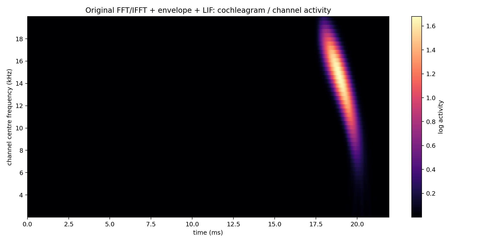
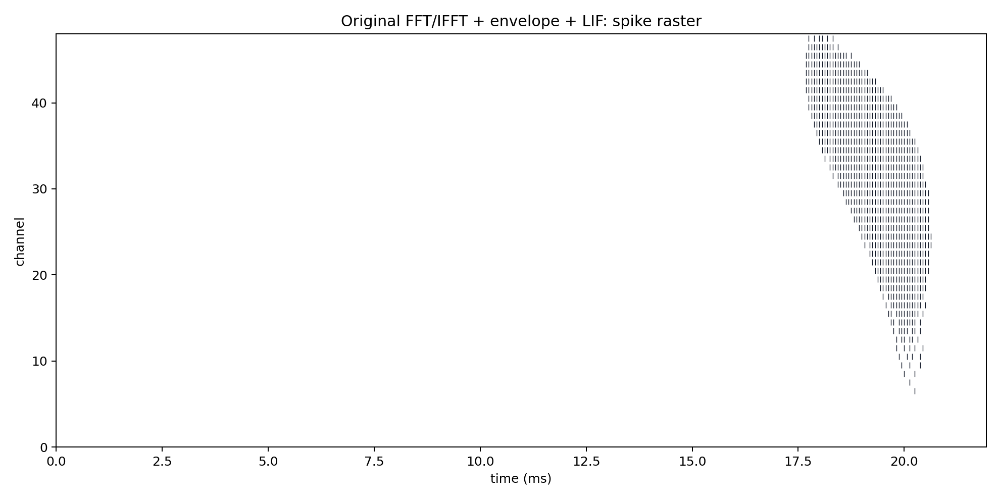
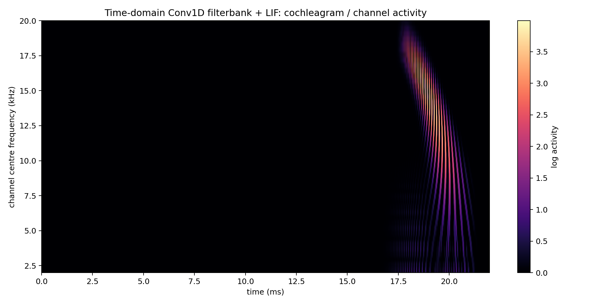
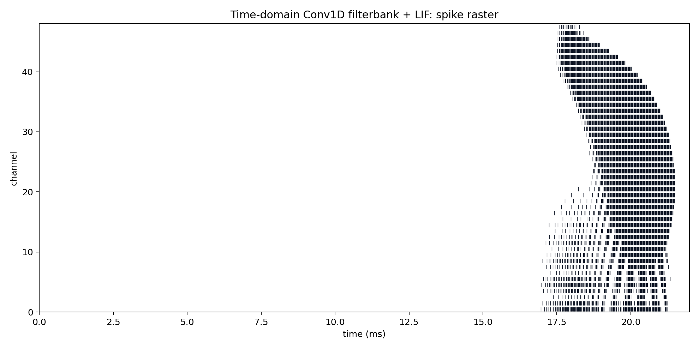
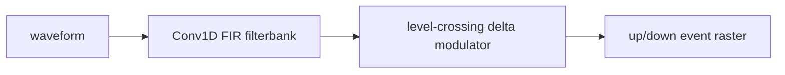
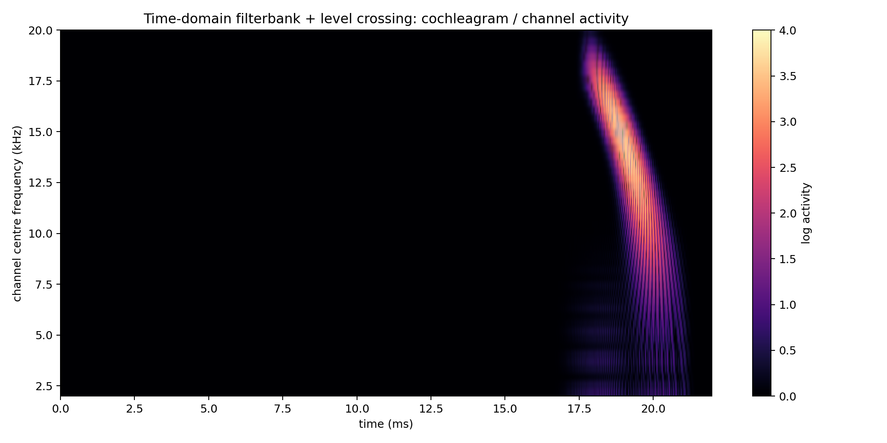
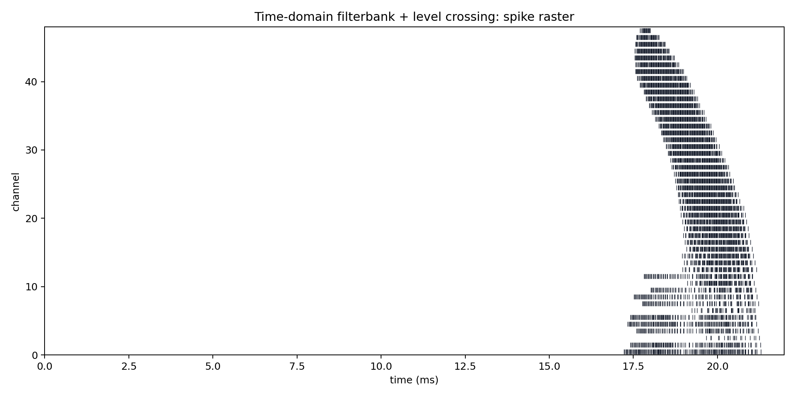
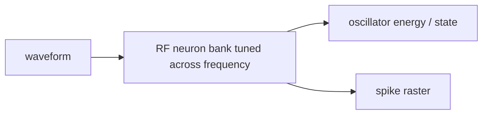
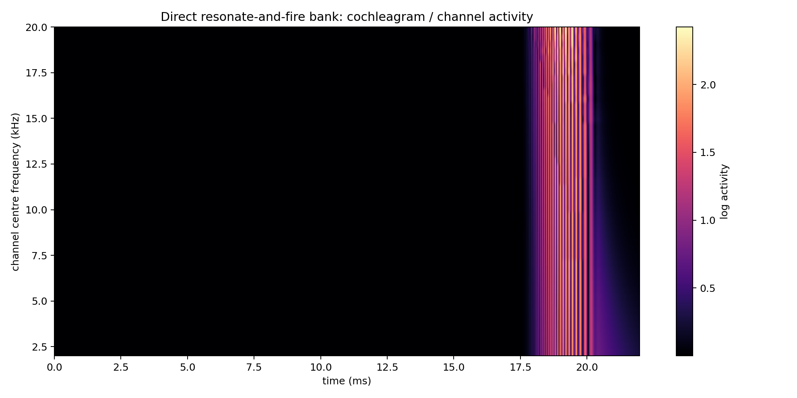
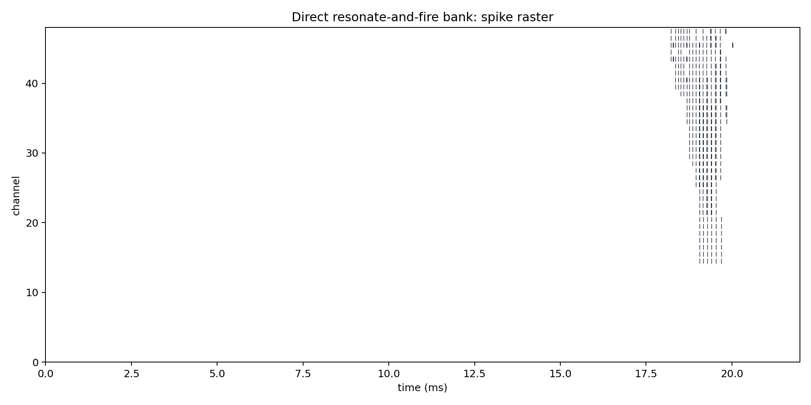

# Mini Model 3: Cochlea Analysis

This mini model compares four candidate cochlea front ends. The aim is not yet to optimise them, but to check whether the mechanisms produce sensible channel activity and spikes, and to estimate their relative computational cost.

## Shared Setup

| Parameter | Value |
|---|---:|
| sample rate | `64000 Hz` |
| chirp | `18000 -> 2000 Hz` |
| chirp duration | `3.0 ms` |
| signal duration | `22.0 ms` |
| cochlea band | `2000 -> 20000 Hz` |
| channels | `48` |
| spike envelope normalization | `False` |
| transmit gain | `1000x` |

The input is one clean left-ear echo from the matched-human signal setup. Keeping one waveform fixed means the plots compare the front ends, not scene variability.

## Cost Summary

| Model | FLOPs estimate | SOPs / output events | Time | Time per channel | Spike density |
|---|---:|---:|---:|---:|---:|
| Original FFT/IFFT + envelope + LIF | `9,031,990` | `910` | `3.785 ms` | `0.0789 ms` | `0.0539` |
| Time-domain Conv1D filterbank + LIF | `17,842,176` | `7,028` | `12.554 ms` | `0.2615 ms` | `0.1040` |
| Time-domain filterbank + level crossing | `17,842,176` | `4,316` | `32.187 ms` | `0.6706 ms` | `0.0639` |
| Direct resonate-and-fire bank | `675,840` | `428` | `15.027 ms` | `0.3131 ms` | `0.0063` |

FLOPs are approximate dense-operation counts for one waveform. SOPs are counted here as emitted output spike/events, because downstream event-driven processing cost would scale with those events. This is a first-order proxy, not a hardware-validated energy model.

## 1. Original FFT/IFFT + Envelope + LIF


```text
X(f) = FFT{x(t)}
x_c(t) = IFFT{X(f) * G_c(f)}
e_c(t) = downsample(lowpass(max(x_c(t), 0)))
v_c[t] = beta * v_c[t-1] + e_c[t]
spike_c[t] = 1 if v_c[t] >= threshold else 0
v_c[t] = max(v_c[t] - threshold * spike_c[t], 0)
```

Old fixed cochlea: FFT, Gaussian frequency filters, IFFT per channel, rectification, low-pass envelope, downsample, LIF.





## 2. Time-Domain Conv1D Filterbank + LIF


```text
x_c[t] = sum_k h_c[k] * x[t-k]
e_c[t] = max(x_c[t], 0)
v_c[t] = beta_sample * v_c[t-1] + e_c[t]
beta_sample = beta_old^(1 / downsample)
spike_c[t] = 1 if v_c[t] >= threshold else 0
```

New dense time-domain cochlea: FIR filterbank directly in time, rectification, full-rate LIF; no explicit envelope low-pass/downsample.





## 3. Time-Domain Filterbank + Level Crossing



```text
x_c[t] = sum_k h_c[k] * x[t-k]
if x_c[t] - ref_c[t] >= delta: emit up event, ref_c += n * delta
if ref_c[t] - x_c[t] >= delta: emit down event, ref_c -= n * delta
```

New event encoder: FIR filterbank followed by delta-modulation events on each filtered channel.





## 4. Direct Resonate-And-Fire Bank



```text
velocity_c[t] = decay_c * velocity_c[t-1] + gain * x[t] - theta_c * state_c[t-1]
state_c[t] = state_c[t-1] + theta_c * velocity_c[t]
theta_c = 2*pi*f_c/sample_rate
spike_c[t] = 1 if state_c[t] >= threshold else 0
```

New reduced cochlea: raw waveform drives a bank of RF neurons tuned across frequency.





## Initial Interpretation

- The original model is the faithful baseline and has the most envelope-shaped representation, but it pays for FFT/IFFT reconstruction plus smoothing.
- The Conv1D model stays in the time domain and removes explicit low-pass/downsample blocks, but naive FIR convolution is not automatically cheaper unless the kernels are short or optimized.
- The level-crossing model is the cleanest route toward event-based processing after the filterbank, but the filterbank itself is still dense in this first implementation.
- The RF model is the most reduced conceptually because the resonators are both filters and spiking units, but its parameters need careful tuning before using it as a full cochlea replacement.
- Binarisation and event-based processing should be evaluated after we decide which of these mechanisms gives useful spike timing and channel selectivity.

## Generated Files

- `cochleagram`: `mini_models/outputs/cochlea_analysis/figures/original_fft_lif_cochleagram.png`
- `raster`: `mini_models/outputs/cochlea_analysis/figures/original_fft_lif_raster.png`
- `cochleagram`: `mini_models/outputs/cochlea_analysis/figures/conv1d_lif_cochleagram.png`
- `raster`: `mini_models/outputs/cochlea_analysis/figures/conv1d_lif_raster.png`
- `cochleagram`: `mini_models/outputs/cochlea_analysis/figures/level_crossing_cochleagram.png`
- `raster`: `mini_models/outputs/cochlea_analysis/figures/level_crossing_raster.png`
- `cochleagram`: `mini_models/outputs/cochlea_analysis/figures/rf_bank_cochleagram.png`
- `raster`: `mini_models/outputs/cochlea_analysis/figures/rf_bank_raster.png`
- `results`: `mini_models/outputs/cochlea_analysis/results.json`

Runtime: `1.55 s`.
