# Mini Model 3: Cochlea Analysis

This mini model compares the original four candidate cochlea front ends and then adds three improvement candidates. The aim is not yet to fully optimise them, but to check whether the mechanisms produce sensible channel activity and spikes, and to estimate their relative computational cost.

## Shared Setup

| Parameter | Value |
|---|---:|
| sample rate | `64000 Hz` |
| chirp | `18000 -> 2000 Hz` |
| chirp duration | `3.0 ms` |
| signal duration | `22.0 ms` |
| cochlea band | `2000 -> 20000 Hz` |
| channels | `48` |
| spike envelope normalization | `False` |
| transmit gain | `1000x` |

The input is one clean left-ear echo from the matched-human signal setup. Keeping one waveform fixed means the plots compare the front ends, not scene variability.

## Cost Summary

| Model | FLOPs estimate | SOPs / output events | Time | Time per channel | Spike density |
|---|---:|---:|---:|---:|---:|
| Original FFT/IFFT + envelope + LIF | `9,031,990` | `910` | `4.751 ms` | `0.0990 ms` | `0.0539` |
| Time-domain Conv1D filterbank + LIF | `17,842,176` | `7,028` | `13.855 ms` | `0.2886 ms` | `0.1040` |
| Time-domain filterbank + level crossing | `17,842,176` | `4,316` | `30.686 ms` | `0.6393 ms` | `0.0639` |
| Direct resonate-and-fire bank | `675,840` | `428` | `16.580 ms` | `0.3454 ms` | `0.0063` |
| IIR resonator filterbank + LIF | `811,008` | `5,759` | `18.281 ms` | `0.3809 ms` | `0.0852` |
| lfilter IIR + optimized LIF | `811,008` | `5,759` | `16.811 ms` | `0.3502 ms` | `0.0852` |
| lfilter IIR + TorchScript LIF | `811,008` | `5,759` | `11.448 ms` | `0.2385 ms` | `0.0852` |
| lfilter IIR + optimized LIF + active-window gating | `170,496` | `5,732` | `3.668 ms` | `0.0764 ms` | `0.0848` |
| lfilter IIR + TorchScript LIF + active-window gating | `170,496` | `5,732` | `2.478 ms` | `0.0516 ms` | `0.0848` |
| IIR resonator filterbank + level crossing | `811,008` | `4,243` | `37.725 ms` | `0.7859 ms` | `0.0628` |
| Damped wide-band RF bank | `675,840` | `2,417` | `17.361 ms` | `0.3617 ms` | `0.0358` |

FLOPs are approximate dense-operation counts for one waveform. SOPs are counted here as emitted output spike/events, because downstream event-driven processing cost would scale with those events. This is a first-order proxy, not a hardware-validated energy model.

## IIR Optimization Savings

| Comparison | Time change vs current IIR + LIF | Samples processed |
|---|---:|---:|
| lfilter IIR + optimized LIF | `+8.0%` | `1408` / `1408` |
| lfilter IIR + TorchScript LIF | `+37.4%` | `1408` / `1408` |
| lfilter IIR + optimized LIF + active-window gating | `+79.9%` | `296` / `1408` |
| lfilter IIR + TorchScript LIF + active-window gating | `+86.4%` | `296` / `1408` |

A positive value means faster than the current Python-loop IIR + LIF model. The gated model is window-gated dense processing: it skips the silent parts of the waveform, but still runs dense IIR/LIF updates inside the detected active window.

## 1. Original FFT/IFFT + Envelope + LIF

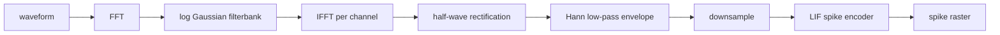

```text
X(f) = FFT{x(t)}
x_c(t) = IFFT{X(f) * G_c(f)}
e_c(t) = downsample(lowpass(max(x_c(t), 0)))
v_c[t] = beta * v_c[t-1] + e_c[t]
spike_c[t] = 1 if v_c[t] >= threshold else 0
v_c[t] = max(v_c[t] - threshold * spike_c[t], 0)
```

Old fixed cochlea: FFT, Gaussian frequency filters, IFFT per channel, rectification, low-pass envelope, downsample, LIF.


## 2. Time-Domain Conv1D Filterbank + LIF

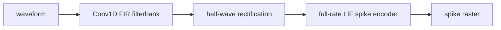

```text
x_c[t] = sum_k h_c[k] * x[t-k]
e_c[t] = max(x_c[t], 0)
v_c[t] = beta_sample * v_c[t-1] + e_c[t]
beta_sample = beta_old^(1 / downsample)
spike_c[t] = 1 if v_c[t] >= threshold else 0
```

New dense time-domain cochlea: FIR filterbank directly in time, rectification, full-rate LIF; no explicit envelope low-pass/downsample.


## 3. Time-Domain Filterbank + Level Crossing

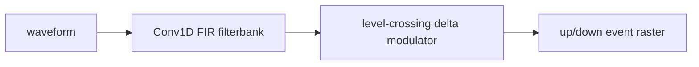

```text
x_c[t] = sum_k h_c[k] * x[t-k]
if x_c[t] - ref_c[t] >= delta: emit up event, ref_c += n * delta
if ref_c[t] - x_c[t] >= delta: emit down event, ref_c -= n * delta
```

New event encoder: FIR filterbank followed by delta-modulation events on each filtered channel.


## 4. Direct Resonate-And-Fire Bank

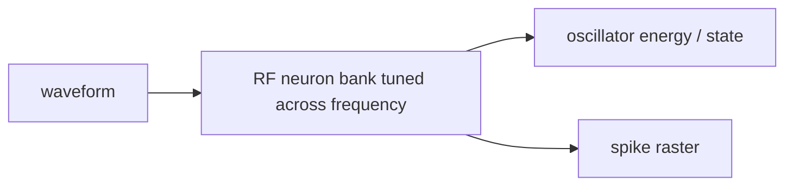

```text
velocity_c[t] = decay_c * velocity_c[t-1] + gain * x[t] - theta_c * state_c[t-1]
state_c[t] = state_c[t-1] + theta_c * velocity_c[t]
theta_c = 2*pi*f_c/sample_rate
spike_c[t] = 1 if state_c[t] >= threshold else 0
```

New reduced cochlea: raw waveform drives a bank of RF neurons tuned across frequency.


## 5. Improvement Candidate: IIR Resonator Filterbank + LIF

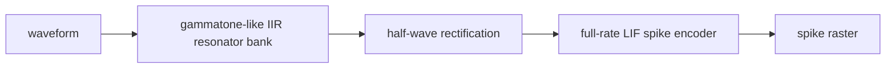

```text
r_c = exp(-pi * bandwidth_c / sample_rate)
theta_c = 2*pi*f_c/sample_rate
y_c[t] = b_c*x[t] + 2*r_c*cos(theta_c)*y_c[t-1] - r_c^2*y_c[t-2]
e_c[t] = max(y_c[t], 0)
v_c[t] = beta_sample*v_c[t-1] + e_c[t]
```

Improvement candidate: recursive gammatone-like resonator bank, rectification, full-rate LIF.


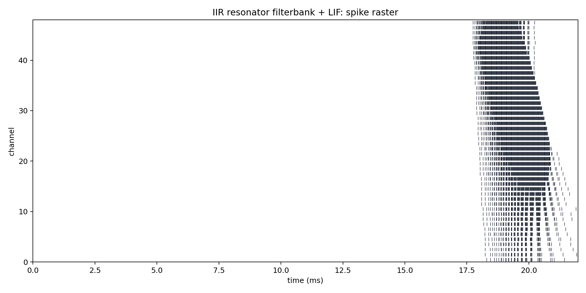

## 6. Optimization Candidate: lfilter IIR + Optimized LIF


```text
y_c[t] = b_c*x[t] + 2*r_c*cos(theta_c)*y_c[t-1] - r_c^2*y_c[t-2]
spikes = zeros(channels, samples)
v.mul_(beta_sample).add_(e[:, t])
spikes[:, t] = v >= threshold
v.sub_(threshold * spikes[:, t]).clamp_(min=0)
```

Optimization candidate: same IIR idea, but the recursive filter is delegated to torchaudio.lfilter and the LIF loop preallocates outputs.

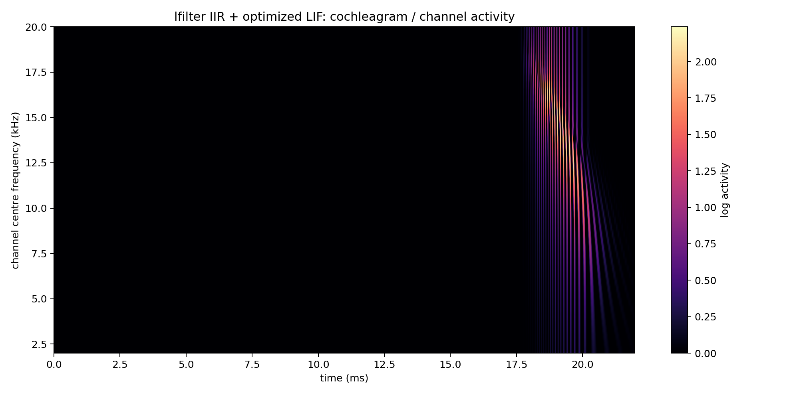


## 7. Optimization Candidate: lfilter IIR + TorchScript LIF

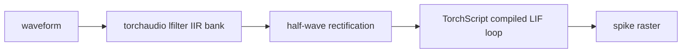

```text
@torch.jit.script
for t in range(samples):
    v = beta_sample*v + e[:, t]
    spike = v >= threshold
    v = max(v - threshold*spike, 0)
```

Optimization candidate: same lfilter IIR front end, but the sequential LIF loop is compiled with TorchScript.


## 8. Optimization Candidate: lfilter IIR + Optimized LIF + Active-Window Gating


```text
active = abs(x[t]) >= threshold_fraction * max(abs(x))
window = [first_active - padding, last_active + padding]
run cochlea only over x[window]
```

Current active-window settings: threshold fraction `0.02`, padding `1.0 ms`, processed fraction `0.210`.

Optimization candidate: same lfilter IIR + optimized LIF, but only over the detected echo window plus padding.


## 9. Combined Candidate: lfilter IIR + TorchScript LIF + Active-Window Gating


```text
active = abs(x[t]) >= threshold_fraction * max(abs(x))
filtered_window = lfilter(x[active_window], a, b)
spikes_window = scripted_LIF(relu(filtered_window))
spikes_full[:, active_window] = spikes_window
```

Current active-window settings: threshold fraction `0.02`, padding `1.0 ms`, processed fraction `0.210`.

Current combined optimization candidate: lfilter IIR, TorchScript LIF, and active-window gating.

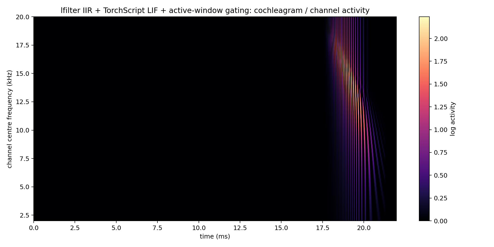

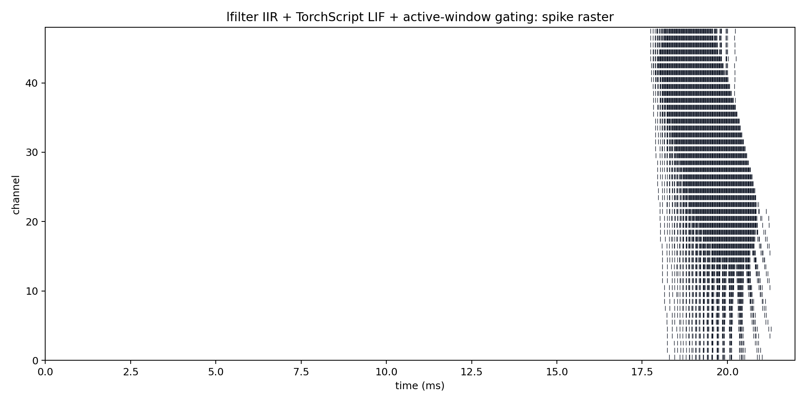

## 10. Improvement Candidate: IIR Resonator Filterbank + Level Crossing

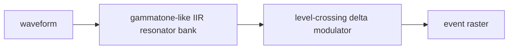

```text
y_c[t] = b_c*x[t] + 2*r_c*cos(theta_c)*y_c[t-1] - r_c^2*y_c[t-2]
if y_c[t] - ref_c[t] >= delta: emit up event
if ref_c[t] - y_c[t] >= delta: emit down event
```

Improvement candidate: recursive gammatone-like resonator bank followed by delta-modulation events.

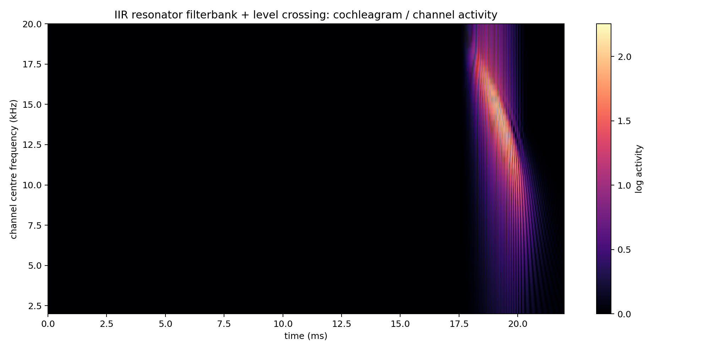

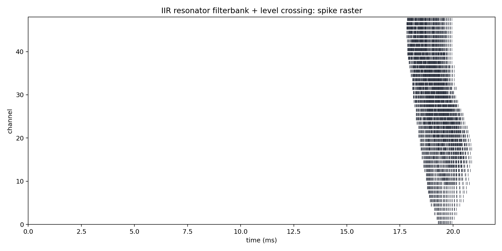

## 11. Improvement Candidate: Damped Wide-Band RF Bank

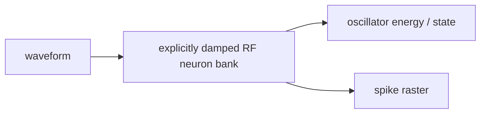

```text
decay_c = damping * exp(-theta_c / (2*Q))
velocity_c[t] = decay_c*velocity_c[t-1] + gain*x[t] - theta_c*state_c[t-1]
state_c[t] = state_c[t-1] + theta_c*velocity_c[t]
spike_c[t] = 1 if state_c[t] >= lower_threshold else 0
```

This variant uses `Q=3.0`, `damping=0.88`, `gain=0.35`, and `threshold=0.5`.

Improvement candidate: RF bank with explicit damping, lower Q for wider response, and lower threshold.

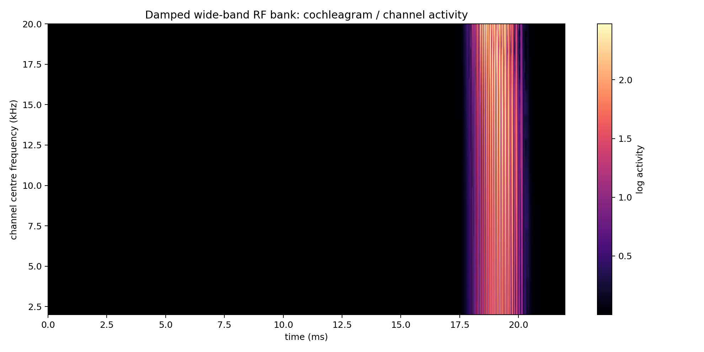

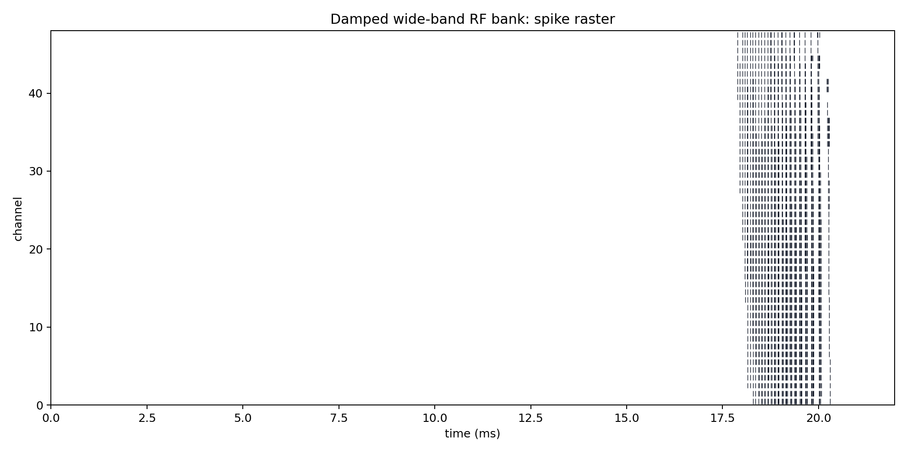

## Initial Interpretation

- The original model is the faithful baseline and has the most envelope-shaped representation, but it pays for FFT/IFFT reconstruction plus smoothing.
- The Conv1D model stays in the time domain and removes explicit low-pass/downsample blocks, but naive FIR convolution is not automatically cheaper unless the kernels are short or optimized.
- The IIR models test the same time-domain idea with recursive filters rather than long FIR kernels. This should be much cheaper in principle, although this first Python-loop implementation is not fully optimized.
- The lfilter IIR variants test whether the theoretical IIR advantage appears when the recursive filter is moved out of Python.
- The TorchScript LIF variant tests whether the remaining sequential threshold/reset loop can be accelerated without changing LIF dynamics.
- Active-window gating tests a pragmatic event-inspired optimisation: silence is skipped, but the active segment is still processed densely.
- The combined gated TorchScript variant is the current best candidate if we want to preserve reset-based LIF dynamics while reducing unnecessary silent-window compute.
- The level-crossing model is the cleanest route toward event-based processing after the filterbank, but the filterbank itself is still dense in this first implementation.
- The RF models are the most reduced conceptually because the resonators are both filters and spiking units, but their parameters need careful tuning before using them as full cochlea replacements.
- Binarisation and event-based processing should be evaluated after we decide which of these mechanisms gives useful spike timing and channel selectivity.

## Generated Files

- `cochleagram`: `mini_models/outputs/cochlea_analysis/figures/original_fft_lif_cochleagram.png`
- `raster`: `mini_models/outputs/cochlea_analysis/figures/original_fft_lif_raster.png`
- `cochleagram`: `mini_models/outputs/cochlea_analysis/figures/conv1d_lif_cochleagram.png`
- `raster`: `mini_models/outputs/cochlea_analysis/figures/conv1d_lif_raster.png`
- `cochleagram`: `mini_models/outputs/cochlea_analysis/figures/level_crossing_cochleagram.png`
- `raster`: `mini_models/outputs/cochlea_analysis/figures/level_crossing_raster.png`
- `cochleagram`: `mini_models/outputs/cochlea_analysis/figures/rf_bank_cochleagram.png`
- `raster`: `mini_models/outputs/cochlea_analysis/figures/rf_bank_raster.png`
- `cochleagram`: `mini_models/outputs/cochlea_analysis/figures/iir_lif_cochleagram.png`
- `raster`: `mini_models/outputs/cochlea_analysis/figures/iir_lif_raster.png`
- `cochleagram`: `mini_models/outputs/cochlea_analysis/figures/iir_lfilter_lif_cochleagram.png`
- `raster`: `mini_models/outputs/cochlea_analysis/figures/iir_lfilter_lif_raster.png`
- `cochleagram`: `mini_models/outputs/cochlea_analysis/figures/iir_lfilter_jit_lif_cochleagram.png`
- `raster`: `mini_models/outputs/cochlea_analysis/figures/iir_lfilter_jit_lif_raster.png`
- `cochleagram`: `mini_models/outputs/cochlea_analysis/figures/iir_lfilter_lif_gated_cochleagram.png`
- `raster`: `mini_models/outputs/cochlea_analysis/figures/iir_lfilter_lif_gated_raster.png`
- `cochleagram`: `mini_models/outputs/cochlea_analysis/figures/iir_lfilter_jit_lif_gated_cochleagram.png`
- `raster`: `mini_models/outputs/cochlea_analysis/figures/iir_lfilter_jit_lif_gated_raster.png`
- `cochleagram`: `mini_models/outputs/cochlea_analysis/figures/iir_level_crossing_cochleagram.png`
- `raster`: `mini_models/outputs/cochlea_analysis/figures/iir_level_crossing_raster.png`
- `cochleagram`: `mini_models/outputs/cochlea_analysis/figures/damped_rf_bank_cochleagram.png`
- `raster`: `mini_models/outputs/cochlea_analysis/figures/damped_rf_bank_raster.png`
- `results`: `mini_models/outputs/cochlea_analysis/results.json`

Runtime: `4.85 s`.
