# Final Cochlea Model And Analysis

This document consolidates the selected cochlea front end for the next model design. It uses the optimized IIR resonator filterbank, TorchScript LIF spike encoding, and active-window gating.

## Final Model


| Parameter | Value |
|---|---:|
| sample rate | `64000 Hz` |
| chirp | `18000 -> 2000 Hz` |
| cochlea band | `2000 -> 20000 Hz` |
| channels for final example | `48` |
| final IIR Q factor | `12.0` |
| spike threshold | `0.42` |
| spike beta | `0.88` |
| active-window threshold | `0.02 * max(abs(signal))` |
| active-window padding | `1.0 ms` |

The Q factor was increased from the earlier exploratory value of `5` to `12` to make the resonator channels more frequency selective. This improves separation between neighbouring channels, at the cost of longer ringing.

## Final Output

- Runtime for the `48`-channel final example: `3.329 ms`
- Estimated FLOPs for active window: `170,496`
- Output spike count: `4212`
- Active samples processed: `296` / `1408`
- Active fraction: `0.210`

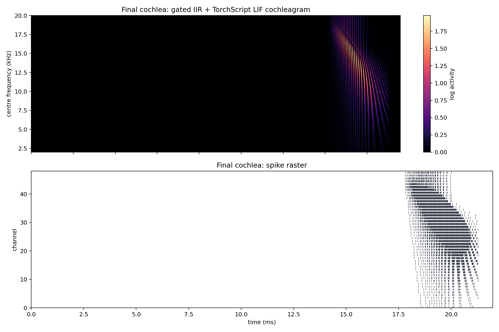

## IIR Filter Mathematics

Each channel is implemented as a second-order resonator. For centre frequency `f_c`, sampling rate `f_s`, and quality factor `Q`:

```text
bandwidth_c = f_c / Q
theta_c = 2*pi*f_c / f_s
r_c = exp(-pi*bandwidth_c / f_s)
```

The time-domain difference equation is:

```text
y_c[n] = b0_c*x[n] + 2*r_c*cos(theta_c)*y_c[n-1] - r_c^2*y_c[n-2]
b0_c = 1 - r_c
```

The transfer function is:

```text
H_c(z) = b0_c / (1 - 2*r_c*cos(theta_c)*z^-1 + r_c^2*z^-2)
```

The poles are:

```text
z = r_c * exp(+/-j*theta_c)
```

For the final model, pole radii range from `0.9214` to `0.9919`. Since all pole radii are less than `1`, the IIR filters are stable.

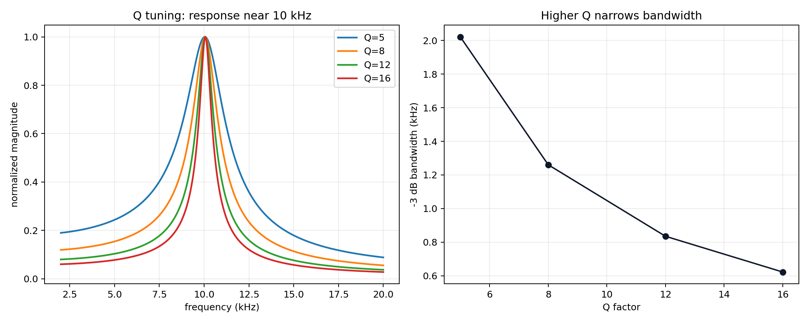

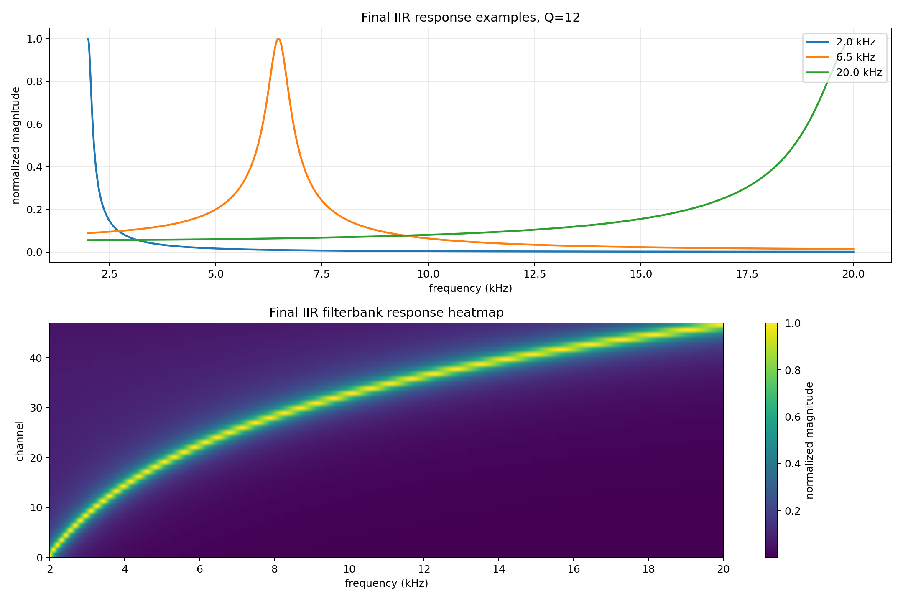

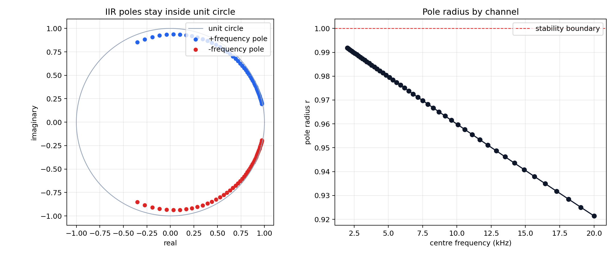

## Channel Scaling

The plot below compares runtime as the channel count increases from `10` to `1000`. The final IIR model uses active-window gating, so its operation count depends on active samples rather than full waveform length.

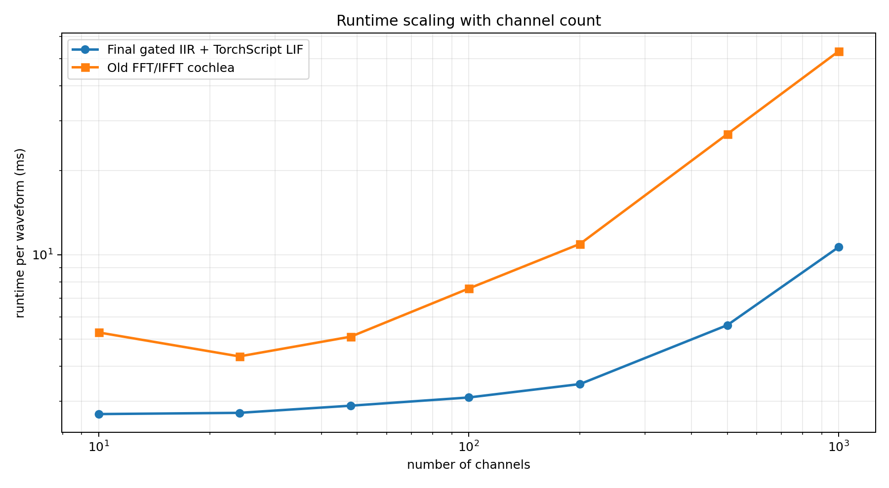

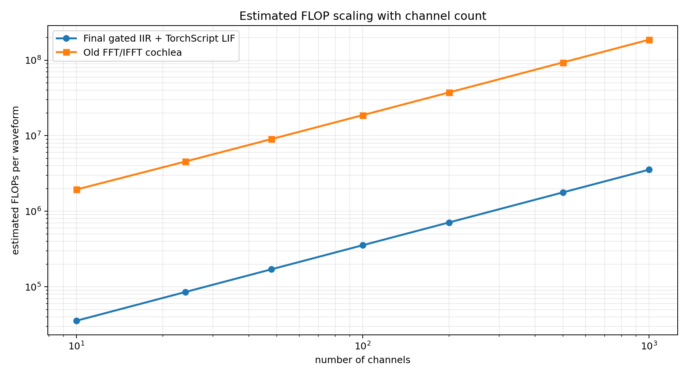

| Channels | Final IIR time (ms) | FFT time (ms) | Final IIR FLOPs | FFT FLOPs |
|---:|---:|---:|---:|---:|
| 10 | 2.703 | 5.284 | 35,520 | 1,939,958 |
| 24 | 2.730 | 4.340 | 85,248 | 4,552,812 |
| 48 | 2.895 | 5.103 | 170,496 | 9,031,990 |
| 100 | 3.097 | 7.575 | 355,200 | 18,736,874 |
| 200 | 3.458 | 10.935 | 710,400 | 37,400,114 |
| 500 | 5.609 | 26.935 | 1,776,000 | 93,389,834 |
| 1000 | 10.650 | 53.179 | 3,552,000 | 186,706,033 |

## Neural IIR Filter Extensions

The final implemented cochlea uses a direct analog IIR filterbank. A useful next step is to express the same resonant operation as a neural circuit. The three versions below are different implementations of the same broad idea: a stable second-order resonator with a centre frequency, damping, and output activity.

### 1. Direct Analog IIR

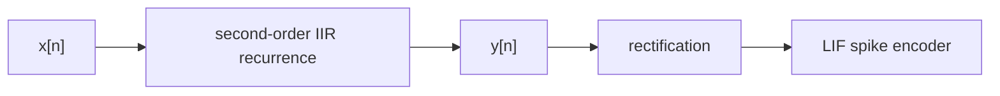

The direct analog form is the current implementation:

```text
y[n] = b0*x[n] + 2*r*cos(theta)*y[n-1] - r^2*y[n-2]
```

As a black-box linear system, this is compact and efficient. It does not explain the recurrence as neurons; it just directly computes the filter output.

### 2. RF Neuron As An IIR

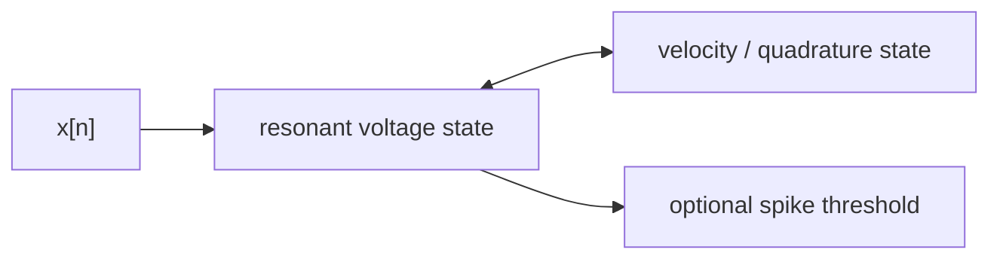

A linearized resonate-and-fire unit can be written as a damped rotation:

```text
v[n] = r*cos(theta)*v[n-1] - r*sin(theta)*u[n-1] + g*x[n]
u[n] = r*sin(theta)*v[n-1] + r*cos(theta)*u[n-1]
```

`v` is the voltage-like state and `u` is the velocity or quadrature state. If a threshold/reset is added to `v`, this becomes a spiking RF neuron. Without the threshold, it is a linear resonator and can be compared fairly against the analog IIR.

### 3. E/I Circuitry As An IIR

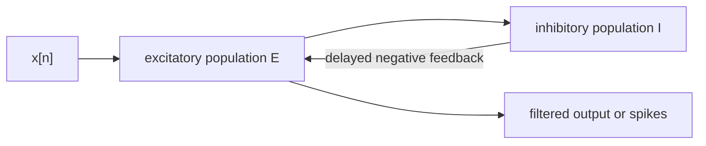

The same two-state recurrence can be interpreted as excitatory/inhibitory circuitry:

```text
E[n] = r*cos(theta)*E[n-1] - r*sin(theta)*I[n-1] + g*x[n]
I[n] = r*sin(theta)*E[n-1] + r*cos(theta)*I[n-1]
```

Here `E` is the driven excitatory state and `I` is the delayed inhibitory or quadrature state. The delayed negative feedback creates resonance. The eigenvalues are still `r*exp(+/-j*theta)`, so the stability condition is the same: `r < 1`.

### Black-Box Similarity

As black-box linear systems, all three are resonant band-pass style filters. The analog IIR is a direct-form recurrence, while the RF and E/I versions are state-space recurrences with two explicit internal states. If tuned to the same pole radius and angle, they peak at the same frequency and have similar damping.

The key transfer functions are:

```text
H_direct(z) = b0 / (1 - 2*r*cos(theta)*z^-1 + r^2*z^-2)
H_state(z)  = g*(1 - r*cos(theta)*z^-1) / (1 - 2*r*cos(theta)*z^-1 + r^2*z^-2)
```

Both forms have the same denominator and therefore the same poles. The difference is the numerator: the direct IIR hides the state in previous output samples, while the state-space RF/E-I versions expose the two internal states.

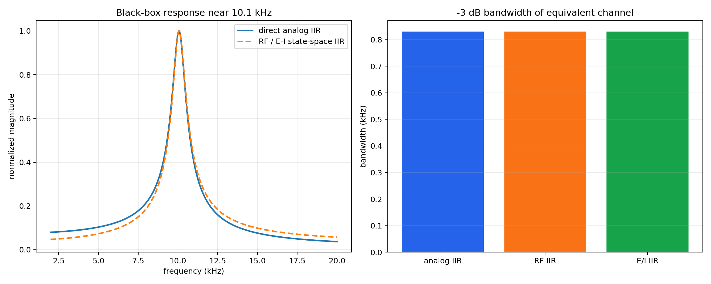

### Dynamical Difference

The direct IIR hides its state in previous outputs. The RF form exposes voltage and velocity. The E/I form exposes excitatory and inhibitory state. This makes the neural versions easier to interpret biologically and easier to plot as circuit dynamics.

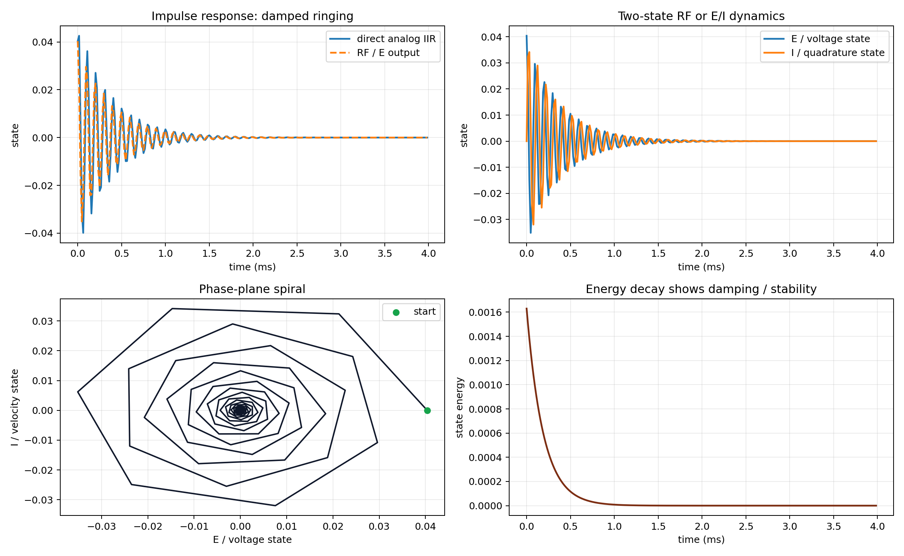

### Prototype Performance

The table below compares filter-block performance only, using the same active waveform window and `48` channels. It does not include rectification or LIF spike encoding.

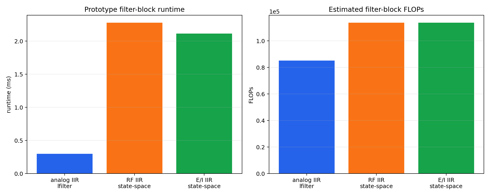

| Variant | Runtime (ms) | Estimated filter FLOPs | Notes |
|---|---:|---:|---|
| Direct analog IIR with `lfilter` | 0.297 | 85,248 | Current efficient implementation. |
| RF state-space IIR | 2.276 | 113,664 | More neural, exposes voltage/velocity states. |
| E/I state-space IIR | 2.114 | 113,664 | Same dynamics as RF, but interpreted as delayed inhibition. |

The current direct IIR remains the best engineering choice for speed because `torchaudio.functional.lfilter` runs the recurrence efficiently. The RF and E/I versions are better explanatory models and may become useful if the cochlea is later made explicitly neural or spiking.

## Interpretation

- Increasing Q from `5` to `12` narrows each IIR channel and improves theoretical frequency selectivity.
- Stability is guaranteed by construction as long as `Q > 0` and `f_c > 0`, because `r = exp(-pi*f_c/(Q*f_s))` lies inside the unit circle.
- The final model is still not truly sparse inside the active window. It is a gated dense computation: silence is skipped, but the echo window is processed by all channels.
- The scaling curves are the key test for whether this front end remains practical as channel count increases.
- A neural IIR is mathematically plausible because RF and E/I circuits can implement the same kind of stable second-order resonator as the direct IIR.

## Caveat

So here, RF neurons are exactly equivalent to the E/I circuitry, but RF uses v as the voltage and u as effectively the imaginary voltage, whilst E/I uses an explicit inhibitory feedback. 

The caveat is important: they are exactly equivalent only while they remain linear analog systems. Once you add spiking thresholds, resets, refractory periods, synaptic delays, saturation, or rectification, they stop being exactly equivalent and become different models.

A linear RF neuron and a linear E/I resonator can implement the same second-order IIR dynamics. RF hides the second state inside one resonant unit; E/I makes the second state an explicit inhibitory feedback population.

## Generated Files

- `final_cochlea_output`: `mini_models/outputs/final_cochlea_model/figures/final_cochlea_output.png`
- `q_selectivity`: `mini_models/outputs/final_cochlea_model/figures/q_selectivity.png`
- `final_frequency_response`: `mini_models/outputs/final_cochlea_model/figures/final_frequency_response.png`
- `iir_stability`: `mini_models/outputs/final_cochlea_model/figures/iir_stability.png`
- `channel_scaling_runtime`: `mini_models/outputs/final_cochlea_model/figures/channel_scaling_runtime.png`
- `channel_scaling_flops`: `mini_models/outputs/final_cochlea_model/figures/channel_scaling_flops.png`
- `neural_iir_frequency_response`: `mini_models/outputs/final_cochlea_model/figures/neural_iir_frequency_response.png`
- `neural_iir_dynamics`: `mini_models/outputs/final_cochlea_model/figures/neural_iir_dynamics.png`
- `neural_iir_performance`: `mini_models/outputs/final_cochlea_model/figures/neural_iir_performance.png`
- `results`: `mini_models/outputs/final_cochlea_model/results.json`

Runtime: `2.54 s`.
