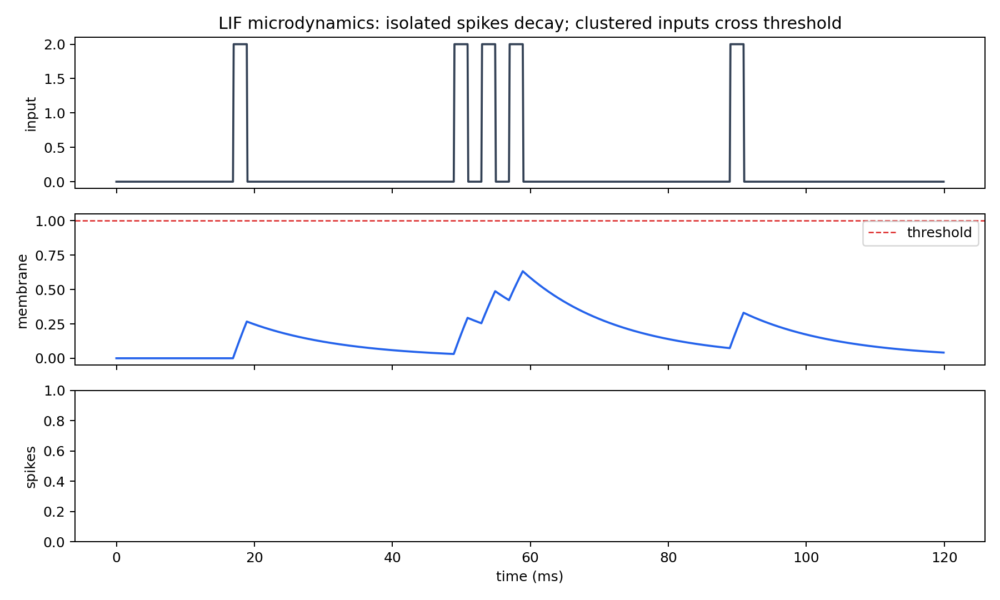
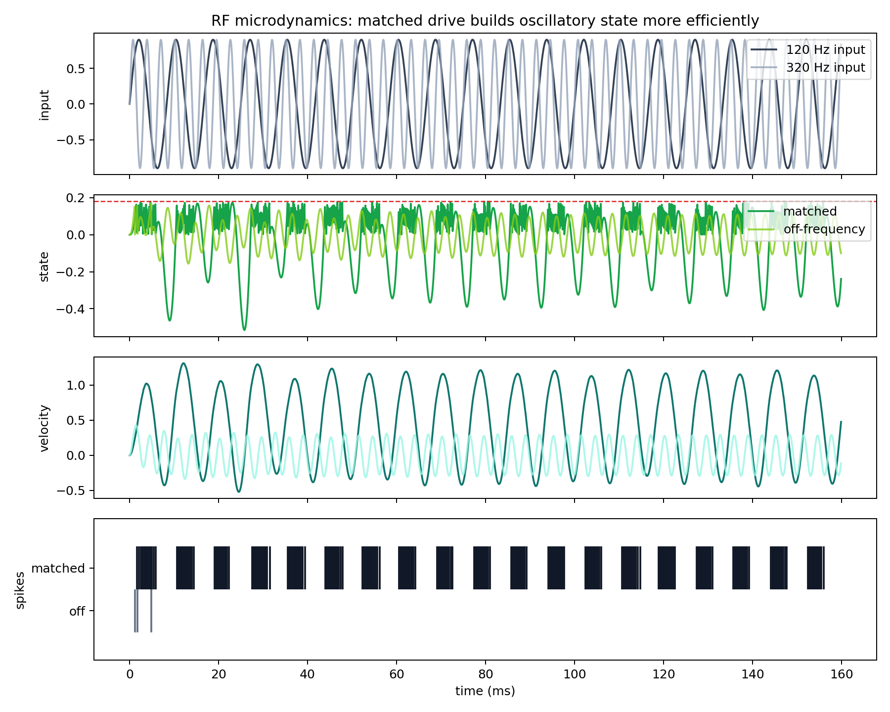
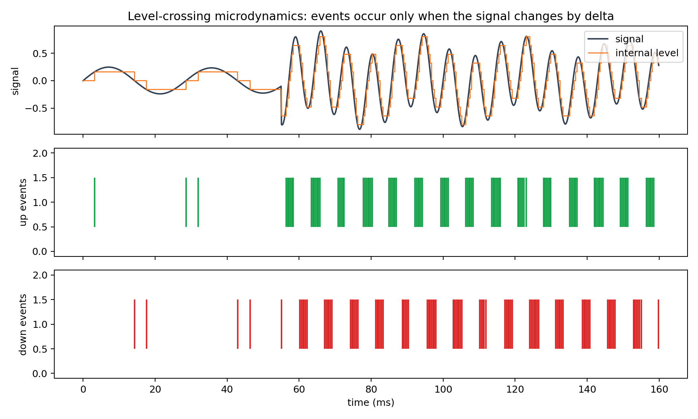
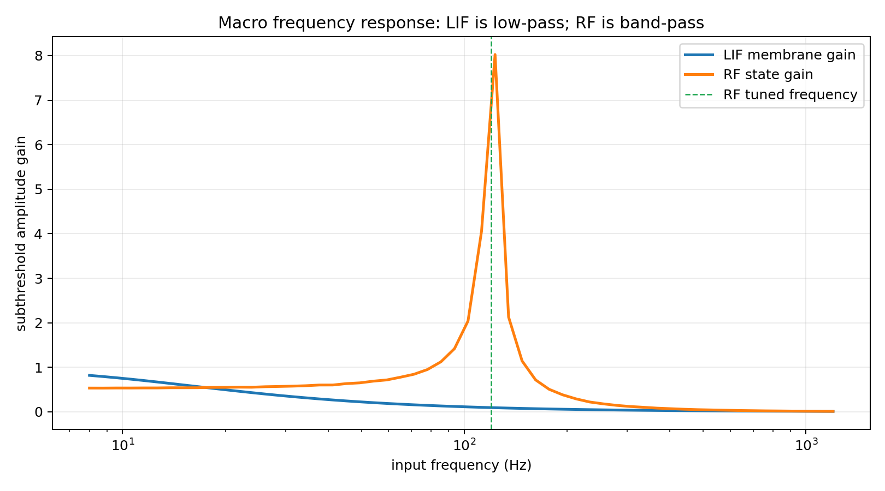
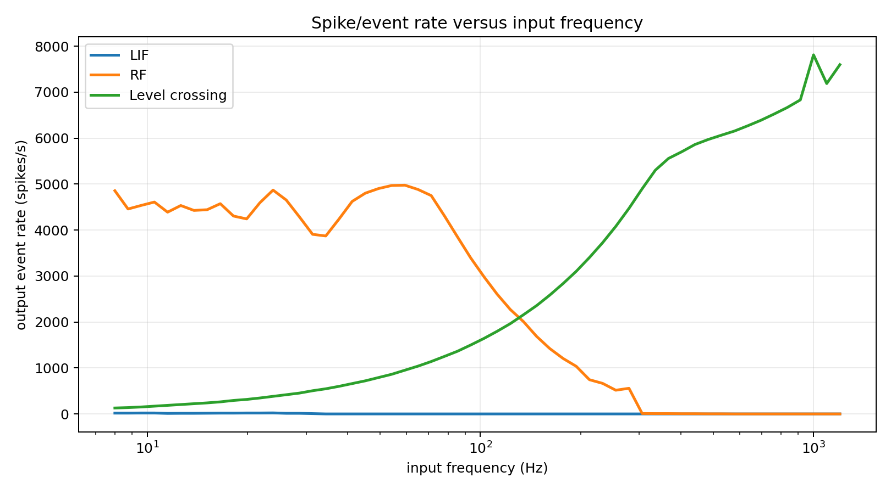
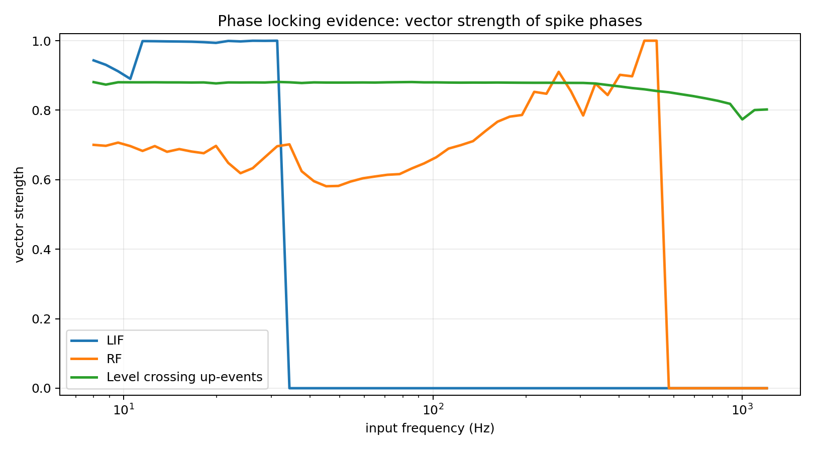
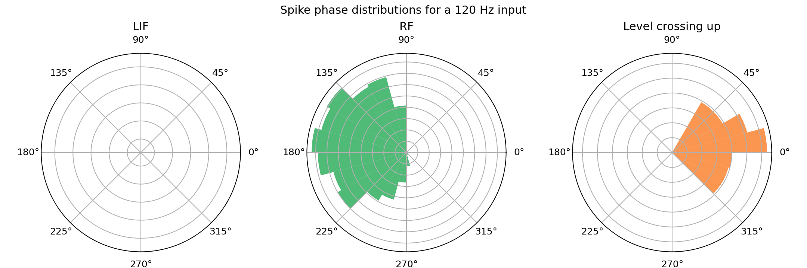

# Mini Model 1: Neuron Analysis

This mini model compares three neuron/encoder types that are candidates for the new model design: LIF, resonate-and-fire, and level crossing.

## Questions

- What are the mathematical definitions?
- What do their micro temporal dynamics look like?
- What macro frequency response does each produce?
- Do the spikes phase-lock to periodic input?
- Which role should each neuron type play in the redesigned model?

## Mathematical Definitions

### Leaky Integrate-and-Fire

The LIF neuron integrates input current while leaking back toward rest:

```text
v[t+1] = v[t] + dt/tau * (-v[t] + R * I[t])
spike[t] = 1 if v[t+1] >= threshold else 0
v[t+1] = v[t+1] - threshold  # subtractive reset when spiking
```

It behaves like a low-pass evidence accumulator. Closely spaced inputs sum; isolated inputs decay before reaching threshold.

### Resonate-and-Fire

The RF neuron is a damped second-order oscillator with a spike threshold:

```text
velocity[t+1] = decay * velocity[t] + input_gain * I[t] - theta * state[t]
state[t+1] = state[t] + theta * velocity[t+1]
spike[t] = 1 if state[t+1] >= threshold else 0
state[t+1] = state[t+1] - threshold  # subtractive reset when spiking
```

It behaves like a band-pass detector. Inputs near the resonant frequency build state more efficiently than off-frequency inputs.

### Level-Crossing Encoder

The level-crossing neuron emits events when the signal changes by a fixed amount:

```text
if signal[t] - reference >= delta: emit up event; reference += delta
if reference - signal[t] >= delta: emit down event; reference -= delta
```

This is closer to asynchronous delta modulation than to a standard rate encoder. It encodes change rather than absolute signal level.

## Micro Temporal Dynamics







## Macro Frequency Response



The RF neuron peaked at approximately `123.0 Hz` in this sweep, close to the configured `120 Hz` resonant frequency. The LIF membrane response behaved as a low-pass filter; its rough half-gain point in this setup was around `26.1 Hz`.



The level-crossing encoder produces more events as the signal oscillates faster, provided the signal crosses enough delta levels. This is useful for change detection, but its event count is not the same thing as a firing-rate estimate from a LIF neuron.

## Phase Locking



Vector strength measures how concentrated spike phases are within the input cycle. A value near `1` indicates strong phase locking; a value near `0` indicates weak or dispersed locking.



The LIF neuron phase-locks when periodic input repeatedly drives it over threshold at a consistent phase. The RF neuron phase-locks most clearly near its resonant band. The level-crossing encoder phase-locks strongly to waveform crossings, especially if up-events and down-events are considered separately.

## Interpretation For The New Model

| Neuron / encoder | Best role | Main strength | Main weakness |
|---|---|---|---|
| LIF | Evidence accumulation, coincidence detection, thresholded integration | Simple, robust, interpretable membrane voltage | Low-pass; can blur fast timing if time constants are too long |
| RF | Frequency-selective feature detection | Band-pass selectivity and phase-sensitive dynamics | More parameters; needs careful tuning of frequency/Q/threshold |
| Level crossing | Event-based encoding, change detection, possible cochlea simplification | Sparse, sharp temporal events, cheap comparisons | Sensitive to delta choice; loses absolute level unless multiple thresholds are used |

For the redesigned model, the cleanest division is likely:

- use LIF for coincidence/evidence accumulation and ring-map integration;
- use RF for frequency-selective or periodicity-sensitive feature detection;
- use level crossing for fast event-based front-end experiments and possibly spectral-delta notch detection.

## Generated Files

- `lif_microdynamics`: `mini_models/outputs/neuron_analysis/figures/lif_microdynamics.png`
- `rf_microdynamics`: `mini_models/outputs/neuron_analysis/figures/rf_microdynamics.png`
- `level_crossing_microdynamics`: `mini_models/outputs/neuron_analysis/figures/level_crossing_microdynamics.png`
- `frequency_gain`: `mini_models/outputs/neuron_analysis/figures/frequency_gain.png`
- `spike_rate_vs_frequency`: `mini_models/outputs/neuron_analysis/figures/spike_rate_vs_frequency.png`
- `vector_strength_vs_frequency`: `mini_models/outputs/neuron_analysis/figures/vector_strength_vs_frequency.png`
- `phase_histograms`: `mini_models/outputs/neuron_analysis/figures/phase_histograms.png`
- `results`: `mini_models/outputs/neuron_analysis/results.json`

Runtime: `1.02 s`.
