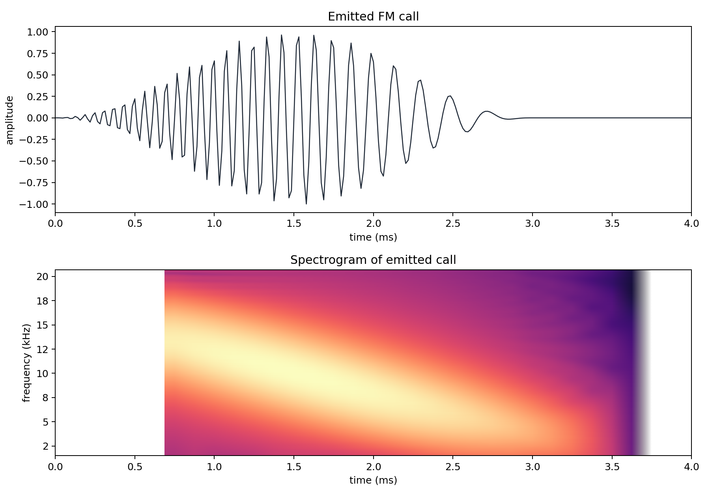
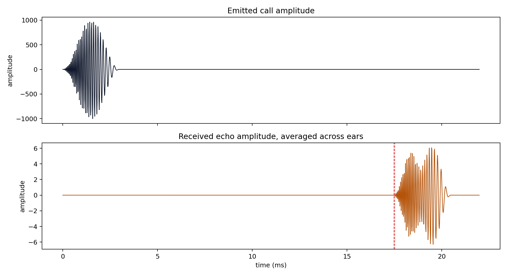
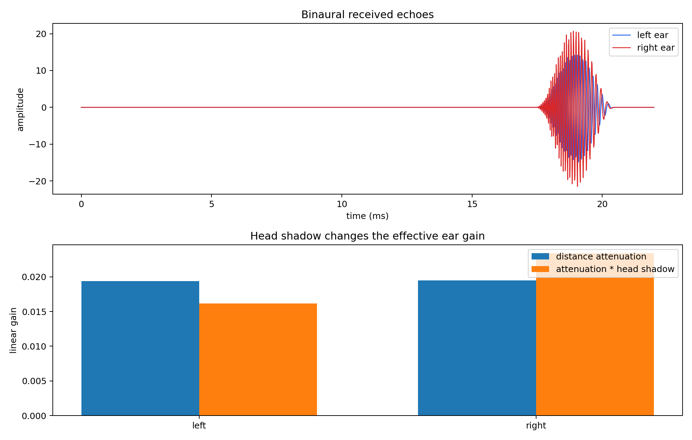
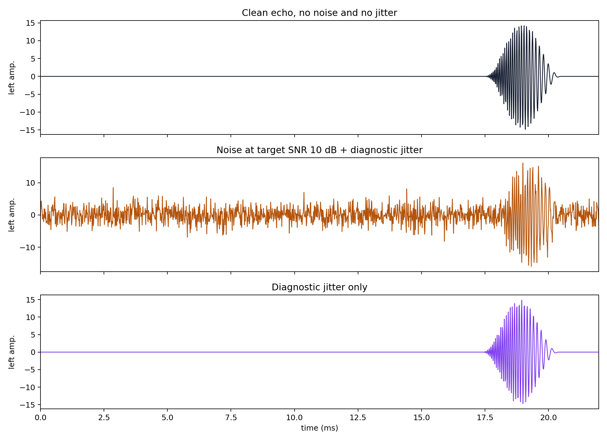
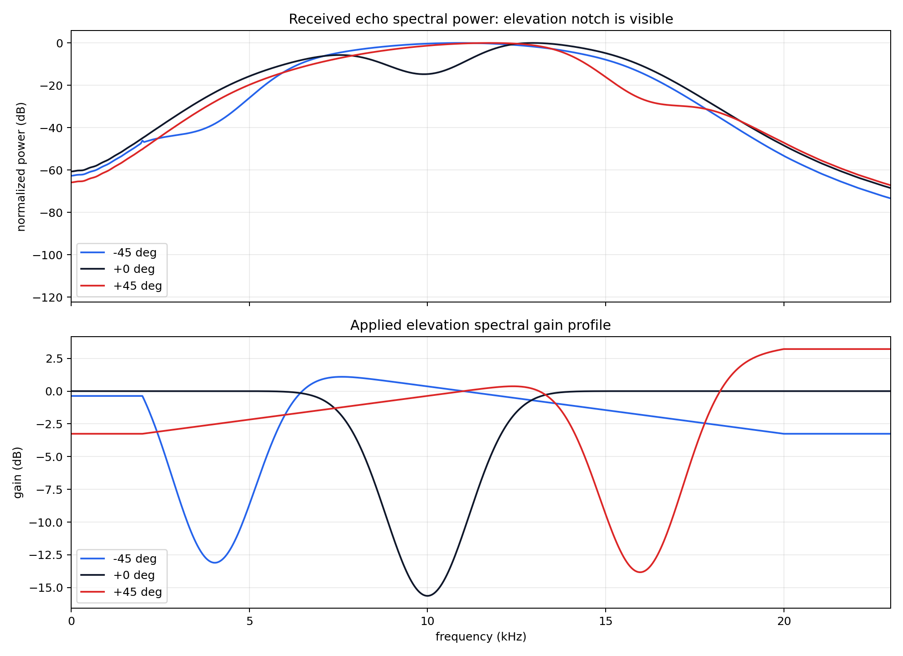
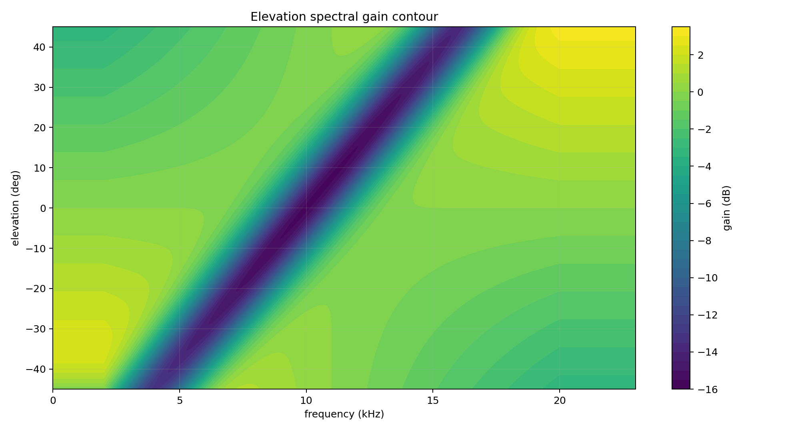
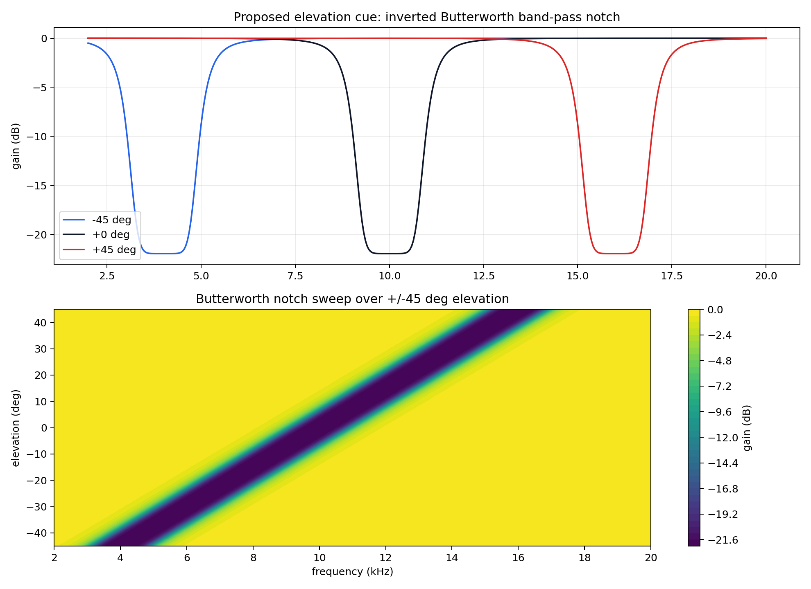
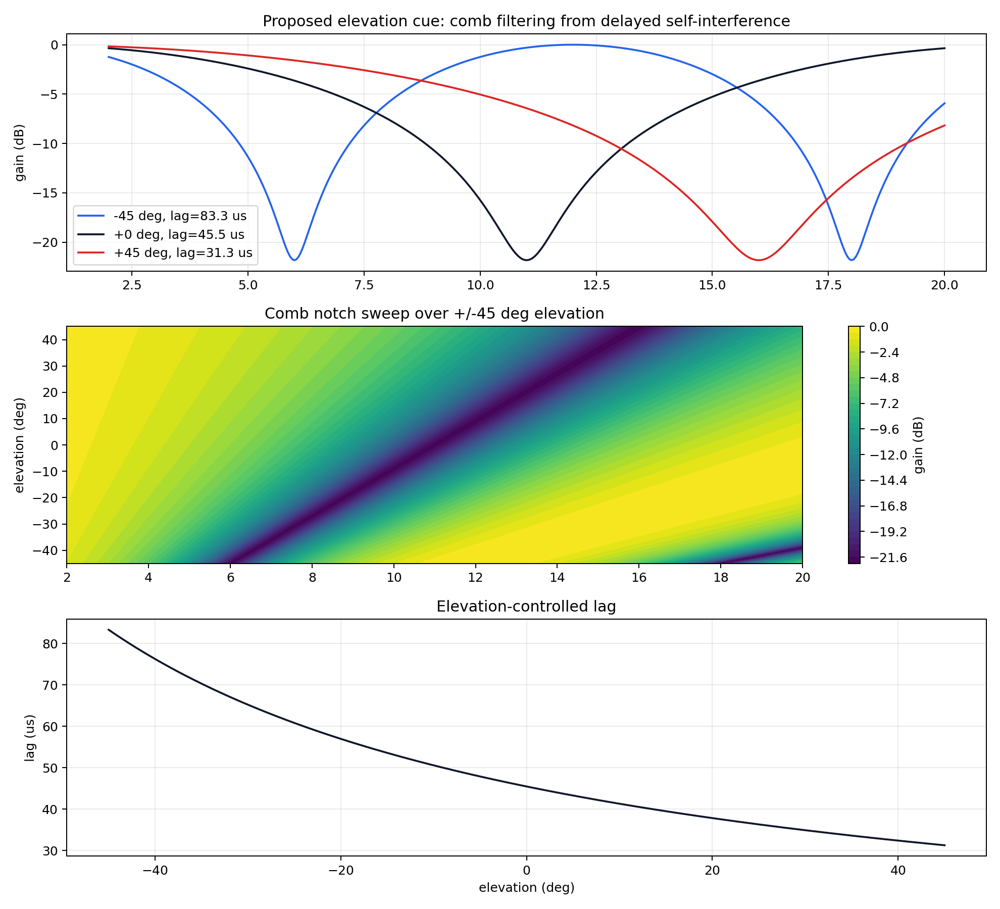

# Mini Model 2: Signal Analysis

This mini model visualizes the acoustic signal before neural processing. It is intended to justify the cues later used by the distance, azimuth, and elevation pathways.

## Configuration

| Parameter | Value |
|---|---:|
| sample rate | `64000 Hz` |
| chirp | `18000.0 -> 2000.0 Hz` |
| chirp duration | `0.003 s` |
| signal duration | `0.022 s` |
| azimuth limit for mini sweeps | `+/-45.0 deg` |
| elevation limit for mini sweeps | `+/-45.0 deg` |
| notch centre sweep | `4000.0 -> 16000.0 Hz` |
| comb first-notch sweep | `6000.0 -> 16000.0 Hz` |
| example distance | `3.0 m` |
| example azimuth | `35.0 deg` |
| example elevation | `20.0 deg` |

## 1. Emitted Call

The emitted call is a Hann-windowed FM chirp:

```text
f(t) = f_start + (f_end - f_start) * t / T
phase(t) = 2*pi * (f_start * t + 0.5 * sweep_rate * t^2)
call(t) = sin(phase(t)) * Hann(t)
```



## 2. Emitted And Received Amplitude

The echo is delayed by propagation time and reduced by inverse-square attenuation:

```text
delay = path_length / speed_of_sound + jitter
amplitude = 0.7 / max(path_length^2, 0.25)
```



## 3. Binaural Attenuation And Head Shadow

For binaural reception, the target-to-ear return distance differs slightly between ears. The head-shadow term then applies an azimuth-dependent gain:

```text
head_shadow_ear = exp(head_shadow_strength * sin(azimuth) * ear_sign)
effective_gain_ear = attenuation_ear * head_shadow_ear
```



## 4. Noise And Jitter

Noise is additive Gaussian receiver noise. Jitter perturbs the propagation delay before fractional delay is applied. The main reference plots above use a clean scene so the cue structure is visible; this panel explicitly compares clean, noisy, and jittered versions.

For visibility, this diagnostic panel targets `10.0 dB` SNR over the active echo window, giving `noise_std = 2.24151` and `jitter_std = 0.00025 s`. The base simulator default remains `noise_std = 0.008` and `jitter_std = 2.5e-05 s`.

```text
delay = path_length / speed_of_sound + Normal(0, jitter_std)
receive = echo + Normal(0, noise_std)
```



## 5. Elevation Spectral Notch

For the mini-model analysis, the current elevation cue is shown over `-45` to `+45 deg`. The notch centre is mapped from `4 kHz` to `16 kHz`, giving a `2 kHz` buffer inside the emitted `2 kHz -> 18 kHz` FM sweep. This keeps the old model untouched, but makes the proposed mini-model range explicit.

```text
elevation_scale = clip(elevation_deg / 45, -1, 1)
notch_center_hz = 4000 + (16000 - 4000) * 0.5 * (elevation_scale + 1)
notch_center = (notch_center_hz - cochlea_low_hz) / (cochlea_high_hz - cochlea_low_hz)
slope_gain = exp(slope_strength * elevation_scale * (freq_norm - 0.5))
gain *= exp(-notch_strength * exp(-0.5 * ((freq_norm - notch_center) / notch_width)^2))
```



The contour plot below shows the same elevation cue directly as applied gain, with frequency on the x-axis, elevation on the y-axis, and gain in dB as colour.



## 6. Proposed Elevation Model A: Butterworth Notch

This proposed cue removes the broad slope and creates the notch as an inverted Butterworth band-pass template. A true band-pass has maximum response at the centre frequency; subtracting it from one gives a band-stop/notch response.

```text
x = abs((freq_norm - notch_center) / notch_width)
bandpass = 1 / sqrt(1 + x^(2 * order))
gain = 1 - depth * bandpass
```

Compared with the Gaussian notch, increasing the Butterworth order makes the notch flatter at the bottom and sharper at the edges. That is useful if we want a cleaner missing-band cue for a disinhibitory elevation detector.



## 7. Proposed Elevation Model B: Comb-Interference Notches

This proposed cue also removes the broad slope. The signal is mixed with a slightly delayed copy of itself. Frequency components whose phase is opposite between the direct and delayed copy cancel, producing a comb of notches.

```text
chirp(t) = sin(2*pi*(f_start*t + 0.5*k*t^2)) * Hann(t)
y(t) = x(t) + alpha * x(t - tau)
H(f) = 1 + alpha * exp(-j * 2*pi*f*tau)
|H(f)| = sqrt(1 + alpha^2 + 2*alpha*cos(2*pi*f*tau))
Y(f) = X_chirp(f) * H(f)
|Y(f)| = |X_chirp(f)| * |H(f)|
first_notch = 1 / (2 * tau)
tau(elevation) = 1 / (2 * first_notch_frequency(elevation))
```

Changing elevation changes the lag, which moves the comb notches across frequency. This is attractive because it produces multiple notches rather than a single handcrafted notch, but it is also more periodic and could create ambiguities if several elevations produce similar notch patterns.



## Interpretation

- Distance is visible as a delay between emitted and received waveforms.
- Azimuth is visible as small timing differences and larger level differences between the two ears.
- Elevation is visible as a frequency-dependent spectral notch over the current `+/-45 deg` mini-model range.
- The Butterworth version makes the single moving notch sharper and less Gaussian.
- The comb-interference version creates several notches from one physical lag parameter.
- Noise and jitter provide the simplest robustness tests for later mini models.
- These plots support using an efference-copy template for timing comparisons rather than treating the emitted call as a literal second cochlear input.

## Generated Files

- `emitted_call_spectrogram`: `mini_models/outputs/signal_analysis/figures/emitted_call_spectrogram.png`
- `emitted_received_amplitude`: `mini_models/outputs/signal_analysis/figures/emitted_received_amplitude.png`
- `binaural_head_shadow`: `mini_models/outputs/signal_analysis/figures/binaural_head_shadow.png`
- `noise_and_jitter`: `mini_models/outputs/signal_analysis/figures/noise_and_jitter.png`
- `elevation_notch_psd`: `mini_models/outputs/signal_analysis/figures/elevation_notch_psd.png`
- `elevation_gain_contour`: `mini_models/outputs/signal_analysis/figures/elevation_gain_contour.png`
- `butterworth_notch_model`: `mini_models/outputs/signal_analysis/figures/butterworth_notch_model.png`
- `comb_interference_notch_model`: `mini_models/outputs/signal_analysis/figures/comb_interference_notch_model.png`
- `results`: `mini_models/outputs/signal_analysis/results.json`

Runtime: `0.99 s`.
