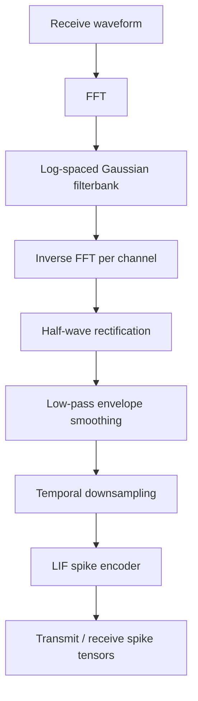

# Cochlea Explained

## Overview

This document describes the current fixed cochlea front end used by the localisation system. The example figures are generated from one clean left-ear echo scene so the transformations are easy to inspect.

Example scene:
- Distance: `1.40 m`
- Azimuth: `18.0 deg`
- Elevation: `12.0 deg`
- Binaural simulation: `on`
- Noise: `off` for clarity

## Pipeline

## Current Fixed Parameters

| Parameter | Value | Role |
| --- | --- | --- |
| `sample_rate_hz` | `256000` | Raw waveform sampling rate |
| `num_cochlea_channels` | `24` | Number of frequency channels |
| `cochlea_low_hz` | `20000` | Lowest cochlear center frequency |
| `cochlea_high_hz` | `90000` | Highest cochlear center frequency |
| `filter_bandwidth_sigma` | `0.160` | Width of the Gaussian log-frequency filters |
| `envelope_lowpass_hz` | `1800` | Envelope smoothing cutoff proxy |
| `envelope_downsample` | `4` | Temporal downsampling factor before spiking |
| `spike_threshold` | `0.42` | LIF firing threshold |
| `spike_beta` | `0.88` | LIF leak factor |

## 1. Input Signal

The cochlea receives the left-ear echo waveform. The transmitted chirp is shown alongside it for reference.

## 2. Log-Spaced Filterbank

The raw waveform is transformed into the frequency domain, multiplied by a bank of Gaussian filters in log-frequency space, and returned to the time domain channel by channel.

## 3. Per-Channel Filtered Signals

After inverse FFT, each channel contains a band-limited version of the original waveform. Low, middle, and high channels respond at different parts of the chirp.

## 4. Rectification, Smoothing, And Downsampling

Each channel is half-wave rectified, smoothed with a Hann low-pass kernel, and then downsampled. The downsampled smoothed envelope is the actual input to the spike encoder.

## 5. LIF Spike Encoding

The smoothed envelope is normalized, integrated through a fixed LIF neuron per channel, thresholded, and reset by subtraction. Spikes are therefore driven by envelope peaks in each frequency band.

## 6. Final Cochleagram And Spike Raster

The final cochleagram is the smoothed, downsampled envelope across all channels. The spike raster is the binary output that the rest of the localisation system consumes.

## Interface To The Rest Of The Model

The current barrier is after spike generation:

- transmit spikes: shape `[batch, channel, time]`
- receive spikes: shape `[batch, ear, channel, time]`

Everything downstream assumes those spike tensors already exist. That makes the current cochlea replaceable, but the easiest swap is another cochlea that preserves the same spike-tensor contract and envelope-rate time base.

## Current Interpretation

This cochlea is fixed and hand-designed. It is not currently trainable. The expensive part is the fixed FFT filterbank plus spike conversion, not the later handcrafted pathway feature extraction.
