# Cochlea Explained

## Overview

This document describes the current fixed cochlea front end used by the localisation system. The example figures are generated from one clean left-ear echo scene so the transformations are easy to inspect.

Example scene:
- Distance: `1.40 m`
- Azimuth: `18.0 deg`
- Elevation: `12.0 deg`
- Binaural simulation: `on`
- Noise: `off` for clarity

## Pipeline

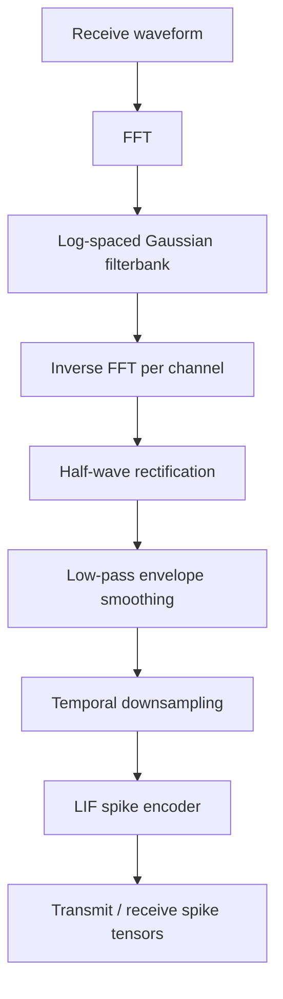
```mermaid
graph TD
    A[Receive waveform] --> B[FFT]
    B --> C[Log-spaced Gaussian filterbank]
    C --> D[Inverse FFT per channel]
    D --> E[Half-wave rectification]
    E --> F[Low-pass envelope smoothing]
    F --> G[Temporal downsampling]
    G --> H[LIF spike encoder]
    H --> I[Transmit / receive spike tensors]
```

## Current Fixed Parameters

| Parameter | Value | Role |
| --- | --- | --- |
| `sample_rate_hz` | `256000` | Raw waveform sampling rate |
| `num_cochlea_channels` | `24` | Number of frequency channels |
| `cochlea_low_hz` | `20000` | Lowest cochlear center frequency |
| `cochlea_high_hz` | `90000` | Highest cochlear center frequency |
| `filter_bandwidth_sigma` | `0.160` | Width of the Gaussian log-frequency filters |
| `envelope_lowpass_hz` | `1800` | Envelope smoothing cutoff proxy |
| `envelope_downsample` | `4` | Temporal downsampling factor before spiking |
| `spike_threshold` | `0.42` | LIF firing threshold |
| `spike_beta` | `0.88` | LIF leak factor |

## 1. Input Signal

The cochlea receives the left-ear echo waveform. The transmitted chirp is shown alongside it for reference.

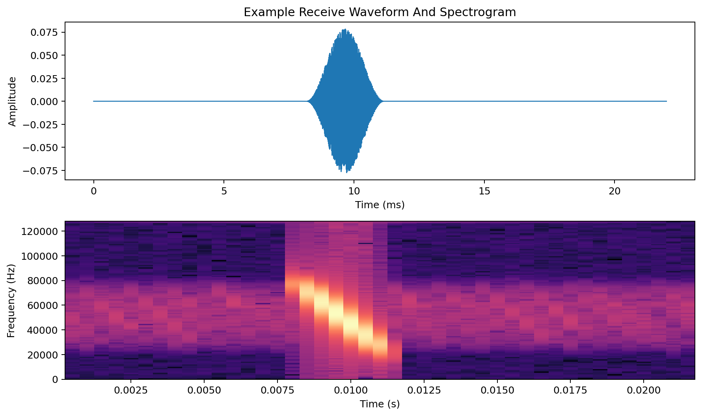
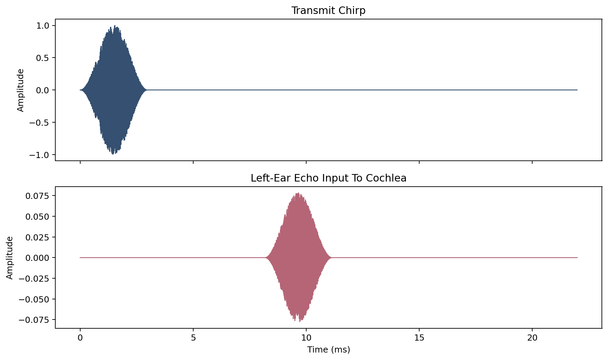

## 2. Log-Spaced Filterbank

The raw waveform is transformed into the frequency domain, multiplied by a bank of Gaussian filters in log-frequency space, and returned to the time domain channel by channel.

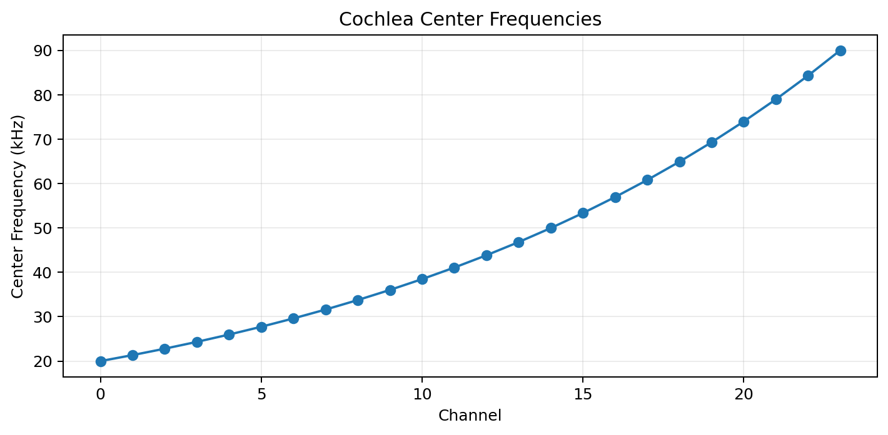
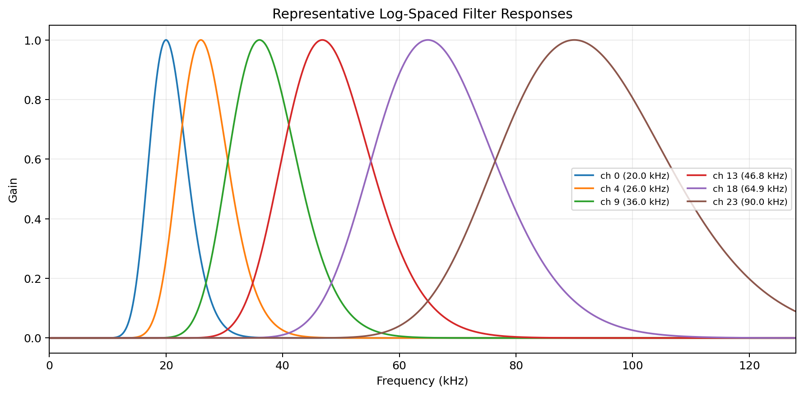
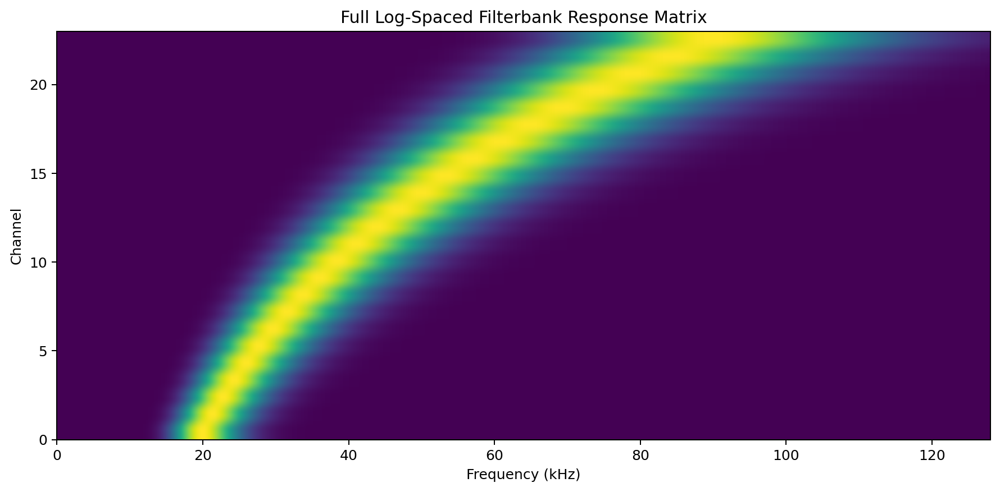

## 3. Per-Channel Filtered Signals

After inverse FFT, each channel contains a band-limited version of the original waveform. Low, middle, and high channels respond at different parts of the chirp.

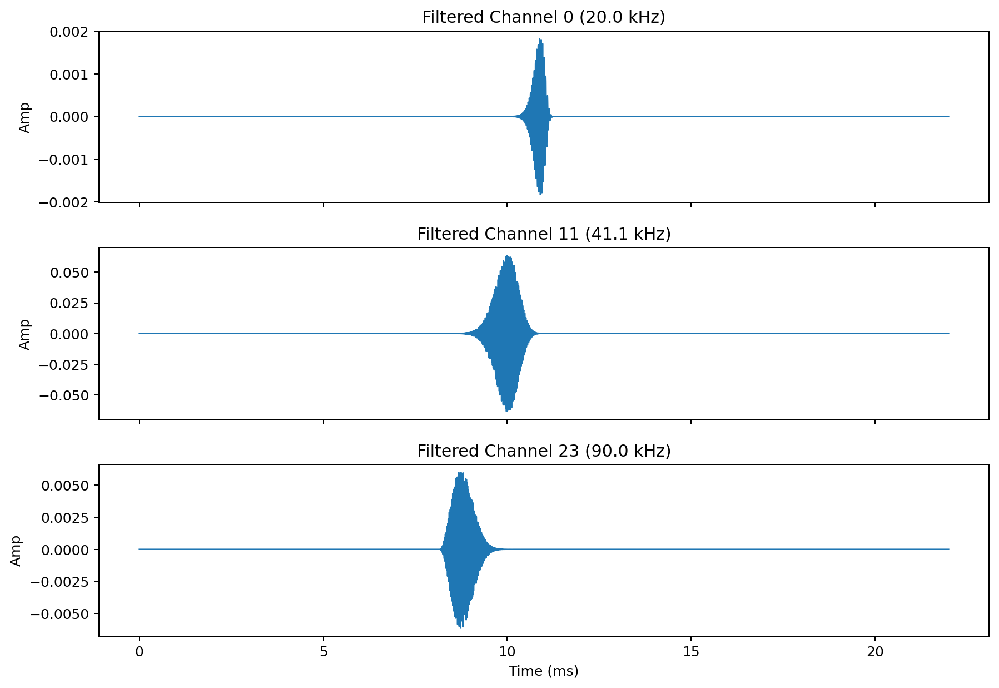

## 4. Rectification, Smoothing, And Downsampling

Each channel is half-wave rectified, smoothed with a Hann low-pass kernel, and then downsampled. The downsampled smoothed envelope is the actual input to the spike encoder.

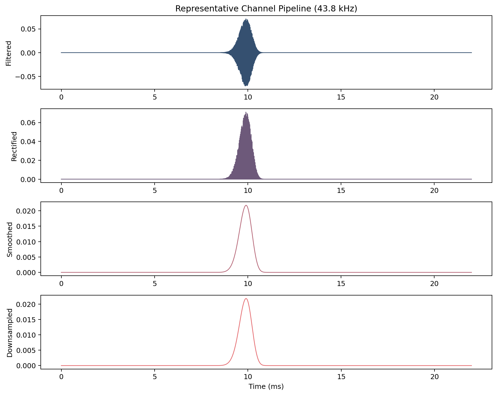
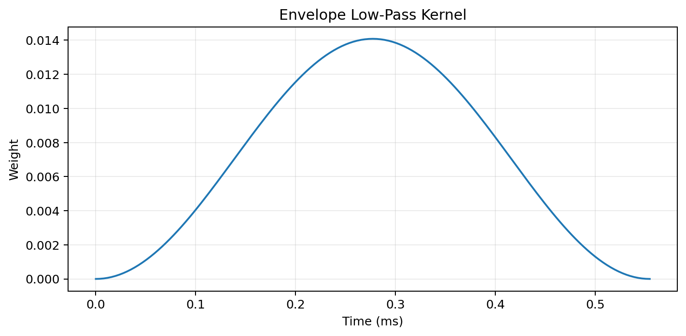

## 5. LIF Spike Encoding

The smoothed envelope is normalized, integrated through a fixed LIF neuron per channel, thresholded, and reset by subtraction. Spikes are therefore driven by envelope peaks in each frequency band.

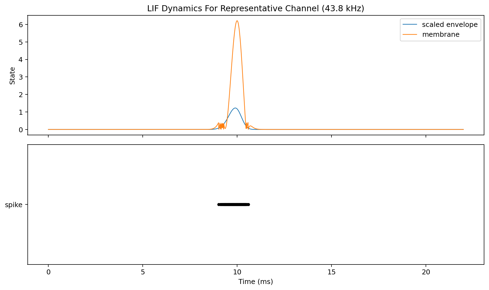

## 6. Final Cochleagram And Spike Raster

The final cochleagram is the smoothed, downsampled envelope across all channels. The spike raster is the binary output that the rest of the localisation system consumes. This figure is zoomed to the actual echo window so the short FM sweep is visible on the millisecond axis.

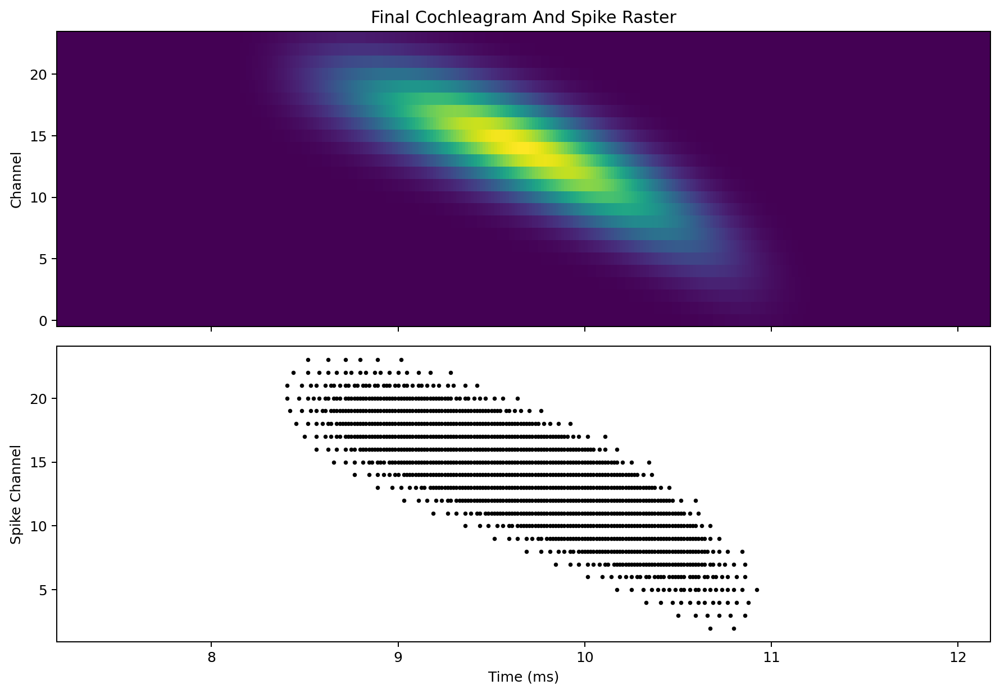

## Interface To The Rest Of The Model

The current barrier is after spike generation:

- transmit spikes: shape `[batch, channel, time]`
- receive spikes: shape `[batch, ear, channel, time]`

Everything downstream assumes those spike tensors already exist. That makes the current cochlea replaceable, but the easiest swap is another cochlea that preserves the same spike-tensor contract and envelope-rate time base.

## Current Interpretation

This cochlea is fixed and hand-designed. It is not currently trainable. The expensive part is the fixed FFT filterbank plus spike conversion, not the later handcrafted pathway feature extraction.

## Bandwidth And Sampling Experiment

This comparison tests the effect of lowering the acoustic and cochlear bandwidth and reducing the sampling rate on the full short-data combined-all localisation system.

Protocol:
- Ultrasonic baseline: saved short-data round-2 combined-all result using the existing `20 kHz to 90 kHz` cochlea, `80 kHz to 20 kHz` chirp, and `256 kHz` sample rate.
- Human-band analogue: fresh rerun of the same short-data combined-all model with cochlea range `20 Hz to 20 kHz`, sample rate `64 kHz`, and a practical downward FM chirp `18 kHz to 2 kHz`.
- Matched human-band analogue: second fresh rerun with the same `64 kHz` sample rate and `18 kHz to 2 kHz` chirp, but with the cochlea restricted to the active signal band `2 kHz to 20 kHz`.
- The lower chirp edge was not set literally to `20 Hz` because a `3 ms` chirp cannot meaningfully encode 20 Hz content; one 20 Hz period is `50 ms`.
- Same dataset size and training budget: `700 / 150 / 150`, `10` epochs, one thread, no Optuna retuning.
- The original wide human-band result is retained below for comparison; the new matched-band result is additional.

Runtime comparison:
- Ultrasonic baseline total: `1115.77 s`
- Human-band analogue total: `143.36 s`
- Overall speedup: `7.78x`
- Prep speedup: `20.68x`
- Training speedup: `7.05x`
- Matched human-band total: `142.92 s`
- Matched overall speedup: `7.81x`
- Matched prep speedup: `29.47x`
- Matched training speedup: `6.95x`

Accuracy comparison:
- Ultrasonic combined error: `0.0789`
- Human-band combined error: `0.1288`
- Matched human-band combined error: `0.1221`
- Ultrasonic distance / azimuth / elevation: `0.0636 m`, `3.5316 deg`, `5.6846 deg`
- Human-band distance / azimuth / elevation: `0.0890 m`, `7.9520 deg`, `9.2961 deg`
- Matched human-band distance / azimuth / elevation: `0.0946 m`, `7.8027 deg`, `8.4785 deg`
- Ultrasonic Euclidean error: `0.2332 m`
- Human-band Euclidean error: `0.4231 m`
- Matched human-band Euclidean error: `0.3964 m`

Interpretation:
- This is not only a cochlea-bandwidth change. It also reduces raw waveform sampling resolution and moves the chirp into a much lower carrier band.
- The comparison therefore measures the practical effect of a lower-bandwidth, lower-sample-rate auditory front end on the full localisation stack.
- The matched human-band variant specifically tests whether excluding irrelevant sub-2 kHz channels helps once the signal itself only occupies `2 kHz to 18 kHz`.
- Because the downstream model was not retuned for either human-band configuration, both should be treated as direct transfer tests rather than optimized redesigns.

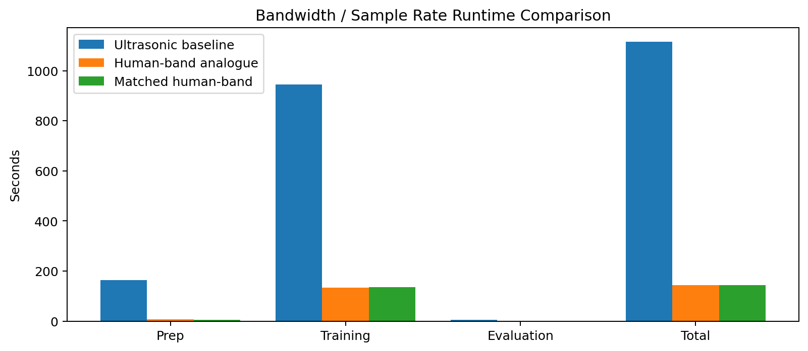
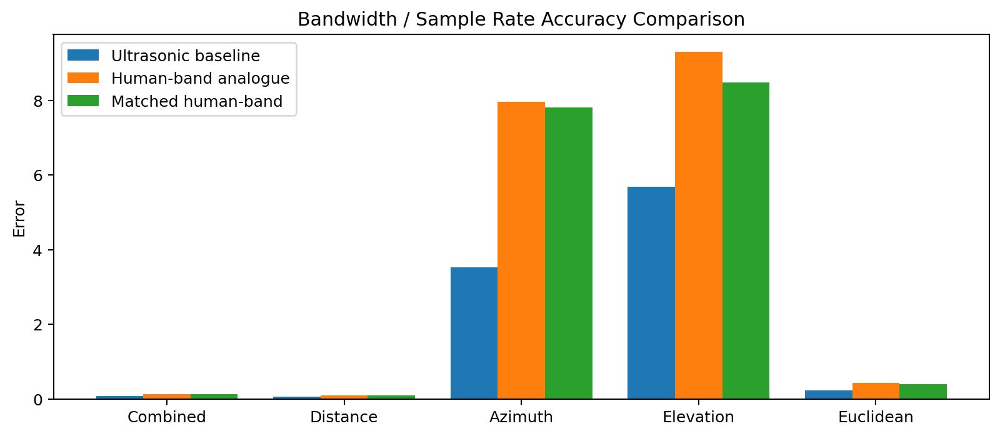
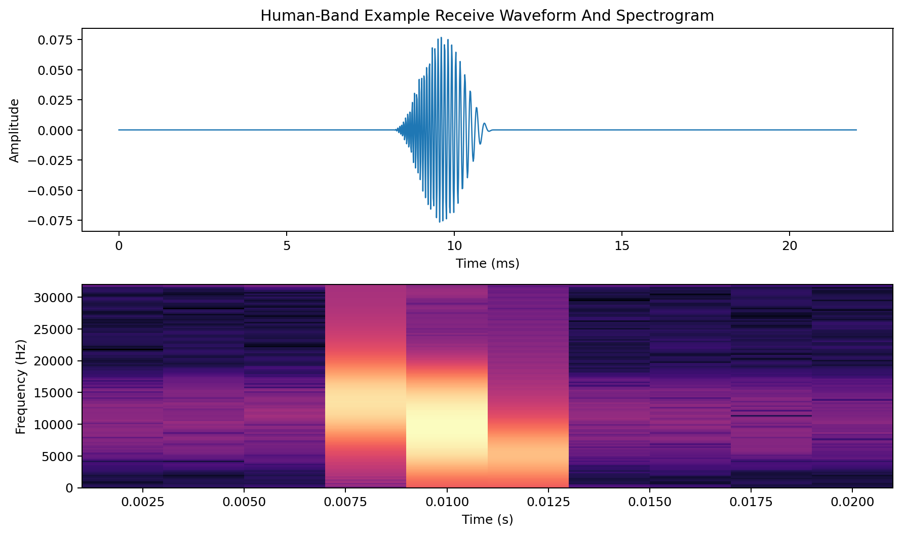
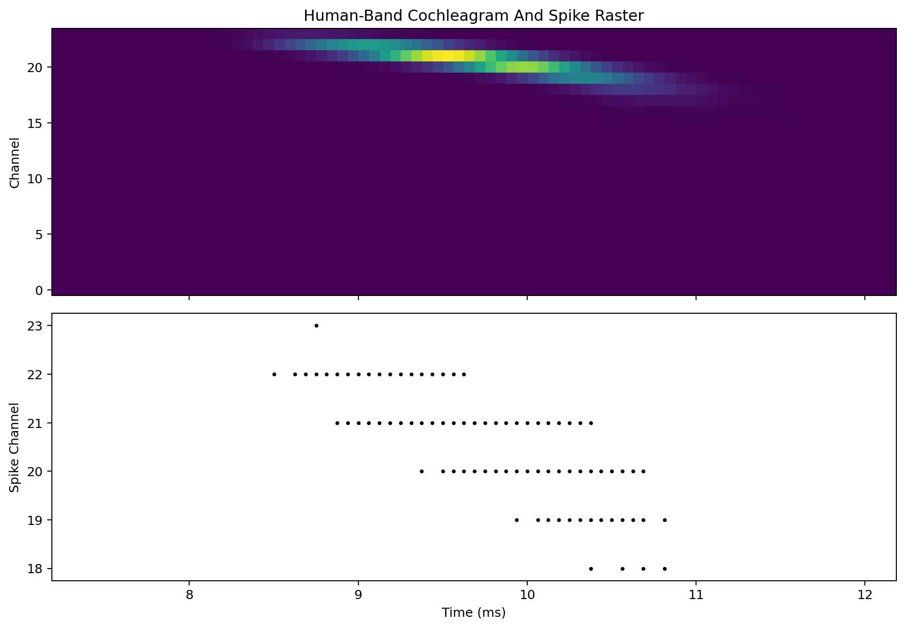
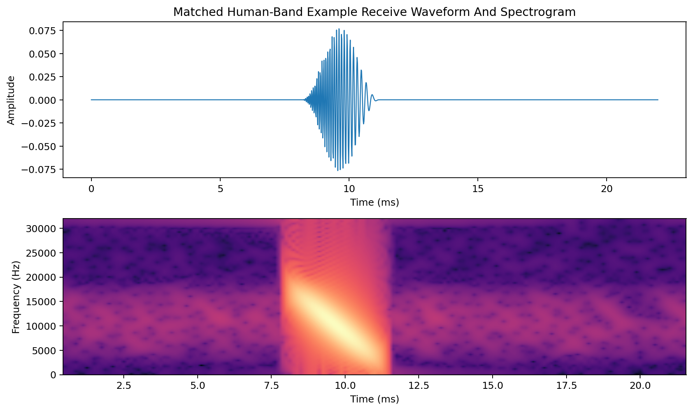
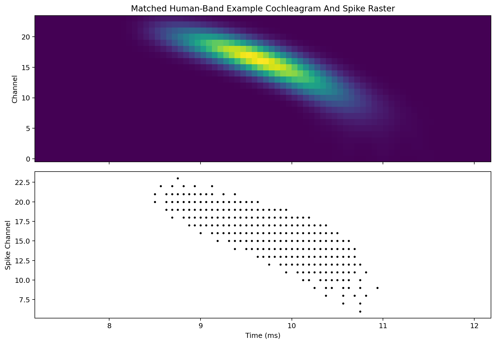

## Channel Count And Spacing Experiments

This comparison keeps the matched human-band setup as the baseline and changes one cochlea design variable at a time.

Protocol:
- Matched human-band baseline: `48` cochlea channels, `log` spacing, `2 kHz to 20 kHz` cochlea range, downstream model width `48`.
- Dense-channel variant: same matched human-band setup, but increase only the cochlea front end to `700` channels while keeping the downstream model width fixed at `48` via channel-axis compression at the cochlea boundary.
- Mel-spacing variant: same matched human-band setup and channel count, but replace the log-spaced cochlea with a mel-spaced cochlea.
- Same dataset and training budget for all three: `700 / 150 / 150`, `10` epochs, one thread, no Optuna retuning.

Runtime comparison against the matched human-band baseline:
- Matched log baseline total: `142.92 s`
- Matched log 700-channel total: `336.95 s` (`2.36x` baseline)
- Matched log 700-channel prep / training multipliers: `32.66x`, `1.13x`
- Matched mel total: `170.06 s` (`1.19x` baseline)
- Matched mel prep / training multipliers: `1.01x`, `1.20x`

Accuracy comparison against the matched human-band baseline:
- Matched log baseline combined / Euclidean: `0.1221`, `0.3964 m`
- Matched log baseline distance / azimuth / elevation: `0.0946 m`, `7.8027 deg`, `8.4785 deg`
- Matched log 700-channel combined / Euclidean: `0.1088`, `0.3585 m`
- Matched log 700-channel distance / azimuth / elevation: `0.0859 m`, `7.1216 deg`, `7.5448 deg`
- Matched mel combined / Euclidean: `0.1222`, `0.4004 m`
- Matched mel distance / azimuth / elevation: `0.0812 m`, `7.2090 deg`, `8.8032 deg`

Interpretation:
- The `700`-channel test isolates the cost and benefit of much finer cochlear frequency resolution under the same matched human-band chirp and training budget, without also widening the downstream combined model.
- The mel-spacing test isolates a change in channel placement along frequency while keeping the rest of the front end and downstream model structure fixed.
- In this implementation, the mel-spaced bank uses mel-spaced centers with the same Gaussian FFT filter construction and a bandwidth rescaling so filter width stays comparable across the covered band.

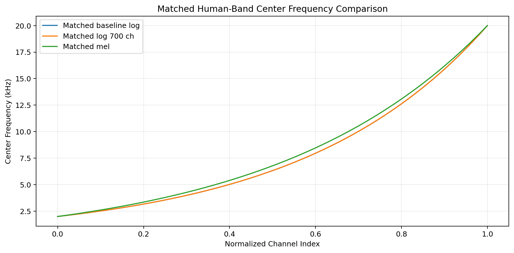
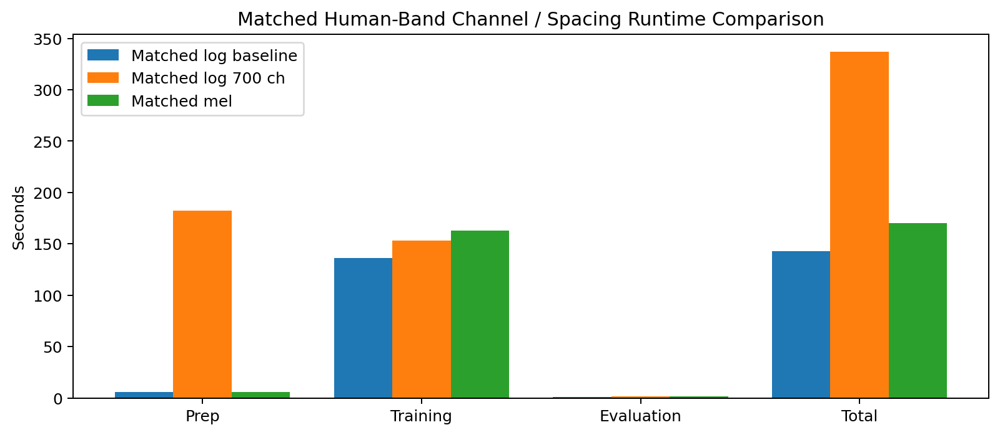
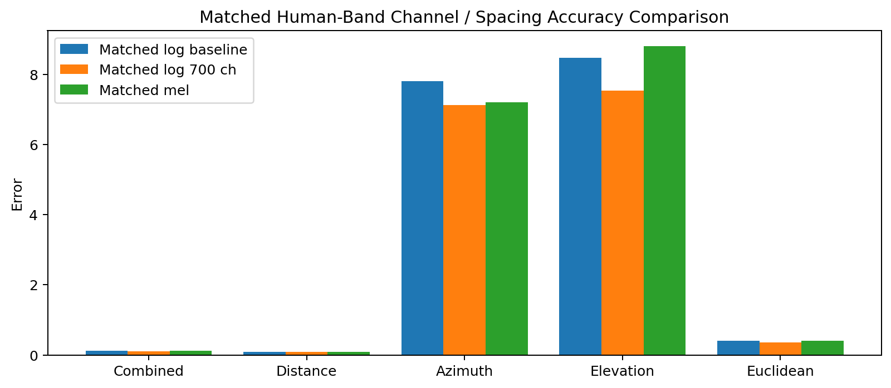
