# Combined Experiment Report

## Scope

- Baseline reference: `pathway_split_enhanced trial 10`
- Baseline source: reused existing training-improved baseline
- Dataset split: `3500 / 750 / 750` synthetic scenes (`70% / 15% / 15%` of 5000 total)
- Max epochs: `50`
- Early stopping patience: `10`
- Scheduler: `ReduceLROnPlateau` with patience `4` and factor `0.5`
- Backend threads: `1`
- Run device: `cpu`
- Previous MPS baseline status: `FAILED`

MPS was not retried here because the previous long-training baseline already failed on an unsupported op: `NotImplementedError: aten::logspace.out is not currently implemented for the MPS device during cochlea_filterbank center-frequency construction.`.

## Baseline Reference

- Combined error: `0.0648`
- Distance MAE: `0.0350 m`
- Azimuth MAE: `2.5537 deg`
- Elevation MAE: `5.1750 deg`

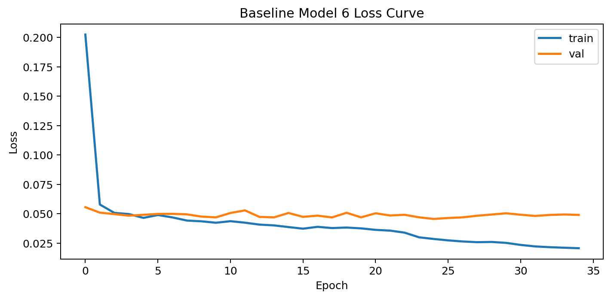

## Combined Design

- Change: Combine the accepted architectural changes from Experiments 1 and 5 inside the elevation pathway and train them with the corrected per-task objective from Experiments 2 and 3.
- Rationale: Experiments 1 and 5 each improved elevation while preserving the baseline distance and azimuth inductive bias, and Experiments 2 and 3 improved task balance through better-scaled losses. This run tests whether those gains stack when they are applied together under the same long-training regime.

Implemented steps:
- Step 1: keep the handcrafted distance and azimuth pathways unchanged so the strong timing and binaural cues remain intact.
- Step 2: add the residual learned spectral CNN from Experiment 1 inside the elevation pathway.
- Step 3: add the residual elevation SConv2dLSTM context branch from Experiment 5 in parallel with the spectral CNN.
- Step 4: fuse both residual elevation corrections back into the baseline elevation latent with small learned gains.
- Step 5: train with corrected per-task normalization from Experiment 2 and uncertainty weighting with warm-up from Experiment 3.

This combines the accepted pieces as follows:
- Experiment 1 contribution: residual learned spectral CNN in the elevation branch.
- Experiment 2 contribution: corrected per-task normalization in the localisation loss.
- Experiment 3 contribution: uncertainty-weighted task balancing with warm-up and manual-weight initialization.
- Experiment 5 contribution: residual elevation SConv2dLSTM branch for spectral-temporal context.

## Result

- Decision: `ACCEPTED`
- Accepted under fixed-baseline rule: `True`
- Executed epochs: `50`
- Best epoch: `44`
- Early stopped: `False`
- Initial learning rate: `0.002662`
- Final learning rate: `0.000166`
- Data preparation time: `689.89 s`
- Training time: `5552.32 s`
- Evaluation time: `12.67 s`
- Total runtime: `6254.89 s`

- Test combined error: `0.0623`
- Test distance MAE: `0.0216 m`
- Test azimuth MAE: `2.1857 deg`
- Test elevation MAE: `5.1975 deg`
- Combined error delta vs baseline: `-0.0025`
- Distance delta vs baseline: `-0.0134`
- Azimuth delta vs baseline: `-0.3680`
- Elevation delta vs baseline: `0.0225`
- Learned sigma distance: `0.1192`
- Learned sigma azimuth: `0.2730`
- Learned sigma elevation: `0.5394`

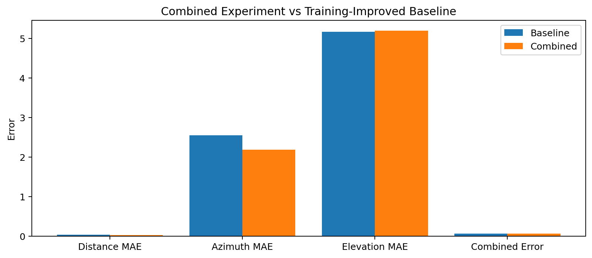
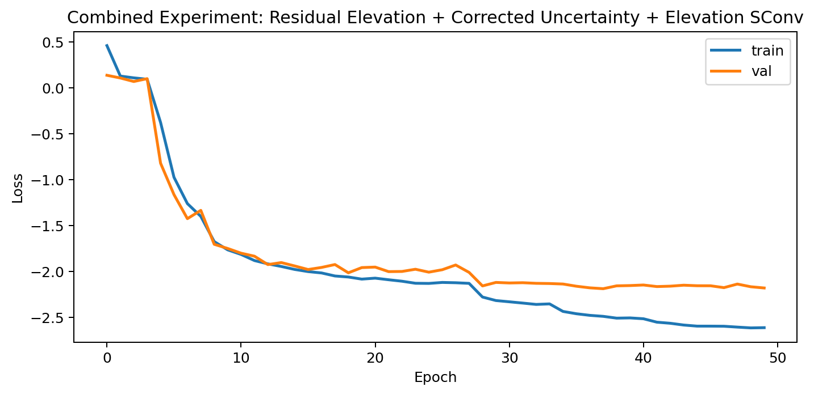
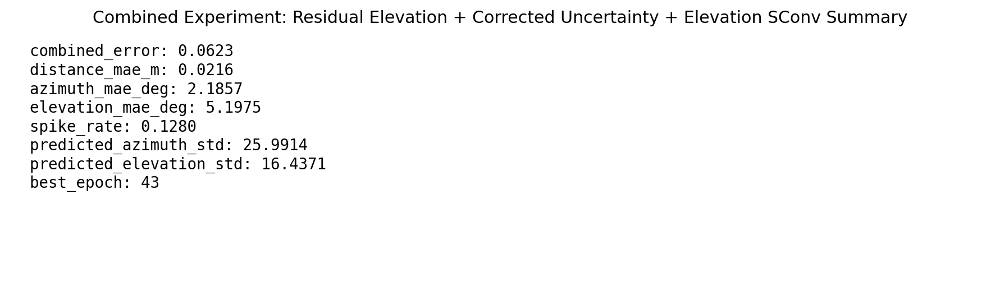
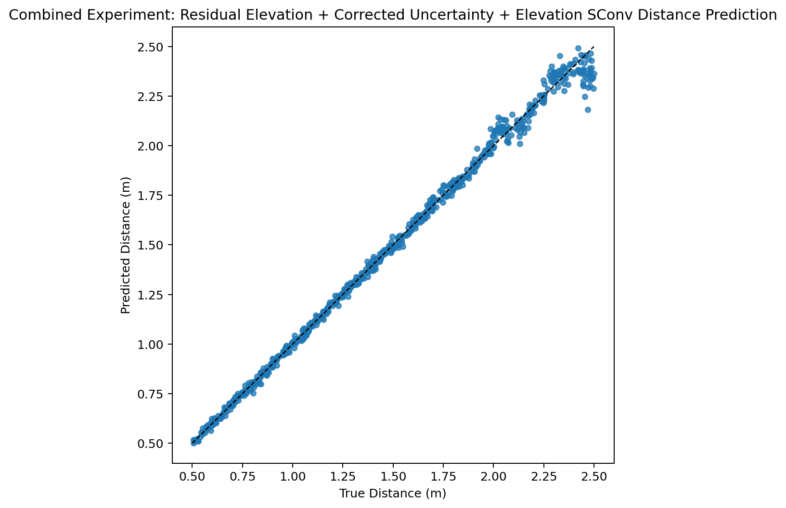
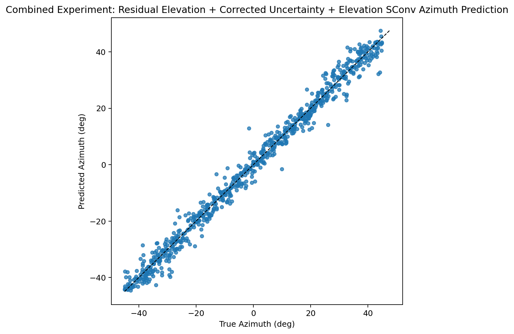
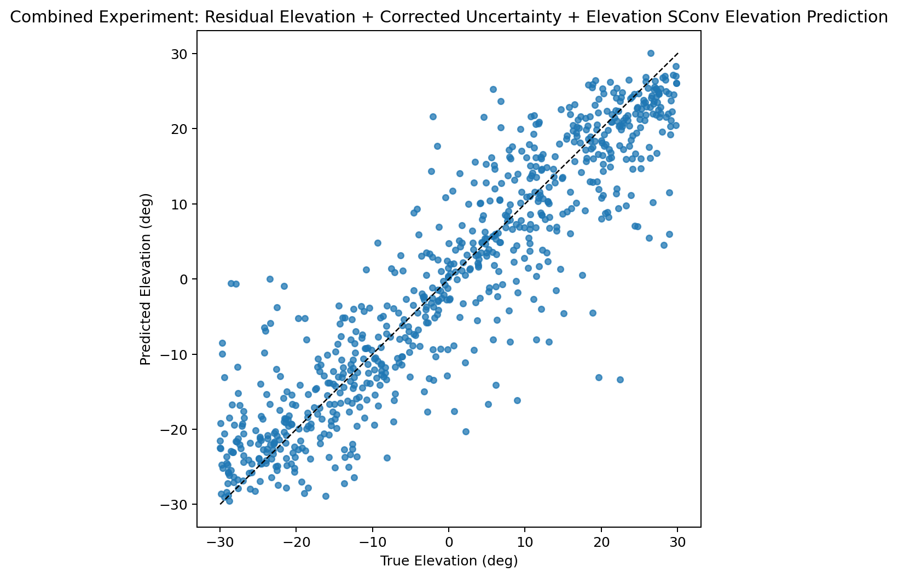

## Interpretation

- This run tests whether the two accepted elevation-pathway changes stack while the loss correction keeps distance and angle training balanced.
- Because the distance and azimuth branches stayed handcrafted, any gain here should be attributable mainly to the combined elevation augmentation and the corrected task weighting.
- Acceptance still requires beating the same long-training CPU baseline on combined error and at least one individual metric.

## Reduced Data Check

This section reuses the saved long-training result above and compares it against a smaller run of the same combined model.
- Reduced-data split: `700 / 150 / 150`
- Reduced-data max epochs: `10`
- Reduced-data decision: `REJECTED`
- Reduced-data executed epochs: `10`
- Reduced-data best epoch: `7`
- Reduced-data early stopped: `False`
- Reduced-data total runtime: `364.14 s`
- Reduced-data training time: `230.08 s`
- Relative speedup vs long training: `17.18x`

- Reduced-data combined error: `0.0894`
- Reduced-data distance MAE: `0.0997 m`
- Reduced-data azimuth MAE: `4.2173 deg`
- Reduced-data elevation MAE: `5.7061 deg`
- Combined error delta vs long training: `0.0271`
- Distance delta vs long training: `0.0781`
- Azimuth delta vs long training: `2.0316`
- Elevation delta vs long training: `0.5086`

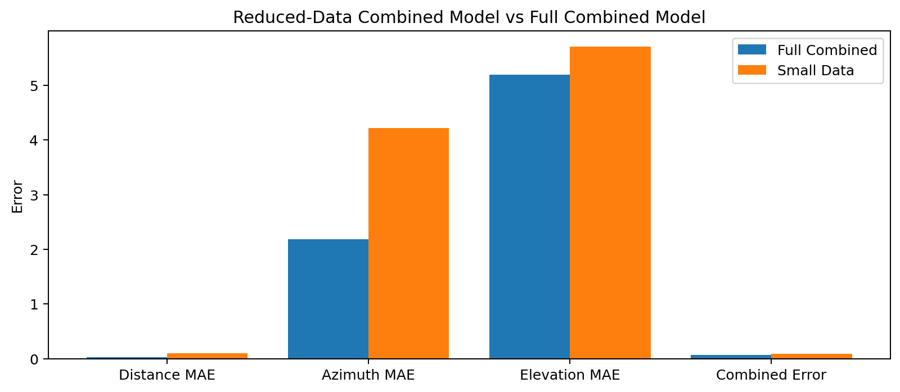
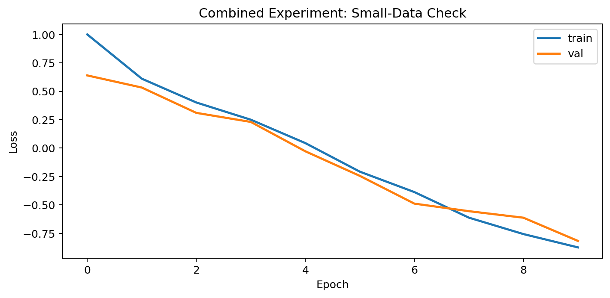
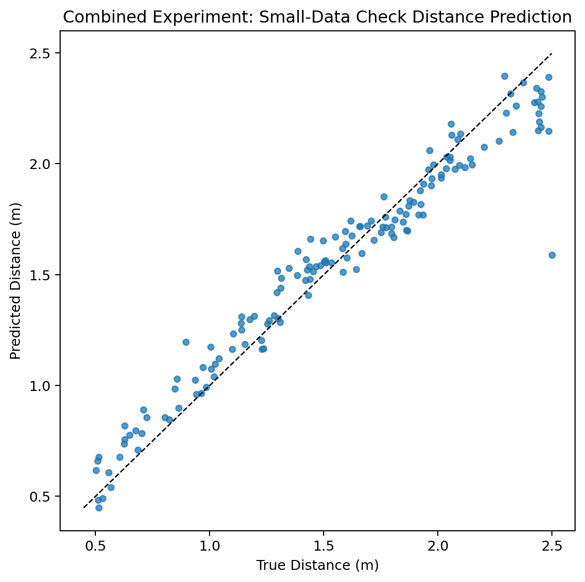
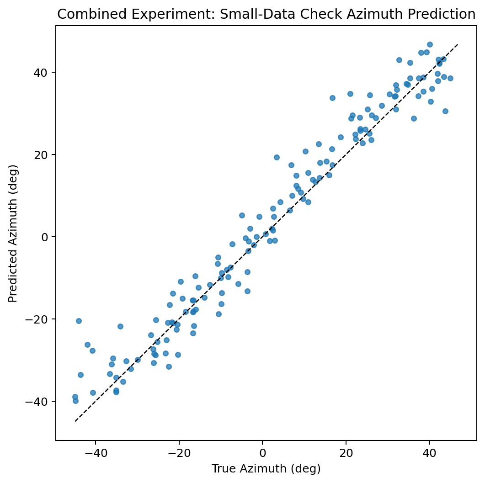
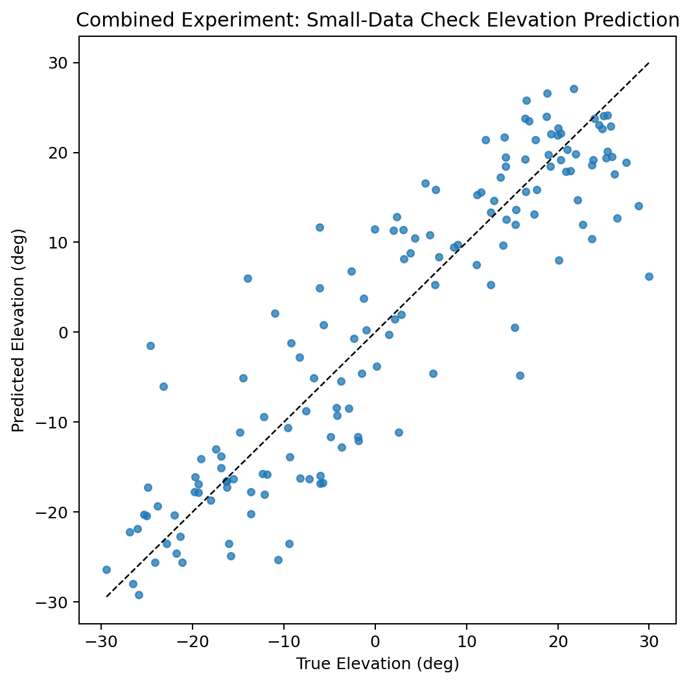

## Remaining Follow-Up

- Ablate the CNN and SConv residual gains separately after training to measure which elevation correction carries the improvement.
- Retry the same combined variant on MPS only after the cochlea front-end avoids unsupported torch.logspace operations.
- Promote the combined model to a larger confirmation run only if it clearly beats the fixed training-improved baseline.