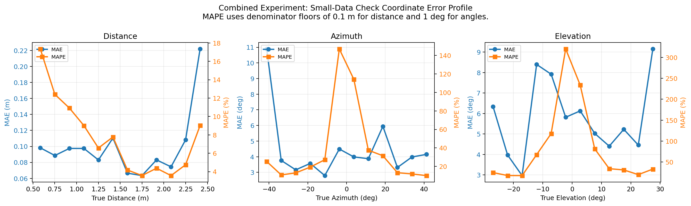

# Combined Experiment Report

## Scope

- Baseline reference: `pathway_split_enhanced trial 10`
- Baseline source: reused existing training-improved baseline
- Dataset split: `3500 / 750 / 750` synthetic scenes (`70% / 15% / 15%` of 5000 total)
- Max epochs: `50`
- Early stopping patience: `10`
- Scheduler: `ReduceLROnPlateau` with patience `4` and factor `0.5`
- Backend threads: `1`
- Run device: `cpu`
- Previous MPS baseline status: `FAILED`

MPS was not retried here because the previous long-training baseline already failed on an unsupported op: `NotImplementedError: aten::logspace.out is not currently implemented for the MPS device during cochlea_filterbank center-frequency construction.`.

## Baseline Reference

- Combined error: `0.0648`
- Distance MAE: `0.0350 m`
- Azimuth MAE: `2.5537 deg`
- Elevation MAE: `5.1750 deg`

## Combined Design

- Change: Combine the accepted architectural changes from Experiments 1 and 5 inside the elevation pathway and train them with the corrected per-task objective from Experiments 2 and 3.
- Rationale: Experiments 1 and 5 each improved elevation while preserving the baseline distance and azimuth inductive bias, and Experiments 2 and 3 improved task balance through better-scaled losses. This run tests whether those gains stack when they are applied together under the same long-training regime.

Implemented steps:
- Step 1: keep the handcrafted distance and azimuth pathways unchanged so the strong timing and binaural cues remain intact.
- Step 2: add the residual learned spectral CNN from Experiment 1 inside the elevation pathway.
- Step 3: add the residual elevation SConv2dLSTM context branch from Experiment 5 in parallel with the spectral CNN.
- Step 4: fuse both residual elevation corrections back into the baseline elevation latent with small learned gains.
- Step 5: train with corrected per-task normalization from Experiment 2 and uncertainty weighting with warm-up from Experiment 3.

This combines the accepted pieces as follows:
- Experiment 1 contribution: residual learned spectral CNN in the elevation branch.
- Experiment 2 contribution: corrected per-task normalization in the localisation loss.
- Experiment 3 contribution: uncertainty-weighted task balancing with warm-up and manual-weight initialization.
- Experiment 5 contribution: residual elevation SConv2dLSTM branch for spectral-temporal context.

## Result

- Decision: `ACCEPTED`
- Accepted under fixed-baseline rule: `True`
- Executed epochs: `50`
- Best epoch: `44`
- Early stopped: `False`
- Initial learning rate: `0.002662`
- Final learning rate: `0.000166`
- Data preparation time: `689.89 s`
- Training time: `5552.32 s`
- Evaluation time: `12.67 s`
- Total runtime: `6254.89 s`

- Test combined error: `0.0623`
- Test distance MAE: `0.0216 m`
- Test azimuth MAE: `2.1857 deg`
- Test elevation MAE: `5.1975 deg`
- Combined error delta vs baseline: `-0.0025`
- Distance delta vs baseline: `-0.0134`
- Azimuth delta vs baseline: `-0.3680`
- Elevation delta vs baseline: `0.0225`
- Learned sigma distance: `0.1192`
- Learned sigma azimuth: `0.2730`
- Learned sigma elevation: `0.5394`

## Interpretation

- This run tests whether the two accepted elevation-pathway changes stack while the loss correction keeps distance and angle training balanced.
- Because the distance and azimuth branches stayed handcrafted, any gain here should be attributable mainly to the combined elevation augmentation and the corrected task weighting.
- Acceptance still requires beating the same long-training CPU baseline on combined error and at least one individual metric.

## Parameter Inventory

Status here means whether a parameter is updated by gradient descent inside the current combined-model training run. Optuna-tuned values that stay constant during a run are marked as `Fixed`.

### Fixed Parameters

| Parameter | What it does | Status | Current value |
| --- | --- | --- | --- |
| `sample_rate_hz` | Sets waveform and cochlear time resolution. | Fixed | `256000` |
| `chirp_start_hz`, `chirp_end_hz`, `chirp_duration_s` | Define the transmit FM chirp sweep. | Fixed | `80000 -> 20000 Hz`, `3.0 ms` |
| `signal_duration_s` | Sets the receive window length. | Fixed | `22.0 ms` |
| `speed_of_sound_m_s` | Converts echo delay into distance. | Fixed | `343.0` |
| `ear_spacing_m` | Sets binaural receiver spacing for ITD geometry. | Fixed | `0.030 m` |
| `noise_std`, `jitter_std_s` | Control additive noise and timing jitter in the simulator. | Fixed | `0.008`, `2.5e-05` |
| `head_shadow_strength` | Sets azimuth-dependent interaural level asymmetry. | Fixed | `0.32` |
| `elevation_spectral_strength` | Sets the synthetic elevation spectral cue strength. | Fixed | `0.75` |
| `num_frequency_channels` | Sets the cochlear channel count and pathway spectral resolution. | Fixed | `48` |
| `cochlea_low_hz`, `cochlea_high_hz`, `filter_bandwidth_sigma` | Define the fixed cochlear filterbank span and bandwidth. | Fixed | `20000 - 90000 Hz`, `0.1057` |
| `envelope_lowpass_hz`, `envelope_downsample` | Control cochlear envelope smoothing and temporal downsampling. | Fixed | `1800 Hz`, `4` |
| `spike_threshold`, `spike_beta` | Control the fixed cochlear LIF spike encoder. | Fixed | `0.3366`, `0.88` |
| `num_delay_lines` | Sets the number of fixed delay/ITD candidates in the handcrafted timing pathways. | Fixed | `8` |
| `branch_hidden_dim`, `hidden_dim` | Set latent width per branch and fused hidden width. | Fixed | `24`, `112` |
| `num_steps`, `membrane_beta`, `fusion_threshold`, `reset_mechanism` | Set the fusion SNN temporal dynamics. | Fixed | `8`, `0.9475`, `1.1845`, `subtract` |
| `learning_rate` | Sets the initial optimizer step size for the combined run. | Fixed | `0.002662` |
| `loss_weighting`, `angle_weight`, `elevation_weight` | Set spike penalty strength and the manual weighting used to initialize task balance. | Fixed | `0.008996`, `1.2818`, `1.3961` |
| `batch_size`, `max_epochs`, `early_stopping_patience` | Set the current training budget. | Fixed | `16`, `50`, `10` |
| `scheduler_patience`, `scheduler_factor`, `scheduler_threshold`, `scheduler_min_lr` | Set `ReduceLROnPlateau` behavior. | Fixed | `4`, `0.5`, `0.0001`, `1e-05` |

### Learned Parameters

| Parameter | What it does | Status | Current form |
| --- | --- | --- | --- |
| `encoder.distance_branch.{weight,bias}` | Projects handcrafted delay-bank distance features into the distance latent. | Learned | `Linear(16 -> 24)` |
| `encoder.azimuth_branch.{weight,bias}` | Projects handcrafted ITD/ILD azimuth features into the azimuth latent. | Learned | `Linear(16 -> 24)` |
| `encoder.elevation_branch.{weight,bias}` | Projects the fixed elevation feature vector into the baseline elevation latent. | Learned | `Linear(144 -> 24)` |
| `encoder.elevation_conv1.{weight,bias}` | First learned spectral CNN block for elevation refinement. | Learned | `Conv2d(2 -> 8, kernel 5x7)` |
| `encoder.elevation_conv2.{weight,bias}` | Second learned spectral CNN block for elevation refinement. | Learned | `Conv2d(8 -> 8, kernel 3x5)` |
| `encoder.elevation_residual.{weight,bias}` | Projects CNN elevation features into the residual elevation latent. | Learned | `Linear(128 -> 24)` |
| `encoder.sconv.conv.{weight,bias}` | Learned recurrent spectral-temporal kernel inside the elevation `SConv2dLSTM` block. | Learned | `conv weight shape (16, 5, 3, 1)` |
| `encoder.sconv_projection.{weight,bias}` | Projects recurrent elevation context into the elevation latent. | Learned | `Linear(4 -> 24)` |
| `encoder.cnn_residual_gain` | Scalar gate on the CNN elevation residual contribution. | Learned | `1 scalar` |
| `encoder.sconv_residual_gain` | Scalar gate on the SConv elevation residual contribution. | Learned | `1 scalar` |
| `fusion.{weight,bias}` | Mixes the distance, azimuth, and elevation latents before the spiking fusion layer. | Learned | `Linear(72 -> 112)` |
| `integration.{weight,bias}` | Applies the second dense transform inside the fusion SNN head. | Learned | `Linear(112 -> 112)` |
| `readout.{weight,bias}` | Maps the fused hidden state to distance, azimuth, and elevation outputs. | Learned | `Linear(112 -> 3)` |
| `log_sigma_distance`, `log_sigma_azimuth`, `log_sigma_elevation` | Learn task uncertainty weights for the corrected multi-task loss. | Learned | `3 scalars` |

### Handcrafted But Not Learned

| Parameter or transform | What it does | Status | Current form |
| --- | --- | --- | --- |
| `distance_candidates` | Defines the fixed delay bins used by the distance coincidence bank. | Fixed | `8 candidate delays` |
| `itd_candidates` | Defines the fixed binaural delay bins used by the azimuth ITD bank. | Fixed | `8 candidate delays` |
| `delay_bank_features` | Computes distance features by fixed onset-and-coincidence matching. | Fixed | handcrafted transform |
| `itd_features` | Computes azimuth timing cues from fixed signed delay sweeps. | Fixed | handcrafted transform |
| `ild_features` | Computes azimuth level cues from left-right spike-count contrasts. | Fixed | handcrafted transform |
| `spectral_norm`, `spectral_notches`, `spectral_slope` | Build the baseline elevation feature vector before learned residual correction. | Fixed | handcrafted transform |

## Coordinate Error Profiles

The saved long-training combined run did not cache per-sample predictions, so the coordinate-wise MAE/MAPE profile cannot be generated for that run without rerunning the full training job.

## Reduced Data Check

This section reuses the saved long-training result above and compares it against a smaller run of the same combined model.
- Reduced-data split: `700 / 150 / 150`
- Reduced-data max epochs: `10`
- Reduced-data decision: `REJECTED`
- Reduced-data executed epochs: `10`
- Reduced-data best epoch: `7`
- Reduced-data early stopped: `False`
- Reduced-data total runtime: `367.10 s`
- Reduced-data training time: `220.85 s`
- Relative speedup vs long training: `17.04x`

- Reduced-data combined error: `0.0894`
- Reduced-data distance MAE: `0.0997 m`
- Reduced-data azimuth MAE: `4.2173 deg`
- Reduced-data elevation MAE: `5.7061 deg`
- Combined error delta vs long training: `0.0271`
- Distance delta vs long training: `0.0781`
- Azimuth delta vs long training: `2.0316`
- Elevation delta vs long training: `0.5086`

## Remaining Follow-Up

- Ablate the CNN and SConv residual gains separately after training to measure which elevation correction carries the improvement.
- Retry the same combined variant on MPS only after the cochlea front-end avoids unsupported torch.logspace operations.
- Promote the combined model to a larger confirmation run only if it clearly beats the fixed training-improved baseline.