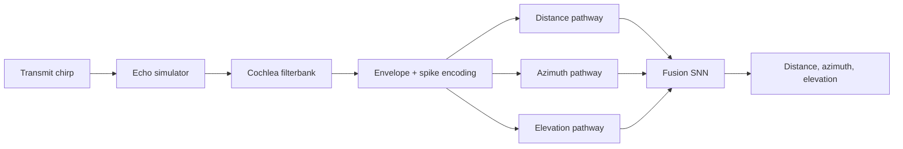

# Current System Explained

This is the clearest way to think about the repository as it stands now.

When I say **current model** below, I mean the **round-2 combined architecture**:
- fixed acoustic simulator
- fixed cochlea-to-spike front end
- handcrafted distance / azimuth / elevation pathway features
- learned residual pathway refinements
- spiking fusion head

Important distinction:
- the **core architecture** is the same
- recent tests such as **140 dB** and **unnormalized spikes** only change the **front-end signal scaling / spike encoding regime**, not the downstream pathway/fusion model
- the **700-channel matched-human cache** exists for future runs, but the main round-2 combined model results you have been inspecting were mostly produced with a **48-channel matched-human front end**

## 1. End-To-End Idea

In words:
1. A downward FM chirp is generated.
2. A target position sets echo delay, attenuation, binaural asymmetry, and elevation spectral shaping.
3. The transmit and receive waveforms are passed through a fixed cochlea model.
4. The cochlea outputs spike trains.
5. Three pathway feature sets are built from those spikes:
   - distance
   - azimuth
   - elevation
6. The round-2 combined model adds residual pathway processing, resonance features, and a spiking fusion head.
7. The network outputs distance, azimuth, and elevation.

## 2. Acoustic Front End

The simulator produces the waveform cues before the SNN sees anything:
- **distance**: echo delay and attenuation
- **azimuth**: ITD + ILD-like binaural asymmetry
- **elevation**: a fixed spectral tilt in the simulator

Useful plots:
- [Example signal and spectrogram](cochlea_explained/human_matched_example_signal.png)
- [Elevation spectral cue contour](cochlea_explained/elevation_spectral_cue.png)

The elevation spectral cue is applied **before** the cochlea. So that cue is already baked into the receive waveform before spike generation.

## 3. Cochlea To Spikes

The current cochlea is fixed, not trainable. It does:

`waveform -> filterbank -> rectify -> smooth -> downsample -> LIF spikes`

Useful plots:
- [Filter responses](cochlea_explained/filter_responses.png)
- [Filtered channels](cochlea_explained/filtered_channels.png)
- [One-channel processing pipeline](cochlea_explained/channel_pipeline.png)
- [Cochleagram and spike raster](cochlea_explained/human_matched_cochleagram_spikes.png)

Two important notes:
- Historically, the default front end used **per-sample envelope normalization** before the LIF threshold.
- Recent long-range tests showed that this normalization can hide absolute amplitude information.
- The later **140 dB unnormalized** tests changed this front-end behavior and worked much better at long range.

## 4. What Each Pathway Actually Does

### Distance Pathway

This is best described as a **fixed bank of delay-tuned coincidence detectors**:
- take onset-coded transmit spikes
- take onset-coded receive spikes
- sweep across candidate echo delays
- score overlap/coincidence at each delay

So the distance pathway is not a generic dense neural network. It is mostly a handcrafted delay-coincidence feature extractor.

### Azimuth Pathway

This has two parts:
- **ITD branch**: another delay/coincidence sweep, but now between left and right ears
- **ILD branch**: spike-count / rate comparison between ears

So azimuth is partly coincidence detection and partly rate comparison.

### Elevation Pathway

This is not coincidence detection. It is spectral analysis of spike counts across channels:
- normalized spectrum
- notch-like deviations
- spectral slope

Then learned residual blocks refine that spectral representation.

## 5. What The Round-2 Combined Model Adds

The round-2 combined model keeps the fixed pathways, then adds four learnable additions:

1. **Adaptive cue tuning**
   - small learnable offsets and gains on the handcrafted pathway features

2. **Pre-pathway LIF residual**
   - the spike trains are passed through extra LIF preprocessing
   - pathway features are recomputed from the processed spikes

3. **Resonance branch**
   - a corollary-discharge-style resonant branch provides extra temporal/frequency information

4. **Post-pathway LIF residual**
   - each pathway latent gets an extra LIF-based residual refinement

Then all branch latents are concatenated and sent into a spiking fusion head.

Useful plots:
- [Adaptive delay offsets](round_2_combined_all/adaptive_delay_offsets.png)
- [Adaptive gains](round_2_combined_all/adaptive_gains.png)
- [Resonant tuning](round_2_combined_all/resonant_tuning.png)
- [Resonant spikes](round_2_combined_all/resonant_spikes.png)
- [Pre-pathway spikes](round_2_combined_all/pre_pathway_left_spikes.png)
- [Post-pathway spikes](round_2_combined_all/post_pathway_distance_spikes.png)

## 6. Fusion And Output

After the three pathway latents are built:
- distance latent
- azimuth latent
- elevation latent
- plus a resonance latent

they are concatenated and passed through:
- a dense layer
- a Leaky LIF layer over several steps
- another dense layer
- another Leaky LIF layer
- a final linear readout to 3 outputs

So the **core cue extraction is mostly fixed**, but the **late integration is genuinely spiking and learned**.

## 7. What Is Fixed vs Learned

### Fixed
- chirp generation
- echo physics
- cochlea filters
- cochlear LIF spike encoder parameters
- distance delay candidates
- ITD candidates
- ILD calculation
- elevation spectral summary features

### Learned
- pathway projections into latent space
- adaptive feature offsets/gains
- elevation CNN residual
- elevation SConv2dLSTM residual
- resonance projections
- pre/post pathway residual blocks
- spiking fusion head
- readout layer
- task uncertainty weights

## 8. What The Best Recent Result Changed

The biggest recent behavioral change was not in the pathway architecture. It was in the **front end**:
- use a much louder input (`140 dB` under the current labeling convention)
- disable per-sample envelope normalization before spike generation

That improved long-range behavior a lot.

Useful plots:
- [Direct-drive spike count vs level](cochlea_explained/direct_drive_spike_count_vs_level.png)
- [140 dB normalized cochleagram](cochlea_explained/human_matched_140db_normalized_cochleagram_spikes.png)
- [140 dB unnormalized cochleagram](cochlea_explained/human_matched_140db_unnormalized_cochleagram_spikes.png)

Interpretation:
- the old normalized encoder was almost level-invariant
- the unnormalized encoder preserved amplitude information
- for long-range localization, that turned out to matter a lot

## 9. The Simplest Correct Mental Model

The easiest correct summary is:

> The current system is a fixed bat-like auditory front end that turns echoes into spikes, a mostly handcrafted three-pathway cue extractor, and a learned spiking fusion network that combines those cues into 3D localization estimates.

If you want one further simplification:
- **distance** = delay coincidence
- **azimuth** = ITD coincidence + ILD comparison
- **elevation** = spectral pattern analysis
- **final output** = learned spiking fusion of those cues

## 10. Best Plots To Open First

If you only want four files to understand the model quickly, use these:

1. [Cochlea explanation](cochlea_explained.md)
2. [Round-2 combined-all report](round_2_combined_all_report.md)
3. [Matched-human cochleagram and spikes](cochlea_explained/human_matched_cochleagram_spikes.png)
4. [Round-2 combined distance prediction](round_2_combined_all/test_distance_prediction.png)
