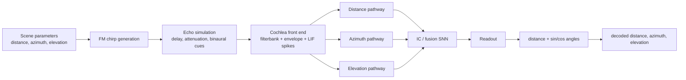
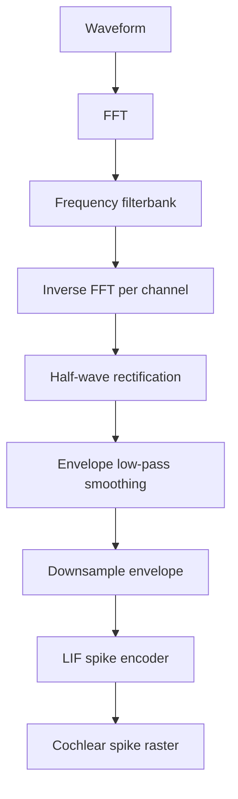
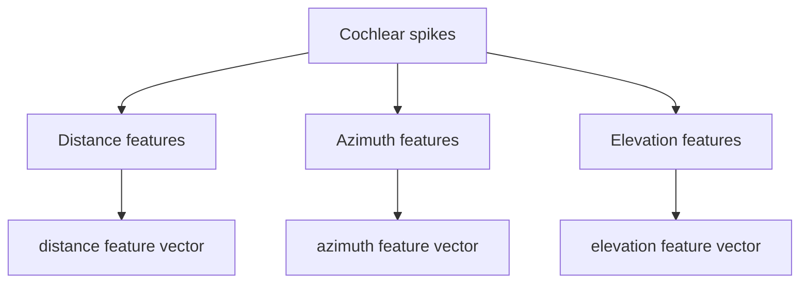

# Current Working Model: Detailed Architecture

This document describes the current working three-pathway bat-inspired localisation model, from acoustic signal generation through cochlear spike encoding, pathway feature extraction, fusion, and readout.

The model described here is the **Round 4 combined model**, because it is the most structurally advanced full model. Where useful, the document also notes the simpler **Round 3 `2B + 3`** model and the **Round 5 fixed decoder** result, because those define the best-performing and simplest current variants.

## 1. High-Level Summary

The system estimates:

- distance, in metres;
- azimuth, in degrees;
- elevation, in degrees.

It does this using three main localisation pathways:

- **Distance pathway:** echo delay / time-of-flight cues, plus loudness/spike-count cues.
- **Azimuth pathway:** interaural time difference (ITD), interaural level difference (ILD), and biologically inspired LSO/MNTB comparison.
- **Elevation pathway:** spectral shape and moving-notch cues, plus explicit notch-detector features.

These pathways produce latent feature vectors. A fusion/readout SNN then combines them and predicts the final coordinates.



## 2. Acoustic Signal

### 2.1 Transmitted Signal

The transmitted call is an FM chirp:

- generated by `generate_fm_chirp`;
- Hann-windowed;
- amplitude-normalised;
- multiplied by `transmit_gain`.

The current Round 3 / Round 4 small-space experiments use the matched-human front end:

| Parameter | Current value in Round 3/4 setup |
|---|---:|
| Sample rate | `64 kHz` |
| Chirp duration | `3 ms` |
| Signal duration | long enough to include echoes up to task range |
| Chirp sweep | `18 kHz -> 2 kHz` |
| Source gain convention | `1000x`, treated as 140 dB relative to an 80 dB reference |
| Spike envelope normalisation | off |

The base `GlobalConfig` defaults are ultrasonic, but the current accepted experiments override this to the matched-human setup.

### 2.2 Echo Simulation

The scene simulator takes target distance, azimuth, and elevation and produces binaural received waveforms.

For each sample:

1. Convert spherical coordinates into Cartesian position.
2. Compute distance from target to each ear.
3. Compute full path length:
   - outgoing path from bat to target;
   - return path from target to each ear.
4. Convert path length into delay:
   - `delay_s = path_length / speed_of_sound + jitter`.
5. Apply fractional delay in the frequency domain.
6. Apply inverse-square attenuation:
   - `amplitude = 0.7 / path_length^2`, clamped for stability.
7. Apply binaural head shadow.
8. Apply spectral elevation and/or azimuth shaping if enabled.
9. Add Gaussian noise.

The binaural simulation also produces:

- ITD: right-ear delay minus left-ear delay;
- ILD: ratio of right-ear amplitude to left-ear amplitude in dB.

## 3. Spectral Cue Simulation

### 3.1 Elevation Spectral Cue

Elevation is encoded in the received signal before the cochlea by applying a frequency-domain gain profile.

For the current moving-notch setup:

- a broad spectral slope varies with elevation;
- a notch moves across the frequency band as elevation changes.

The elevation scale is:

```text
elevation_scale = tanh(elevation_rad / (pi / 6))
```

The notch centre is:

```text
notch_center = center_min + (center_max - center_min) * 0.5 * (elevation_scale + 1)
```

The notch is Gaussian in normalized frequency and multiplicative in the spectrum:

```text
gain *= exp(-notch_strength * notch_profile)
```

In the Round 3/4 moving-notch setup:

- `elevation_cue_mode = slope_notch`;
- `elevation_notch_strength = 1.8`;
- `elevation_notch_width = 0.065`;
- default notch centre range is usually `0.18 -> 0.82` of normalized frequency unless explicitly overridden.

### 3.2 Azimuth Spectral Cue

The main Round 4 combined model uses azimuth through ITD and ILD, not the later rejected azimuth notch systems.

Azimuth spectral notch code exists in the codebase, but it was not part of the accepted Round 4 combined model.

## 4. Cochlea Front End

The cochlea converts waveform signals into spike rasters.



### 4.1 Filterbank

The cochlea uses a fixed frequency-domain filterbank:

- filters are Gaussian in log-frequency or mel-frequency space;
- current accepted small-space experiments use the matched-human band;
- previous dense cache experiments used 700 channels, but the Round 3/4 short experiments used the normal experiment channel count.

Filterbank stages:

1. FFT of waveform.
2. Create channel centre frequencies.
3. Build Gaussian frequency filters around each centre.
4. Multiply spectrum by each filter.
5. Inverse FFT to produce per-channel time signals.

The filters are fixed, not learned.

### 4.2 Rectification And Envelope

After filtering:

1. Half-wave rectification is applied:
   - negative filtered values are clamped to zero.
2. A Hann-window low-pass kernel smooths the rectified signal.
3. The smoothed signal is downsampled by average pooling.

The downsample block reduces the time resolution of the envelope before spike encoding. It makes the cochlear representation smaller and faster to process, but also reduces temporal precision.

### 4.3 LIF Spike Encoding

The cochlea uses LIF-like spike encoding:

```text
membrane[t] = beta * membrane[t-1] + envelope[t]
spike[t] = membrane[t] >= threshold
membrane[t] = membrane[t] - spike[t] * threshold
```

Important details:

- the reset is subtractive, not a hard reset to zero;
- the membrane is clamped at zero after reset;
- Round 3/4 front end uses unnormalised spike envelopes for the 140 dB setup;
- louder signals generally produce more envelope drive and therefore more spikes.

Current relevant parameters:

| Parameter | Meaning |
|---|---|
| `spike_threshold` | LIF spike threshold |
| `spike_beta` | membrane leak/retention |
| `normalize_spike_envelope` | whether envelope is amplitude-normalised before spiking |
| `envelope_downsample` | average-pooling downsample factor |
| `envelope_lowpass_hz` | smoothing cutoff proxy |

## 5. Base Pathway Feature Construction

After cochlear spiking, fixed pathway features are built from:

- transmit cochlear spikes;
- left received cochlear spikes;
- right received cochlear spikes.

The base pathway feature function is `build_pathway_features`.



## 6. Distance Pathway

### 6.1 Fixed Delay-Coincidence Features

The base distance pathway compares transmit spikes with received spikes at candidate delays.

Steps:

1. Convert transmit spikes to onset spikes.
2. Collapse across frequency channels.
3. Convert received spikes to onset spikes.
4. Collapse across frequency channels.
5. For each candidate delay, shift the target signal.
6. Multiply delayed transmit onset with received onset.
7. Sum over time.

This is a fixed coincidence/correlation bank:

```text
score[d] = sum_t transmit_onset[t] * receive_onset[t + d]
```

There are separate scores for:

- transmit vs left ear;
- transmit vs right ear.

These are resized and concatenated into the distance branch input.

### 6.2 LIF Distance Coincidence Bank

Round 4 adds explicit LIF coincidence banks for distance.

For each candidate delay:

1. delay the reference/transmit onset trace;
2. combine delayed reference and target/received onset with trainable non-negative weights;
3. run a LIF detector over time;
4. output the mean spike rate of each detector.

The detector has trainable:

- reference weight;
- target weight;
- beta/leak.

The LIF coincidence bank is more neuron-like than the fixed dot-product delay bank.

### 6.3 Distance Spike-Sum Cue

Round 4 also adds a loudness cue:

```text
left_total
right_total
left_total + right_total
left_total - right_total
log(1 + total)
```

These five features are layer-normalised, projected, scaled, and added into the distance latent vector.

Biological interpretation:

- delay/coincidence approximates echo time-of-flight processing;
- spike count approximates the fact that closer echoes tend to be louder.

## 7. Azimuth Pathway

Azimuth uses both timing and level asymmetry.

### 7.1 ITD Features

The base ITD pathway compares left-ear and right-ear onset spikes across candidate interaural delays:

```text
itd_score[d] = sum_t left_onset[t] * right_onset[t + d]
```

This is similar to a Jeffress-style delay-line coincidence model.

### 7.2 ILD Features

The base ILD features use per-frequency spike counts:

```text
difference = left_counts - right_counts
total = left_counts + right_counts
normalized = difference / max(total, 1)
```

The output concatenates:

- raw left-right difference;
- normalized left-right difference.

These capture which ear received a stronger echo and how that varies across frequency.

### 7.3 LSO/MNTB-Inspired ILD System

Round 4 replaces the simple ILD idea with a more biological computation.

For each frequency channel:

```text
left_exc  = softplus(left_exc_weight)  * left_counts
right_exc = softplus(right_exc_weight) * right_counts

left_lso  = relu(left_exc  - softplus(left_inh_weight)  * right_exc)
right_lso = relu(right_exc - softplus(right_inh_weight) * left_exc)
```

This mimics:

- MNTB: converts the opposite ear into inhibitory drive;
- LSO: compares same-side excitation against opposite-side inhibition.

The model then computes:

```text
lso_compare = right_lso - left_lso
lso_total = right_lso + left_lso
normalized_compare = lso_compare / max(lso_total, 1)
```

The LSO features are resized and combined with ITD features to produce the azimuth latent.

### 7.4 LIF ITD Bank

Round 4 also includes an explicit LIF ITD bank:

- left onset spikes are the reference;
- right onset spikes are the target;
- each detector corresponds to a candidate ITD;
- trainable weights and beta determine coincidence sensitivity.

Biological interpretation:

- ITD branch approximates medial-superior-olive / Jeffress-like timing comparison;
- ILD branch approximates LSO/MNTB level comparison.

## 8. Elevation Pathway

Elevation is mainly spectral.

### 8.1 Base Spectral Features

The base elevation pathway uses spike counts across cochlear channels:

```text
left_counts = sum over time of left spikes
right_counts = sum over time of right spikes
spectral_counts = left_counts + right_counts
spectral_norm = spectral_counts / sum(spectral_counts)
```

It then computes local notch and slope features:

```text
local_mean = local average of spectral_norm
spectral_notches = relu(local_mean - spectral_norm)
spectral_slope = difference between neighbouring frequency channels
```

The elevation feature vector concatenates:

- normalized spectral profile;
- local notch strength;
- spectral slope.

### 8.2 Moving-Notch Cue

The simulator embeds elevation by moving a notch across the frequency band. The elevation pathway then tries to infer elevation from the observed notch position.

This is a pinna-like cue:

- different elevations cause different spectral filtering;
- the cochlea turns this into a frequency-channel spike-count pattern;
- the elevation pathway reads the notch location.

### 8.3 Explicit Notch Detectors

Round 3 `2B` adds explicit notch detectors.

The model builds Gaussian templates across cochlear channel index:

```text
template[k, channel] = Gaussian(channel around detector_center[k])
```

It computes:

```text
detector_response = spectral_notches @ detector_templates.T
```

The detector response is layer-normalised, projected, scaled, and added to the elevation latent.

This was one of the most useful model additions.

Biological interpretation:

- pinna / outer-ear spectral filtering creates notches;
- cochlea encodes the notches as reduced activity at specific frequency channels;
- a downstream detector population reads notch location.

## 9. Resonance Banks

Round 4 adds per-pathway resonance banks.

Each resonance bank is a bank of oscillator-like spiking units with trainable:

- input projection;
- resonant frequency;
- Q factor;
- threshold.

The state update is approximately:

```text
velocity = decay * velocity + current - frequency * state
state = state + frequency * velocity
spike = state >= threshold
state = state - spike * threshold
```

Pathway-specific inputs:

- distance resonance: transmit trace and common received trace;
- azimuth resonance: left trace, right trace, and right-left difference;
- elevation resonance: lower/middle/upper spectral-band traces.

Initial Q-factor assumptions:

- distance: moderate Q, for echo recognition;
- azimuth: lower Q, for phase/timing robustness;
- elevation: higher Q, for sharper spectral/notch selectivity.

In the current implementation these Q factors are trainable, not fixed.

## 10. Post-Pathway IC Convolution

Round 4 includes an IC-style post-pathway convolution.

The base encoder produces post-pathway spike traces for:

- distance;
- azimuth;
- elevation.

These are stacked into a 2D tensor:

```text
[batch, pathway, time/step, feature]
```

The IC block applies:

1. 2D convolution from 3 pathway channels to IC channels;
2. second 2D convolution;
3. adaptive pooling to a fixed shape;
4. linear projection back into three pathway residuals;
5. gated residual addition into distance, azimuth, and elevation latents.

Biological interpretation:

- approximates inferior colliculus style integration across auditory feature maps;
- learns local spatio-temporal receptive fields across pathway activity.

## 11. Fusion And Final Readout

The Round 4 model uses `AllRound2CombinedModel` as its fusion/readout wrapper.

Inputs to fusion:

- distance latent;
- azimuth latent;
- elevation latent;
- fusion resonance latent.

These are concatenated and passed through:

```text
fusion linear layer
fusion LIF layer
integration linear layer
integration LIF layer
readout linear layer
```

The LIF fusion and integration layers run for `num_steps`.

The final readout uses the mean integration spike activity over time:

```text
pooled = mean(integration_spikes over steps)
output = readout(pooled)
```

For the accepted Round 3/4 angular models, the output mode is sine/cosine:

```text
output = [distance_model, az_sin, az_cos, el_sin, el_cos]
```

Angles are decoded using normalized sine/cosine pairs:

```text
azimuth = atan2(az_sin, az_cos)
elevation = atan2(el_sin, el_cos)
```

This avoids some pathologies of direct angle regression and was one reason `2B + 3` performed well.

## 12. What Is Trainable

The Round 4 combined model has trainable parameters in several places, not just the final IC/readout.

Trainable components include:

- base pathway projection layers;
- fusion resonance projection;
- final fusion, integration, and readout layers;
- LIF coincidence reference weights, target weights, and beta values;
- LSO/MNTB excitatory and inhibitory weights;
- distance spike-sum projection and gain;
- resonance-bank input projections, frequencies, Q factors, thresholds, projections, and gains;
- post-pathway IC convolution kernels, projection, and gains;
- elevation notch detector projection and gain.

Fixed/preprocessed components include:

- acoustic scene simulation;
- cochlear filterbank frequencies and filters;
- cochlear LIF threshold/beta unless explicitly changed in config;
- delay candidate grids;
- ITD candidate grids;
- base delay-correlation formulas;
- spectral normalization/notch/slope formulas;
- notch detector template centres and widths.

## 13. Current Best Variants

### Best Accuracy So Far

The best-performing full trained model by combined error is:

```text
Round 3 Combined A: 2B + 3
```

Metrics:

| Metric | Value |
|---|---:|
| Combined error | 0.0394 |
| Distance MAE | 0.0646 m |
| Azimuth MAE | 2.8595 deg |
| Elevation MAE | 2.5258 deg |
| Euclidean error | 0.2043 m |

This model uses:

- moving-notch elevation cue;
- elevation notch detectors;
- sine/cosine angle regression;
- simpler architecture than Round 4.

### Most Advanced Structural Model

The most structurally advanced model is:

```text
Round 4 combined model
```

Metrics:

| Metric | Value |
|---|---:|
| Combined error | 0.0435 |
| Distance MAE | 0.0786 m |
| Azimuth MAE | 2.8320 deg |
| Elevation MAE | 2.7802 deg |
| Euclidean error | 0.2264 m |

It is more biological and modular, but slightly worse than Round 3 `2B + 3` by combined error.

### Best Simplified Readout Variant

Round 5 showed that a fixed-feature system with a trained-once ridge decoder can work very well:

| Variant | Combined | Distance | Azimuth | Elevation | Euclidean |
|---|---:|---:|---:|---:|---:|
| Round 5 trained-once fixed ridge decoder | 0.0387 | 0.0438 m | 3.1077 deg | 2.5876 deg | 0.2069 m |

This suggests that much of the useful information is already present in the fixed pathway features, but a calibrated readout is still important.

## 14. Important Design Lessons

The current system suggests several useful conclusions for a ground-up redesign:

- The cochlea/front end can be treated as a mostly fixed preprocessing block, but its sampling rate, channel count, bandwidth, and normalization strongly affect downstream behaviour.
- The pathway split is useful: distance, azimuth, and elevation need different cue types.
- Distance is relatively easy to decode from delay/coincidence and spike-count features.
- Azimuth benefits from both ITD and ILD; biological LSO/MNTB computation is plausible but needs careful calibration.
- Elevation is highly dependent on the quality and separability of spectral notch cues.
- The fully naive no-training decoder failed, but a small trained-once linear decoder worked extremely well.
- The final learned SNN readout is not the only source of performance; fixed pathway features already contain substantial localisation information.
- Round 4 added biological detail but also added many trainable components, making it harder to interpret than the simpler Round 3 `2B + 3` model.

## 15. Code Reference

Main implementation files:

- `models/acoustics.py`: acoustic simulation, spectral cues, cochlea filterbank, LIF spike encoding.
- `models/snn.py`: onset extraction, delay coincidence, ITD, ILD, spike utilities.
- `models/pathway_snn.py`: base distance/azimuth/elevation pathway feature construction.
- `models/round3_variants.py`: notch detectors, LIF coincidence detectors, sine/cosine support.
- `models/round4_variants.py`: Round 4 combined biological additions.
- `models/round2_variants.py`: combined encoder and fusion/readout SNN.
- `stages/round_4_experiments.py`: Round 4 experiment harness.
- `stages/round_5_experiments.py`: fixed-decoder simplification experiments.

