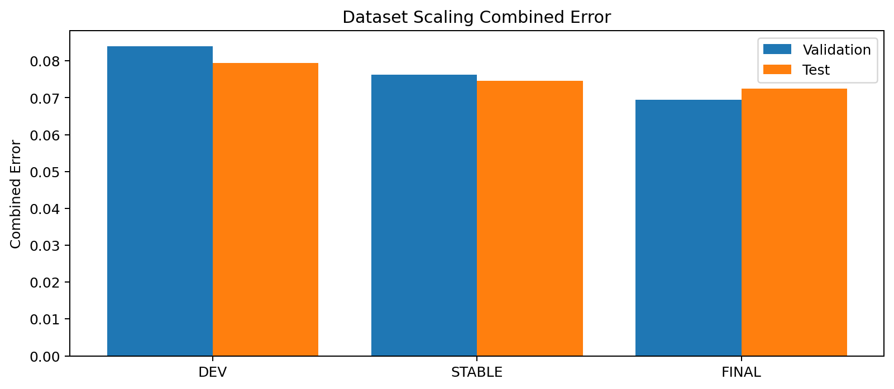
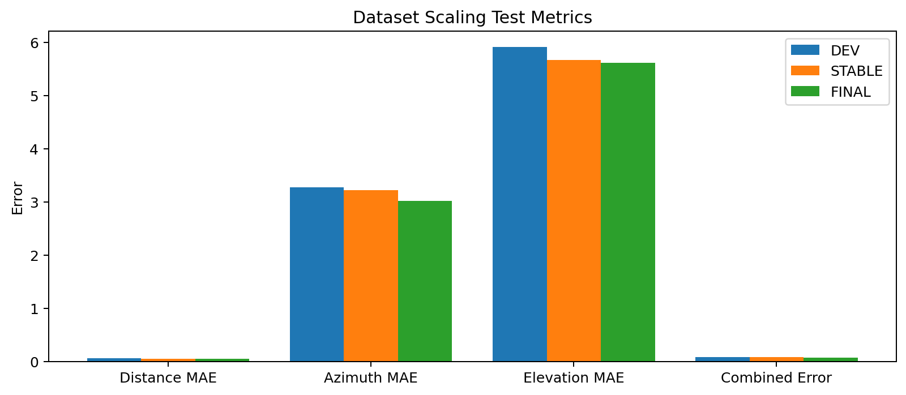

# Dataset Scaling Study

Reference configuration: `pathway_split_enhanced trial 10`

| Mode | Train | Val | Test | Val Combined | Test Combined | Test Distance MAE | Test Azimuth MAE | Test Elevation MAE | Improvement vs Dev |
| --- | --- | --- | --- | --- | --- | --- | --- | --- | --- |
| DEV | 512 | 256 | 256 | 0.0840 | 0.0794 | 0.0605 | 3.2770 | 5.9165 | 0.00% |
| STABLE | 2000 | 512 | 512 | 0.0763 | 0.0746 | 0.0523 | 3.2240 | 5.6724 | 6.05% |
| FINAL | 5000 | 512 | 512 | 0.0695 | 0.0725 | 0.0452 | 3.0217 | 5.6230 | 8.66% |

## Plots

