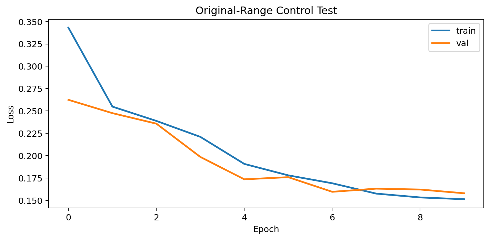
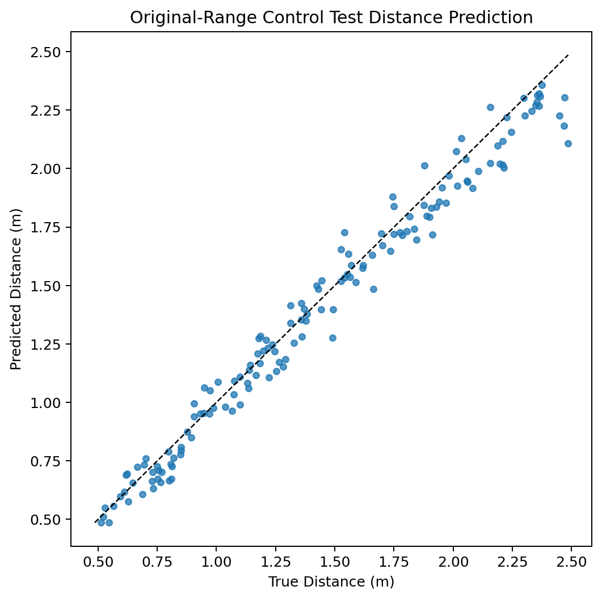
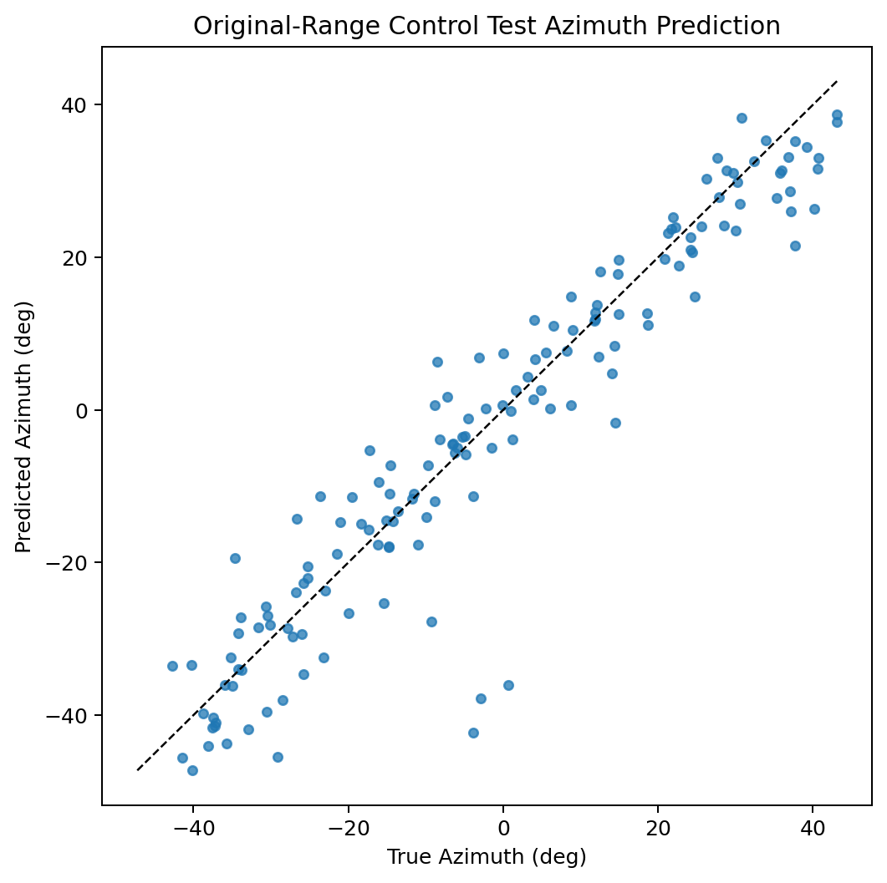
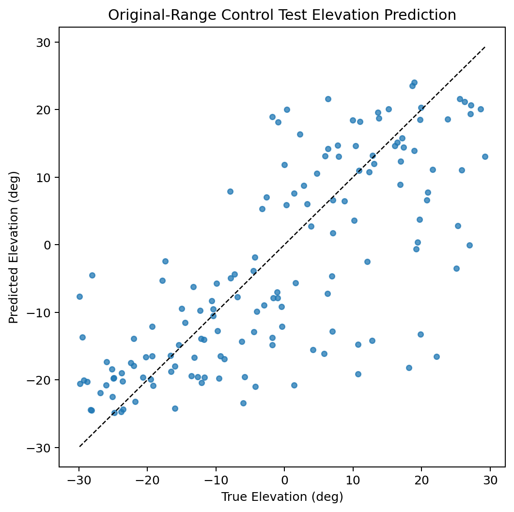
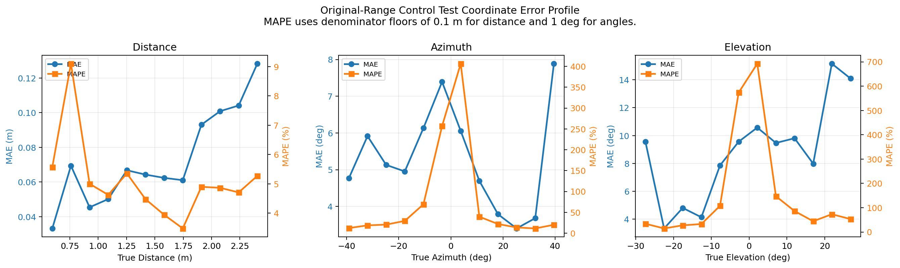
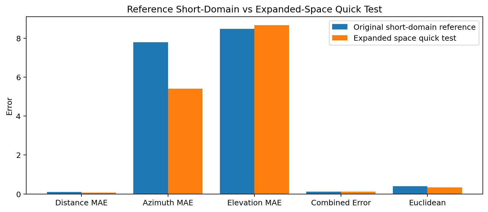

# Original-Range Control Test

## Overview

This run reuses the matched-human round-2 combined-all architecture and tests it on a different spatial support. The goal is not a fair benchmark against the original domain, but a quick check of whether the current system still trains and produces structured predictions when the range and angle support are changed. This scenario is: `Original-Range Control Test`.

Important note:
- The existing matched-human spike cache was not reused here.
- That cache is for a different domain and also uses a different cochlea width, so it cannot support this test directly.
- Direct metric comparison against the original short-domain matched-human run is therefore only contextual, not like-for-like.

## Test Setup

- Model architecture: `combined_all`
- Reference architecture source: saved round-2 combined-all matched-human run
- Dataset counts: `train 700 / val 150 / test 150`
- Distance support: `0.5 to 2.5 m`
- Azimuth support: `-45 to 45 deg`
- Elevation support: `-30 to 30 deg`
- Signal duration increased to: `37.6 ms`
- Sample rate: `64000` (`matched-human front end`)
- Chirp: `18000 Hz -> 2000 Hz`
- Cochlea range: `2000 Hz -> 20000 Hz`
- Cochlea channels actually used in front end: `48`
- Downstream model frequency width: `48`
- Loss mode: `mixed_cartesian_expanded`
- Max epochs: `10`, batch size: `8`

## Results

- Validation combined error: `0.1075`
- Test combined error: `0.1150`
- Test distance MAE: `0.0720 m`
- Test azimuth MAE: `5.4033 deg`
- Test elevation MAE: `8.6680 deg`
- Test Euclidean error: `0.3293 m`
- Mean spike rate: `0.0380`

## Timing

- Data preparation: `11.51 s`
- Training: `322.87 s`
- Evaluation: `2.40 s`
- Total: `336.80 s`
- Best epoch: `7`

## Reference Comparison

The saved reference below is the earlier short-domain matched-human round-2 combined-all run. This control is intended to show whether the current harness still reproduces a non-collapsed solution when the spatial support matches the original task.

- Reference combined error: `0.1221`
- Reference distance / azimuth / elevation: `0.0946 m`, `7.8027 deg`, `8.4785 deg`
- Scenario combined error delta vs reference: `-0.0071`
- Scenario distance MAE delta vs reference: `-0.0226 m`
- Scenario azimuth MAE delta vs reference: `-2.3994 deg`
- Scenario elevation MAE delta vs reference: `0.1895 deg`

## Interpretation

- When the support is widened, the range expansion is especially severe because the echo delay support grows from a few milliseconds to over 100 ms, forcing a much longer receive window even at the cheaper 64 kHz front end.
- The angular task becomes harder when the model has to cover the full front hemisphere for both azimuth and elevation.
- The round-2 combined-all architecture is being reused here as-is; only the front-end band choice and target support differ.
- If performance degrades sharply but predictions still show non-trivial spread, that suggests the pipeline remains functional but is out of its previously tuned operating regime.

## Plots

