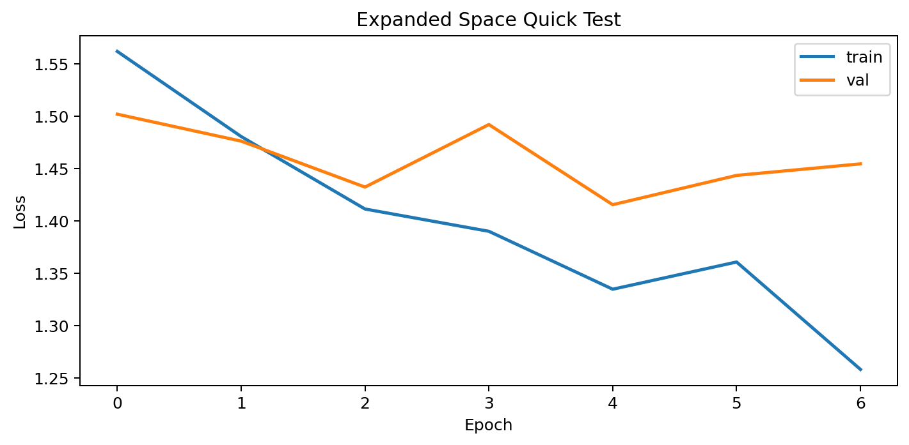
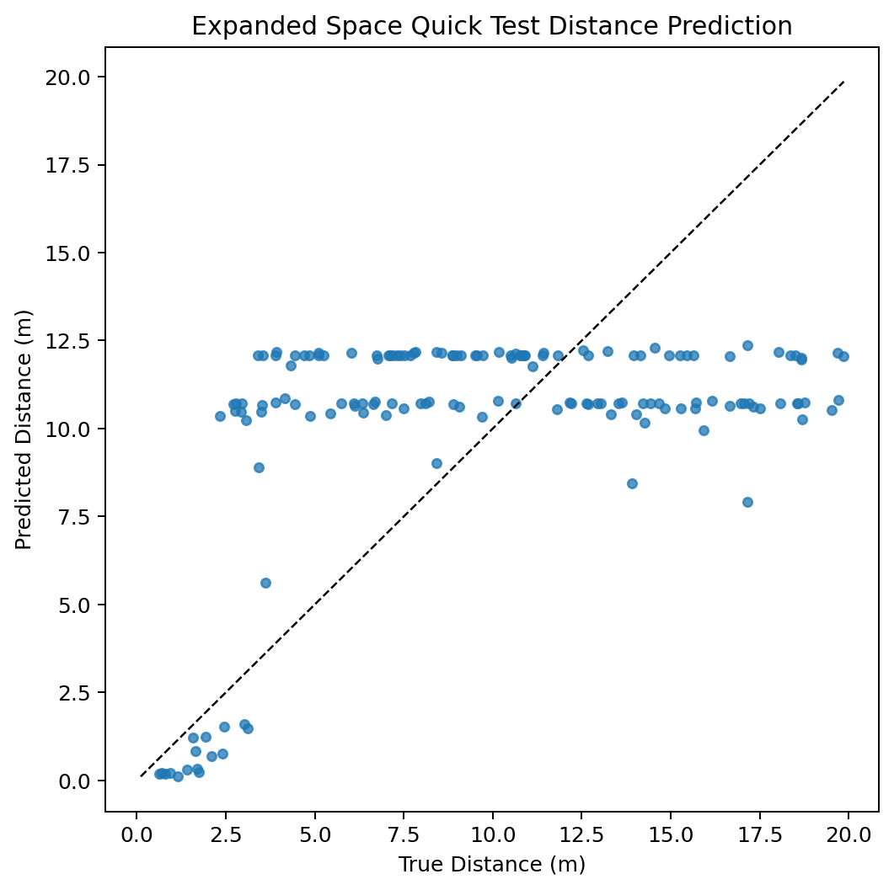
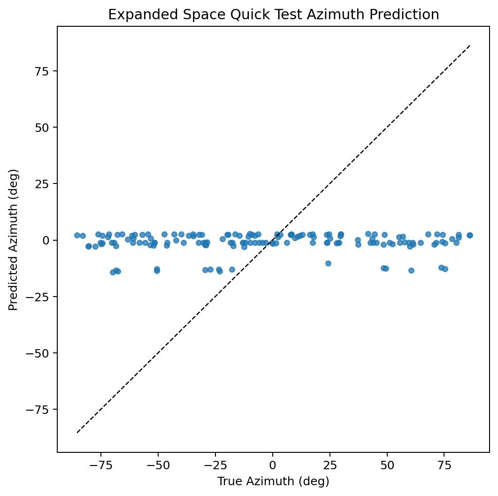
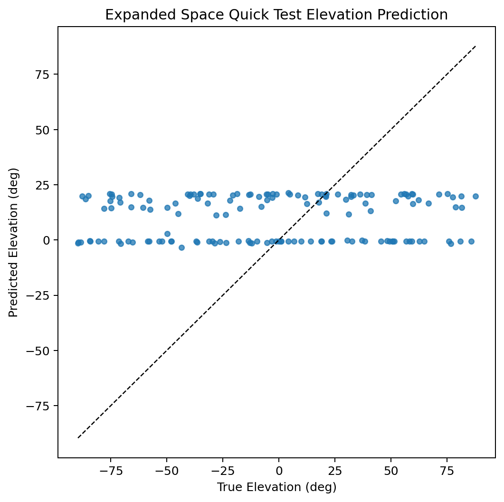
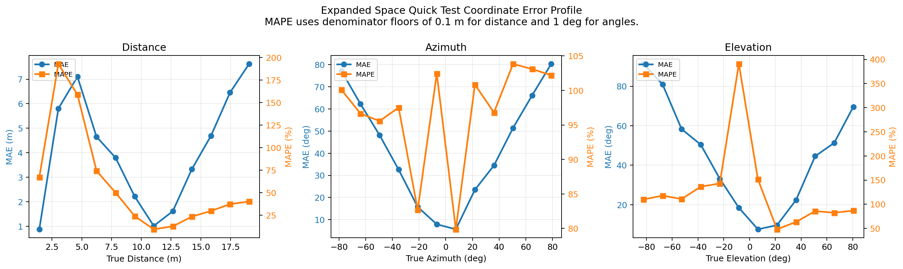
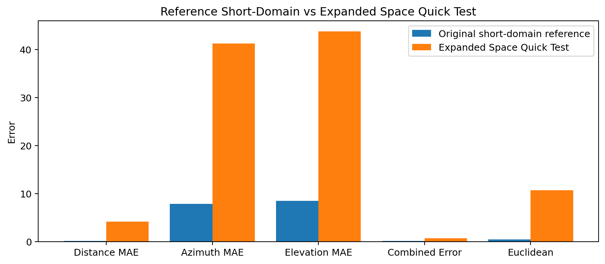

# Expanded Space Quick Test

## Control Check

The same matched-human / round-2 combined-all harness was rerun on the original task limits before this expanded-space run. That control did not collapse, so the flat behavior in the expanded test is not a generic harness failure.

- Control combined error: `0.1150`
- Control distance / azimuth / elevation: `0.0720 m`, `5.4033 deg`, `8.6680 deg`
- Control prediction spread: distance std `0.5402`, azimuth std `24.1809`, elevation std `14.8356`
- Control target spread: distance std `0.5632`, azimuth std `24.2894`, elevation std `16.5835`

## Overview

This run reuses the matched-human round-2 combined-all architecture and tests it on a different spatial support. The goal is not a fair benchmark against the original domain, but a quick check of whether the current system still trains and produces structured predictions when the range and angle support are changed. This scenario is: `Expanded Space Quick Test`.

Important note:
- The existing matched-human spike cache was not reused here.
- That cache is for a different domain and also uses a different cochlea width, so it cannot support this test directly.
- Direct metric comparison against the original short-domain matched-human run is therefore only contextual, not like-for-like.

## Test Setup

- Model architecture: `combined_all`
- Reference architecture source: saved round-2 combined-all matched-human run
- Dataset counts: `train 700 / val 150 / test 150`
- Distance support: `0.5 to 20.0 m`
- Azimuth support: `-90 to 90 deg`
- Elevation support: `-90 to 90 deg`
- Signal duration increased to: `139.6 ms`
- Sample rate: `64000` (`matched-human front end`)
- Chirp: `18000 Hz -> 2000 Hz`
- Cochlea range: `2000 Hz -> 20000 Hz`
- Cochlea channels actually used in front end: `48`
- Downstream model frequency width: `48`
- Delay lines: `64`
- Branch hidden dim: `40`
- Fusion hidden dim: `160`
- SNN time steps: `12`
- Loss mode: `mixed_cartesian_expanded`
- Max epochs: `10`, batch size: `6`

## Results

- Validation combined error: `0.6332`
- Test combined error: `0.6315`
- Test distance MAE: `4.1299 m`
- Test azimuth MAE: `41.2251 deg`
- Test elevation MAE: `43.7670 deg`
- Test Euclidean error: `10.7116 m`
- Mean spike rate: `0.0354`

## Timing

- Data preparation: `46.71 s`
- Training: `1972.71 s`
- Evaluation: `13.24 s`
- Total: `2032.67 s`
- Best epoch: `3`

## Reference Comparison

The saved reference below is the original short-domain matched-human round-2 combined-all run (`0.5 to 2.5 m`, `-45 to 45 deg`, `-30 to 30 deg`). It is included only as context.

- Reference combined error: `0.1221`
- Reference distance / azimuth / elevation: `0.0946 m`, `7.8027 deg`, `8.4785 deg`
- Scenario combined error delta vs reference: `0.5094`
- Scenario distance MAE delta vs reference: `4.0353 m`
- Scenario azimuth MAE delta vs reference: `33.4224 deg`
- Scenario elevation MAE delta vs reference: `35.2885 deg`

## Interpretation

- When the support is widened, the range expansion is especially severe because the echo delay support grows from a few milliseconds to over 100 ms, forcing a much longer receive window even at the cheaper 64 kHz front end.
- The angular task becomes harder when the model has to cover the full front hemisphere for both azimuth and elevation.
- This rerun increases delay-bank and latent capacity relative to the earlier failed expanded attempt, so it is testing whether the previous collapse was partly a model-capacity mismatch rather than only a data-domain mismatch.
- The round-2 combined-all architecture is still the base model; the main changes are support-aware delay-bank and latent-capacity scaling.
- If performance degrades sharply but predictions still show non-trivial spread, that suggests the pipeline remains functional but is out of its previously tuned operating regime.

## Failure Analysis

The current evidence points away from a generic code or report bug and toward a front-end failure mode under the expanded-space acoustics:

- The control run uses the same matched-human front end and the same round-2 combined-all harness, and it does not collapse.
- Increasing delay lines from the short-range setting to `64`, and increasing latent capacity, only changed the expanded result slightly. That means the collapse is not primarily caused by the old short-range delay-bank width.
- The `1/r^2` attenuation was intentionally left unchanged. At `20 m`, the return is much weaker than in the original task, so the effective cue SNR is much worse.
- The strongest new clue is in the spike encoder itself: `lif_encode_stages()` in [models/acoustics.py](/Users/jackhenry/Library/CloudStorage/OneDrive-UniversityofCambridge/IIB%20Project%20work/Radar_SNN_4/models/acoustics.py) scales every sample by its own maximum envelope before thresholding. That means weak long-range echoes are renormalized upward, so noise and low-level background structure can dominate the spike raster instead of simply disappearing.
- That combination is a plausible explanation for the observed behavior: the model gets less trustworthy cue structure at long range, then regresses toward mean-like predictions in azimuth and elevation.

## Front-End Distance Sweep

To make that visible, I generated matched-human receive-waveform, cochleagram, and spike-raster diagnostics at several fixed distances with `azimuth = 0`, `elevation = 0`, and `add_noise = True`. The figures are in [expanded_space_frontend_diagnostics](/Users/jackhenry/Library/CloudStorage/OneDrive-UniversityofCambridge/IIB%20Project%20work/Radar_SNN_4/outputs/expanded_space_frontend_diagnostics), with the summary in [summary.json](/Users/jackhenry/Library/CloudStorage/OneDrive-UniversityofCambridge/IIB%20Project%20work/Radar_SNN_4/outputs/expanded_space_frontend_diagnostics/summary.json).

Important note:
- `0 m` is not included because the current simulator uses inverse-square attenuation and a two-way delay model, so `0.5 m` is the nearest practical diagnostic point.

Key observations:
- `0.5 m`: receive peak `0.695879`, cochleagram peak `0.189507`, spike count `484`
- `2.5 m`: receive peak `0.045582`, cochleagram peak `0.007484`, spike count `31025`
- `5.0 m`: receive peak `0.034623`, cochleagram peak `0.003716`, spike count `64364`
- `10.0 m`: receive peak `0.032740`, cochleagram peak `0.002717`, spike count `80493`
- `15.0 m`: receive peak `0.034823`, cochleagram peak `0.003047`, spike count `75561`
- `20.0 m`: receive peak `0.031619`, cochleagram peak `0.002756`, spike count `80071`

The important pattern is not just that the waveform/cochleagram amplitudes fall with distance. It is that the spike count explodes once the return becomes weak. That strongly suggests the current normalization-plus-thresholding front end is turning weak long-range/noisy inputs into broad, noise-dominated spike activity instead of preserving clean range-dependent structure.

Diagnostic figures:

## Plots

