# Presentation Draft

This is a first-pass presentation draft for a non-specialist audience. It is structured slide-by-slide, with suggested visuals and a short speaking goal for each slide.

## Slide 1: Title

**Title:** Building a Bat-Inspired Spiking Neural Network for 3D Sound Localisation

- Goal: state the problem in one sentence.
- Key message: the project uses bat-like sensing and biologically inspired spiking computation to estimate distance, azimuth, and elevation from echoes.

Visual:
- 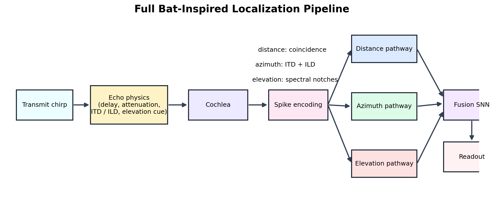

## Slide 2: Why Spiking Neural Networks?

- Standard neural networks are good at static pattern recognition.
- Echolocation is event-driven, time-critical, and naturally sparse.
- Spiking neural networks give a natural language for:
  - timing
  - coincidence
  - oscillation / resonance
  - biological interpretability

Suggested points:
- spikes represent events rather than continuous activations
- delays and synchrony are central to localization
- the architecture can be interpreted in neural terms rather than just as a black-box regressor

## Slide 3: What A Spike-Based Neuron Does

### LIF neuron

- integrates input current over time
- leaks back toward rest
- spikes when threshold is crossed

Visual:
- 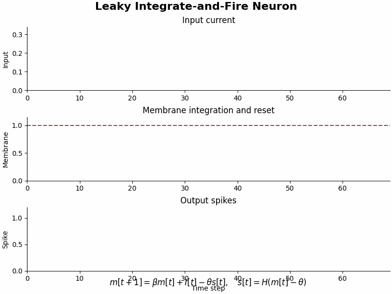

Equation:

```text
m[t+1] = beta * m[t] + I[t] - theta * s[t]
s[t]   = H(m[t] - theta)
```

Speaking note:
- this is the simplest timing-sensitive building block in the project

## Slide 4: Resonant Neuron

- a resonant neuron does not just integrate
- it prefers certain temporal rhythms
- this makes it useful for echo timing and frequency-selective temporal structure

Visual:
- 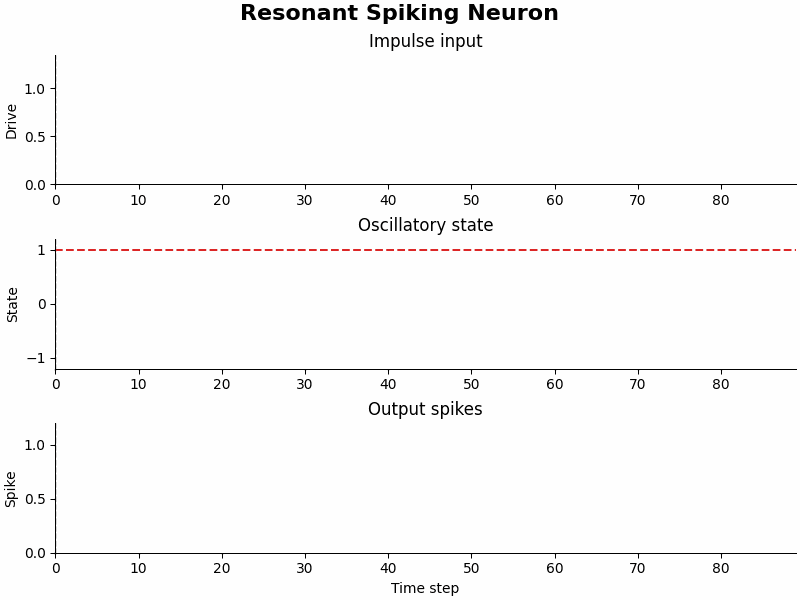

Equation:

```text
v[t+1] = alpha * v[t] + u[t] - omega * z[t]
z[t+1] = z[t] + omega * v[t]
```

Speaking note:
- this is roughly RLC-like in spirit: damped, oscillatory, and frequency-tuned

## Slide 5: From Algorithms To Circuits

This is the key bridge in the talk: show that familiar algorithms can be reinterpreted as neuronal structures.

- coincidence bank -> delay-swept cross-correlation
- resonance bank -> frequency-selective temporal decomposition
- LSO/MNTB opponent coding -> signed binaural level comparison
- spike summing -> intensity / range cue

## Slide 6: Coincidence Detection Animation

Key message:
- distance and ITD estimation can be framed as testing multiple delay hypotheses in parallel

Visual:
- 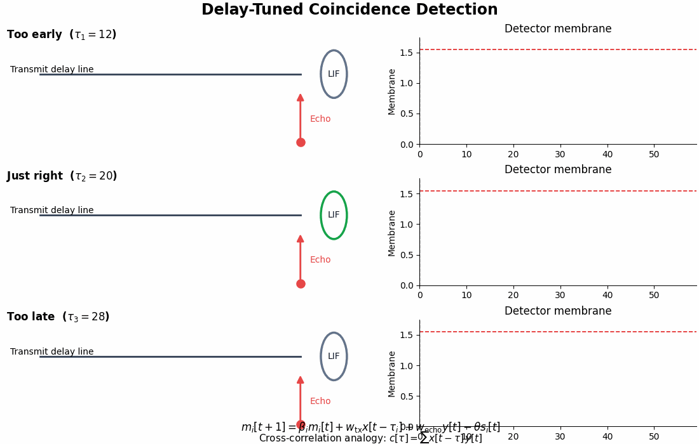
- 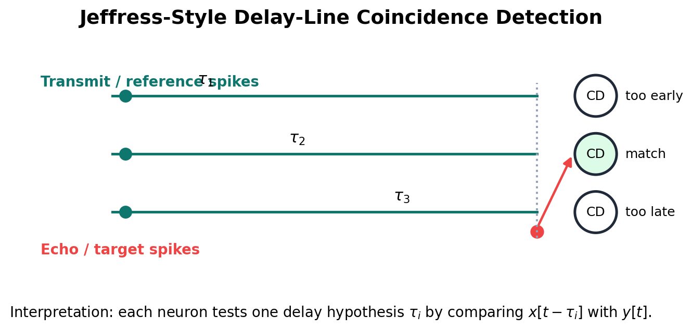

Equations:

```text
m_i[t+1] = beta_i * m_i[t] + w_tx * x[t-tau_i] + w_echo * y[t] - theta * s_i[t]
c[tau]   = sum_t x[t-tau] * y[t]
```

Speaking note:
- each tuned neuron tests one delay hypothesis
- the best-matching delay is the one that receives transmit and echo input together

## Slide 7: Resonance Bank Animation

Key message:
- a bank of resonators is not a literal DFT, but it behaves like a frequency-selective decomposition of temporal structure

Visual:
- 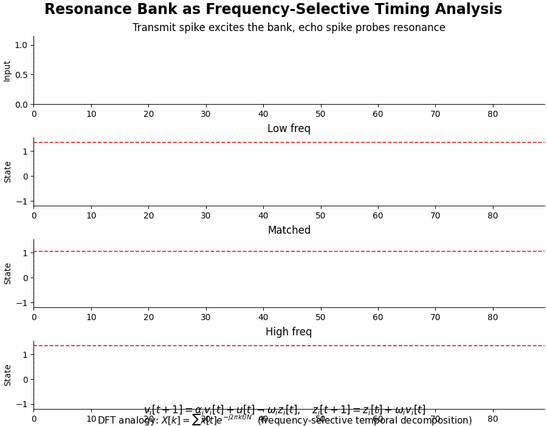

Equation link:

```text
resonator bank: state evolves with tuned omega_i
DFT analogy: X[k] = sum_t x[t] * exp(-j 2 pi k t / N)
```

Suggested wording:
- "This is Fourier-like rather than exactly Fourier."

## Slide 8: Biological Azimuth Coding: LSO / MNTB

Key message:
- azimuth is not only about timing
- level differences between ears can also be coded by opponent circuits

Visual:
- 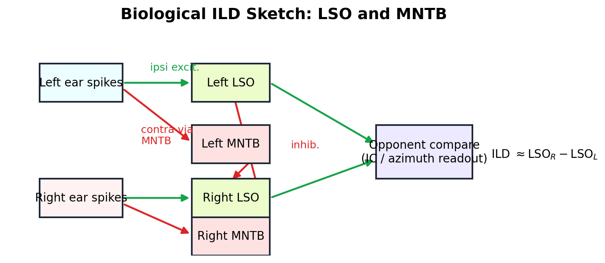

Talking points:
- ipsilateral excitation
- contralateral inhibition via MNTB
- opponent comparison sharpens lateralization cues

## Slide 9: Elevation As Spectral Pattern Analysis

Key message:
- elevation is fundamentally different from distance and ITD
- it depends on spectral shaping rather than coincidence timing

Visual:
- 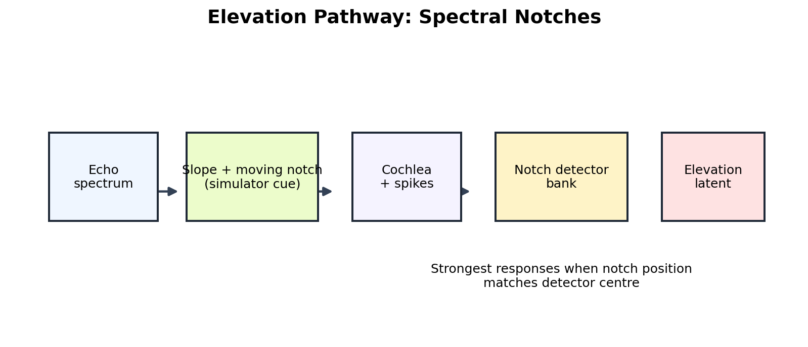
- 

Talking points:
- early elevation cue was a simple slope
- adding a moving notch made the cue richer
- explicit notch detectors improved elevation further

## Slide 10: The Life Of A Sound Signal

Walk the audience through one sound end-to-end:

1. transmit chirp
2. echo simulator adds delay, attenuation, azimuth asymmetry, and elevation cue
3. cochlea filterbank converts waveform into channel activity
4. spike encoder converts activity into spikes
5. distance / azimuth / elevation pathways compute different cue families
6. fusion SNN combines them into a 3D estimate

Visuals:
- 
- 

## Slide 11: Building A Bat Brain

Use this slide to map the computational parts to biological interpretations:

- cochlea -> peripheral filtering
- delay-line coincidence bank -> Jeffress-like timing circuit
- ILD opponent coding -> LSO/MNTB-like binaural comparison
- spectral notch detectors -> elevation / pinna-like cue decoding
- resonance bank -> tuned temporal feature extraction
- fusion SNN -> higher integration area

## Slide 12: What Actually Worked

Key experimental findings:

- the front end mattered more than expected
- unnormalized high-amplitude spikes recovered long-range behavior
- richer elevation cues helped a lot
- sine/cosine angle outputs stabilized angle regression
- biologically inspired ILD improved overall performance
- adding trainability helped, but stacking everything did not always help

Visual:
- 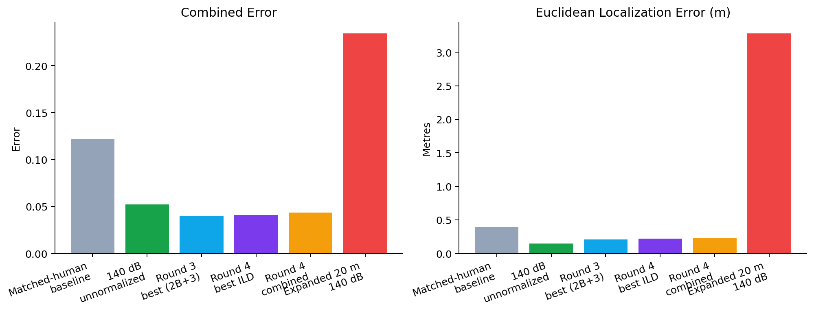

Numbers to cite:
- matched-human baseline combined error: `0.1221`
- 140 dB unnormalized short-range combined error: `0.0522`
- best round-3 combined model (`2B + 3`): combined error `0.0394`
- best round-4 individual model (LSO/MNTB ILD): combined error `0.0407`

## Slide 13: A Useful Failure Story

This is worth including because it shows real scientific debugging.

Observation:
- expanded-space tests initially collapsed badly

Diagnosis:
- per-sample envelope normalization made the front end almost level-invariant
- weak long-range returns were being renormalized upward
- that destroyed amplitude information and could create noisy spike patterns

Fix:
- use a much stronger source level (`140 dB` under the current convention)
- disable the front-end normalization

Result:
- expanded 20 m test improved from combined error `0.6315` to `0.2344`

Useful visuals:
- [Direct-drive spike count vs level](cochlea_explained/direct_drive_gain_sweep_700_spike_count_vs_level.png)
- [140 dB unnormalized cochleagram](cochlea_explained/human_matched_140db_unnormalized_cochleagram_spikes.png)

## Slide 14: Current Best Model

Recommended model to present as the current best overall story:

- Round 3 combined model `2B + 3`
  - moving-notch elevation cue + notch detectors
  - sine/cosine angle regression

If you want the most biologically trainable later variant:
- Round 4 combined model
  - explicit LIF timing replacement
  - LSO/MNTB ILD system
  - spike-sum distance cue
  - per-pathway resonance banks

Suggested message:
- the best pure accuracy and the best biological decomposition are not always exactly the same model

## Slide 15: Next Steps

### Improving the bat model
- better long-range amplitude calibration
- more realistic elevation cues / HRTF-like filtering
- cleaner separation of azimuth and elevation spectral codes
- larger cached datasets with the fixed cochlea front end

### Generalising the model
- replace hand-designed cue modules with learnable but constrained spiking modules
- test broader spatial domains
- test other sensing tasks where timing matters

## Slide 16: Conclusion

Suggested closing message:

- SNNs were useful here not just as a fashionable model class, but because the task itself is about timing, coincidence, oscillation, and sparse events.
- The work showed that biologically inspired structure can genuinely help localization.
- The strongest improvements came from understanding the sensory front end and cue design, not just adding depth.

## Suggested Backup Slides

- exhaustive experiment table: [experiments_summary.md](experiments_summary.md)
- cochlea walkthrough: [cochlea_explained.md](cochlea_explained.md)
- current system explanation: [current_system_explained.md](current_system_explained.md)
- round 3 results: [round_3_experiments_report.md](round_3_experiments_report.md)
- round 4 results: [round_4_experiments_report.md](round_4_experiments_report.md)

---

## Technical Walkthrough Appendix

This appendix uses the **final round-4 combined model** as the reference system:

- matched-human front end
- `64 kHz` sample rate
- chirp `18 kHz -> 2 kHz`
- cochlea band `2 kHz -> 20 kHz`
- `48` cochlear channels
- `140 dB` under the current convention (`1x = 80 dB SPL`, so `1000x` gain)
- **unnormalized** cochlear spike encoding
- support: `0.5 -> 5.0 m`, azimuth `-45 -> 45 deg`, elevation `-30 -> 30 deg`
- readout mode: **distance + sin/cos azimuth + sin/cos elevation**

Core tuned network parameters inherited from the saved baseline family:

- `num_delay_lines = 8`
- `num_steps = 8`
- fusion/integration LIF `beta = 0.9475`
- fusion/integration threshold `= 1.1845`
- fusion/integration reset mechanism `= subtract`
- task weights: `angle_weight = 1.2818`, `elevation_weight = 1.3961`
- spike-rate loss weight: `0.0090`
- round-4 combined extras: `cartesian_mix_weight = 0.35`, `unit_penalty_weight = 0.10`

### 1. The Signal

The model starts from a **downward FM chirp**. The simulator then applies:

- range-dependent delay
- `1 / r^2`-style attenuation
- binaural asymmetry for azimuth
- spectral notch/slope cue for elevation

Plots:

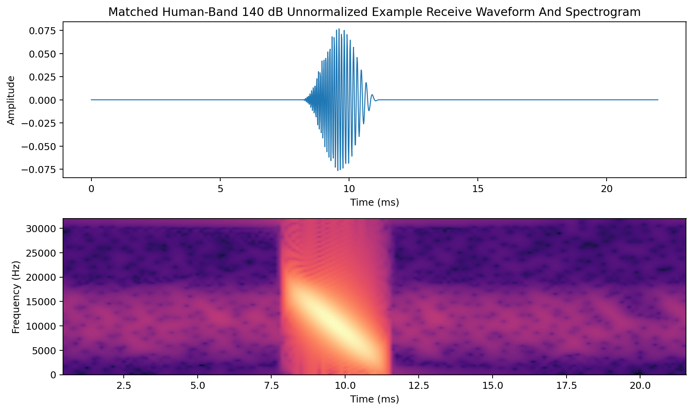

Flow:

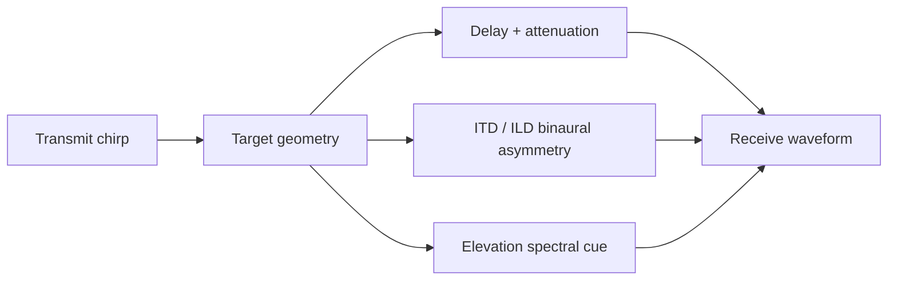

### 2. The Cochlea

The cochlea is **fixed preprocessing**, not a trained network block.

Stages:

1. FFT-domain filterbank
2. half-wave rectification
3. low-pass envelope smoothing
4. temporal downsampling
5. LIF spike encoding

Plots:


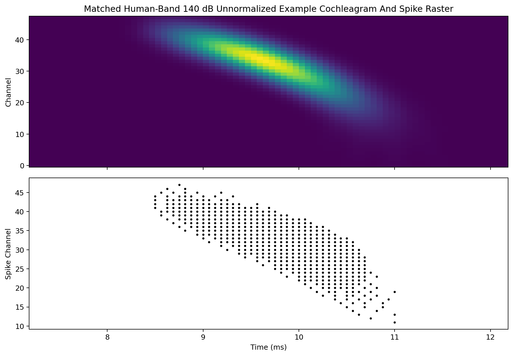

Flow:


How it encodes spikes:

- each channel has an envelope over time
- membrane update is:

```text
m[t+1] = beta * m[t] + envelope[t]
```

- a spike is emitted when `m[t] >= threshold`
- after a spike, the encoder uses **subtract-reset with floor at zero**:

```text
m[t] = max(0, m[t] - threshold)
```

So yes, the cochlea **does use LIF**. In the current round-4 combined model:

- cochlear spike threshold = `0.42`
- cochlear spike beta = `0.88`
- reset style = subtractive reset, then clamp to nonnegative
- **no per-sample envelope normalization** is applied before this stage in the final model

### 3. The Three Pathways

The model splits the spike representation into three cue families.

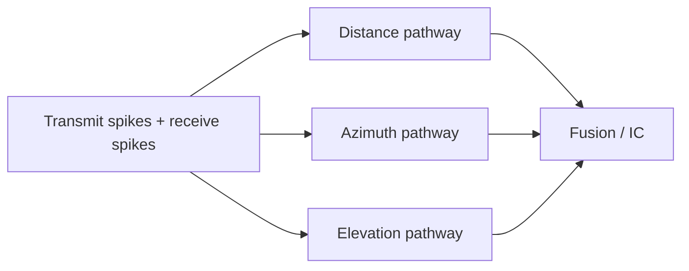

#### 3a. Distance

Distance combines two cue types:

- **delay coincidence** between transmit and echo spikes
- **spike-sum amplitude cue** from total receive activity

Conceptually:

- transmit spikes are onset-coded
- receive spikes are onset-coded
- multiple candidate delays are tested
- left and right echo coincidence scores are built
- a separate spike-sum residual gives loudness/range information

Plot / diagram:


Brain-area interpretation:

- best interpreted as a **Jeffress-style delay line / coincidence system**
- the added spike-sum cue is more like a simple intensity/range side-channel than a named nucleus

#### 3b. Azimuth

Azimuth combines:

- **ITD timing** via coincidence detection
- **ILD level comparison** via a biologically inspired **LSO/MNTB-like** system

ILD in the final round-4 combined model:

- left and right ear spike counts are computed per channel
- ipsilateral excitation is modeled
- contralateral inhibition is modeled through an MNTB-like transformation
- left and right LSO-like outputs are compared
- the normalized comparison is resized and fused with the ITD latent

Plot / diagram:


Brain-area interpretation:

- ITD side: **Jeffress/MSO-like coincidence logic**
- ILD side: **LSO/MNTB-like opponent coding**

#### 3c. Elevation

Elevation is handled very differently. It is **spectral**, not timing-first.

In the final round-4 combined model, elevation comes from:

- a simulator-side **slope + moving notch** spectral cue
- cochlear spike patterns across frequency
- explicit **notch detectors**
- a pathway-specific **high-Q resonance bank**
- shared post-pathway IC-style convolution

Plots:


Brain-area interpretation:

- spectral/pinna cue encoding rather than classic coincidence circuitry
- most closely related to **spectral-shape decoding stages**, not a single simple nucleus

### Compound Loss Function

The final round-4 combined model trains in **sine/cosine output mode**, so the network predicts:

- distance
- `sin(azimuth)`, `cos(azimuth)`
- `sin(elevation)`, `cos(elevation)`

The total training objective is:

```text
distance loss
+ angle_weight * azimuth sin/cos loss
+ elevation_weight * elevation sin/cos loss
+ 0.35 * Cartesian position loss
+ 0.10 * unit-circle penalty
+ spike_weight * spike-rate penalty
```

Where:

- `angle_weight = 1.2818`
- `elevation_weight = 1.3961`
- `spike_weight = 0.0090`
- Cartesian loss is computed in `x,y,z`
- the unit-circle penalty keeps the sine/cosine outputs close to norm `1`

### 4. Fusion In IC

The final round-4 combined model has an explicit **post-pathway IC-style integration block**, plus the pre-existing fusion SNN.

First, pathway traces are stacked and passed through a small 2D conv block:

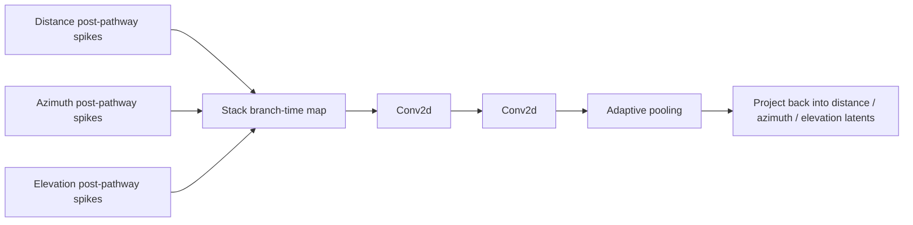

Then the final fusion SNN acts as the core integration heart:

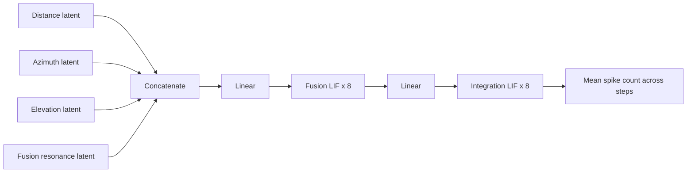

This is the closest thing in the implementation to an **IC-like shared integration core**.

### 5. SC / Readout Layer

The readout is the final linear layer after integration spikes are averaged over time.


How spike counts turn into floating-point regression:

- integration spikes have shape `[batch, step, hidden]`
- the model averages them over time: `mean(dim=1)`
- this produces a floating-point hidden vector because spike rates are real-valued after averaging
- a linear layer maps that vector to `5` floating-point outputs
- angles are decoded by:
  - normalizing the predicted sine/cosine pair
  - applying `atan2`

So the final regression is **not** based on a single last spike. It is based on **mean spike activity over several steps**, then a standard linear readout.

### 6. Results For The Final Round-4 Combined Model

Headline metrics:

- combined error: `0.0435`
- distance MAE: `0.0786 m`
- azimuth MAE: `2.8320 deg`
- elevation MAE: `2.7802 deg`
- Euclidean error: `0.2264 m`

Plots:


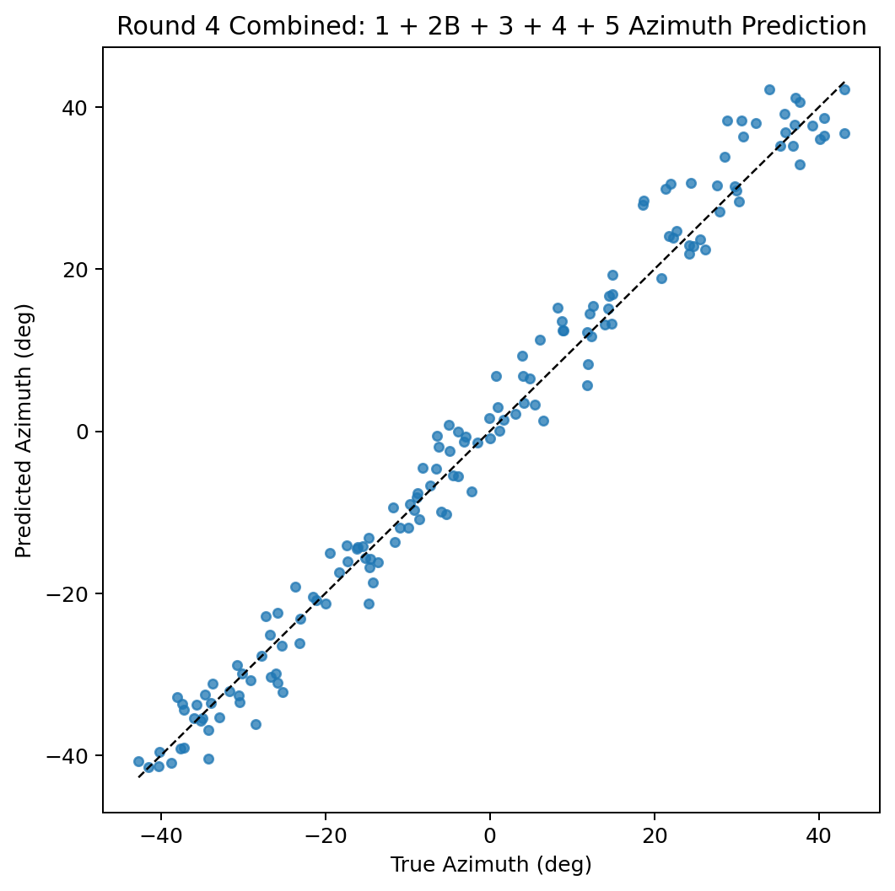
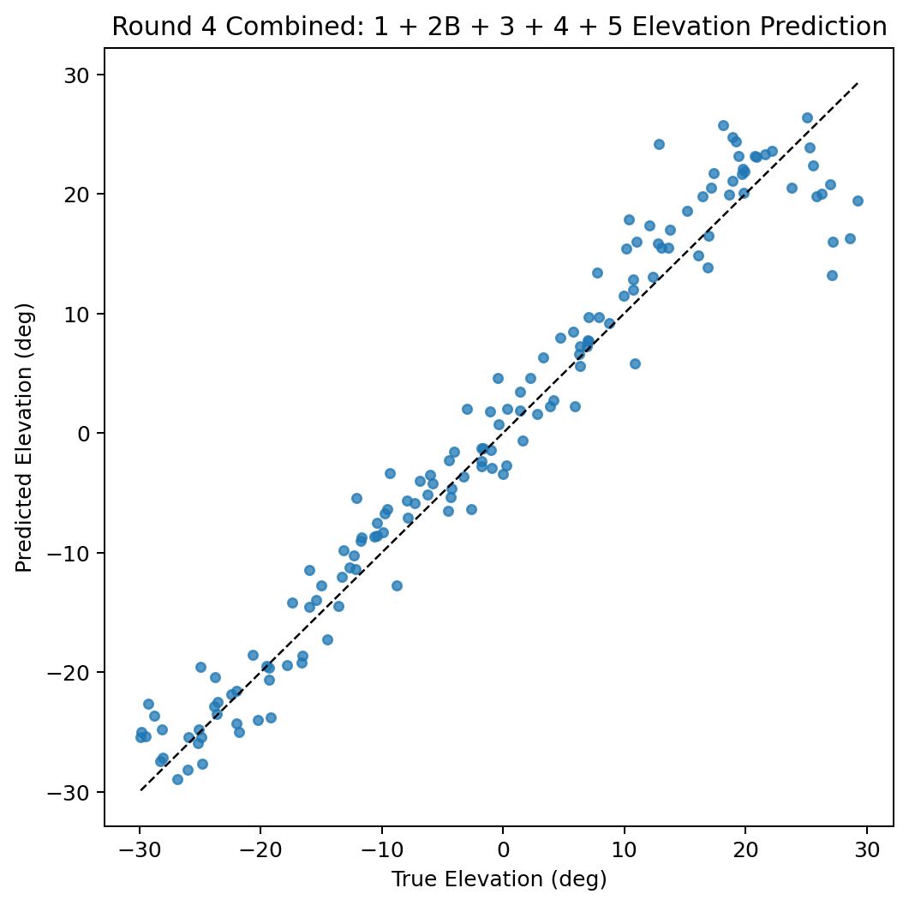


---

## Questions About The Final Round-4 Combined Model

### How does output actually work?

The final hidden spiking state is averaged over time, then passed through a linear readout to `5` floats:

- distance
- `sin(azimuth)`
- `cos(azimuth)`
- `sin(elevation)`
- `cos(elevation)`

The sine/cosine pairs are normalized and decoded with `atan2`.

### How do other parts actually work?

The model is a mixture of:

- fixed sensory preprocessing
- handcrafted spike-domain pathway features
- learned residual refinements
- learned spiking fusion

So it is not fully learned end-to-end, but it is also not fully fixed.

### How are different things encoded?

- **distance**: delay coincidence + total echo spike activity
- **azimuth**: ITD timing + ILD opponent comparison
- **elevation**: spectral slope/notch pattern across frequency channels
- **final output**: average spike rate in the fusion head

### What parts are trained vs pre-processed?

Pre-processed / fixed:

- chirp generation
- echo physics
- cochlear filterbank
- cochlear LIF encoder
- basic pathway feature construction rules
- simulator spectral cue structure

Trained:

- LIF coincidence detector weights and betas
- LSO/MNTB ILD excitation/inhibition weights
- distance spike-sum projection
- pathway-specific resonance frequencies / Q / thresholds
- post-pathway IC conv weights
- fusion SNN and readout weights
- sine/cosine output decoding parameters are not trained separately, but the `5` raw outputs are

### What does the loss function actually affect?

It affects:

- how distance vs azimuth vs elevation errors are traded off
- how strongly Cartesian position consistency is enforced
- whether sine/cosine outputs stay on the unit circle
- how much global spiking is penalized

It does **not** directly change the preprocessing logic. It shapes gradient updates to the trainable parts only.

### How does cochlea encode the signal to spikes?

It converts the waveform into a cochleagram, then each frequency channel is passed through a fixed LIF encoder:

- membrane integrates the envelope
- threshold crossing emits a spike
- subtractive reset happens

So higher envelope energy means faster threshold crossings and more spikes.

### How does the cochlea encode higher volume signals?

Because the final model uses **unnormalized** spike encoding:

- higher-amplitude signals produce larger envelope values
- the membrane charges faster
- spikes occur more easily and often more densely
- loudness information is preserved instead of being scaled away

This was one of the most important fixes for expanded-range behavior.

### How does spike count turn into a floating-point output for regression?

Spikes are binary at each step, but the model averages them across time. That average is a real number between `0` and `1` per hidden unit. The final linear layer then maps those real-valued mean spike activities into continuous regression outputs.

### What normalization happens?

In the final round-4 combined model:

- **no per-sample cochlear envelope normalization** before spike generation
- spectral elevation features include `spectral_norm`, which divides by total spectral energy
- the LSO normalized compare divides by `left_lso + right_lso`
- many feature vectors pass through `layer_norm` before projection
- Q-resonance traces are normalized by their max absolute value within each sample
- sine/cosine outputs are normalized to unit norm during decode
- Cartesian loss terms are scaled by `max_range`

### Why is elevation worse than azimuth? Why is it similar?

Elevation is usually harder because:

- it depends on spectral structure, which is more ambiguous than ITD/ILD timing cues
- the cue is synthetic and relatively simple compared with full HRTF structure
- small spectral distortions can look similar across elevations

It is still in the same rough error range as azimuth because:

- the moving-notch cue made the elevation information much richer
- the notch detector bank made the decoder much more targeted
- range is only up to `5 m` in this protocol, so the task is not yet in the hardest long-range regime

### Why do the different resonance banks have different Q factors? Are these Q factors trainable or set? Were they worked out theoretically?

They are **initialized differently** and then **trained**.

The code initializes:

- distance bank: moderate `Q` (`q_init = 6.0`)
- azimuth bank: lower `Q` (`q_init = 2.5`)
- elevation bank: higher `Q` (`q_init = 12.0`)

Why:

- azimuth benefits from broader, phase-tolerant temporal sensitivity
- distance benefits from moderate echo-structure selectivity
- elevation benefits from sharper spectral selectivity

These were **not derived from a strict closed-form theory**. They were chosen as biologically/computationally sensible priors, then made trainable through `q_raw`.

### How does the elevation pathway isolate the notches?

It does this in two stages:

1. the simulator inserts a moving notch into the spectrum
2. the decoder computes:
   - spectral normalization
   - local mean across neighboring channels
   - notch strength = `ReLU(local_mean - spectral_norm)`

Then a bank of Gaussian notch detectors measures how strongly the current notch profile matches different channel centres.

So it isolates notches by comparing each spectral channel to its local neighborhood, not by looking only at absolute power.

### What parts of the model relate to what brain areas and what types of neurons?

Approximate mapping:

- **cochlea filterbank** -> peripheral cochlea / auditory nerve front end
- **cochlear LIF encoder** -> simple spike-generating auditory afferent model
- **distance delay bank** -> Jeffress-style delay-line coincidence logic
- **ITD bank** -> MSO / Jeffress-like timing comparison
- **LSO/MNTB ILD module** -> explicit LSO/MNTB-inspired opponent coding
- **elevation notch pathway** -> spectral-shape / pinna-like cue decoding
- **post-pathway IC conv** -> IC-like shared integration map
- **fusion and integration LIF layers** -> higher spiking integration stages
- **final linear readout** -> SC-like or motor/readout stage, but implemented as a standard linear decoder

Neuron types used:

- fixed cochlear LIF encoder
- trainable LIF coincidence detectors
- trainable fusion/integration LIF neurons
- trainable resonance neurons with tunable `Q`
- non-spiking linear / convolutional projections around them
