# Round 2 Combined-All Experiment

## Overview

This run combines all of the short-data architectural additions into one model and uses the mixed Cartesian-plus-polar loss. It is intentionally a stress test: if performance improves, the features are stacking constructively; if it degrades, the gains from the individual experiments are not additive.

## Fixed Protocol

- Dataset mode: `combined_small`
- Split: `700 train / 150 validation / 150 test`
- Max epochs: `10`
- Scheduler: `ReduceLROnPlateau` with patience `3` and factor `0.5`
- Device: `cpu`
- Thread cap: `1`

## Reference Models

- Fixed short-data combined baseline: combined `0.0894`, Euclidean `0.2659 m`
- Best individual round-2 model: `Round 2 Experiment 5B: Mixed Cartesian And Polar Loss` with combined `0.0816` and Euclidean `0.2517 m`

## Combined-All Design

Architectural additions active together:
- Adaptive cue tuning from Experiment 1
- Shared corollary-discharge resonance routed both per-pathway and at fusion from Experiments 2A and 2B
- Pre-pathway LIF residual from Experiment 3
- Post-pathway LIF residual from Experiment 4
- Mixed Cartesian-plus-polar loss from Experiment 5B

## Result

- Decision vs fixed short-data baseline: `ACCEPTED`
- Better than best individual round-2 model: `YES`

Polar metrics:
- Combined error: `0.0789`
- Distance MAE: `0.0636 m`
- Azimuth MAE: `3.5316 deg`
- Elevation MAE: `5.6846 deg`

Cartesian metrics:
- Euclidean error: `0.2332 m`
- X / Y / Z MAE: `0.0778`, `0.1001`, `0.1649 m`

Delta vs fixed short-data baseline:
- Combined error delta: `-0.0105`
- Distance MAE delta: `-0.0361`
- Azimuth MAE delta: `-0.6857`
- Elevation MAE delta: `-0.0215`
- Euclidean error delta: `-0.0327 m`

Delta vs best individual round-2 model:
- Combined error delta: `-0.0027`
- Distance MAE delta: `-0.0040`
- Azimuth MAE delta: `-0.7617`
- Elevation MAE delta: `-0.0854`
- Euclidean error delta: `-0.0185 m`

## Timing Breakdown

- Saved combined-all wall clock: `1115.77 s` total
- Data prep in saved run: `164.65 s` (14.8%)
- Training in saved run: `946.07 s` (84.8%)
- Evaluation in saved run: `5.06 s` (0.5%)

Profiled data-preparation breakdown:
- Scene synthesis: `0.30 s` (0.2% of profiled prep)
- Candidate setup: `0.00 s`
- Cochlea + spike conversion: `163.51 s` (99.3% of profiled prep)
- Pathway feature construction: `0.75 s` (0.5% of profiled prep)
- Tensor concatenation: `0.03 s`
- Standardization: `0.01 s`
- Profiled prep total: `164.65 s` with chunk size `64`

- Train split: `700` samples over `11` chunks, `120.35 s` total
  front end `119.81 s`, pathway `0.52 s`, concat `0.02 s`
- Val split: `150` samples over `3` chunks, `22.68 s` total
  front end `22.57 s`, pathway `0.11 s`, concat `0.00 s`
- Test split: `150` samples over `3` chunks, `21.26 s` total
  front end `21.14 s`, pathway `0.12 s`, concat `0.00 s`

Training-loop breakdown:
- Baseline-config Optuna trial loop total: `1068.91 s` across `10` epochs
- Mean epoch time: `106.89 s`
- Forward pass: `305.02 s`
- Loss assembly: `7.29 s`
- Backward pass: `695.00 s`
- Optimizer step: `0.84 s`
- Validation forward: `31.15 s`
- Validation loss: `0.00 s`
- Validation metrics pass: `28.40 s`
- Total training batches processed: `590`
- Interpretation: the main barrier is not the final linear readout; it is repeated spike-domain model forward/backward through the added residual and resonance branches, plus a second full validation forward used for metric computation each epoch.

## Cochlea / Spike Boundary

- Boundary: `cochlea_to_spikes -> build_pathway_features`
- Upstream spike contract: transmit `[700, 48, 1408]`, receive `[700, 2, 48, 1408]` at `64000.0 Hz` envelope rate
- Downstream pathway tensors: distance `[700, 16]`, azimuth `[700, 16]`, elevation `[700, 144]`
- What the boundary means:
  the cochlea side is responsible for taking waveforms to per-channel spike trains, while the rest of the system assumes those spike tensors already exist and builds delay, ITD/ILD, spectral, resonance, and fusion features from them.
- How easy it is to swap:
  `moderate`. The easiest replacement keeps the same spike tensor contract: transmit spikes shaped [batch, channel, time] and receive spikes shaped [batch, ear, channel, time] on the same envelope-rate time base.
- What must change if the alternative cochlea differs:
  If an alternative cochlea changes channel count, time resolution, or stops emitting spikes, then build_pathway_features and the pre-pathway residual branch need an adapter or a rewrite.
- Practical conclusion:
  the clean replacement point is `_extract_front_end()` / `cochlea_to_spikes()`. If a new cochlea preserves the spike tensor shapes, the rest of the combined-all model can stay unchanged.

## Optuna Tuning

- Study name: `round2_combined_all_short_v1`
- Storage: `sqlite:///outputs/round_2_combined_all/optuna_study.db`
- Trials requested/completed: `5` total, `2` completed
- Cache strategy: one short-data prepared bundle was built once, then every Optuna trial reused the same synthetic scenes, cochlea spikes, and pathway tensors. The search space only changed downstream model and training parameters, so no front-end rebuild was needed per trial.

Best Optuna trial:
- Trial number: `0`
- Validation objective: `0.0809`
- Test combined error: `0.0801`
- Test Euclidean error: `0.2487 m`
- Distance / azimuth / elevation: `0.0783 m`, `3.6520 deg`, `5.5502 deg`
- Delta vs saved combined-all: combined `0.0012`, Euclidean `0.0155 m`

Best parameters:
- `hidden_dim`: `112`
- `num_steps`: `8`
- `membrane_beta`: `0.9475477253452869`
- `fusion_threshold`: `1.1844936591445887`
- `learning_rate_scale`: `0.85`
- `batch_size`: `12`
- `cartesian_mix_weight`: `0.5`
- `spike_weight_scale`: `1.0`

Parameter importance:
- `batch_size`: `0.1250`
- `cartesian_mix_weight`: `0.1250`
- `fusion_threshold`: `0.1250`
- `hidden_dim`: `0.1250`
- `learning_rate_scale`: `0.1250`
- `membrane_beta`: `0.1250`
- `num_steps`: `0.1250`
- `spike_weight_scale`: `0.1250`

## Plots

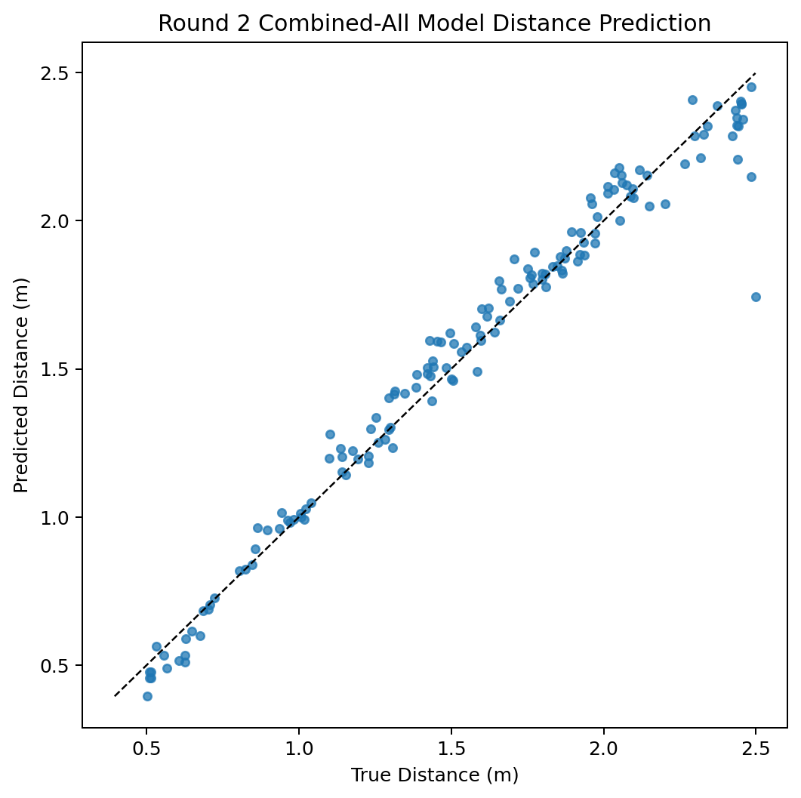
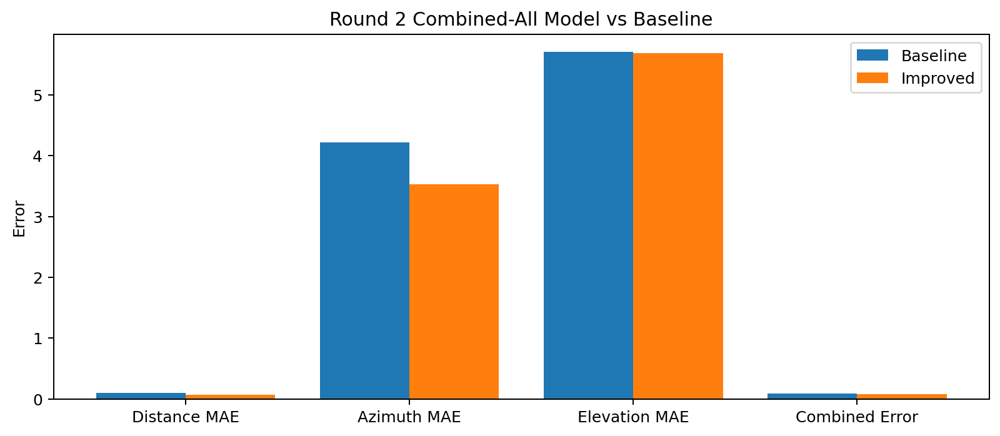
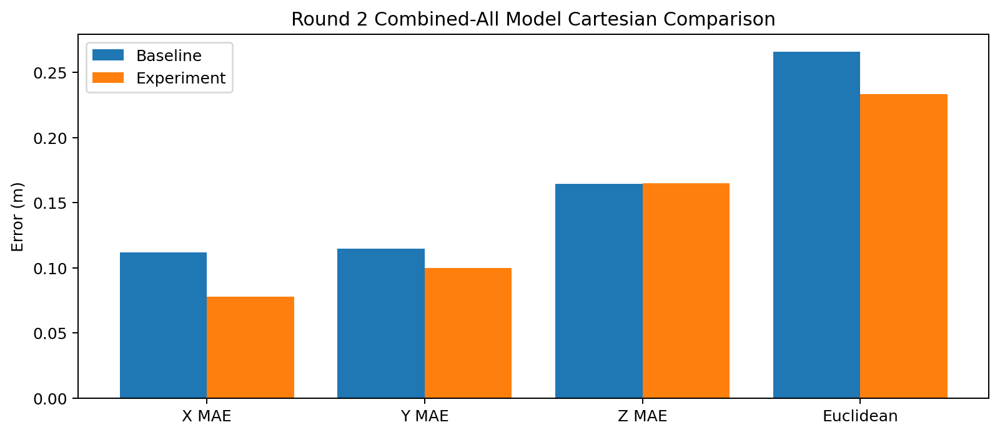
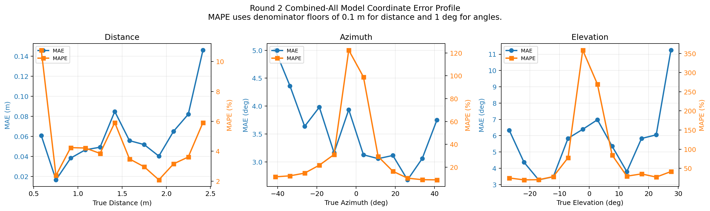
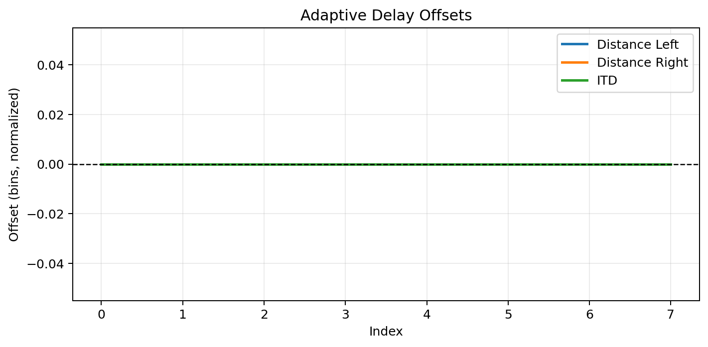
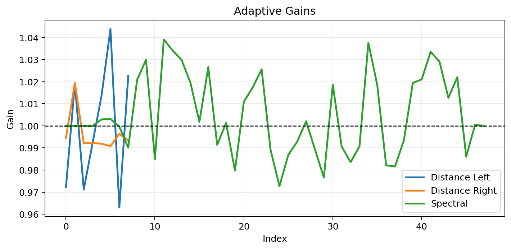
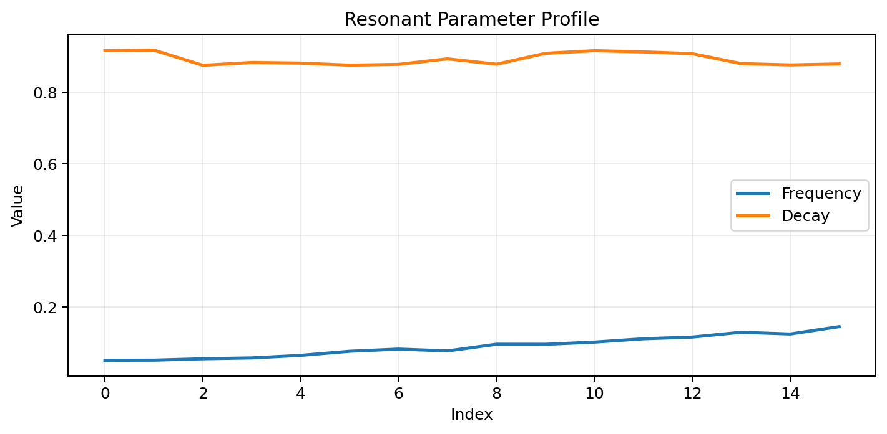

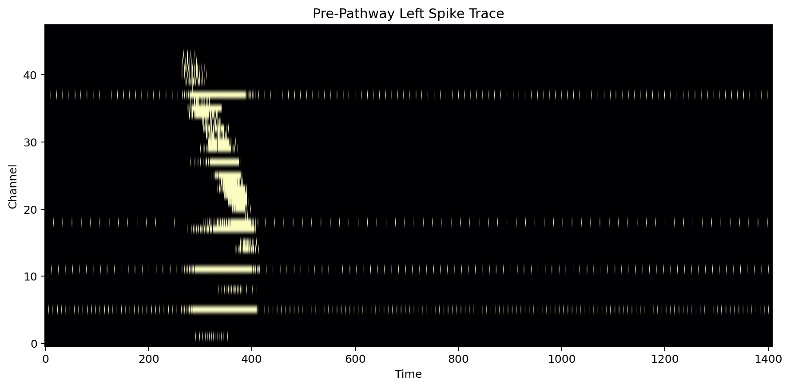
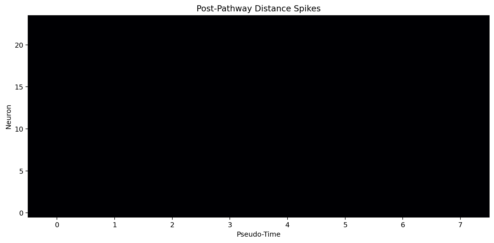
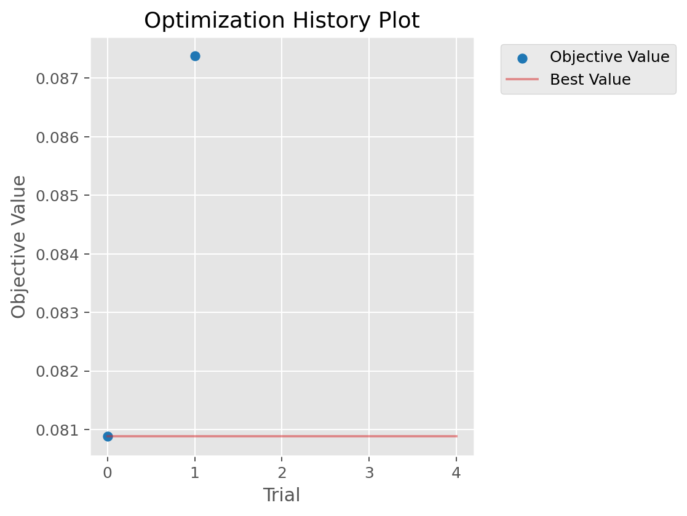
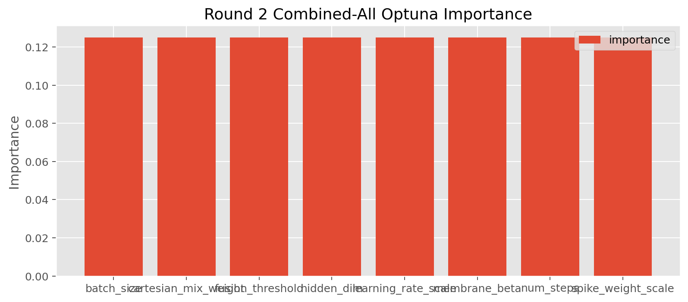
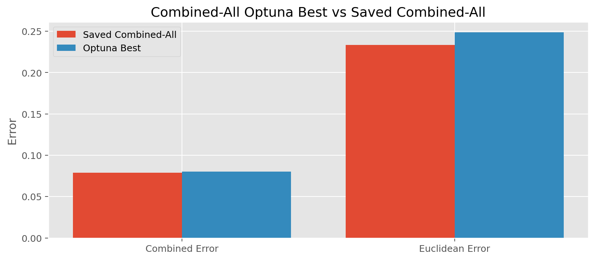

## Interpretation

If this model improves on the best individual result, the round-2 changes are largely complementary. If it only beats the fixed baseline but not the best individual variant, then the additions help in isolation but partly compete when stacked. If it loses to both, the short-data improvements are not additive and the combined model is over-complex for this regime.

The new timing analysis shows that the combined-all short-data regime is dominated by two areas: front-end spike construction during preparation, and repeated spike-domain forward/backward passes through the resonance plus residual branches during training. The cochlea boundary is explicit and reasonably clean, so an alternative cochlea is practical as long as it preserves the spike-tensor contract or provides an adapter before `build_pathway_features()`.
