# Round 3 Experiments

## Overview

Round 3 keeps the round-2 combined model as the structural baseline, changes the front-end operating regime to a matched-human 140 dB unnormalized setting, extends the range support to 5 m, and then tests targeted pathway and output-code changes against that same fresh control.

## Protocol

- Front end: matched-human
- Sample rate: `64000` Hz
- Chirp: `18000 -> 2000 Hz` over `3.0 ms`
- Cochlea band: `2000 -> 20000 Hz`
- Cochlea channels: `48`
- Envelope normalization before spikes: `off`
- Transmit gain: `1000x` (`140 dB` under the `1x = 80 dB` convention)
- Distance support: `0.5 to 5.0 m`
- Azimuth support: `-45 to 45 deg`
- Elevation support: `-30 to 30 deg`
- Split: `700 train / 150 validation / 150 test`
- Max epochs: `10`
- Scheduler: `ReduceLROnPlateau`, patience `2`, factor `0.5`
- Device: `cpu`
- Thread cap: `1`

## Experiment 0 Control

- Combined error: `0.0630`
- Distance MAE: `0.1377 m`
- Azimuth MAE: `3.4642 deg`
- Elevation MAE: `3.9121 deg`
- Euclidean error: `0.3145 m`
- Runtime: `488.85 s` total, `487.09 s` training

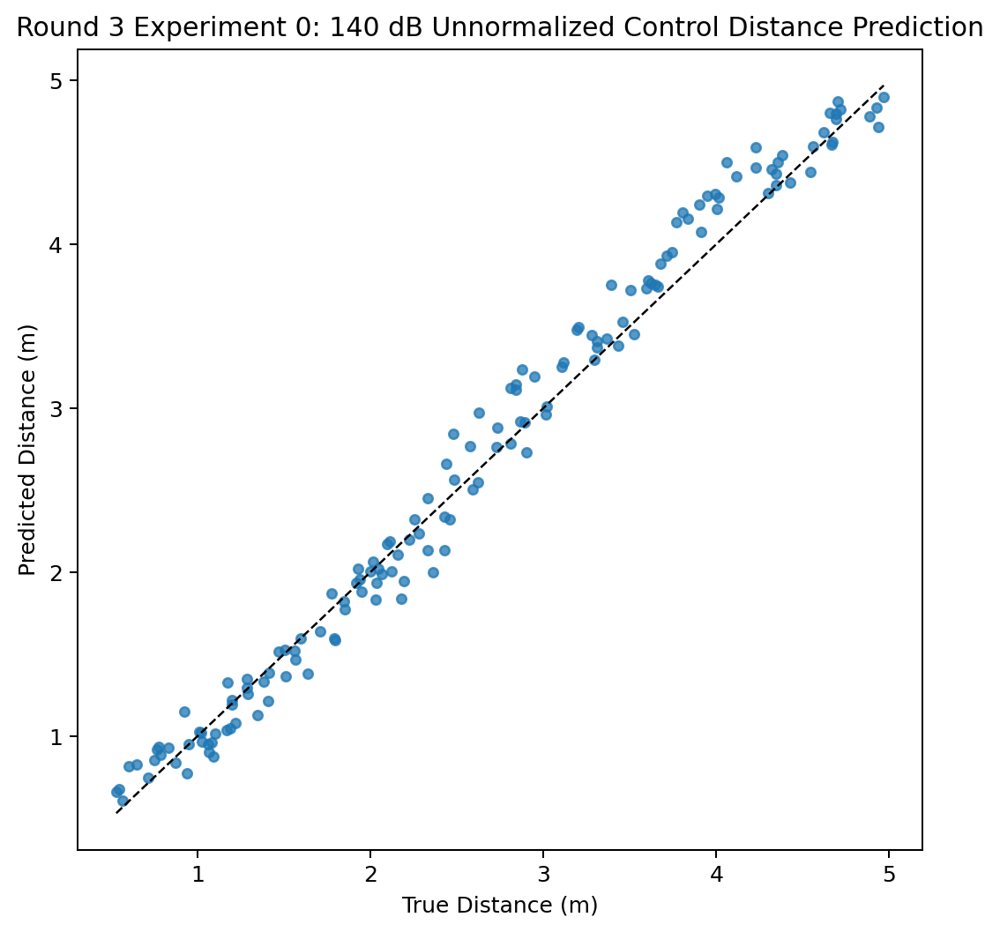
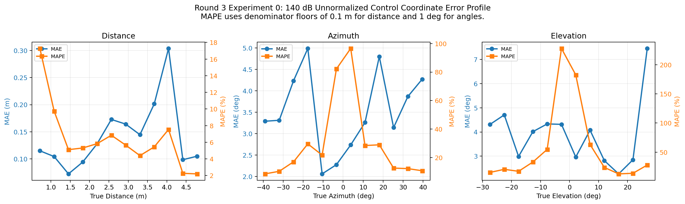

## Results Table

| Experiment | Combined Error | Euclidean (m) | Distance MAE (m) | Azimuth MAE (deg) | Elevation MAE (deg) | Accepted |
| --- | --- | --- | --- | --- | --- | --- |
| Round 3 Experiment 1: Trainable LIF Coincidence Detectors | 0.0531 | 0.2482 | 0.1075 | 2.3063 | 3.6960 | Yes |
| Round 3 Experiment 2: Comb-Filtered Elevation Features | 0.0677 | 0.3396 | 0.1638 | 4.1123 | 3.9853 | No |
| Round 3 Experiment 3: Sine/Cosine Angle Regression | 0.0593 | 0.2706 | 0.0770 | 3.3350 | 4.2824 | Yes |
| Round 3 Experiment 4: 0-1 Distance Labels | 0.0740 | 0.3653 | 0.2332 | 3.0242 | 3.9133 | No |

## Detailed Experiments

### Round 3 Experiment 1: Trainable LIF Coincidence Detectors

- Change: Replace the fixed distance and ITD overlap banks with explicit spike-domain LIF coincidence banks that receive delayed reference spikes and undelayed target spikes.
- Rationale: This tests whether making coincidence detection explicitly spiking and mildly trainable improves the timing pathways without discarding the round-2 inductive bias.
- Decision vs control: `ACCEPTED`

Implementation details:
- Keep the full round-2 combined encoder as the base path.
- Build delay-aligned reference spike banks for transmit-to-echo and left-to-right timing cues.
- Feed the delayed reference spikes and the target spikes into trainable LIF coincidence banks.
- Project the resulting coincidence spike rates into residual distance and azimuth latents.
- Train detector weights and membrane beta while keeping the detector thresholds fixed.

Analysis focus:
- Whether explicit LIF coincidence banks improve distance or azimuth beyond the round-3 control.
- Whether the learned beta and input weights stay in a sensible regime rather than saturating.

Metrics:
- Combined error: `0.0531`
- Distance MAE: `0.1075 m`
- Azimuth MAE: `2.3063 deg`
- Elevation MAE: `3.6960 deg`
- Euclidean error: `0.2482 m`

Delta vs control:
- Combined error delta: `-0.0099`
- Distance MAE delta: `-0.0302`
- Azimuth MAE delta: `-1.1580`
- Elevation MAE delta: `-0.2161`
- Euclidean delta: `-0.0663 m`

Timing:
- Training: `506.01 s`
- Evaluation: `1.58 s`
- Total: `507.59 s`

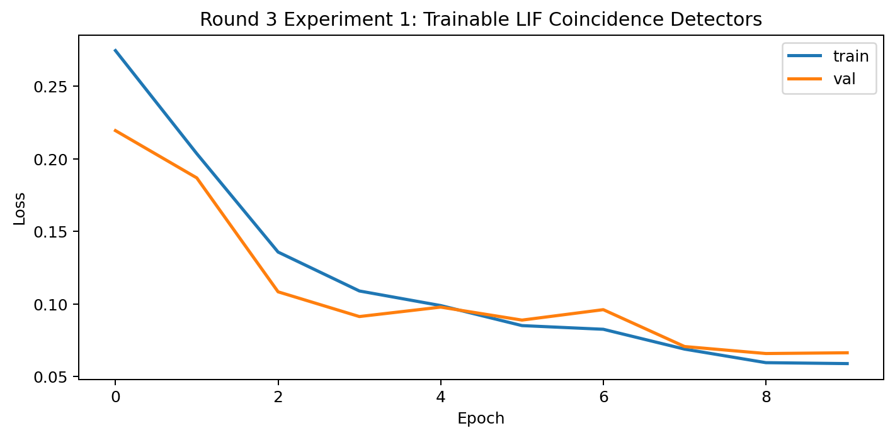
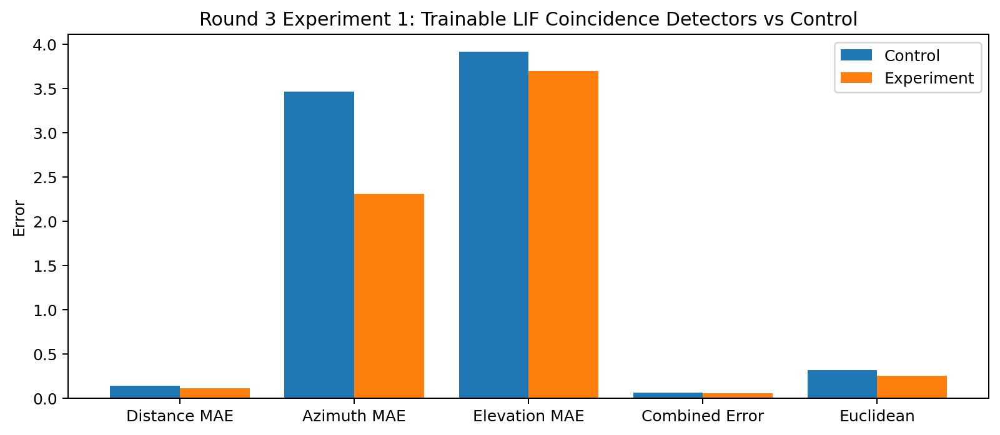
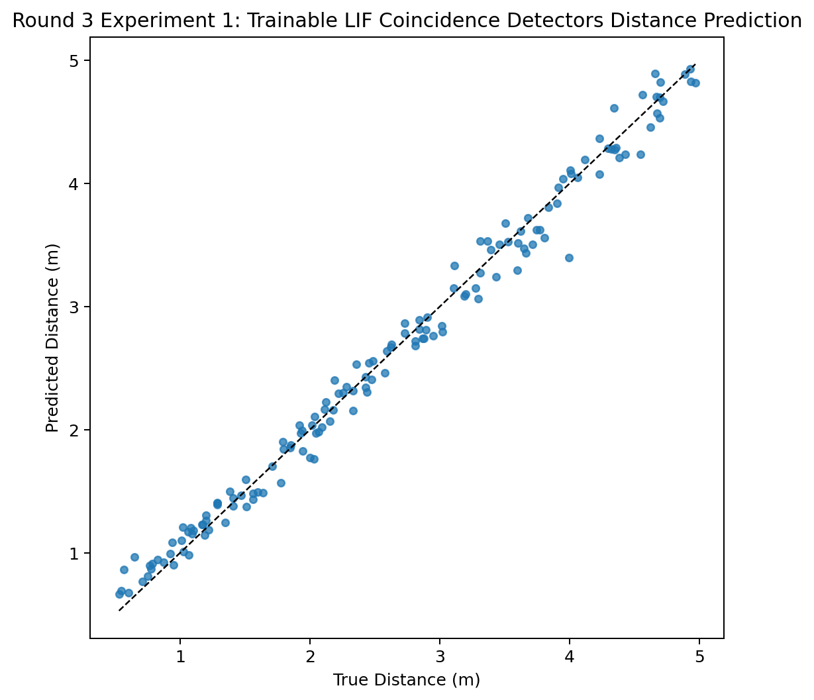
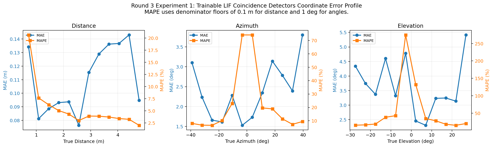
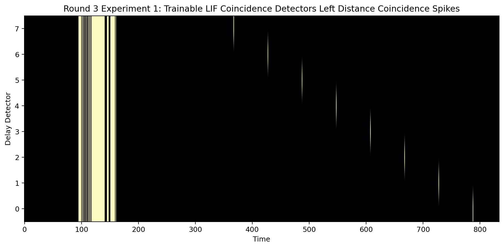
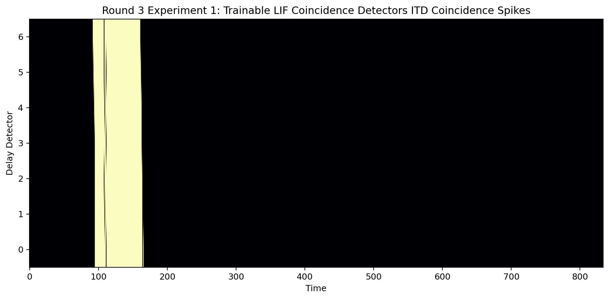
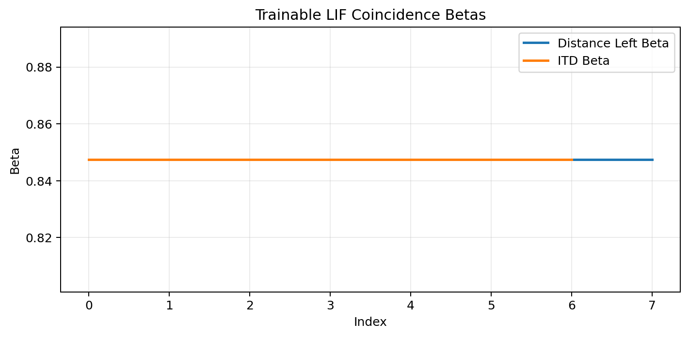

### Round 3 Experiment 2: Comb-Filtered Elevation Features

- Change: Replace the simple spectral-slope style elevation residual with a comb-response residual that measures periodic spectral structure across frequency channels.
- Rationale: This tests whether a richer fixed spectral operator improves elevation cues more than the current slope-like summary.
- Decision vs control: `REJECTED`

Implementation details:
- Keep the round-2 combined encoder as the base path.
- Build spectral norm and notch terms exactly as before.
- Replace the residual slope-like term with a multi-lag comb response across channels.
- Project the comb feature vector into an elevation residual latent with a small learned gain.

Analysis focus:
- Whether the comb response reduces elevation MAE relative to the round-3 control.
- Whether the richer spectral filter improves elevation without damaging distance and azimuth.

Metrics:
- Combined error: `0.0677`
- Distance MAE: `0.1638 m`
- Azimuth MAE: `4.1123 deg`
- Elevation MAE: `3.9853 deg`
- Euclidean error: `0.3396 m`

Delta vs control:
- Combined error delta: `0.0047`
- Distance MAE delta: `0.0261`
- Azimuth MAE delta: `0.6481`
- Elevation MAE delta: `0.0733`
- Euclidean delta: `0.0251 m`

Timing:
- Training: `504.18 s`
- Evaluation: `1.88 s`
- Total: `506.06 s`

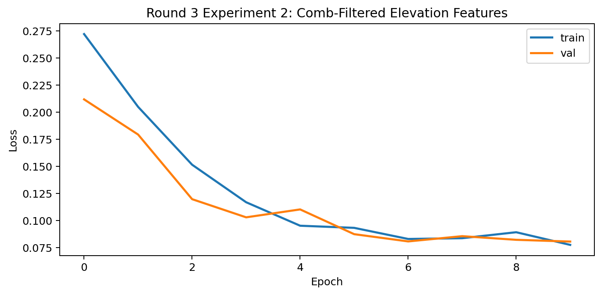
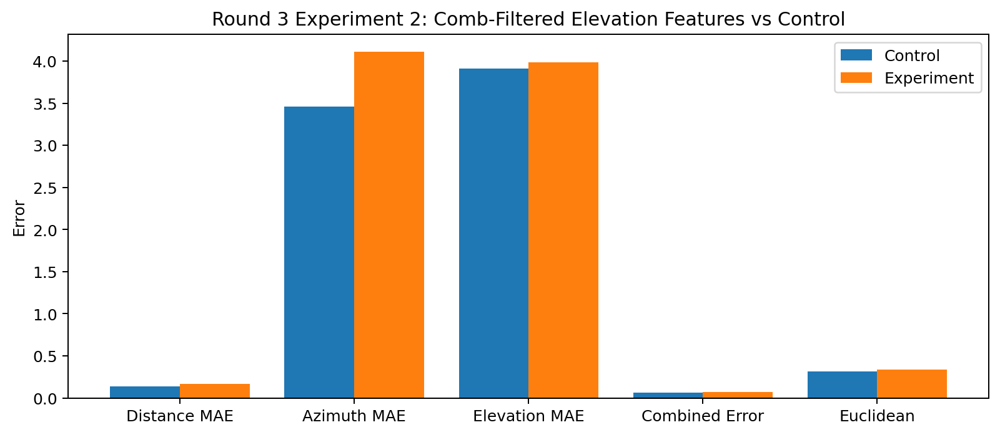
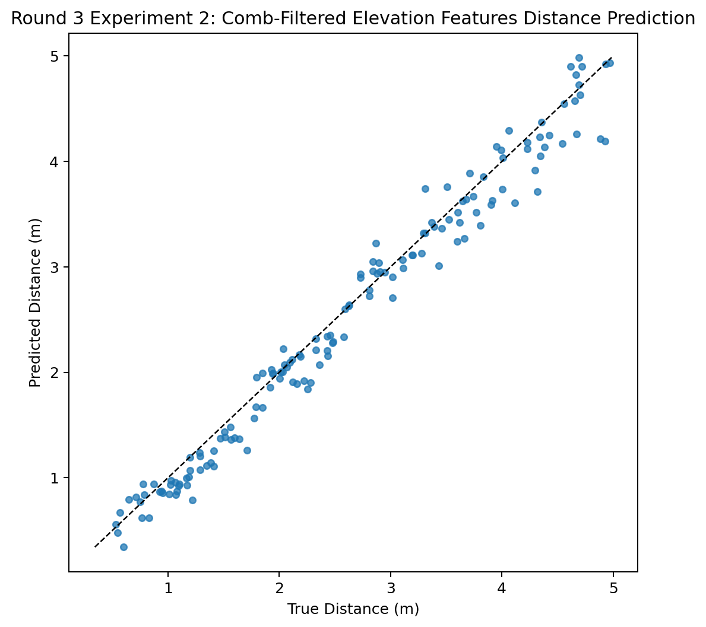
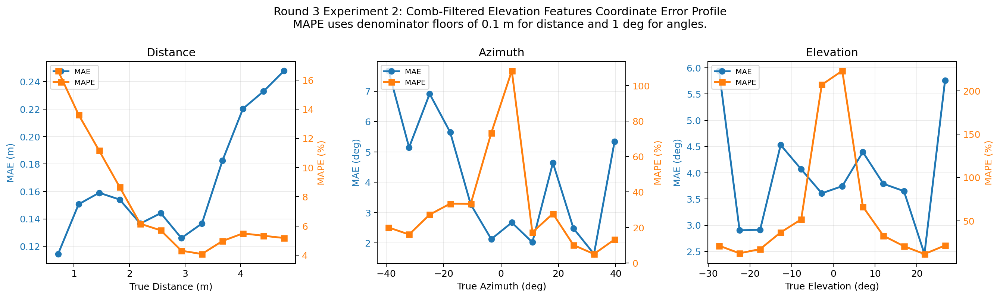

Comb-filter explanation:
- This is not a temporal comb filter on the waveform.
- It is a frequency-channel operator applied to the normalized binaural spike-count spectrum after the cochlea and spike encoding.
- First, left and right receive spikes are summed over time to get per-channel spike counts, then combined into a normalized spectrum `x[c]`.
- For each lag `k`, the operator computes `|x[c] - 0.5 * (x[c-k] + x[c+k])|`, so a channel responds strongly when it differs from its symmetric neighbours.
- Lags `2`, `4`, and `6` channels are averaged, giving a richer periodic spectral-contrast cue than the previous simple slope-like summary.
- The resulting comb-response vector is concatenated with the existing spectral norm and notch terms, projected through a learned linear layer, and added as a residual only to the elevation latent.

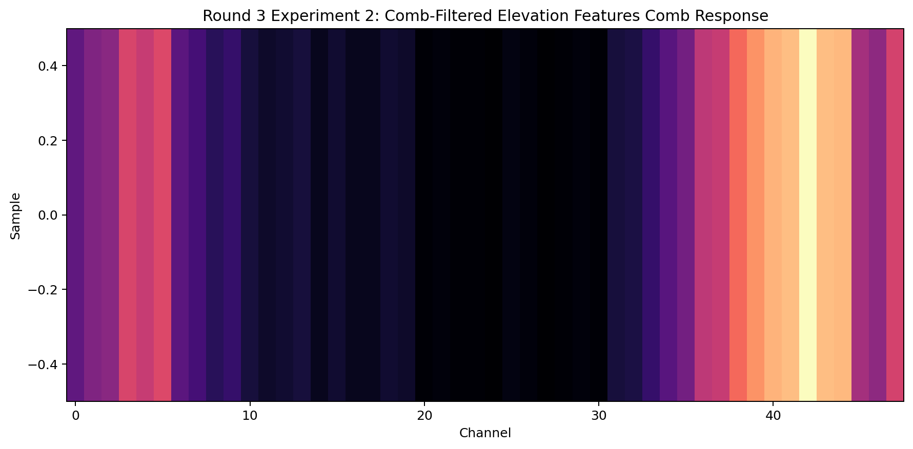
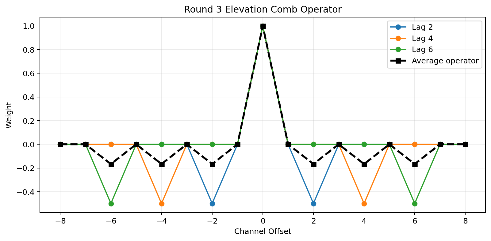

### Round 3 Experiment 3: Sine/Cosine Angle Regression

- Change: Predict azimuth and elevation as sine/cosine pairs, constrain the outputs toward the unit circle, and decode them back to angles only for evaluation and Cartesian regularization.
- Rationale: This tests whether removing angular wraparound from the raw regression target improves optimization.
- Decision vs control: `ACCEPTED`

Implementation details:
- Keep the round-2 combined architecture unchanged up to the final readout.
- Increase the readout size from 3 to 5 outputs: distance, azimuth sin/cos, elevation sin/cos.
- Normalize the predicted angle pairs before decoding with atan2.
- Add a unit-circle penalty on the raw pair norms.

Analysis focus:
- Whether angular wraparound handling improves azimuth and elevation errors.
- Whether the unit-circle constraint remains active rather than collapsing to near-zero vectors.

Metrics:
- Combined error: `0.0593`
- Distance MAE: `0.0770 m`
- Azimuth MAE: `3.3350 deg`
- Elevation MAE: `4.2824 deg`
- Euclidean error: `0.2706 m`

Delta vs control:
- Combined error delta: `-0.0037`
- Distance MAE delta: `-0.0607`
- Azimuth MAE delta: `-0.1292`
- Elevation MAE delta: `0.3704`
- Euclidean delta: `-0.0439 m`

Timing:
- Training: `492.17 s`
- Evaluation: `1.73 s`
- Total: `493.89 s`

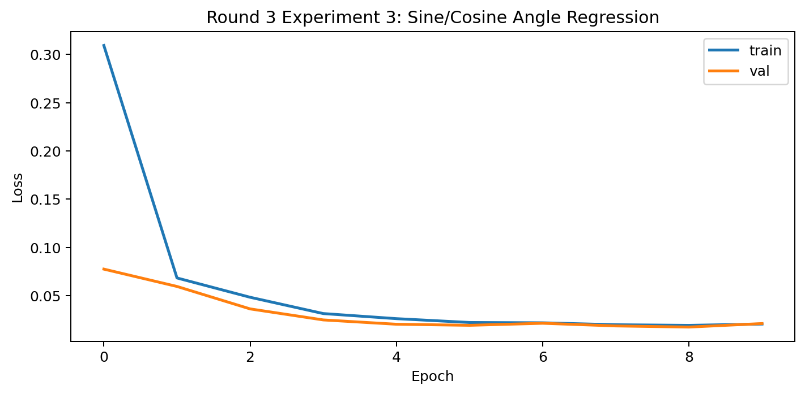
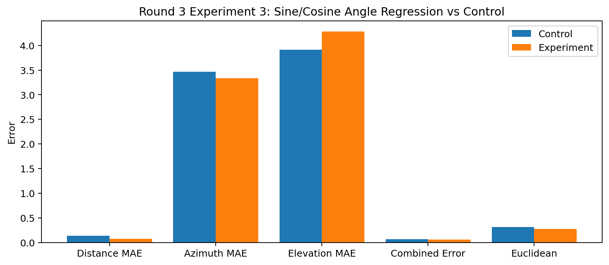
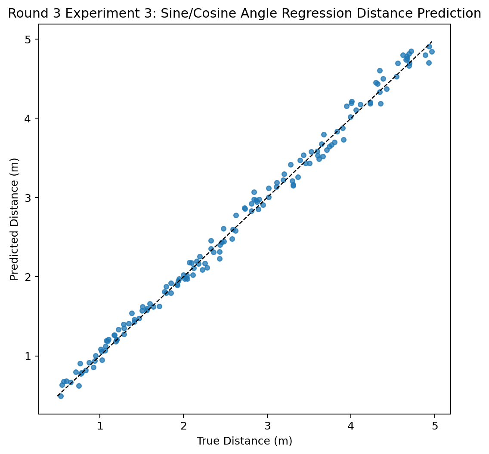
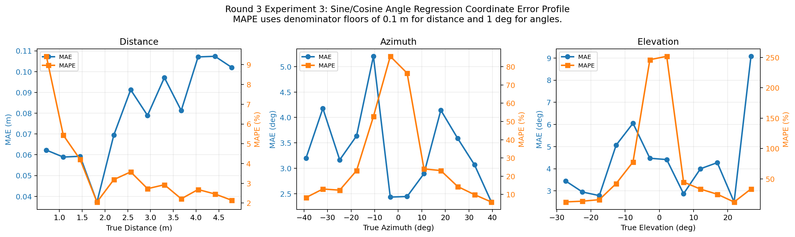
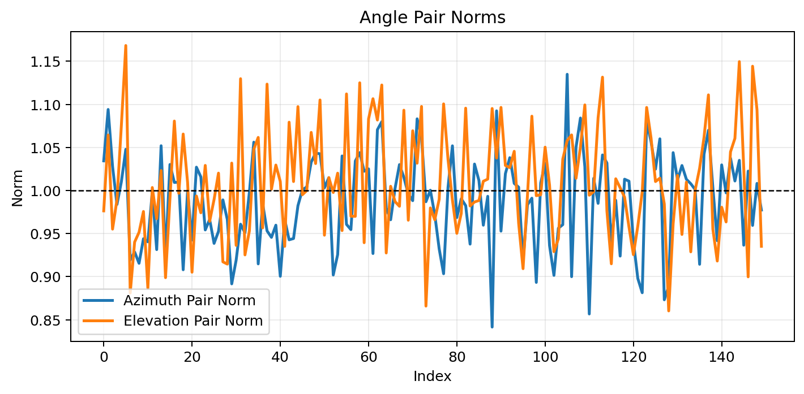

### Round 3 Experiment 4: 0-1 Distance Labels

- Change: Train the distance output against labels normalized to the 0-1 interval, then decode them back to physical metres for evaluation.
- Rationale: This tests whether a simpler bounded distance target improves conditioning when the range support is wider than the original short task.
- Decision vs control: `REJECTED`

Implementation details:
- Keep the round-2 combined architecture unchanged up to the final readout.
- Apply a sigmoid to the distance output and train it against 0-1 normalized range labels.
- Keep angle decoding compatible with the baseline target bundle.
- Decode distance back to metres for all reported metrics.

Analysis focus:
- Whether the bounded distance code improves distance MAE without harming angle prediction.
- Whether the decoded 0-1 distance output saturates near the support limits.

Metrics:
- Combined error: `0.0740`
- Distance MAE: `0.2332 m`
- Azimuth MAE: `3.0242 deg`
- Elevation MAE: `3.9133 deg`
- Euclidean error: `0.3653 m`

Delta vs control:
- Combined error delta: `0.0110`
- Distance MAE delta: `0.0955`
- Azimuth MAE delta: `-0.4400`
- Elevation MAE delta: `0.0012`
- Euclidean delta: `0.0508 m`

Timing:
- Training: `565.27 s`
- Evaluation: `1.73 s`
- Total: `567.00 s`

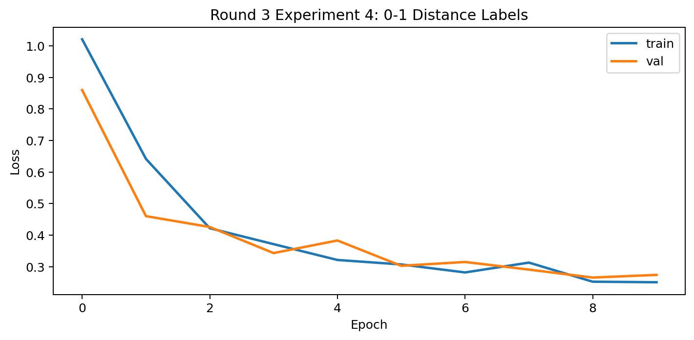
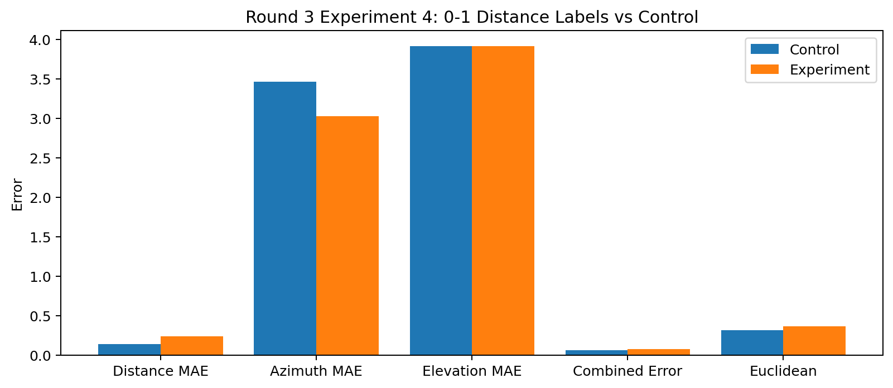
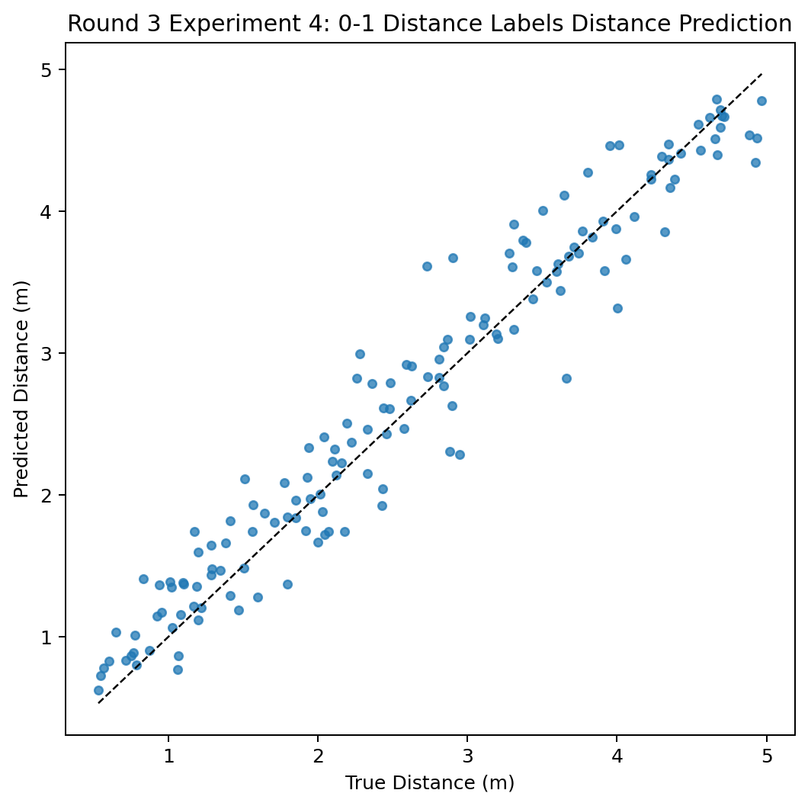
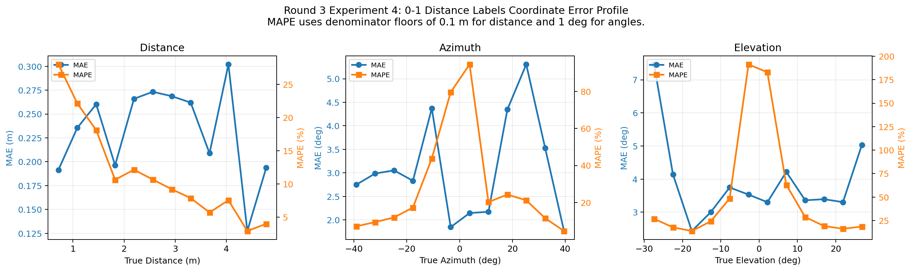

## Summary

- Accepted experiments: Round 3 Experiment 1: Trainable LIF Coincidence Detectors, Round 3 Experiment 3: Sine/Cosine Angle Regression
- Round 3 uses the fresh 5 m, 140 dB, unnormalized control as the only reference.
- Any accepted variant should be rerun on a longer schedule before it replaces the current short-run baseline.
