# Round 3 Experiments

## Overview

Round 3 keeps the round-2 combined model as the structural baseline, changes the front-end operating regime to a matched-human 140 dB unnormalized setting, extends the range support to 5 m, and then tests targeted pathway and output-code changes against that same fresh control.

## Protocol

- Front end: matched-human
- Sample rate: `64000` Hz
- Chirp: `18000 -> 2000 Hz` over `3.0 ms`
- Cochlea band: `2000 -> 20000 Hz`
- Cochlea channels: `48`
- Envelope normalization before spikes: `off`
- Transmit gain: `1000x` (`140 dB` under the `1x = 80 dB` convention)
- Distance support: `0.5 to 5.0 m`
- Azimuth support: `-45 to 45 deg`
- Elevation support: `-30 to 30 deg`
- Split: `700 train / 150 validation / 150 test`
- Max epochs: `10`
- Scheduler: `ReduceLROnPlateau`, patience `2`, factor `0.5`
- Device: `cpu`
- Thread cap: `1`

## Experiment 0 Control

- Combined error: `0.0630`
- Distance MAE: `0.1377 m`
- Azimuth MAE: `3.4642 deg`
- Elevation MAE: `3.9121 deg`
- Euclidean error: `0.3145 m`
- Runtime: `488.85 s` total, `487.09 s` training

## Results Table

| Experiment | Combined Error | Euclidean (m) | Distance MAE (m) | Azimuth MAE (deg) | Elevation MAE (deg) | Accepted |
| --- | --- | --- | --- | --- | --- | --- |
| Round 3 Experiment 1: Trainable LIF Coincidence Detectors | 0.0531 | 0.2482 | 0.1075 | 2.3063 | 3.6960 | Yes |
| Round 3 Experiment 2: Comb-Filtered Elevation Features | 0.0677 | 0.3396 | 0.1638 | 4.1123 | 3.9853 | No |
| Round 3 Experiment 2A: Moving-Notch Elevation Cue | 0.0432 | 0.2249 | 0.1198 | 2.5915 | 2.1565 | Yes |
| Round 3 Experiment 2B: Moving-Notch Cue Plus Notch Detectors | 0.0396 | 0.2127 | 0.1038 | 2.8270 | 1.9386 | Yes |
| Round 3 Experiment 3: Sine/Cosine Angle Regression | 0.0593 | 0.2706 | 0.0770 | 3.3350 | 4.2824 | Yes |
| Round 3 Experiment 3A: Ear-Specific Azimuth Notch Detectors | 0.0983 | 0.3742 | 0.1304 | 2.2429 | 7.7429 | No |
| Round 3 Experiment 3B: Ear-Specific Azimuth Notch Detectors Without Slope | 0.1005 | 0.4139 | 0.1291 | 2.6449 | 8.0721 | No |
| Round 3 Experiment 3C: Orthogonal Combined Azimuth/Elevation Notches | 0.0469 | 0.2391 | 0.1351 | 3.3489 | 2.1144 | Yes |
| Round 3 Experiment 4: 0-1 Distance Labels | 0.0740 | 0.3653 | 0.2332 | 3.0242 | 3.9133 | No |

## Detailed Experiments

### Round 3 Experiment 1: Trainable LIF Coincidence Detectors

- Change: Replace the fixed distance and ITD overlap banks with explicit spike-domain LIF coincidence banks that receive delayed reference spikes and undelayed target spikes.
- Rationale: This tests whether making coincidence detection explicitly spiking and mildly trainable improves the timing pathways without discarding the round-2 inductive bias.
- Decision vs control: `ACCEPTED`
- Data variant: `base`

Implementation details:
- Keep the full round-2 combined encoder as the base path.
- Build delay-aligned reference spike banks for transmit-to-echo and left-to-right timing cues.
- Feed the delayed reference spikes and the target spikes into trainable LIF coincidence banks.
- Project the resulting coincidence spike rates into residual distance and azimuth latents.
- Train detector weights and membrane beta while keeping the detector thresholds fixed.

Analysis focus:
- Whether explicit LIF coincidence banks improve distance or azimuth beyond the round-3 control.
- Whether the learned beta and input weights stay in a sensible regime rather than saturating.

Metrics:
- Combined error: `0.0531`
- Distance MAE: `0.1075 m`
- Azimuth MAE: `2.3063 deg`
- Elevation MAE: `3.6960 deg`
- Euclidean error: `0.2482 m`

Delta vs control:
- Combined error delta: `-0.0099`
- Distance MAE delta: `-0.0302`
- Azimuth MAE delta: `-1.1580`
- Elevation MAE delta: `-0.2161`
- Euclidean delta: `-0.0663 m`

Timing:
- Training: `506.01 s`
- Evaluation: `1.58 s`
- Total: `507.59 s`

### Round 3 Experiment 2: Comb-Filtered Elevation Features

- Change: Replace the simple spectral-slope style elevation residual with a comb-response residual that measures periodic spectral structure across frequency channels.
- Rationale: This tests whether a richer fixed spectral operator improves elevation cues more than the current slope-like summary.
- Decision vs control: `REJECTED`
- Data variant: `base`

Implementation details:
- Keep the round-2 combined encoder as the base path.
- Build spectral norm and notch terms exactly as before.
- Replace the residual slope-like term with a multi-lag comb response across channels.
- Project the comb feature vector into an elevation residual latent with a small learned gain.

Analysis focus:
- Whether the comb response reduces elevation MAE relative to the round-3 control.
- Whether the richer spectral filter improves elevation without damaging distance and azimuth.

Metrics:
- Combined error: `0.0677`
- Distance MAE: `0.1638 m`
- Azimuth MAE: `4.1123 deg`
- Elevation MAE: `3.9853 deg`
- Euclidean error: `0.3396 m`

Delta vs control:
- Combined error delta: `0.0047`
- Distance MAE delta: `0.0261`
- Azimuth MAE delta: `0.6481`
- Elevation MAE delta: `0.0733`
- Euclidean delta: `0.0251 m`

Timing:
- Training: `504.18 s`
- Evaluation: `1.88 s`
- Total: `506.06 s`

Comb-filter explanation:
- This is not a temporal comb filter on the waveform.
- It is a frequency-channel operator applied to the normalized binaural spike-count spectrum.
- For each lag `k`, it computes `|x[c] - 0.5 * (x[c-k] + x[c+k])|`, so a channel is large when it differs from its symmetric neighbours.
- Lags `2`, `4`, and `6` are averaged, giving a richer spectral-periodicity cue than the previous simple slope term.

### Round 3 Experiment 2A: Moving-Notch Elevation Cue

- Change: Keep the round-2 combined model unchanged, but replace the simulator-side slope-only elevation cue with a slope-plus-moving-notch spectral cue whose notch position shifts with elevation.
- Rationale: This isolates whether richer elevation information in the acoustic front end improves performance even before adding any dedicated notch decoder.
- Decision vs control: `ACCEPTED`
- Data variant: `moving_notch`

Implementation details:
- Keep the round-2 combined encoder and readout unchanged.
- Change the simulator elevation cue from `slope` to `slope + moving notch`.
- Map elevation smoothly to notch center position across the cochlear frequency span.
- Reuse the same matched-human 140 dB unnormalized front end and 5 m support.

Analysis focus:
- Whether richer elevation structure in the data alone improves elevation MAE.
- Whether the unchanged decoder can exploit the moving-notch cue without an explicit notch bank.

Metrics:
- Combined error: `0.0432`
- Distance MAE: `0.1198 m`
- Azimuth MAE: `2.5915 deg`
- Elevation MAE: `2.1565 deg`
- Euclidean error: `0.2249 m`

Delta vs control:
- Combined error delta: `-0.0199`
- Distance MAE delta: `-0.0179`
- Azimuth MAE delta: `-0.8727`
- Elevation MAE delta: `-1.7555`
- Euclidean delta: `-0.0896 m`

Timing:
- Training: `459.13 s`
- Evaluation: `1.52 s`
- Total: `460.66 s`

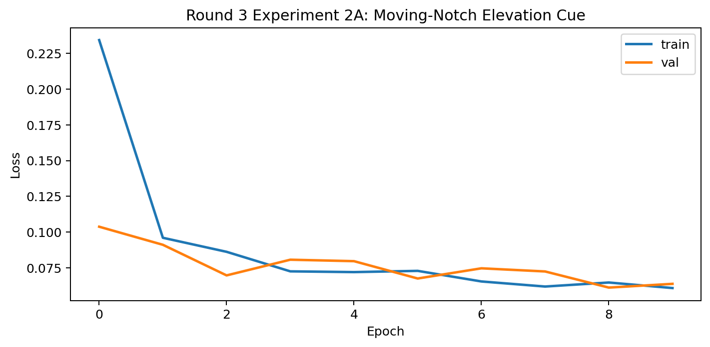
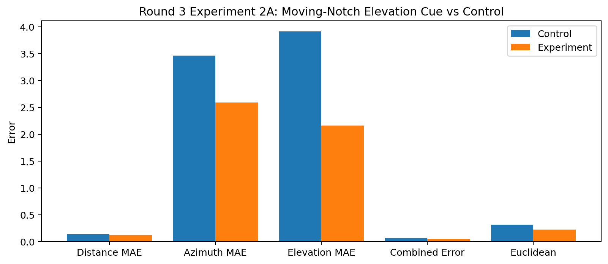
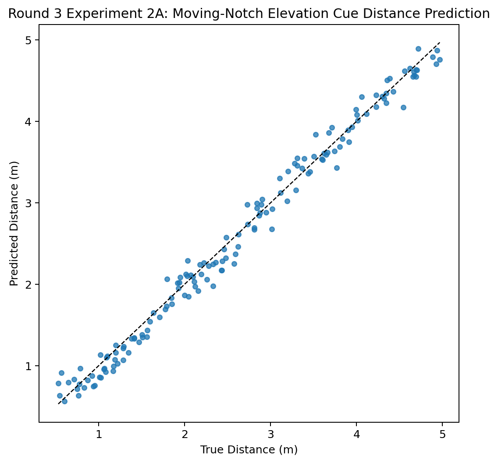
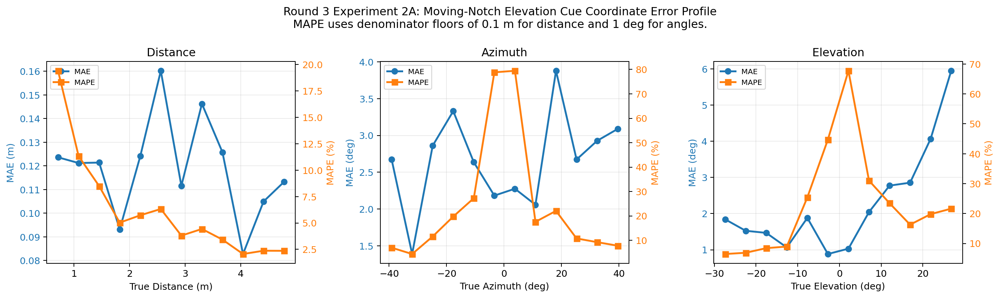

Moving-notch cue explanation:
- The simulator keeps the original elevation-dependent slope cue and multiplies it by a Gaussian spectral notch.
- The notch center shifts smoothly across frequency with elevation, so lower elevations suppress lower-frequency channels and higher elevations suppress higher-frequency channels.
- This cue is injected upstream of the cochlea, so it changes the spike distribution before the elevation branch sees the input.
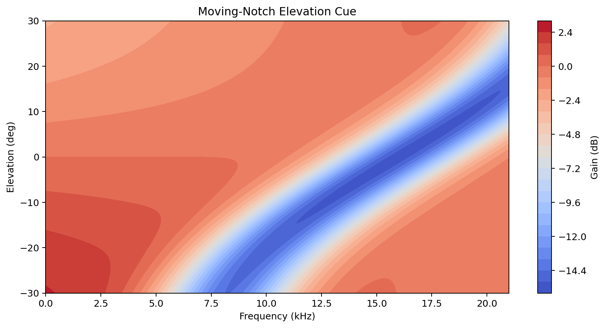

### Round 3 Experiment 2B: Moving-Notch Cue Plus Notch Detectors

- Change: Use the same slope-plus-moving-notch simulator cue as 2A and add an explicit notch-detector bank in the elevation branch to decode notch position from the spike-domain spectrum.
- Rationale: This tests the full two-stage hypothesis: a richer cue may need an aligned decoder before it helps.
- Decision vs control: `ACCEPTED`
- Data variant: `moving_notch`

Implementation details:
- Use the same simulator-side slope-plus-moving-notch cue as Experiment 2A.
- Compute post-cochlea spectral notch features from the binaural spike counts.
- Apply a fixed bank of Gaussian notch detectors across channel position.
- Project detector responses into a learned residual added only to the elevation latent.

Analysis focus:
- Whether explicit notch-location decoding improves elevation beyond both the control and 2A.
- Whether the detector responses cover the channel range or collapse to a narrow subset.

Metrics:
- Combined error: `0.0396`
- Distance MAE: `0.1038 m`
- Azimuth MAE: `2.8270 deg`
- Elevation MAE: `1.9386 deg`
- Euclidean error: `0.2127 m`

Delta vs control:
- Combined error delta: `-0.0234`
- Distance MAE delta: `-0.0339`
- Azimuth MAE delta: `-0.6372`
- Elevation MAE delta: `-1.9735`
- Euclidean delta: `-0.1018 m`

Timing:
- Training: `504.58 s`
- Evaluation: `1.63 s`
- Total: `506.21 s`

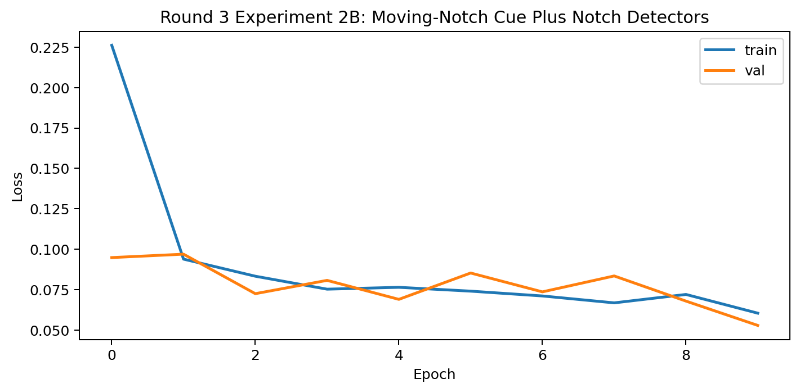
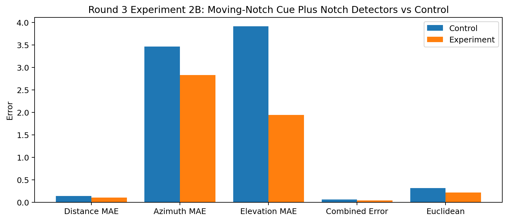
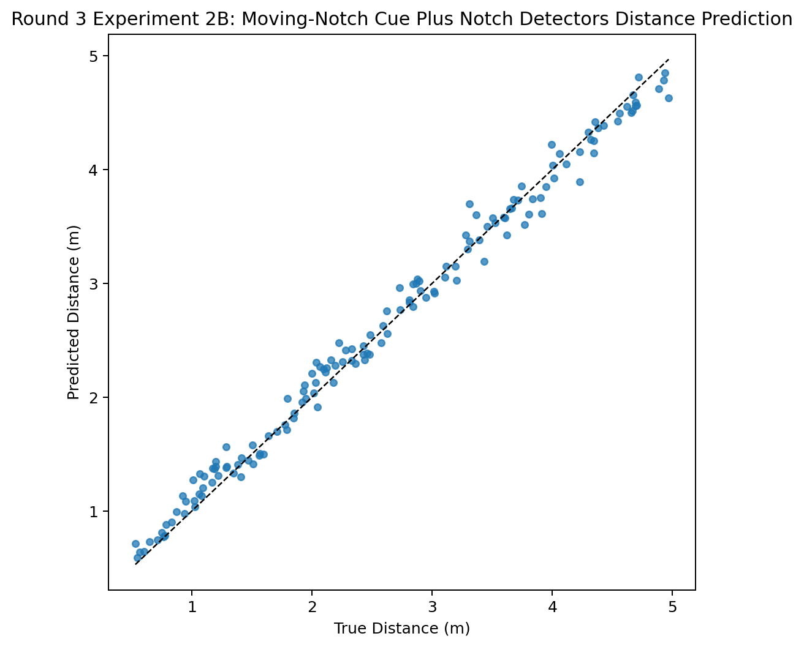
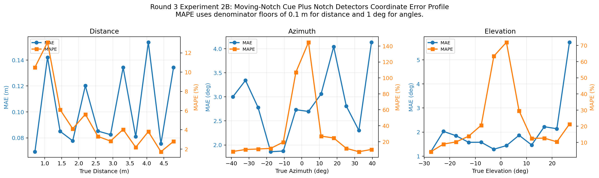

Moving-notch cue explanation:
- The simulator keeps the original elevation-dependent slope cue and multiplies it by a Gaussian spectral notch.
- The notch center shifts smoothly across frequency with elevation, so lower elevations suppress lower-frequency channels and higher elevations suppress higher-frequency channels.
- This cue is injected upstream of the cochlea, so it changes the spike distribution before the elevation branch sees the input.

Notch-detector explanation:
- The elevation branch computes the spike-domain spectral notch profile and applies a fixed bank of Gaussian detectors across channel position.
- Each detector reports how much notch energy is present near one channel region, turning notch location into an explicit feature vector.
- That detector-response vector is projected into a learned residual added only to the elevation latent.
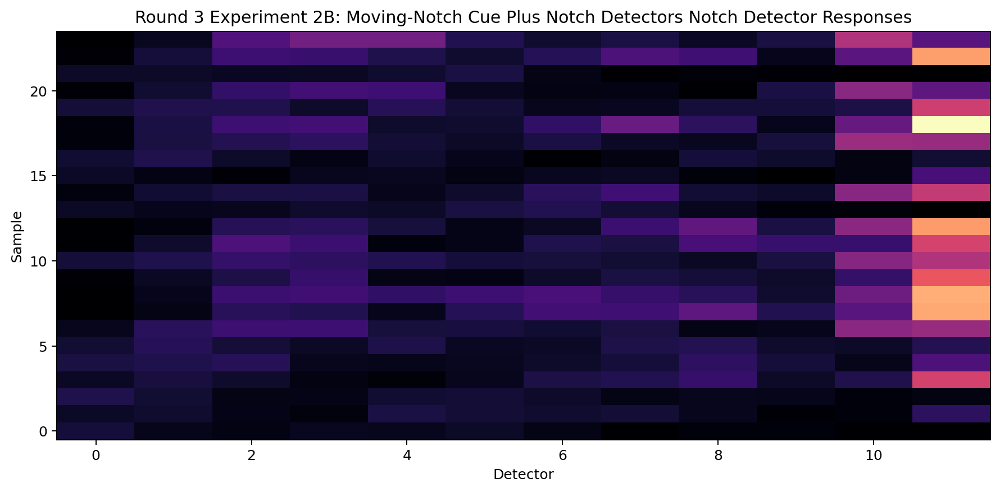
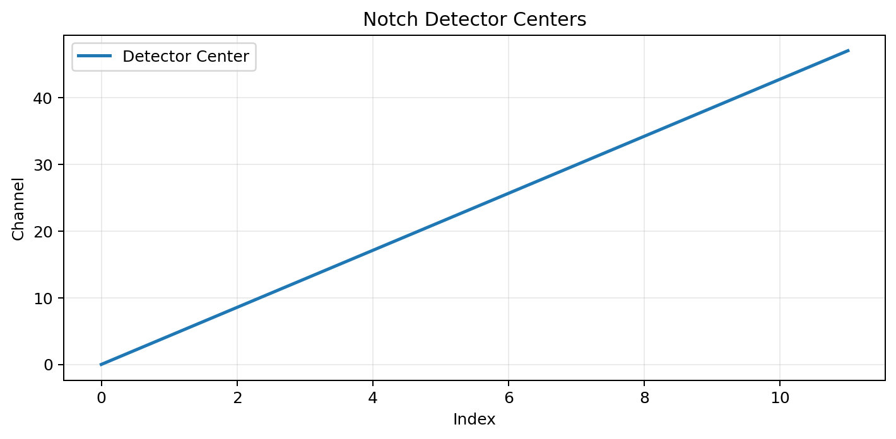

### Round 3 Experiment 3: Sine/Cosine Angle Regression

- Change: Predict azimuth and elevation as sine/cosine pairs, constrain the outputs toward the unit circle, and decode them back to angles only for evaluation and Cartesian regularization.
- Rationale: This tests whether removing angular wraparound from the raw regression target improves optimization.
- Decision vs control: `ACCEPTED`
- Data variant: `base`

Implementation details:
- Keep the round-2 combined architecture unchanged up to the final readout.
- Increase the readout size from 3 to 5 outputs: distance, azimuth sin/cos, elevation sin/cos.
- Normalize the predicted angle pairs before decoding with atan2.
- Add a unit-circle penalty on the raw pair norms.

Analysis focus:
- Whether angular wraparound handling improves azimuth and elevation errors.
- Whether the unit-circle constraint remains active rather than collapsing to near-zero vectors.

Metrics:
- Combined error: `0.0593`
- Distance MAE: `0.0770 m`
- Azimuth MAE: `3.3350 deg`
- Elevation MAE: `4.2824 deg`
- Euclidean error: `0.2706 m`

Delta vs control:
- Combined error delta: `-0.0037`
- Distance MAE delta: `-0.0607`
- Azimuth MAE delta: `-0.1292`
- Elevation MAE delta: `0.3704`
- Euclidean delta: `-0.0439 m`

Timing:
- Training: `492.17 s`
- Evaluation: `1.73 s`
- Total: `493.89 s`

### Round 3 Experiment 3A: Ear-Specific Azimuth Notch Detectors

- Change: Add mirrored ear-specific slope-plus-moving-notch azimuth cues upstream of the cochlea and decode them with a dedicated notch-detector residual as a third azimuth pathway stream alongside ITD and ILD.
- Rationale: This tests whether azimuth benefits from richer ear-specific spectral structure, not just time and level differences.
- Decision vs control: `REJECTED`
- Data variant: `azimuth_moving_notch`

Implementation details:
- Keep the base round-2 combined model and 140 dB unnormalized front end.
- Inject mirrored ear-specific azimuth slope-plus-moving-notch spectral cues before the cochlea.
- Build per-ear spike-domain notch profiles from the left and right receive spectra.
- Apply a fixed bank of azimuth notch detectors across channel position for each ear.
- Project left, right, and left-right notch-detector responses into an azimuth-only residual latent.

Analysis focus:
- Whether explicit ear-specific notch cues improve azimuth beyond the round-3 control.
- Whether the notch-detector responses remain asymmetric across ears rather than collapsing to identical patterns.

Metrics:
- Combined error: `0.0983`
- Distance MAE: `0.1304 m`
- Azimuth MAE: `2.2429 deg`
- Elevation MAE: `7.7429 deg`
- Euclidean error: `0.3742 m`

Delta vs control:
- Combined error delta: `0.0353`
- Distance MAE delta: `-0.0073`
- Azimuth MAE delta: `-1.2213`
- Elevation MAE delta: `3.8308`
- Euclidean delta: `0.0597 m`

Timing:
- Training: `476.02 s`
- Evaluation: `2.14 s`
- Total: `478.17 s`

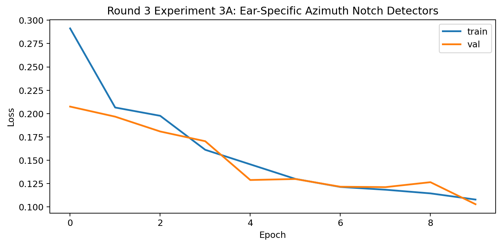
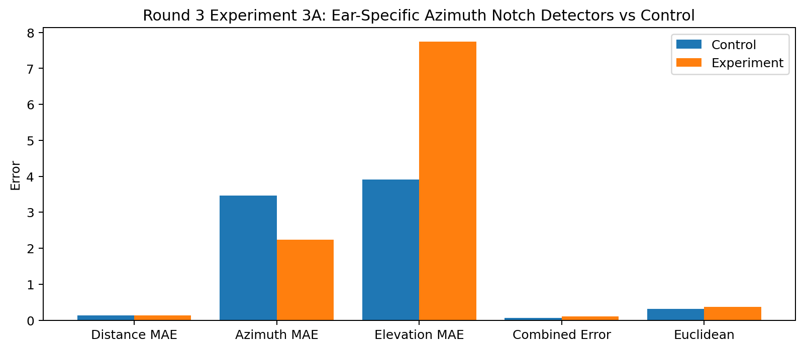
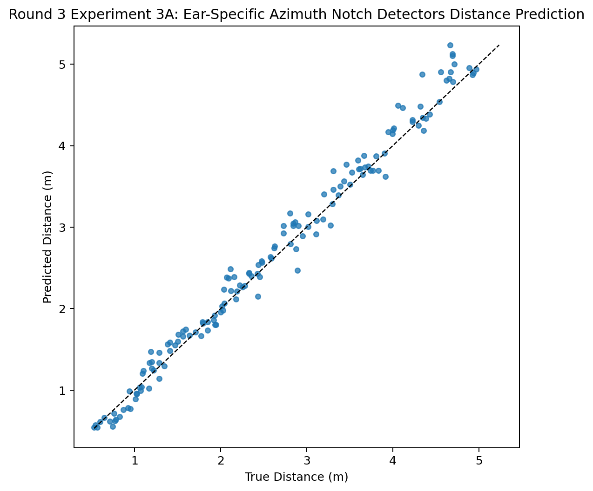
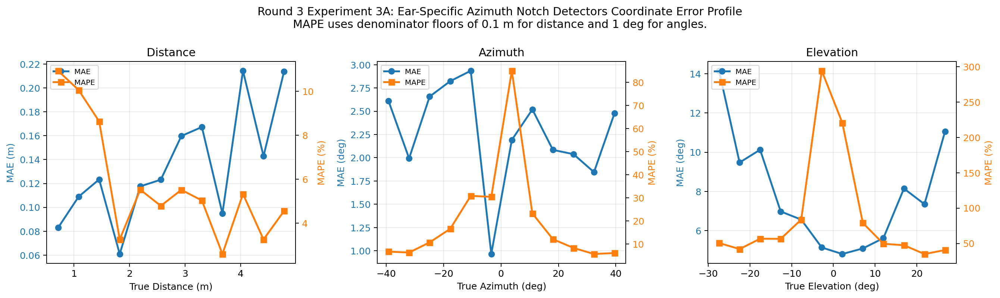

Azimuth moving-notch cue explanation:
- The simulator applies mirrored ear-specific slope-plus-moving-notch spectral cues before the cochlea.
- At positive azimuth, the left and right ears receive different notch locations and slope tilts; at negative azimuth the pattern mirrors.
- This augments the existing ITD and ILD cues with ear-specific spectral asymmetry.
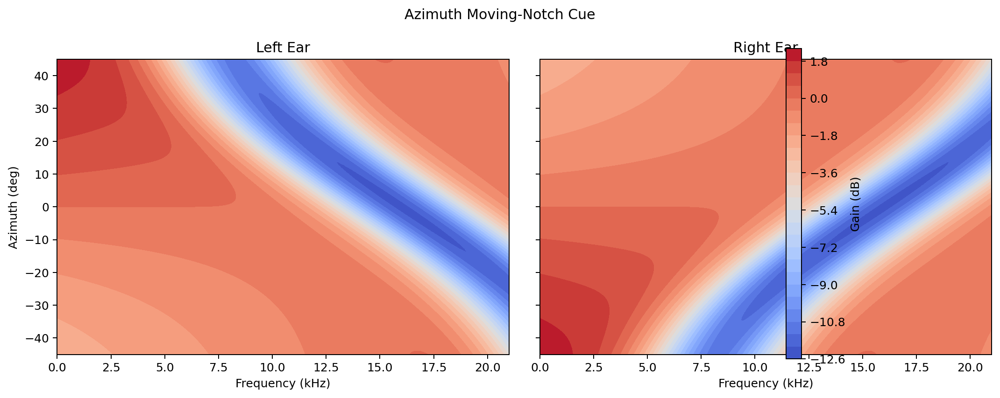

Azimuth notch-detector explanation:
- The azimuth branch now gets a third residual stream built from ear-specific spectral notch profiles.
- A fixed detector bank scans notch energy across channel position separately for the left and right ears.
- Left, right, and ear-difference detector responses are projected into an azimuth-only residual latent and fused with the existing ITD and ILD features.
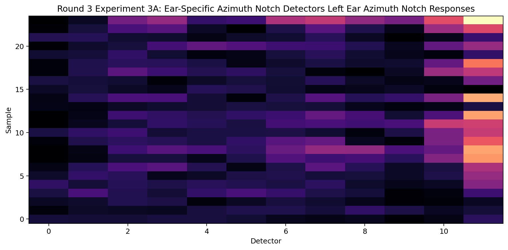
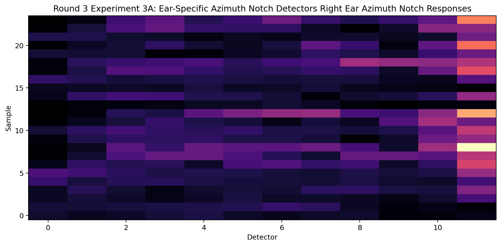
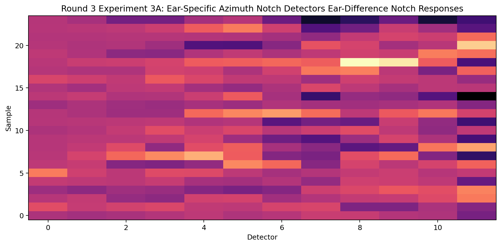
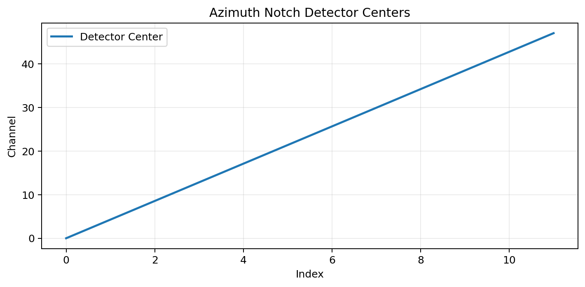

### Round 3 Experiment 3B: Ear-Specific Azimuth Notch Detectors Without Slope

- Change: Add mirrored ear-specific moving-notch azimuth cues upstream of the cochlea, but do not add any extra azimuth spectral slope cue, then decode them with the same azimuth notch-detector residual.
- Rationale: This isolates whether the azimuth notch itself is useful, or whether the previous 3A result mainly came from interaction between the notch and added spectral slope.
- Decision vs control: `REJECTED`
- Data variant: `azimuth_notch_only`

Implementation details:
- Keep the base round-2 combined model and 140 dB unnormalized front end.
- Inject mirrored ear-specific azimuth moving notches before the cochlea, with no added azimuth slope term.
- Build per-ear spike-domain notch profiles from the left and right receive spectra.
- Apply the same fixed bank of azimuth notch detectors across channel position for each ear.
- Project left, right, and left-right notch-detector responses into an azimuth-only residual latent.

Analysis focus:
- Whether azimuth improves when only the notch cue is added, without the extra spectral tilt used in 3A.
- Whether removing the slope reduces interference with the elevation branch.

Metrics:
- Combined error: `0.1005`
- Distance MAE: `0.1291 m`
- Azimuth MAE: `2.6449 deg`
- Elevation MAE: `8.0721 deg`
- Euclidean error: `0.4139 m`

Delta vs control:
- Combined error delta: `0.0375`
- Distance MAE delta: `-0.0086`
- Azimuth MAE delta: `-0.8193`
- Elevation MAE delta: `4.1601`
- Euclidean delta: `0.0994 m`

Timing:
- Training: `902.05 s`
- Evaluation: `3.57 s`
- Total: `905.63 s`

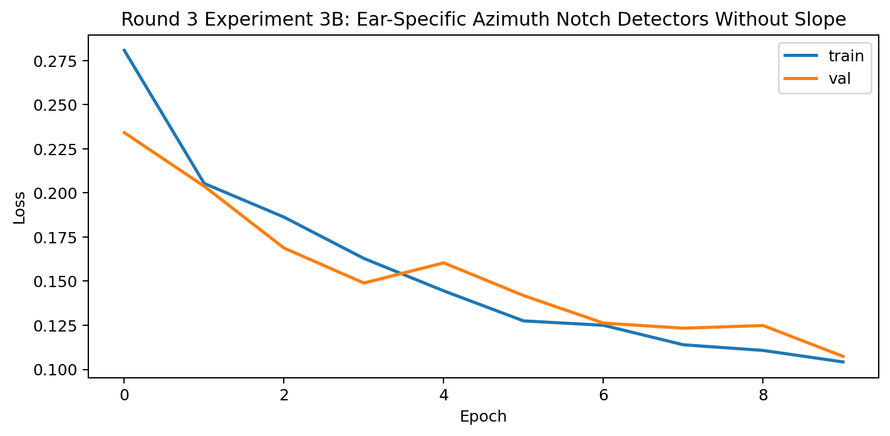
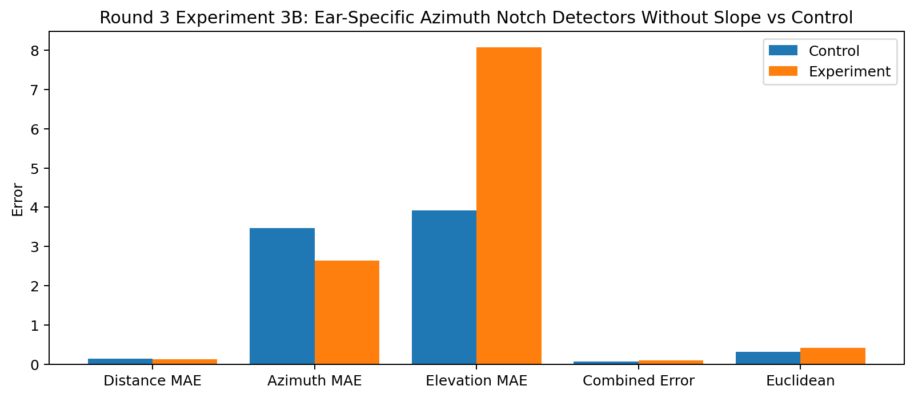
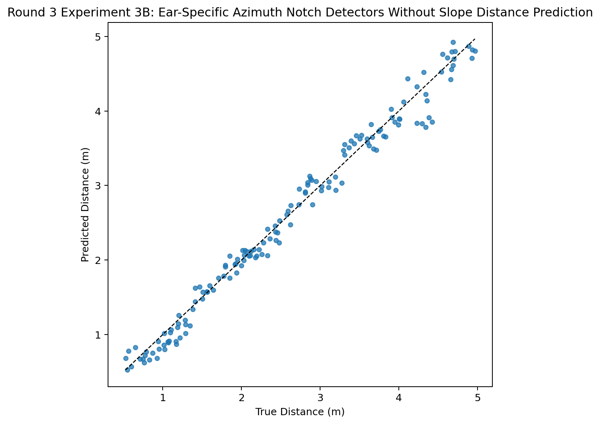
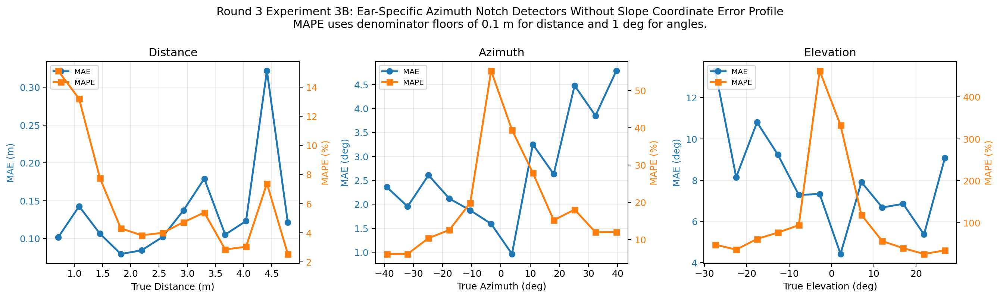

Azimuth moving-notch cue explanation:
- The simulator applies mirrored ear-specific moving notches before the cochlea, without adding any extra azimuth spectral slope.
- At positive azimuth, the left and right ears receive different notch locations; at negative azimuth the pattern mirrors.
- This augments the existing ITD and ILD cues with ear-specific spectral asymmetry while trying to reduce interference from added tilt.
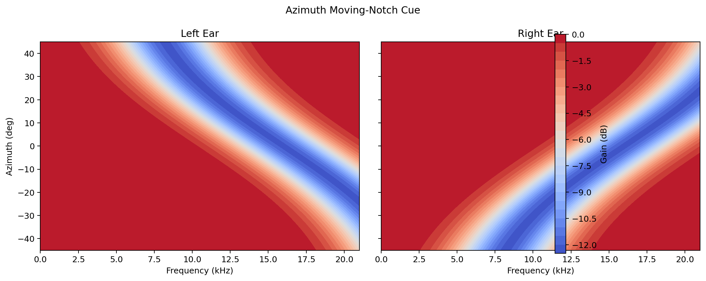

Azimuth notch-detector explanation:
- The azimuth branch now gets a third residual stream built from ear-specific spectral notch profiles.
- A fixed detector bank scans notch energy across channel position separately for the left and right ears.
- Left, right, and ear-difference detector responses are projected into an azimuth-only residual latent and fused with the existing ITD and ILD features.
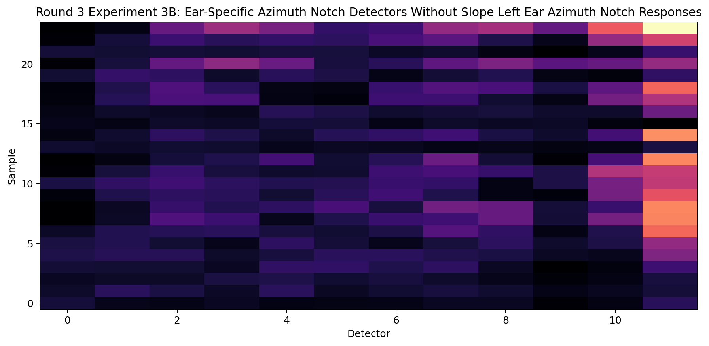
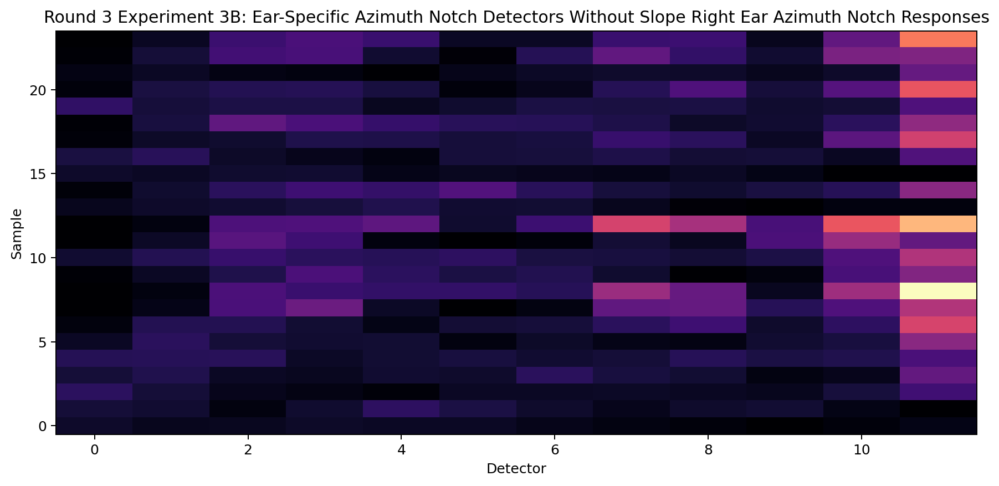
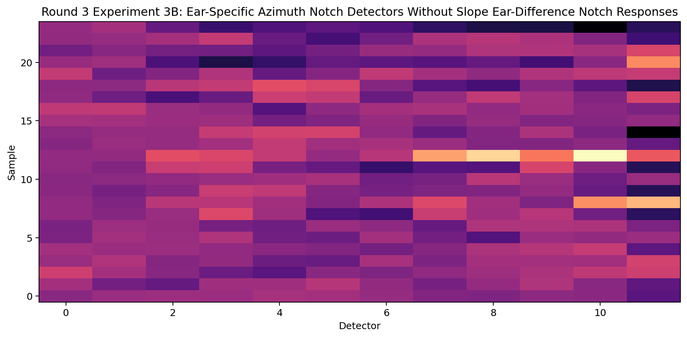

### Round 3 Experiment 3C: Orthogonal Combined Azimuth/Elevation Notches

- Change: Combine a common-mode mid-band elevation slope-plus-notch cue with mirrored edge-band azimuth notch-only cues, then decode them with branch-specific detectors that use common-mode features for elevation and difference features for azimuth.
- Rationale: This tests whether cue orthogonality in both the simulator and the branch decoders can keep the two angular tasks from interfering with each other.
- Decision vs control: `ACCEPTED`
- Data variant: `orthogonal_combined_notches`

Implementation details:
- Inject a common-mode elevation slope-plus-notch cue in the middle of the spectral band for both ears.
- Inject mirrored ear-specific azimuth notch-only cues toward the spectral edges.
- Decode elevation from binaural-mean notch features with a mid-band detector bank.
- Decode azimuth from ear-difference notch features with an edge-focused detector bank.
- Keep distance and the rest of the round-2 combined architecture unchanged.

Analysis focus:
- Whether separating cue design and detector inputs improves both angles simultaneously.
- Whether the new model beats the control and the earlier single-purpose notch experiments on angular error.

Metrics:
- Combined error: `0.0469`
- Distance MAE: `0.1351 m`
- Azimuth MAE: `3.3489 deg`
- Elevation MAE: `2.1144 deg`
- Euclidean error: `0.2391 m`

Delta vs control:
- Combined error delta: `-0.0162`
- Distance MAE delta: `-0.0026`
- Azimuth MAE delta: `-0.1154`
- Elevation MAE delta: `-1.7977`
- Euclidean delta: `-0.0754 m`

Timing:
- Training: `831.75 s`
- Evaluation: `2.47 s`
- Total: `834.22 s`

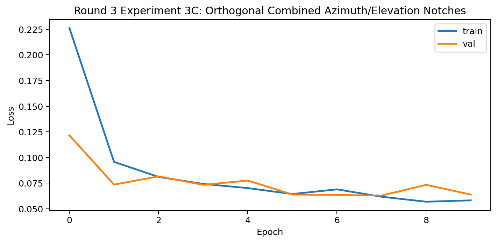
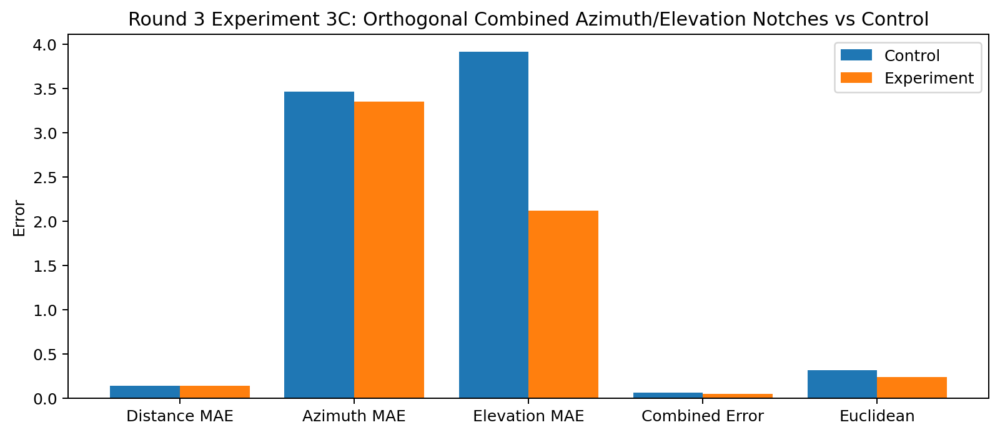
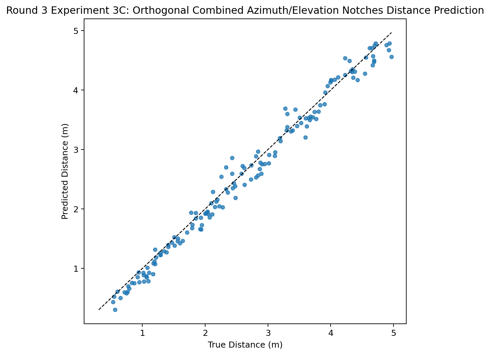
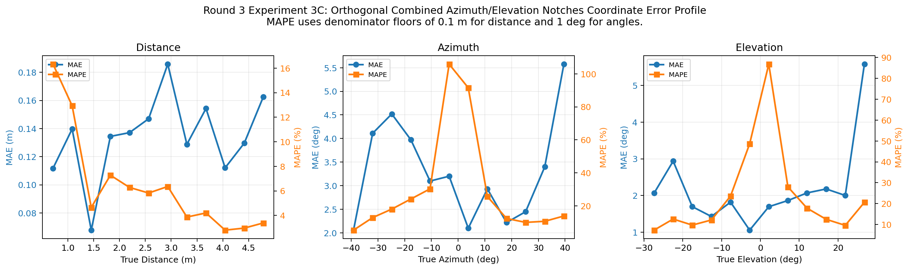

Moving-notch cue explanation:
- The simulator keeps the original elevation-dependent slope cue and multiplies it by a Gaussian spectral notch.
- The notch center shifts smoothly across frequency with elevation, so lower elevations suppress lower-frequency channels and higher elevations suppress higher-frequency channels.
- This cue is injected upstream of the cochlea, so it changes the spike distribution before the elevation branch sees the input.

Azimuth moving-notch cue explanation:
- The simulator applies mirrored ear-specific moving notches before the cochlea, without adding any extra azimuth spectral slope.
- At positive azimuth, the left and right ears receive different notch locations; at negative azimuth the pattern mirrors.
- This augments the existing ITD and ILD cues with ear-specific spectral asymmetry while trying to reduce interference from added tilt.
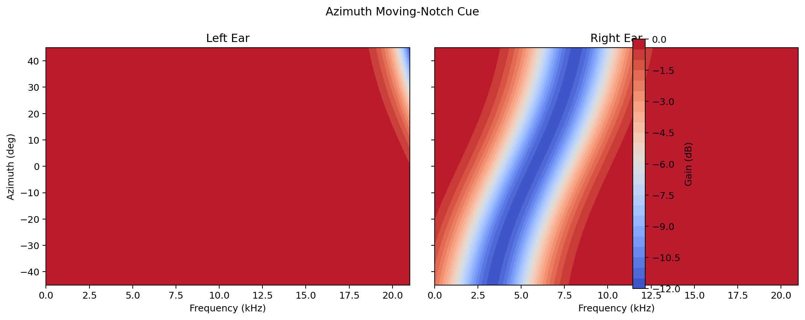

Orthogonal decoder explanation:
- Elevation is decoded only from the binaural-mean notch profile, using a mid-band detector bank.
- Azimuth is decoded only from ear-difference notch features, using an edge-focused detector bank.
- This keeps the two angular tasks on different spectral statistics instead of letting both read the same raw spectrum.
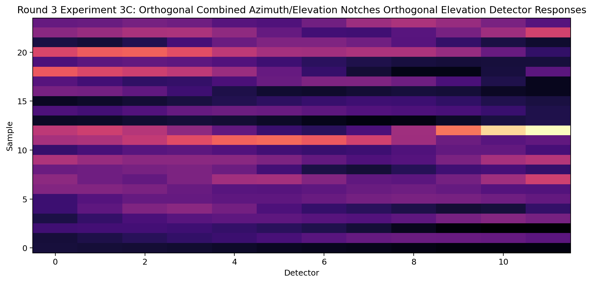
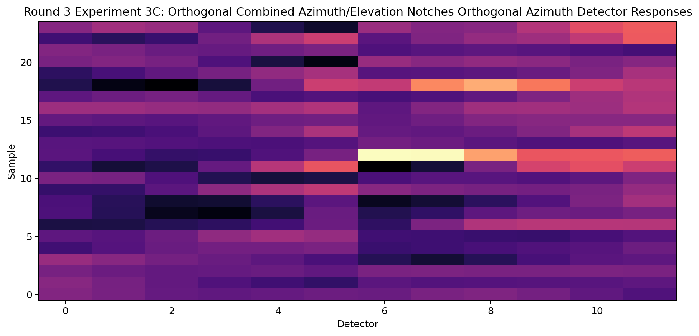
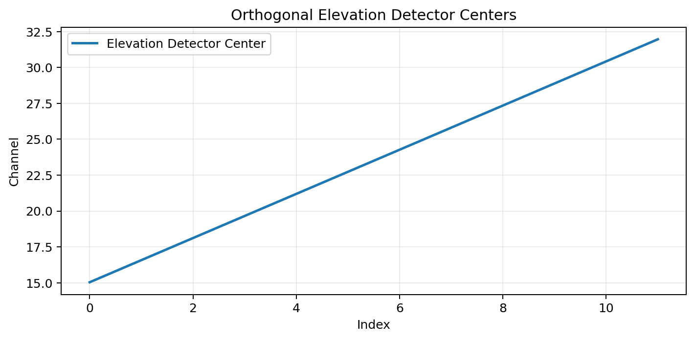
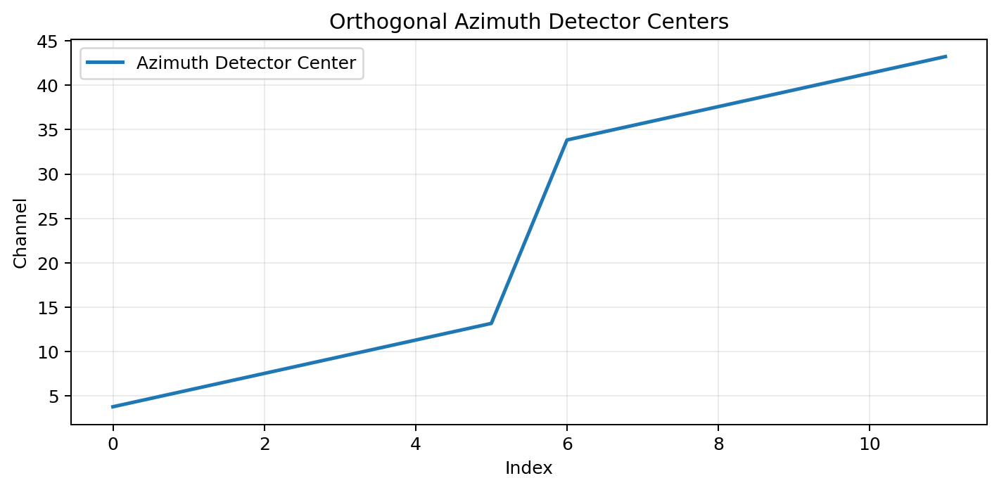

Angle comparison against prior notch models:
- vs Control: combined delta `-0.0162`, azimuth delta `-0.1154 deg`, elevation delta `-1.7977 deg`
- vs Elevation 2A: combined delta `0.0037`, azimuth delta `0.7574 deg`, elevation delta `-0.0421 deg`
- vs Elevation 2B: combined delta `0.0073`, azimuth delta `0.5219 deg`, elevation delta `0.1758 deg`
- vs Azimuth 3A: combined delta `-0.0514`, azimuth delta `1.1060 deg`, elevation delta `-5.6285 deg`
- vs Azimuth 3B: combined delta `-0.0536`, azimuth delta `0.7039 deg`, elevation delta `-5.9577 deg`

### Round 3 Experiment 4: 0-1 Distance Labels

- Change: Train the distance output against labels normalized to the 0-1 interval, then decode them back to physical metres for evaluation.
- Rationale: This tests whether a simpler bounded distance target improves conditioning when the range support is wider than the original short task.
- Decision vs control: `REJECTED`
- Data variant: `base`

Implementation details:
- Keep the round-2 combined architecture unchanged up to the final readout.
- Apply a sigmoid to the distance output and train it against 0-1 normalized range labels.
- Keep angle decoding compatible with the baseline target bundle.
- Decode distance back to metres for all reported metrics.

Analysis focus:
- Whether the bounded distance code improves distance MAE without harming angle prediction.
- Whether the decoded 0-1 distance output saturates near the support limits.

Metrics:
- Combined error: `0.0740`
- Distance MAE: `0.2332 m`
- Azimuth MAE: `3.0242 deg`
- Elevation MAE: `3.9133 deg`
- Euclidean error: `0.3653 m`

Delta vs control:
- Combined error delta: `0.0110`
- Distance MAE delta: `0.0955`
- Azimuth MAE delta: `-0.4400`
- Elevation MAE delta: `0.0012`
- Euclidean delta: `0.0508 m`

Timing:
- Training: `565.27 s`
- Evaluation: `1.73 s`
- Total: `567.00 s`

## Summary

- Accepted experiments: Round 3 Experiment 1: Trainable LIF Coincidence Detectors, Round 3 Experiment 2A: Moving-Notch Elevation Cue, Round 3 Experiment 2B: Moving-Notch Cue Plus Notch Detectors, Round 3 Experiment 3: Sine/Cosine Angle Regression, Round 3 Experiment 3C: Orthogonal Combined Azimuth/Elevation Notches
- Round 3 uses the fresh 5 m, 140 dB, unnormalized control as the only reference.
- Any accepted variant should be rerun on a longer schedule before it replaces the current short-run baseline.
