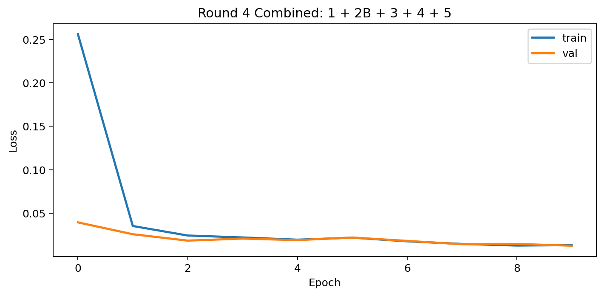
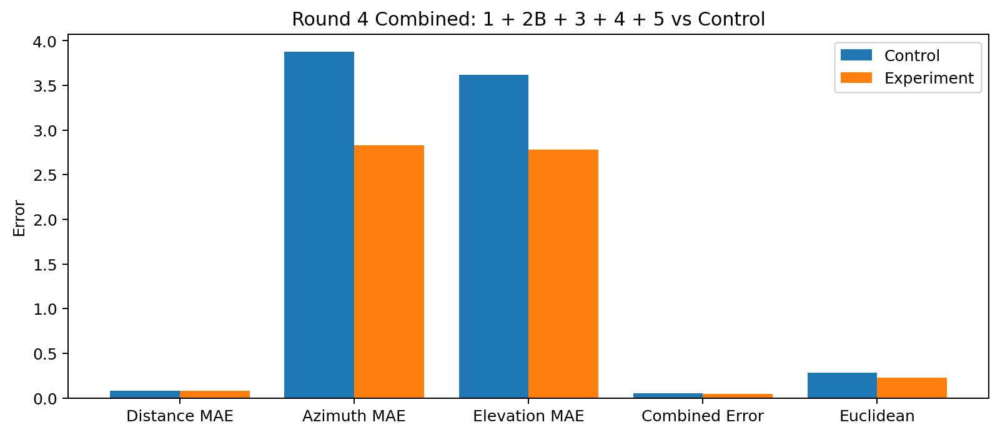
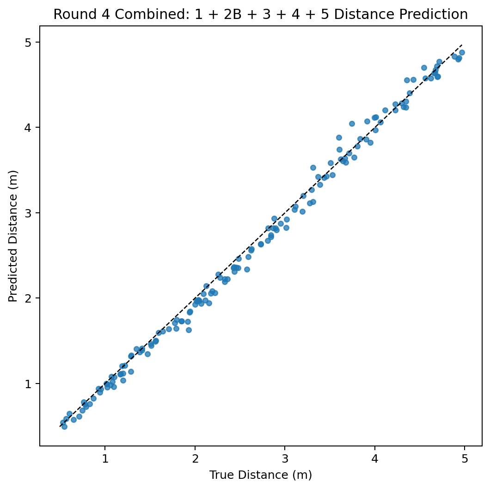

# Round 4 Combined Experiment

This run combines all accepted round-4 additions except the rejected `2A` shared pre-pathway convolution.

| Model | Combined | Distance | Azimuth | Elevation | Euclidean |
| --- | ---: | ---: | ---: | ---: | ---: |
| Round 4 Experiment 0: 2B + 3 Baseline | 0.0542 | 0.0785 | 3.8763 | 3.6179 | 0.2839 |
| Round 4 Experiment 1: Full LIF Timing Replacement | 0.0458 | 0.0786 | 4.1350 | 2.4979 | 0.2462 |
| Round 4 Experiment 2B: Post-Pathway IC Conv | 0.0523 | 0.0715 | 3.6499 | 3.5883 | 0.2824 |
| Round 4 Experiment 3: LSO/MNTB ILD System | 0.0407 | 0.0724 | 3.1207 | 2.4737 | 0.2211 |
| Round 4 Experiment 4: Distance Spike-Sum Cue | 0.0421 | 0.0763 | 2.9143 | 2.7600 | 0.2132 |
| Round 4 Experiment 5: Per-Pathway Q-Tunable Resonance Banks | 0.0488 | 0.0818 | 3.1792 | 3.3205 | 0.2429 |
| Round 4 Combined: 1 + 2B + 3 + 4 + 5 | 0.0435 | 0.0786 | 2.8320 | 2.7802 | 0.2264 |

## Result

- Decision vs round-4 baseline: `ACCEPTED`
- Combined error: `0.0435`
- Distance MAE: `0.0786 m`
- Azimuth MAE: `2.8320 deg`
- Elevation MAE: `2.7802 deg`
- Euclidean error: `0.2264 m`

## Deltas

- vs baseline: combined `-0.0107`, distance `0.0002 m`, azimuth `-1.0443 deg`, elevation `-0.8376 deg`
- vs best individual combined (Experiment 3): combined `0.0027`
- vs best azimuth individual (Experiment 4): azimuth `-0.0823 deg`
- vs best distance individual (Experiment 2B): distance `0.0072 m`

