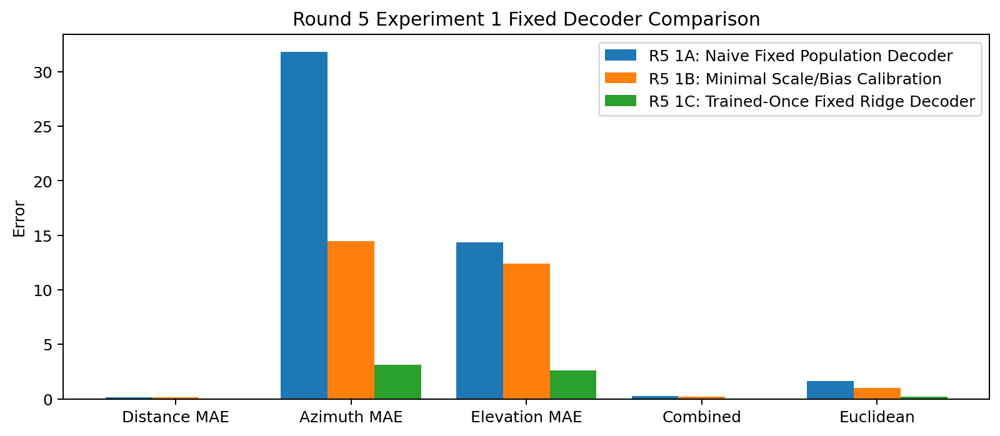

# Round 5 Experiments Report

## Purpose

Round 5 uses the **Round 4 combined model** as the main baseline and keeps the **Round 3 Combined A: 2B + 3** model as a simpler high-performing reference.

The theme is to reduce or remove training, simplify the model, and test whether biologically structured fixed computations can maintain useful localisation performance while reducing training time and computational cost.

## Baselines

### Main Baseline: Round 4 Combined Model

This is the most structurally advanced model so far. It combines:

- Round 3 `2B + 3`: moving-notch elevation cue, elevation notch detectors, and sine/cosine angle regression.
- Full LIF timing replacement for distance and azimuth ITD.
- LSO/MNTB-inspired ILD pathway.
- Distance spike-count/loudness cue.
- Per-pathway Q resonance banks.
- Post-pathway IC-style convolution.
- Trainable spiking fusion and readout.

Known result:

| Metric | Value |
|---|---:|
| Combined error | 0.0435 |
| Distance MAE | 0.0786 m |
| Azimuth MAE | 2.8320 deg |
| Elevation MAE | 2.7802 deg |
| Euclidean error | 0.2264 m |

### Reference Baseline: Round 3 Combined A, 2B + 3

This is the best-performing model so far by combined test error and Euclidean error.

Known result:

| Metric | Value |
|---|---:|
| Combined error | 0.0394 |
| Distance MAE | 0.0646 m |
| Azimuth MAE | 2.8595 deg |
| Elevation MAE | 2.5258 deg |
| Euclidean error | 0.2043 m |

## Current Understanding Of Trainable Parameters

The current Round 4 combined model is **not only trained in the IC**.

The IC/fusion/readout is trainable, but training is also present in several pathway-level components:

- LIF coincidence banks: trainable reference weights, target weights, and membrane beta values.
- Distance and azimuth pathway projections from coincidence features into latent pathway vectors.
- LSO/MNTB ILD system: trainable excitatory and inhibitory frequency weights.
- Distance spike-sum cue: trainable projection and gain.
- Resonance banks: trainable input projections, resonant frequencies, Q factors, thresholds, pathway projections, and gains.
- Post-pathway IC convolution: trainable convolution kernels, projection, and gains.
- Final fusion/readout stack: trainable fusion projection, integration projection, and readout layer.

This means a true no-training version requires more than freezing or replacing the IC. It also requires either fixing, removing, or analytically defining the pathway projections and readout.

## Experiment 1: Remove Training / Fixed Parallel Pathway ICs

### Aim

Test whether the model can still localise sound if the trained fusion/readout system is removed or heavily simplified.

The main question is:

> Can the hand-structured pathway features already contain enough information that a fixed biologically inspired decoder can recover distance, azimuth, and elevation without gradient training?

### Proposed Design

Use the Round 4 combined feature-generation front end as the starting point, but replace the final shared trained IC/readout with three mostly independent fixed decoders:

- Distance pathway -> fixed distance IC/readout.
- Azimuth pathway -> fixed azimuth IC/readout.
- Elevation pathway -> fixed elevation IC/readout.

Each pathway would produce its own scalar output before recombination into the final coordinate prediction.

### Recommended First Implementation

Start with a staged simplification rather than removing every trainable part at once:

1. Keep the existing trained-capable pathway feature builders, but replace the final fusion/readout with fixed per-pathway decoders.
2. Use deterministic mappings where possible:
   - distance from peak delay-line/coincidence index plus optional spike-sum correction,
   - azimuth from ITD/ILD balance,
   - elevation from notch-detector centre of mass.
3. Do a zero-epoch evaluation first. This measures whether fixed decoding works at all.
4. If zero-epoch performance is poor, allow only tiny calibration parameters, such as one scale and one bias per coordinate.
5. Compare computational cost using wall-clock evaluation time first, then add FLOP/SOP estimates if stable.

### Why Not Start With Identity Weights Only?

Identity weights are useful when the feature dimension already directly corresponds to the output dimension. Here, most branch latents are high-dimensional feature vectors, while the outputs are physical coordinates. A pure identity layer would not know which latent channel maps to metres, azimuth, or elevation.

A better fixed decoder is therefore not a generic identity layer, but a **structured population decoder**:

- weighted average over distance candidates,
- signed centre of mass over ITD/ILD candidates,
- weighted average over elevation notch detector centres.

This is closer to a biological population-code readout and has a better chance of working without training.

### Expected Outcome

This is feasible, but it is a high-risk simplification. The model may lose accuracy because the current trained readout learns calibration between handcrafted/biological cues and physical labels.

The most likely useful outcome is not perfect no-training localisation, but a much clearer separation between:

- information already present in the fixed pathways,
- information added by trained projection/fusion layers,
- calibration needed to convert spike/pathway codes into physical coordinates.

## Metrics To Record

For each Round 5 experiment:

- Combined error.
- Distance MAE.
- Azimuth MAE.
- Elevation MAE.
- Cartesian MAE for x, y, z.
- Euclidean error.
- Data preparation time.
- Training time.
- Evaluation time.
- Total runtime.
- Number of trainable parameters.
- Number of frozen/fixed parameters.
- Approximate FLOPs where practical.
- Approximate SOPs/spike operations where practical.
- Whether the experiment is accepted, rejected, or diagnostic-only.

## Current Status

No Round 5 experiments have been run yet.

## Experiment 1 Results

Experiment 1 tested whether the trained IC/fusion/readout could be replaced by fixed or nearly fixed population-code decoders.

| Variant | Training mode | Fixed tuned params | Combined | Distance | Azimuth | Elevation | Euclidean | Runtime |
|---|---|---:|---:|---:|---:|---:|---:|---:|
| Round 5 Experiment 1A: Naive Fixed Population Decoder | none | 0 | 0.2688 | 0.1646 m | 31.8177 deg | 14.3279 deg | 1.6060 m | 0.55 s |
| Round 5 Experiment 1B: Minimal Scale/Bias Calibration | closed_form_scale_bias | 6 | 0.1766 | 0.1385 m | 14.4682 deg | 12.3877 deg | 0.9845 m | 0.01 s |
| Round 5 Experiment 1C: Trained-Once Fixed Ridge Decoder | closed_form_ridge | 792 | 0.0387 | 0.0438 m | 3.1077 deg | 2.5876 deg | 0.2069 m | 1.10 s |

Shared data preparation time was `15.93 s`. The runtime column above is the decoder fitting/evaluation time after the cochlear spike/pathway data had been prepared.

### Interpretation

The naive no-training decoder reached combined error `0.2688`. This directly measures how much localisation can be recovered from fixed population codes without learned calibration.

This should be treated as a failure of the fully naive no-training decoder: distance was usable, but azimuth and elevation were much too poorly calibrated.

The best Experiment 1 variant was `Round 5 Experiment 1C: Trained-Once Fixed Ridge Decoder` with combined error `0.0387`. Its tuned parameters are fixed after fitting, so inference does not require gradient training.

For comparison, the Round 4 combined baseline had combined error `0.0435`, distance MAE `0.0786 m`, azimuth MAE `2.8320 deg`, and elevation MAE `2.7802 deg`.

The Round 3 `2B + 3` reference had combined error `0.0394` and Euclidean error `0.2043 m`.

The trained-once fixed ridge decoder therefore slightly beat both the Round 4 combined model and the Round 3 `2B + 3` model on combined error, mainly because distance error became lower. It did not beat the Round 4 combined model on azimuth, and its Euclidean error was similar to but slightly worse than the original Round 3 `2B + 3` result.

FLOP/SOP accounting has not yet been added. The useful first cost result is already clear: replacing gradient training with a closed-form fixed decoder reduced decoder tuning to about `1.10 s`, with only `792` fixed tuned decoder parameters after fitting.

